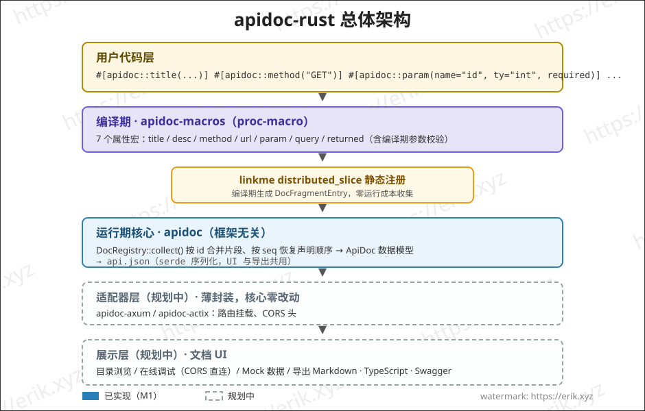
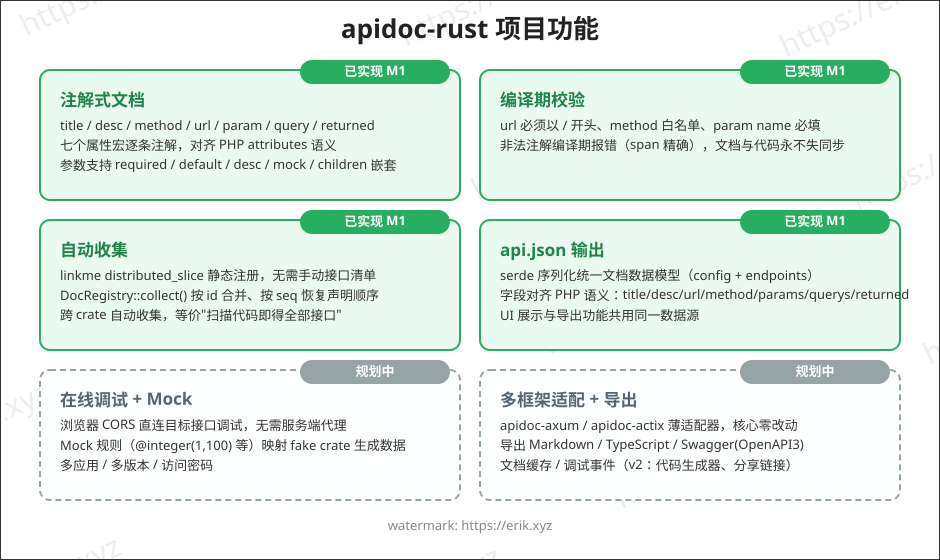
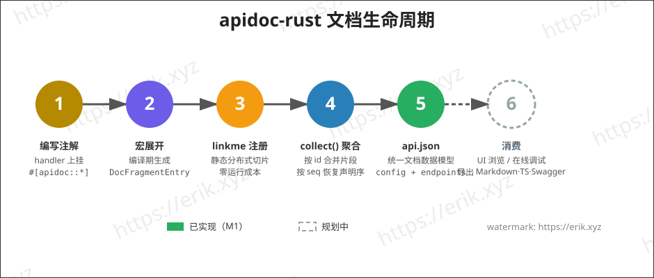

<h1 align="center">Apidoc (apidoc-rust)</h1>

<div align="center">
 基于 Rust 过程宏（proc-macro）生成 API 接口文档的通用插件库
</div>

<div align="center">
<a href="https://github.com/erikwang2013/apidoc-rust"></a>
<a href="https://github.com/erikwang2013/apidoc-rust"></a>
</div>

<div align="center">
<a href="README.md"><strong>中文</strong></a> ·
<a href="docs/i18n/README-en.md">English</a> ·
<a href="docs/i18n/README-ko.md">한국어</a> ·
<a href="docs/i18n/README-ru.md">Русский</a> ·
<a href="docs/i18n/README-de.md">Deutsch</a> ·
<a href="docs/i18n/README-fr.md">Français</a> ·
<a href="docs/i18n/README-es.md">Español</a> ·
<a href="docs/i18n/README-pt.md">Português</a> ·
<a href="docs/i18n/README-hi.md">हिन्दी</a> ·
<a href="docs/i18n/README-ar.md">العربية</a> ·
<a href="docs/i18n/README-bn.md">বাংলা</a> ·
<a href="docs/i18n/README-id.md">Bahasa Indonesia</a> ·
<a href="docs/i18n/README-ja.md">日本語</a>
</div>

## 项目介绍

apidoc-rust 是一个用 Rust 实现的**通用插件式 API 接口文档生成器**，参考 [apidoc-php](https://github.com/erikwang2013/apidoc-php)（基于 PHP 8 attributes 生成 API 文档的 composer 扩展），把"注解即文档"的能力以 Rust 原生方式落地：

- **编译期生成**：文档由过程宏在编译期生成，文档与代码永不失同步；
- **零成本收集**：linkme 静态注册，运行期一次聚合即得全部接口文档；
- **通用插件**：核心与 HTTP 框架无关，通过薄适配器（axum / actix-web）接入任意框架。

## 特性

### 已实现（M1-M3）

- **注解式文档**：`title` / `desc` / `method` / `url` / `param` / `query` / `returned` 七个属性宏，逐条注解（对应 PHP attributes 写法），参数支持 `required` / `default` / `desc` / `mock` / `children` 嵌套
- **编译期校验**：url 必须以 `/` 开头、method 白名单、param name 必填等，非法注解编译期报错（span 精确）
- **自动收集**：linkme `distributed_slice` 静态注册，无需手动接口清单；`DocRegistry::collect()` 按 id 合并、按 seq 恢复声明顺序，跨 crate 自动收集
- **api.json 输出**：serde 序列化统一文档数据模型（config + endpoints），字段对齐 PHP 语义
- **axum 适配器 + 内嵌文档 UI**：挂载路由即得文档页面，分组目录浏览（M2）
- **注解补齐**：`tag` / `group` / `author` / `header` / `route_param` / `response_status` / `success` / `error` / `not_debug` / `md` / `sort` / `ref` 12 个新注解（M3）

### 已实现（M4）

- **在线调试**：文档页内置「在线调试」面板——Base URL 预填 `location.origin` 跨域直连目标服务、参数表单 mock 预填、`{name}` / `:name` 路由占位符替换、GET/HEAD 参数并入 query、其余 method 组装 JSON body、请求头编辑 + 自定义 header、响应展示（状态 / 耗时 / pretty JSON）、CORS 失败黄色提示
- **Mock 引擎**（`crates/apidoc/src/mock.rs`，feature `mock`，依赖 fake crate，15 条规则：name / company / email / phone / url / ip / city / country / text / number / int / float / bool / uuid / date）。规则优先级：`mock="fake:xxx"` 走 fake 规则表（未知名回退默认值）→ 其余非空 mock 原样直出（如 `mock="1"`、`mock="erik"`）→ 无 mock 按 `ty` 自动生成（int→`"1"`、float→`"0.5"`、bool→`"true"`、object→`"{}"`、string→`"string"`）；children 递归嵌套对象，array 固定 2 项
- **mock 接口**：axum 适配器新增 `GET /apidoc/mock?url=&method=`，url + method 精确匹配，未命中返回 404；调试面板默认隐藏 `not_debug` 端点，勾选「显示 not_debug 接口」才显示
- **CORS 直连**：在线调试由浏览器直连目标接口，适配器 `cors_layer` 负责放行（服务端反向代理留 v2）

### 已实现（M5）

- **导出三格式**（`crates/apidoc/src/export/`）：markdown / typescript / swagger（OpenAPI 3.0.0），核心 crate 提供 `export::markdown::render` / `export::typescript::render` / `export::swagger::render`
- **导出路由**：适配器新增 `GET /apidoc/export?format=md|ts|swagger`，未知 format 返回 400；Content-Type 分别为 `text/markdown` / `application/typescript` / `application/json`
- **markdown**：分组目录 + 参数表 + 响应块；**typescript**：按 group 命名空间生成 `{Name}Params` / `{Name}Result` 类型，未分组接口落入 `defaultGroup`（`default` 是 TS 保留字）；**swagger**：`info.version` 取根目录 `VERSION` 文件内容
- **actix-web 适配器**（`crates/apidoc/src/actix.rs`，feature `actix`）：与 axum 适配器功能 1:1——`apidoc_routes(ApidocConfig) -> Scope` 挂载 /apidoc、/apidoc/api.json、/apidoc/mock、/apidoc/export，`cors_layer(CorsConfig)` 放行跨域
- **UI 共享**：文档 UI（`src/ui.html`）上移至核心 crate，导出 `pub const UI_HTML`，两适配器引用同一份（发布打包安全）

### 已实现（M6）

- **密码鉴权（M6a）**：`AuthConfig { enable, password, secret_key, expire }` 开启后，客户端 `GET /apidoc/auth?password=<md5(密码)>&appKey=<key>` 换取 token；数据路由 `/apidoc/api.json`、`/apidoc/export`、`/apidoc/mock` 需附带 `?token=xxx`，token 缺失/过期/错误返回 401，文档 UI 弹出密码遮罩；token 为 authcode 加密封套签发（Discuz authcode 逐行移植：RC4 变体 + md5 校验和 + 无 padding base64），载荷 `{key: md5(md5(原始密码)), expire: now+expire}`，MAC 比对恒定时间
- **鉴权安全红线**：`password` / `secret_key` 永不序列化，api.json 输出与未启用鉴权时字节级一致；auth 未启用时 `/apidoc/auth` 返回 404、数据路由直接放行；应用配置独立 password 时应用密码优先于全局密码；`secret_key` 缺省 `"apidoc#hgcode"`（启用且未配时 stderr 警告一次）、`expire` 缺省 86400 秒
- **多应用多版本（M6b）**：`ApidocConfig.apps: Vec<AppConfig>`（`key` / `title` / `items` 递归子版本 / `password`）配置应用树，`#[apidoc::app("key")]` 把接口挂到指定应用 key，未挂 key 的接口落默认应用；api.json 输出新增 `doc.apps` 树，UI 顶部出现应用/版本选择器，token 按 appKey 分开存 localStorage（不同应用可有独立密码）

### 规划中（v2）

- v2：代码生成器、数据表字段引用、分享链接、调试事件

## 架构



## 功能



## 生命周期



## 项目结构

```
apidoc-rust/
├── Cargo.toml                 # workspace 配置（resolver 2）
├── VERSION                    # 项目版本（v1.3.0，与框架版本 0.1.0 分离）
├── crates/
│   ├── apidoc/                # 单一发布包 apidoc-rust（lib 名 apidoc）
│   │   ├── src/lib.rs         # 数据模型 + DocRegistry 聚合 + api.json + UI_HTML
│   │   ├── src/auth.rs        # M6a 密码鉴权（authcode token 签发/校验 + 路由守卫）
│   │   ├── src/mock.rs        # M4 Mock 引擎（feature `mock`，axum/actix 隐含启用）
│   │   ├── src/axum.rs        # axum 适配器（feature `axum`：文档路由 + cors + mock + export）
│   │   ├── src/actix.rs       # actix-web 适配器（feature `actix`，与 axum 功能 1:1）
│   │   ├── src/export/        # M5 导出：markdown / typescript / swagger
│   │   ├── src/ui.html        # 共享文档 UI（核心 crate 导出，适配器引用）
│   │   ├── tests/             # 集成测试（宏展开/聚合/序列化/跨 crate/适配器）
│   │   ├── examples/demo.rs   # 示例：注解 + 输出 api.json
│   │   └── examples/axum_demo.rs  # 示例：axum 接入（feature `axum`）
│   ├── apidoc-macros/         # proc-macro：20 个属性宏（经 apidoc-rust re-export）
│   │   └── src/lib.rs         # 宏定义 + 参数解析 + 编译期校验
│   └── apidoc-test-fixtures/  # 跨 crate 注册测试夹具（仅 workspace，不发布）
├── .github/
│   └── workflows/release.yml  # 发布工作流（读取 VERSION，增量创建 tag+release）
└── docs/
    ├── images/                # 架构/功能/生命周期图（SVG）
    └── i18n/                  # 多语言文档（12 种语言）
```

## 使用说明

### 1. 添加依赖

```toml
[dependencies]
apidoc-rust = "0.1"     # 或 path = "crates/apidoc"
serde_json = "1"      # 输出 api.json 用
```

> 单个发布包 `apidoc-rust`（lib 名 `apidoc`，宏经 re-export 无需单独依赖）：
> 纯核心零 feature；按 Web 框架二选一开 `features = ["axum"]` 或 `features = ["actix"]`（两者功能 1:1）；Mock 引擎由适配器 feature 隐含启用（`mock` 也可单独开启）。默认构建不拉任何框架依赖。

### 2. 编写注解

在 handler 函数上逐条挂注解，文档即在编译期生成：

```rust
use apidoc::*;

#[apidoc::title("获取用户信息")]
#[apidoc::desc("根据用户 ID 查询用户详情")]
#[apidoc::url("/api/user/info")]
#[apidoc::method("GET")]
#[apidoc::param(name = "user_id", ty = "int", required, desc = "用户ID", mock = "1")]
#[apidoc::query(name = "lang", ty = "string", desc = "语言", default = "zh-CN")]
#[apidoc::returned(
    name = "data",
    ty = "object",
    desc = "用户数据",
    children = [
        { name = "id", ty = "int", required, desc = "用户ID" },
        { name = "name", ty = "string", required, desc = "用户名", mock = "erik" },
    ]
)]
fn get_user_info() -> String {
    unimplemented!()
}
```

M3 起支持分组、作者、标签、请求头、路由参数、状态码、成功/失败示例、排序与引用等注解（全部可选，未标注的字段不出现在输出中）：

```rust
use apidoc::*;

#[apidoc::title("获取用户信息")]
#[apidoc::url("/api/user/info")]
#[apidoc::method("GET")]
#[apidoc::group("用户管理")]                              // 分组（UI 优先使用）
#[apidoc::author("erik")]                                // 作者
#[apidoc::tag("user", "v1")]                             // 标签，可重复挂载，追加
#[apidoc::header(name = "X-Token", desc = "访问令牌")]    // 请求头
#[apidoc::route_param(name = "user_id", ty = "int", required, desc = "用户ID")]
#[apidoc::response_status("200", "404")]                 // 状态码，重复自动去重
#[apidoc::success(code = "200", example = "{\"code\":0,\"data\":{}}")]
#[apidoc::error(code = "500", example = "{\"code\":1,\"msg\":\"err\"}")]
#[apidoc::not_debug]                                     // 标志位，M4 调试面板按环境过滤
#[apidoc::md("### 备注\n调用前需登录")]                    // 补充说明（原样展示）
#[apidoc::sort(10)]                                      // 组内排序权重，大者在前，可负
fn get_user_info() -> String {
    unimplemented!()
}

#[apidoc::title("用户列表")]
#[apidoc::url("/api/user/list")]
#[apidoc::method("GET")]
#[apidoc::returned(
    name = "list",
    ty = "array",
    children = [
        { name = "id", ty = "int", required },
        { name = "name", ty = "string", required },
    ]
)]
fn get_user_list() -> String {
    unimplemented!()
}

#[apidoc::title("用户详情(复用)")]
#[apidoc::url("/api/user/detail")]
#[apidoc::method("GET")]
// ref 引用目标接口的返回结构（按函数名全局匹配），UI 展示"参考接口"。
// `ref` 是 Rust 关键字，属性路径须写 raw identifier：#[apidoc::r#ref(...)]
#[apidoc::r#ref("get_user_list")]
fn get_user_detail() -> String {
    unimplemented!()
}
```

### 3. 收集与输出

```rust
fn main() {
    let doc = DocRegistry::collect_doc(ApidocConfig {
        title: "我的 API".to_string(),
        description: None,
        auth: None,    // M6a 密码鉴权，见「8. 密码鉴权」
        apps: vec![],  // M6b 多应用多版本，见「9. 多应用与多版本」
    });
    println!("{}", serde_json::to_string_pretty(&doc).unwrap());
}
```

### 4. 运行示例

```bash
cargo run --example demo -p apidoc
```

输出（节选）：

```json
{
  "config": { "title": "demo api" },
  "endpoints": [
    {
      "title": "获取用户信息",
      "desc": "根据用户 ID 查询用户详情",
      "url": "/api/user/info",
      "method": "GET",
      "params": [
        { "name": "user_id", "type": "int", "required": true, "desc": "用户ID", "mock": "1" }
      ],
      "querys": [
        { "name": "lang", "type": "string", "required": false, "default": "zh-CN", "desc": "语言" }
      ],
      "returned": [
        {
          "name": "data",
          "type": "object",
          "required": false,
          "desc": "用户数据",
          "children": [
            { "name": "id", "type": "int", "required": true, "desc": "用户ID" },
            { "name": "name", "type": "string", "required": true, "desc": "用户名", "mock": "erik" }
          ]
        }
      ]
    }
  ]
}
```

### 5. 在线调试与 Mock（M4）

打开文档页面 → 选中接口 → 右侧「在线调试」面板按 mock 规则预填好参数 → 将 Base URL 指向目标服务地址（默认 `location.origin`，跨域直连）→ 点击发送，即得真实响应（状态码 / 耗时 / pretty JSON）。调试面板默认隐藏 `not_debug` 端点，勾选「显示 not_debug 接口」后才展示。

**CORS 要求**：在线调试由浏览器直连目标接口，目标服务需挂载适配器提供的 `cors_layer` 放行跨域请求；CORS 失败时面板给出黄色提示。

Mock 规则语法（三个优先级）：

```rust
#[apidoc::param(name = "email", ty = "string", desc = "邮箱", mock = "fake:email")]  // fake 规则生成
#[apidoc::param(name = "status", ty = "string", desc = "状态", mock = "1")]          // 非空 mock 原样直出
#[apidoc::param(name = "name", ty = "string", desc = "用户名")]                       // 无 mock：按 ty 自动生成
#[apidoc::returned(
    name = "data",
    ty = "object",
    children = [
        { name = "id", ty = "int", required },       // 无 mock → "1"
        { name = "email", ty = "string", mock = "fake:email" },  // children 递归嵌套
    ]
)]
fn create_user() -> String {
    unimplemented!()
}
```

内置 15 条 fake 规则：`name` / `company` / `email` / `phone` / `url` / `ip` / `city` / `country` / `text` / `number` / `int` / `float` / `bool` / `uuid` / `date`；未知名规则回退为默认值。无 mock 的自动生成规则：int→`"1"`、float→`"0.5"`、bool→`"true"`、object→`"{}"`、string→`"string"`；array 固定 2 项。

### 6. 在线导出（M5）

适配器内置三格式导出接口，接入后即用（未知 `format` 返回 400）：

```bash
GET /apidoc/export?format=md        # 分组目录 + 参数表 + 响应块（text/markdown）
GET /apidoc/export?format=ts        # 按 group 命名空间生成 {Name}Params / {Name}Result 类型（application/typescript）
GET /apidoc/export?format=swagger   # OpenAPI 3.0.0 描述文件（application/json）
```

- **markdown**：适合贴进项目 Wiki / 发布说明，按分组输出目录，每个接口带参数表与响应块；
- **typescript**：前端可直接粘贴为类型定义；未分组接口落入 `defaultGroup` 命名空间（`default` 是 TS 保留字，不能作标识符）；
- **swagger**：`info.version` 取根目录 `VERSION` 文件内容（当前 1.3.0），可直接导入 Swagger UI 或代码生成器。

### 7. actix-web 适配器

Web 框架用 actix-web 时开启 `features = ["actix"]`（与 axum 适配器功能 1:1）：

```toml
[dependencies]
apidoc-rust = { version = "0.1", features = ["actix"] }
```

```rust
use actix_web::{App, HttpServer};
use apidoc::actix::{apidoc_routes, cors_layer, CorsConfig};
use apidoc::ApidocConfig;

#[actix_web::main]
async fn main() -> std::io::Result<()> {
    HttpServer::new(|| {
        App::new()
            .service(apidoc_routes(ApidocConfig {
                title: "我的 API".to_string(),
                description: None,
                auth: None,    // M6a 密码鉴权，见「8. 密码鉴权」
                apps: vec![],  // M6b 多应用多版本，见「9. 多应用与多版本」
            }))
            .wrap(cors_layer(CorsConfig::default()))   // M4 在线调试跨域放行
    })
    .bind("127.0.0.1:8080")?
    .run()
    .await
}
```

挂载后即可访问 `/apidoc`（文档 UI）、`/apidoc/api.json`（数据）、`/apidoc/mock`（Mock）、`/apidoc/export`（导出）。CORS 空配置放行字面 `*`（不携带凭据），配置 `allow_origins` 白名单则精确匹配反射 Origin，两种模式均不开凭据。

### 8. 密码鉴权（M6a）

开启 `auth` 后文档需要密码才能访问（对齐上游 apidoc-php 的 Auth.php，token 为 Discuz authcode 加密封套逐行移植）：

```rust
use apidoc::auth::AuthConfig;

let doc = DocRegistry::collect_doc(ApidocConfig {
    title: "我的 API".to_string(),
    description: None,
    auth: Some(AuthConfig {
        enable: true,
        password: "your-password".to_string(),
        secret_key: "your-secret-key".to_string(), // 缺省 "apidoc#hgcode"（启用且未配时 stderr 警告一次）
        expire: 86400,                             // 秒；缺省 86400
    }),
    apps: vec![],
});
```

**流程**：

1. 客户端 `GET /apidoc/auth?password=<md5(密码)>&appKey=<key>` 换取 token（成功返回 `{"token":"..."}`，密码错误返回 401）；auth 未启用时该路由返回 404，数据路由直接放行
2. 数据路由 `GET /apidoc/api.json`、`/apidoc/export`、`/apidoc/mock` 需附带 `?token=xxx`（选择了具体应用时同时带 `&appKey=`）；token 缺失/过期/错误返回 401，文档 UI 自动弹出密码遮罩，输入密码后前端本地 md5 提交换取 token
3. token 载荷为 `{key: md5(md5(原始密码)), expire: now+expire}`，由 `secret_key` 经 authcode 加密（RC4 变体 + md5 校验和 + 无 padding base64，MAC 比对恒定时间防时序侧信道）
4. `password` / `secret_key` 永不序列化，api.json 输出与未启用鉴权时字节级一致；应用配置了独立 `password` 时应用密码优先于全局密码

### 9. 多应用与多版本（M6b）

一个项目可拆成多个应用/版本，各自独立展示与访问控制：

```rust
#[apidoc::title("获取用户信息")]
#[apidoc::app("demo")]   // 挂到 key="demo" 的应用；未挂 app 的接口落默认应用
fn get_user_info() -> String {
    unimplemented!()
}
```

```rust
let doc = DocRegistry::collect_doc(ApidocConfig {
    title: "我的 API".to_string(),
    description: None,
    auth: None,
    apps: vec![
        AppConfig {
            key: "demo".to_string(),
            title: "演示应用".to_string(),
            items: vec![AppConfig {
                key: "v1".to_string(),
                title: "v1".to_string(),
                items: vec![],
                password: None,
            }],
            password: None, // 应用独立访问密码，优先于全局密码，永不序列化
        },
    ],
});
```

- `AppConfig { key, title, items, password }`：`key` 为 `#[apidoc::app("key")]` 注解引用的唯一标识，`items` 递归嵌套子版本/子应用，`password` 为应用独立访问密码（有独立密码时只校验应用 token）
- api.json 输出新增 `doc.apps` 树（key / title / items / endpoints）；UI 顶部出现应用/版本选择器，切换后按该节点渲染接口并重拉数据，token 按 appKey 分开存 localStorage
- `app` 注解引用了未在 `apps` 中配置的 key 时 stderr 警告并落默认应用；无 `app` 注解或未配置 `apps` 时输出与 M5 字节级一致

## 开发计划

| 阶段 | 内容 | 状态 |
|------|------|------|
| M1 | workspace 骨架 + 数据模型 + 宏 MVP + linkme 注册 | ✅ 已完成 |
| M2 | axum 适配器 + 内嵌文档 UI + 分组目录 | ✅ 已完成 |
| M3 | 注解补齐（tag/group/author/header/route_param/response_status/success/error/not_debug/md/sort/ref） | ✅ 已完成 |
| M4 | 在线调试 + Mock 引擎 | ✅ 已完成 |
| M5 | 导出 markdown / typescript / swagger.json（OpenAPI3） | ✅ 已完成 |
| —  | actix-web 适配器（与 axum 功能 1:1） | ✅ 已完成 |
| M6a | 密码鉴权（authcode token + 密码遮罩，应用密码优先） | ✅ 已完成 |
| M6b | 多应用多版本（apps 配置树 + app 注解 + UI 选择器） | ✅ 已完成 |

## 多语言文档

- [English](docs/i18n/README-en.md)
- [한국어](docs/i18n/README-ko.md)
- [Русский](docs/i18n/README-ru.md)
- [Deutsch](docs/i18n/README-de.md)
- [Français](docs/i18n/README-fr.md)
- [Español](docs/i18n/README-es.md)
- [Português](docs/i18n/README-pt.md)
- [हिन्दी](docs/i18n/README-hi.md)
- [العربية](docs/i18n/README-ar.md)
- [বাংলা](docs/i18n/README-bn.md)
- [Bahasa Indonesia](docs/i18n/README-id.md)
- [日本語](docs/i18n/README-ja.md)

## 支持与打赏

如果本项目对您有所帮助，欢迎点个 ⭐ Star 支持我们，也欢迎打赏支持开源！

### 微信 / 支付宝

<table>
  <tr>
    <td align="center">
      <br/>
      <strong>微信支付</strong>
    </td>
    <td align="center">
      <br/>
      <strong>支付宝</strong>
    </td>
  </tr>
</table>

### 全球转账打赏

**【收款人信息】**

- 收款人姓名：WANG KEXUN
- 收款账户号码：881015918251

**【收款银行】**

- ZA Bank SWIFT Code：AABLHKHHXXX
- 银行名称：ZA Bank Limited
- 银行编号：387
- 银行地址：Core F, Cyberport 3, 100 Cyberport Road, Hong Kong

**【跨境汇款代理银行（如需）】**

> 请留意，此为跨境汇款代理银行（中转银行）信息，非收款银行信息。请向汇款银行查询是否需要提供跨境汇款代理银行信息。

- **汇入港元、人民币及美元的代理银行为 Citibank：**
  - 银行名称：Citibank N.A. Hong Kong
  - SWIFT Code：CITIHKHXXXX
  - 银行编号：006
  - 分行名称：Hong Kong Branch
  - 分行编号：391
  - 银行地址：Citibank Tower, Citibank Plaza, 3 Garden Road, Central, Hong Kong
- **汇入其他币种时的代理银行为 BNY Mellon：**
  - 银行名称：THE BANK OF NEW YORK MELLON
  - SWIFT Code：IRVTUS3NXXX
  - 银行地址：THE BANK OF NEW YORK MELLON, 240 GREENWICH STREET, NEW YORK, United States

## License

[MIT](LICENSE)
