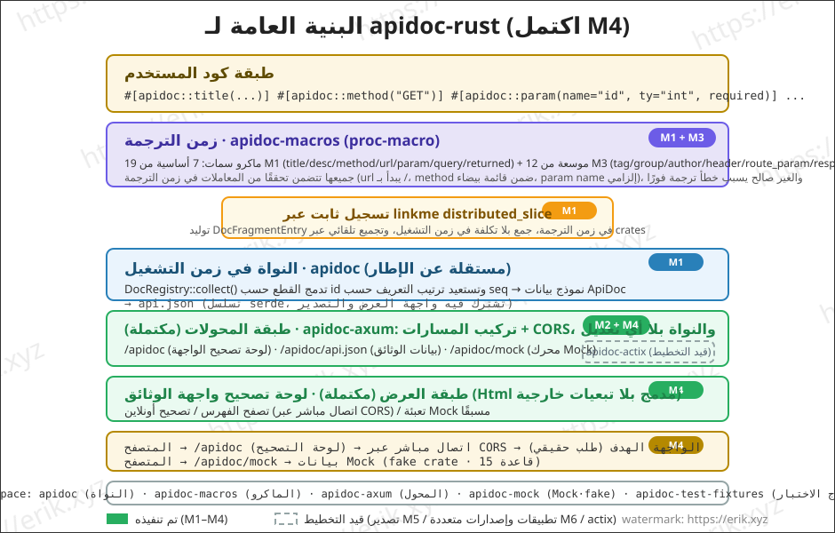
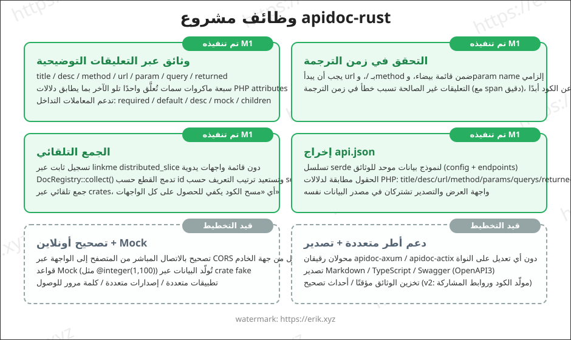
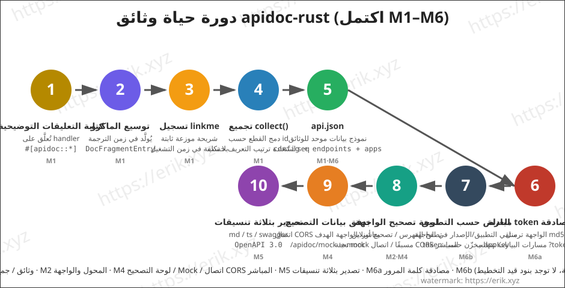

<h1 align="center">Apidoc (apidoc-rust)</h1>

<div align="center">
 مكتبة إضافات عامة لتوليد وثائق واجهات برمجة التطبيقات (API) مبنية على ماكروات Rust الإجرائية (proc-macro)
</div>

<div align="center">
<a href="https://github.com/erikwang2013/apidoc-rust"></a>
<a href="https://github.com/erikwang2013/apidoc-rust"></a>
</div>

<div align="center">
<a href="../../README.md">中文</a> ·
<a href="README-en.md">English</a> ·
<a href="README-ko.md">한국어</a> ·
<a href="README-ru.md">Русский</a> ·
<a href="README-de.md">Deutsch</a> ·
<a href="README-fr.md">Français</a> ·
<a href="README-es.md">Español</a> ·
<a href="README-pt.md">Português</a> ·
<a href="README-hi.md">हिन्दी</a> ·
<a href="README-ar.md"><strong>العربية</strong></a> ·
<a href="README-bn.md">বাংলা</a> ·
<a href="README-id.md">Bahasa Indonesia</a> ·
<a href="README-ja.md">日本語</a>
</div>

## مقدمة المشروع

apidoc-rust هو **مولّد وثائق API عام وقابل للتوسع عبر الإضافات** مكتوب بلغة Rust، مستوحى من [apidoc-php](https://github.com/erikwang2013/apidoc-php) (امتداد Composer يولّد وثائق API اعتمادًا على سمات PHP 8 attributes)، وينقل فكرة «التعليقات التوضيحية هي الوثائق» إلى عالم Rust بطريقة أصلية:

- **التوليد في زمن الترجمة**: تُولَّد الوثائق بواسطة الماكرو الإجرائي في زمن الترجمة، فلا تنفصل الوثائق عن الكود أبدًا؛
- **جمع بلا تكلفة**: تسجيل ثابت عبر linkme، وتجميع واحد في زمن التشغيل يكفي للحصول على جميع وثائق الواجهات؛
- **إضافات عامة**: النواة مستقلة عن إطار عمل HTTP، وتتصل بأي إطار عبر محولات رقيقة (axum / actix-web).

## المميزات

### تم تنفيذه (M1–M3)

- **وثائق عبر التعليقات التوضيحية**: سبعة ماكروات سمات `title` / `desc` / `method` / `url` / `param` / `query` / `returned` تُعلَّق واجهةً تلو الأخرى (بما يطابق أسلوب سمات PHP attributes)، مع دعم التداخل في المعاملات: `required` / `default` / `desc` / `mock` / `children`
- **التحقق في زمن الترجمة**: يجب أن يبدأ url بـ `/`، وmethod ضمن قائمة بيضاء، وparam name إلزامي... أي تعليق توضيحي غير صالح يُبلَغ عنه في زمن الترجمة (مع span دقيق)
- **الجمع التلقائي**: تسجيل ثابت عبر `distributed_slice` من linkme دون الحاجة إلى قائمة واجهات يدوية؛ `DocRegistry::collect()` يدمج القطع حسب id ويستعيد ترتيب التعريف حسب seq، مع جمع تلقائي عبر crates متعددة
- **إخراج api.json**: تسلسل serde لنموذج بيانات موحد (config + endpoints)، بحقول مطابقة لدلالات PHP
- **محول axum + واجهة وثائق مدمجة**: تركيب المسار يعطيك صفحة الوثائق فورًا، مع تصفح الفهرس المجمّع (M2)
- **استكمال التعليقات التوضيحية**: 12 تعليقًا جديدًا `tag` / `group` / `author` / `header` / `route_param` / `response_status` / `success` / `error` / `not_debug` / `md` / `sort` / `ref` (M3)

### تم تنفيذه (M4)

- **تصحيح أونلاين**: لوحة «تصحيح أونلاين» مدمجة في صفحة الوثائق — Base URL يُعبَّأ مسبقًا بـ `location.origin` للاتصال المباشر بالخدمة عبر النطاقات، نموذج المعاملات يُعبَّأ مسبقًا ببيانات mock، استبدال مواضع المسار `{name}` / `:name`، دمج معاملات GET/HEAD في query، وتجميع بقية الـ methods في JSON body، تحرير رؤوس الطلب + header مخصص، عرض الاستجابة (الحالة / الزمن / pretty JSON)، مع تنبيه أصفر عند فشل CORS
- **محرك Mock** (`crates/apidoc/src/mock.rs`، يعتمد على crate fake، 15 قاعدة: name / company / email / phone / url / ip / city / country / text / number / int / float / bool / uuid / date). أولوية القواعد: `mock="fake:xxx"` تمر عبر جدول قواعد fake (الأسماء غير المعروفة تعود إلى قيمة افتراضية) ← بقية قيم mock غير الفارغة تُخرج كما هي (مثل `mock="1"`، `mock="erik"`) ← بدون mock يُولَّد تلقائيًا حسب `ty` (int←`"1"`، float←`"0.5"`، bool←`"true"`، object←`"{}"`، string←`"string"`)؛ children يتداخل بشكل متكرر، وarray ثابت على عنصرين
- **واجهة mock**: محول axum يضيف `GET /apidoc/mock?url=&method=`، بمطابقة دقيقة لـ url + method، ويعيد 404 عند عدم التطابق؛ لوحة التصحيح تخفي افتراضيًا نقاط النهاية `not_debug`، ولا تظهرها إلا بعد تحديد «إظهار واجهات not_debug»
- **اتصال CORS مباشر**: التصحيح أونلاين يربط المتصفح مباشرة بالواجهة الهدف، و`cors_layer` من المحول يتولى السماح (الوكيل العكسي من جهة الخادم يُترك لـ v2)

### تم تنفيذه (M5)

- **التصدير بثلاث صيغ** (`crates/apidoc/src/export/`): markdown / typescript / swagger (OpenAPI 3.0.0)، النواة توفر `export::markdown::render` / `export::typescript::render` / `export::swagger::render`
- **مسار التصدير**: المحول يضيف `GET /apidoc/export?format=md|ts|swagger`، والصيغة غير المعروفة تعيد 400؛ وContent-Type تكون `text/markdown` / `application/typescript` / `application/json` على التوالي
- **markdown**: فهرس مجمّع + جدول معاملات + كتلة استجابة؛ **typescript**: توليد أنواع `{Name}Params` / `{Name}Result` ضمن نطاق group، والواجهات غير المجمّعة تقع في `defaultGroup` (`default` كلمة محجوزة في TS)؛ **swagger**: `info.version` مأخوذ من محتوى ملف `VERSION` في جذر المشروع
- **محول actix-web** (`crates/apidoc/src/actix.rs`): وظائف متطابقة 1:1 مع محول axum — `apidoc_routes(ApidocConfig) -> Scope` يركّب /apidoc و/apidoc/api.json و/apidoc/mock و/apidoc/export، و`cors_layer(CorsConfig)` يسمح بالطلبات عبر النطاقات
- **مشاركة الواجهة**: واجهة الوثائق (`src/ui.html`) نُقلت للأعلى إلى النواة، وتُصدَّر باسم `pub const UI_HTML`، والمحولان يشيران إلى النسخة نفسها (آمن عند نشر الحزمة)

### تم تنفيذه (M6)

- **مصادقة كلمة المرور (M6a)**: عند تفعيل `AuthConfig { enable, password, secret_key, expire }`، يحصل العميل عبر `GET /apidoc/auth?password=<md5(كلمة المرور)>&appKey=<key>` على token؛ مسارات البيانات `/apidoc/api.json` و`/apidoc/export` و`/apidoc/mock` تتطلب `?token=xxx`، وإذا كان token مفقودًا/منتهيًا/خاطئًا يُعاد 401 مع ظهور قناع كلمة مرور في واجهة الوثائق؛ يُصدر token عبر تشفير authcode (منقول سطرًا بسطر من Discuz authcode: متغير RC4 + مجموع تحقق md5 + base64 بلا padding)، الحمولة `{key: md5(md5(كلمة المرور الأصلية)), expire: now+expire}`، ومقارنة MAC في زمن ثابت
- **الخطوط الحمراء لأمان المصادقة**: `password` / `secret_key` لا يُسلسلان أبدًا — إخراج api.json مطابق بايتًا ببايت لحالة عدم تفعيل المصادقة؛ عند عدم تفعيل المصادقة يعيد `/apidoc/auth` 404 وتُمرَّر مسارات البيانات مباشرة؛ إذا كان لإعداد تطبيق كلمة مرور مستقلة فلها الأولوية على كلمة المرور العامة؛ القيمة الافتراضية لـ `secret_key` هي `"apidoc#hgcode"` (تحذير stderr لمرة واحدة عند التفعيل دون إعداد)، والقيمة الافتراضية لـ `expire` هي 86400 ثانية
- **تطبيقات وإصدارات متعددة (M6b)**: `ApidocConfig.apps: Vec<AppConfig>` (`key` / `title` / `items` إصدارات فرعية متكررة / `password`) يهيئ شجرة التطبيقات، و`#[apidoc::app("key")]` يعلّق الواجهات على مفتاح تطبيق معين، والواجهات بدون مفتاح تقع في التطبيق الافتراضي؛ إخراج api.json يضيف شجرة `doc.apps`، ويظهر منتقي تطبيق/إصدار أعلى الواجهة، وتُخزَّن الـ tokens منفصلة في localStorage حسب appKey (يمكن لتطبيقات مختلفة امتلاك كلمات مرور مستقلة)

### قيد التخطيط (v2)

- v2: مولّد كود، مراجع لحقول جداول البيانات، روابط مشاركة، أحداث تصحيح

## البنية



## الوظائف



## دورة الحياة



## بنية المشروع

```
apidoc-rust/
├── Cargo.toml                 # إعداد workspace (resolver 2)
├── VERSION                    # إصدار المشروع (v1.3.0، منفصل عن إصدار الإطار 0.1.0)
├── crates/
│   ├── apidoc/                # النواة في زمن التشغيل (مستقلة عن الإطار)
│   │   ├── src/lib.rs         # نموذج البيانات + تجميع DocRegistry + api.json + UI_HTML
│   │   ├── src/auth.rs        # M6a مصادقة كلمة المرور (إصدار/تحقق token عبر authcode + حارس المسارات)
│   │   ├── src/export/        # تصدير M5: markdown / typescript / swagger
│   │   ├── src/ui.html        # واجهة الوثائق المشتركة (تصدّرها النواة، ويشير إليها المحولان)
│   │   ├── tests/             # اختبارات التكامل (توسيع الماكرو / التجميع / التسلسل / عبر crates)
│   │   └── examples/demo.rs   # مثال: تعليقات توضيحية + إخراج api.json
│   ├── apidoc-macros/         # proc-macro: 20 ماكروات سمات
│   │   └── src/lib.rs         # تعريفات الماكرو + تحليل المعاملات + التحقق في زمن الترجمة

│   ├── apidoc-test-fixtures/  # نماذج اختبار التسجيل عبر crates


├── .github/
│   └── workflows/release.yml  # سير عمل النشر (يقرأ VERSION، وإنشاء tag+release تدريجي)
└── docs/
    ├── images/                # مخططات البنية / الوظائف / دورة الحياة (SVG)
    └── i18n/                  # وثائق متعددة اللغات (12 لغة)
```

## دليل الاستخدام

### 1. إضافة التبعيات

```toml
[dependencies]
apidoc-rust = "0.1"        # أو path = "crates/apidoc"


serde_json = "1"      # لاستخدام إخراج api.json
```

> المحولات تُختار واحدًا حسب إطار العمل: axum يستخدم `features = ["axum"]`، وactix-web يستخدم `features = ["actix"]` (وظائف الاثنين 1:1). `mock` (محرك Mock) تبعية داخلية للإطار، تُضاف تلقائيًا عبر المحول، ولا يحتاج المستهلك عمومًا إلى استخدامه مباشرة.

### 2. كتابة التعليقات التوضيحية

علّق على دوال handler واحدًا تلو الآخر، وتُولَّد الوثائق في زمن الترجمة:

```rust
use apidoc::*;

#[apidoc::title("جلب معلومات المستخدم")]
#[apidoc::desc("الاستعلام عن تفاصيل المستخدم حسب معرّف المستخدم")]
#[apidoc::url("/api/user/info")]
#[apidoc::method("GET")]
#[apidoc::param(name = "user_id", ty = "int", required, desc = "معرّف المستخدم", mock = "1")]
#[apidoc::query(name = "lang", ty = "string", desc = "اللغة", default = "zh-CN")]
#[apidoc::returned(
    name = "data",
    ty = "object",
    desc = "بيانات المستخدم",
    children = [
        { name = "id", ty = "int", required, desc = "معرّف المستخدم" },
        { name = "name", ty = "string", required, desc = "اسم المستخدم", mock = "erik" },
    ]
)]
fn get_user_info() -> String {
    unimplemented!()
}
```

### 3. الجمع والإخراج

```rust
fn main() {
    let doc = DocRegistry::collect_doc(ApidocConfig {
        title: "API الخاص بي".to_string(),
        description: None,
        auth: None,    // M6a مصادقة كلمة المرور، انظر «8. مصادقة كلمة المرور»
        apps: vec![],  // M6b تطبيقات وإصدارات متعددة، انظر «9. تطبيقات وإصدارات متعددة»
    });
    println!("{}", serde_json::to_string_pretty(&doc).unwrap());
}
```

### 4. تشغيل المثال

```bash
cargo run --example demo -p apidoc
```

الإخراج (مقتطف):

```json
{
  "config": { "title": "demo api" },
  "endpoints": [
    {
      "title": "جلب معلومات المستخدم",
      "desc": "الاستعلام عن تفاصيل المستخدم حسب معرّف المستخدم",
      "url": "/api/user/info",
      "method": "GET",
      "params": [
        { "name": "user_id", "type": "int", "required": true, "desc": "معرّف المستخدم", "mock": "1" }
      ],
      "querys": [
        { "name": "lang", "type": "string", "required": false, "default": "zh-CN", "desc": "اللغة" }
      ],
      "returned": [
        {
          "name": "data",
          "type": "object",
          "required": false,
          "desc": "بيانات المستخدم",
          "children": [
            { "name": "id", "type": "int", "required": true, "desc": "معرّف المستخدم" },
            { "name": "name", "type": "string", "required": true, "desc": "اسم المستخدم", "mock": "erik" }
          ]
        }
      ]
    }
  ]
}
```

### 5. التصحيح أونلاين و Mock (M4)

افتح صفحة الوثائق ← اختر واجهة ← لوحة «التصحيح أونلاين» على اليمين تعبّئ المعاملات مسبقًا وفق قواعد mock ← وجّه Base URL إلى عنوان الخدمة الهدف (الافتراضي `location.origin`، اتصال مباشر عبر النطاقات) ← اضغط إرسال لتحصل على الاستجابة الحقيقية (رمز الحالة / الزمن / pretty JSON). لوحة التصحيح تخفي افتراضيًا نقاط النهاية `not_debug`، ولا تظهرها إلا بعد تحديد «إظهار واجهات not_debug».

**متطلب CORS**: التصحيح أونلاين يربط المتصفح مباشرة بالواجهة الهدف، لذا يجب على الخدمة الهدف تركيب `cors_layer` الذي يوفره المحول للسماح بطلبات عبر النطاقات؛ وعند فشل CORS تعرض اللوحة تنبيهًا أصفر.

صيغة قواعد Mock (ثلاث أولويات):

```rust
#[apidoc::param(name = "email", ty = "string", desc = "البريد", mock = "fake:email")]  // توليد عبر قاعدة fake
#[apidoc::param(name = "status", ty = "string", desc = "الحالة", mock = "1")]          // mock غير فارغ يُخرج كما هو
#[apidoc::param(name = "name", ty = "string", desc = "اسم المستخدم")]                   // بدون mock: توليد تلقائي حسب ty
#[apidoc::returned(
    name = "data",
    ty = "object",
    children = [
        { name = "id", ty = "int", required },       // بدون mock → "1"
        { name = "email", ty = "string", mock = "fake:email" },  // children يتداخل بشكل متكرر
    ]
)]
fn create_user() -> String {
    unimplemented!()
}
```

15 قاعدة fake مدمجة: `name` / `company` / `email` / `phone` / `url` / `ip` / `city` / `country` / `text` / `number` / `int` / `float` / `bool` / `uuid` / `date`؛ الأسماء غير المعروفة تعود إلى قيمة افتراضية. قواعد التوليد التلقائي بدون mock: int←`"1"`، float←`"0.5"`، bool←`"true"`، object←`"{}"`، string←`"string"`؛ وarray ثابت على عنصرين.

### 6. التصدير أونلاين (M5)

المحول يوفر واجهات تصدير بالصيغ الثلاث مدمجة، جاهزة فور التركيب (الصيغة غير المعروفة `format` تعيد 400):

```bash
GET /apidoc/export?format=md        # فهرس مجمّع + جدول معاملات + كتلة استجابة (text/markdown)
GET /apidoc/export?format=ts        # توليد أنواع {Name}Params / {Name}Result ضمن نطاق group (application/typescript)
GET /apidoc/export?format=swagger   # ملف وصف OpenAPI 3.0.0 (application/json)
```

- **markdown**: مناسب للصقه في Wiki المشروع / ملاحظات الإصدار، يخرج فهرسًا مجمّعًا حسب المجموعة، وكل واجهة مع جدول معاملات وكتلة استجابة؛
- **typescript**: الواجهة الأمامية يمكنها لصقه مباشرة كتعريفات أنواع؛ الواجهات غير المجمّعة تقع في نطاق `defaultGroup` (`default` كلمة محجوزة في TS، لا يمكن استخدامها كمعرّف)؛
- **swagger**: `info.version` مأخوذ من محتوى ملف `VERSION` في جذر المشروع (حاليًا 1.3.0)، ويمكن استيراده مباشرة إلى Swagger UI أو مولّدات الكود.

### 7. محول actix-web

عند استخدام actix-web كإطار عمل للويب، اربط `features = ["actix"]` (وظائف متطابقة 1:1 مع محول axum):

```toml
[dependencies]
apidoc-rust = { version = "0.1", features = ["actix"] }
```

```rust
use actix_web::{App, HttpServer};
use apidoc::actix::{apidoc_routes, cors_layer, CorsConfig};
use apidoc::ApidocConfig;

#[actix_web::main]
async fn main() -> std::io::Result<()> {
    HttpServer::new(|| {
        App::new()
            .service(apidoc_routes(ApidocConfig {
                title: "API الخاص بي".to_string(),
                description: None,
                auth: None,    // M6a مصادقة كلمة المرور، انظر «8. مصادقة كلمة المرور»
                apps: vec![],  // M6b تطبيقات وإصدارات متعددة، انظر «9. تطبيقات وإصدارات متعددة»
            }))
            .wrap(cors_layer(CorsConfig::default()))   // M4 التصحيح أونلاين عبر النطاقات
    })
    .bind("127.0.0.1:8080")?
    .run()
    .await
}
```

بعد التركيب يمكن الوصول إلى `/apidoc` (واجهة الوثائق) و`/apidoc/api.json` (البيانات) و`/apidoc/mock` (Mock) و`/apidoc/export` (التصدير). إعداد CORS الفارغ يسمح حرفيًا `*` (دون حمل اعتمادات)، وعند إعداد القائمة البيضاء `allow_origins` فيطابق تلقائيًا Origin المُعاد توجيهه بدقة، وكلا الوضعين لا يفتحان الاعتمادات.

### 8. مصادقة كلمة المرور (M6a)

عند تفعيل `auth` تصبح الوثائق بحاجة إلى كلمة مرور للوصول (بما يطابق Auth.php في apidoc-php الأصلي، والـ token هو تشفير Discuz authcode منقول سطرًا بسطر):

```rust
use apidoc::auth::AuthConfig;

let doc = DocRegistry::collect_doc(ApidocConfig {
    title: "API الخاص بي".to_string(),
    description: None,
    auth: Some(AuthConfig {
        enable: true,
        password: "your-password".to_string(),
        secret_key: "your-secret-key".to_string(), // الافتراضي "apidoc#hgcode" (تحذير stderr لمرة واحدة عند التفعيل دون إعداد)
        expire: 86400,                             // بالثواني؛ الافتراضي 86400
    }),
    apps: vec![],
});
```

**الخطوات**:

1. يستدعي العميل `GET /apidoc/auth?password=<md5(كلمة المرور)>&appKey=<key>` ليحصل على token (عند النجاح يُعاد `{"token":"..."}`، وعند خطأ كلمة المرور يُعاد 401)؛ عند عدم تفعيل المصادقة يعيد هذا المسار 404 وتُمرَّر مسارات البيانات مباشرة
2. مسارات البيانات `GET /apidoc/api.json` و`/apidoc/export` و`/apidoc/mock` تتطلب `?token=xxx` (مع `&appKey=` أيضًا عند اختيار تطبيق معين)؛ وإذا كان token مفقودًا/منتهيًا/خاطئًا يُعاد 401، وتفتح واجهة الوثائق تلقائيًا قناع كلمة المرور، وبعد إدخال كلمة المرور يحوّلها الطرف الأمامي محليًا إلى md5 ويستبدلها بالـ token
3. حمولة الـ token هي `{key: md5(md5(كلمة المرور الأصلية)), expire: now+expire}`، مشفرة عبر `secret_key` بـ authcode (متغير RC4 + مجموع تحقق md5 + base64 بلا padding، ومقارنة MAC في زمن ثابت لمنع هجمات التوقيت الجانبية)
4. `password` / `secret_key` لا يُسلسلان أبدًا — إخراج api.json مطابق بايتًا ببايت لحالة عدم تفعيل المصادقة؛ وإذا كان لإعداد تطبيق `password` مستقلة فلها الأولوية على كلمة المرور العامة

### 9. تطبيقات وإصدارات متعددة (M6b)

يمكن تقسيم المشروع إلى تطبيقات/إصدارات متعددة، لكل منها عرض وتحكم بالوصول مستقل:

```rust
#[apidoc::title("获取用户信息")]
#[apidoc::app("demo")]   // تُعلق على التطبيق ذي key="demo"؛ الواجهات بدون app تقع في التطبيق الافتراضي
fn get_user_info() -> String {
    unimplemented!()
}
```

```rust
let doc = DocRegistry::collect_doc(ApidocConfig {
    title: "API الخاص بي".to_string(),
    description: None,
    auth: None,
    apps: vec![
        AppConfig {
            key: "demo".to_string(),
            title: "演示应用".to_string(),
            items: vec![AppConfig {
                key: "v1".to_string(),
                title: "v1".to_string(),
                items: vec![],
                password: None,
            }],
            password: None, // كلمة مرور وصول مستقلة للتطبيق، لها الأولوية على العامة، لا تُسلسل أبدًا
        },
    ],
});
```

- `AppConfig { key, title, items, password }`: `key` هو المعرّف الفريد الذي تشير إليه تعليقة `#[apidoc::app("key")]`، و`items` يتداخل بشكل متكرر لإصدارات/تطبيقات فرعية، و`password` هي كلمة مرور الوصول المستقلة للتطبيق (عند وجود كلمة مرور مستقلة يُتحقق من token التطبيق فقط)
- إخراج api.json يضيف شجرة `doc.apps` (key / title / items / endpoints)؛ يظهر منتقي تطبيق/إصدار أعلى الواجهة — عند التبديل تُعرض واجهات ذلك العقدة وتُعاد جلب البيانات، وتُخزَّن الـ tokens منفصلة في localStorage حسب appKey
- عندما تشير تعليقة `app` إلى مفتاح غير مهيأ في `apps` يُصدر تحذير stderr وتقع الواجهة في التطبيق الافتراضي؛ بدون تعليقات `app` أو بدون تهيئة `apps` يكون الإخراج مطابقًا بايتًا ببايت لـ M5

## خطة التطوير

| المرحلة | المحتوى | الحالة |
|------|------|------|
| M1 | هيكل workspace + نموذج البيانات + ماكرو MVP + تسجيل linkme | ✅ مكتمل |
| M2 | محول axum + واجهة وثائق مدمجة + فهرس مجمّع | ✅ مكتمل |
| M3 | استكمال التعليقات التوضيحية (tag/group/author/header/route_param/response_status/success/error/not_debug/md/sort/ref) | ✅ مكتمل |
| M4 | تصحيح أونلاين + محرك Mock | ✅ مكتمل |
| M5 | تصدير markdown / typescript / swagger.json (OpenAPI3) | ✅ مكتمل |
| —  | محول actix-web (وظائف متطابقة 1:1 مع axum) | ✅ مكتمل |
| M6a | مصادقة كلمة المرور (token authcode + قناع كلمة المرور، كلمة مرور التطبيق لها الأولوية) | ✅ مكتمل |
| M6b | تطبيقات وإصدارات متعددة (شجرة إعداد apps + تعليقة app + منتقي الواجهة) | ✅ مكتمل |

## وثائق متعددة اللغات

- [中文](../../README.md)
- [English](README-en.md)
- [한국어](README-ko.md)
- [Русский](README-ru.md)
- [Deutsch](README-de.md)
- [Français](README-fr.md)
- [Español](README-es.md)
- [Português](README-pt.md)
- [हिन्दी](README-hi.md)
- [العربية](README-ar.md)
- [বাংলা](README-bn.md)
- [Bahasa Indonesia](README-id.md)
- [日本語](README-ja.md)

## الدعم والتبرعات

إذا كان هذا المشروع مفيدًا لك، فمرحبًا بك لدعمنا بنجمة ⭐، ونسعد أيضًا بأي تبرع لدعم البرمجيات مفتوحة المصدر!

### 微信支付 / 支付宝 (WeChat Pay / Alipay)

<table>
  <tr>
    <td align="center">
      <br/>
      <strong>微信支付 (WeChat Pay)</strong>
    </td>
    <td align="center">
      <br/>
      <strong>支付宝 (Alipay)</strong>
    </td>
  </tr>
</table>

### التبرعات عبر التحويلات المصرفية العالمية

**【معلومات المستفيد】**

- اسم المستفيد: WANG KEXUN
- رقم حساب المستفيد: 881015918251

**【البنك المستفيد】**

- رمز SWIFT لبنك ZA Bank: AABLHKHHXXX
- اسم البنك: ZA Bank Limited
- رقم البنك: 387
- عنوان البنك: Core F, Cyberport 3, 100 Cyberport Road, Hong Kong

**【البنك الوكيل للتحويلات العابرة للحدود (عند الحاجة)】**

> يرجى الانتباه: هذه معلومات البنك الوكيل للتحويلات العابرة للحدود (البنك الوسيط)، وليست معلومات البنك المستفيد. استفسر من البنك المُحوِّل عما إذا كانت هناك حاجة لتقديم معلومات البنك الوكيل.

- **البنك الوكيل للتحويلات بالدولار الهونغ كونغي واليوان الصيني والدولار الأمريكي هو Citibank:**
  - اسم البنك: Citibank N.A. Hong Kong
  - رمز SWIFT: CITIHKHXXXX
  - رقم البنك: 006
  - اسم الفرع: Hong Kong Branch
  - رقم الفرع: 391
  - عنوان البنك: Citibank Tower, Citibank Plaza, 3 Garden Road, Central, Hong Kong
- **أما البنك الوكيل للتحويلات بالعملات الأخرى فهو BNY Mellon:**
  - اسم البنك: THE BANK OF NEW YORK MELLON
  - رمز SWIFT: IRVTUS3NXXX
  - عنوان البنك: THE BANK OF NEW YORK MELLON, 240 GREENWICH STREET, NEW YORK, United States

## الترخيص

[MIT](LICENSE)
