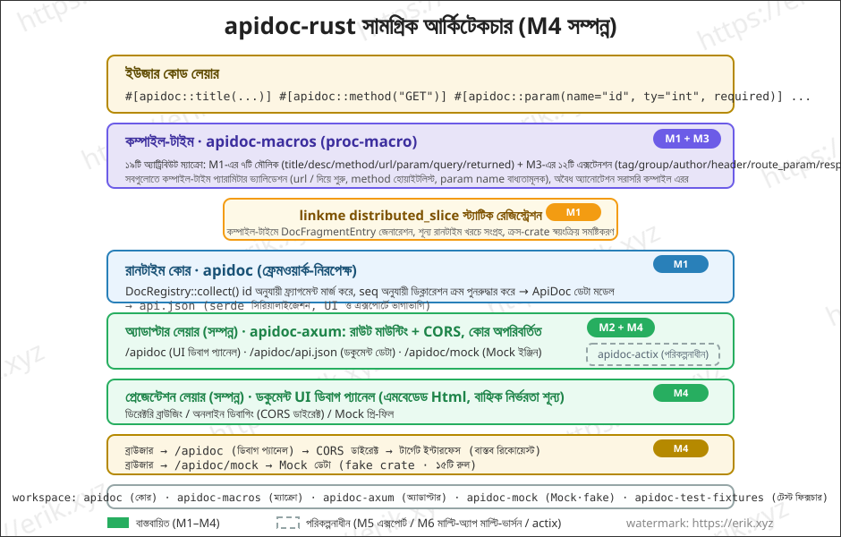
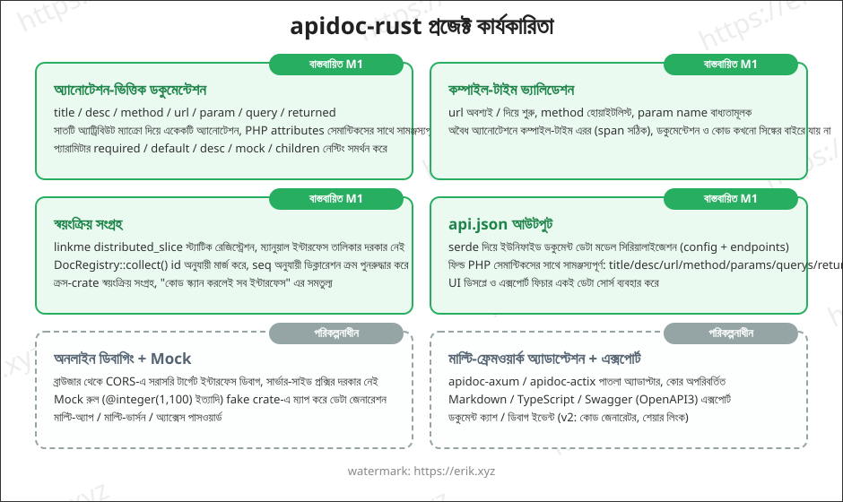
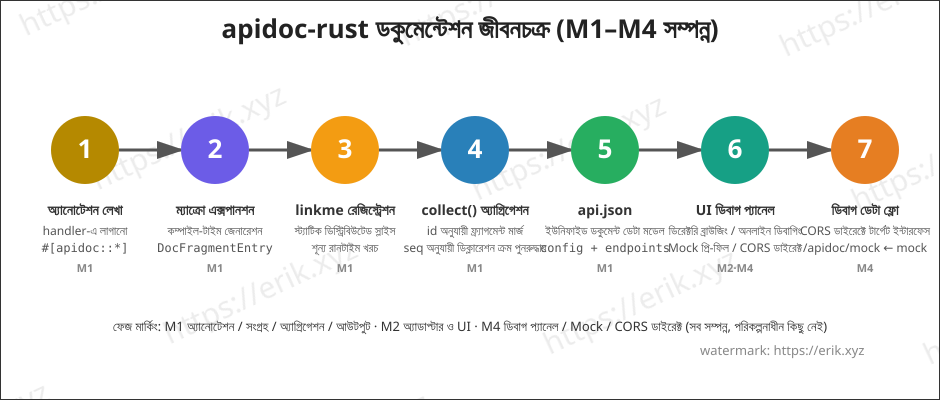

<h1 align="center">Apidoc (apidoc-rust)</h1>

<div align="center">
 রাস্ট প্রসেস-ম্যাক্রো (proc-macro) দিয়ে API ইন্টারফেস ডকুমেন্টেশন তৈরি করার সাধারণ প্লাগইন লাইব্রেরি
</div>

<div align="center">
<a href="https://github.com/erikwang2013/apidoc-rust"></a>
<a href="https://github.com/erikwang2013/apidoc-rust"></a>
</div>

<div align="center">
<a href="../../README.md">中文</a> ·
<a href="README-en.md">English</a> ·
<a href="README-ko.md">한국어</a> ·
<a href="README-ru.md">Русский</a> ·
<a href="README-de.md">Deutsch</a> ·
<a href="README-fr.md">Français</a> ·
<a href="README-es.md">Español</a> ·
<a href="README-pt.md">Português</a> ·
<a href="README-hi.md">हिन्दी</a> ·
<a href="README-ar.md">العربية</a> ·
<a href="README-bn.md"><strong>বাংলা</strong></a> ·
<a href="README-id.md">Bahasa Indonesia</a> ·
<a href="README-ja.md">日本語</a>
</div>

## প্রকল্প পরিচিতি

apidoc-rust হল একটি রাস্টে বাস্তবায়িত **সাধারণ প্লাগইন-ভিত্তিক API ইন্টারফেস ডকুমেন্টেশন জেনারেটর**, যা [apidoc-php](https://github.com/erikwang2013/apidoc-php) (PHP 8 attributes-এর ভিত্তিতে API ডকুমেন্টেশন তৈরি করা composer এক্সটেনশন)-কে অনুসরণ করে, "অ্যানোটেশনই ডকুমেন্টেশন" ধারণাটিকে রাস্টের নেটিভ উপায়ে বাস্তবায়ন করে:

- **কম্পাইল-টাইম জেনারেশন**: প্রসেস-ম্যাক্রো কম্পাইল-টাইমে ডকুমেন্টেশন তৈরি করে, ডকুমেন্টেশন ও কোড কখনোই সিঙ্কের বাইরে যায় না;
- **শূন্য-খরচ সংগ্রহ**: linkme স্ট্যাটিক রেজিস্ট্রেশনের মাধ্যমে, রানটাইমে একবার অ্যাগ্রিগেশন করলেই সব ইন্টারফেস ডকুমেন্টেশন পাওয়া যায়;
- **সাধারণ প্লাগইন**: কোর HTTP ফ্রেমওয়ার্ক-নিরপেক্ষ, পাতলা অ্যাডাপ্টার (axum / actix-web)-এর মাধ্যমে যেকোনো ফ্রেমওয়ার্কে সংযুক্ত হয়।

## বৈশিষ্ট্য

### বাস্তবায়িত (M1–M3)

- **অ্যানোটেশন-ভিত্তিক ডকুমেন্টেশন**: `title` / `desc` / `method` / `url` / `param` / `query` / `returned` সাতটি অ্যাট্রিবিউট ম্যাক্রো, একেকটি করে অ্যানোটেশন (PHP attributes লেখার সাথে সামঞ্জস্যপূর্ণ), প্যারামিটারগুলো `required` / `default` / `desc` / `mock` / `children` নেস্টিং সমর্থন করে
- **কম্পাইল-টাইম ভ্যালিডেশন**: url অবশ্যই `/` দিয়ে শুরু হতে হবে, method হোয়াইটলিস্ট, param name বাধ্যতামূলক ইত্যাদি — অবৈধ অ্যানোটেশনে কম্পাইল-টাইম এরর (span সঠিক)
- **স্বয়ংক্রিয় সংগ্রহ**: linkme `distributed_slice` স্ট্যাটিক রেজিস্ট্রেশন, ম্যানুয়াল ইন্টারফেস তালিকার দরকার নেই; `DocRegistry::collect()` id অনুযায়ী মার্জ করে, seq অনুযায়ী ডিক্লারেশন ক্রম পুনরুদ্ধার করে, ক্রস-crate স্বয়ংক্রিয় সংগ্রহ
- **api.json আউটপুট**: serde সিরিয়ালাইজেশনের মাধ্যমে ইউনিফাইড ডকুমেন্ট ডেটা মডেল (config + endpoints), ফিল্ডগুলো PHP সেমান্টিকসের সাথে সামঞ্জস্যপূর্ণ
- **axum অ্যাডাপ্টার + এমবেডেড ডকুমেন্ট UI**: রাউট মাউন্ট করলেই ডকুমেন্টেশন পেজ পাওয়া যায়, গ্রুপড ডিরেক্টরি ব্রাউজিং (M2)
- **অ্যানোটেশন সম্পূর্ণকরণ**: `tag` / `group` / `author` / `header` / `route_param` / `response_status` / `success` / `error` / `not_debug` / `md` / `sort` / `ref` ১২টি নতুন অ্যানোটেশন (M3)

### বাস্তবায়িত (M4)

- **অনলাইন ডিবাগিং**: ডকুমেন্ট পেজে বিল্ট-ইন «অনলাইন ডিবাগিং» প্যানেল — Base URL প্রি-ফিল হয় `location.origin` দিয়ে ক্রস-অরিজিনে সরাসরি টার্গেট সার্ভিসে, প্যারামিটার ফর্ম mock দিয়ে প্রি-ফিল, `{name}` / `:name` রাউট প্লেসহোল্ডার রিপ্লেসমেন্ট, GET/HEAD প্যারামিটার query-তে, বাকি methods JSON body হিসেবে, রিকোয়েস্ট হেডার এডিট + কাস্টম header, রেসপন্স ডিসপ্লে (স্ট্যাটাস / সময় / pretty JSON), CORS ফেল হলে হলুদ সতর্কতা
- **Mock ইঞ্জিন** (`crates/apidoc-mock`, fake crate-এর উপর নির্ভরশীল, ১৫টি রুল: name / company / email / phone / url / ip / city / country / text / number / int / float / bool / uuid / date)। রুল প্রায়োরিটি: `mock="fake:xxx"` fake রুল টেবিলে যায় (অজানা নাম ডিফল্ট ভ্যালুতে ফলব্যাক) ← বাকি নন-খালি mock অপরিবর্তিত আউটপুট (যেমন `mock="1"`, `mock="erik"`) ← mock না থাকলে `ty` অনুযায়ী অটো-জেনারেশন (int←`"1"`, float←`"0.5"`, bool←`"true"`, object←`"{}"`, string←`"string"`)؛ children রিকার্সিভ নেস্টিং, array ফিক্সড ২টি আইটেম
- **mock ইন্টারফেস**: axum অ্যাডাপ্টারে নতুন `GET /apidoc/mock?url=&method=`, url + method এক্সাক্ট ম্যাচ, ম্যাচ না হলে 404; ডিবাগ প্যানেল ডিফল্টে `not_debug` এন্ডপয়েন্ট লুকিয়ে রাখে, «not_debug ইন্টারফেস দেখান» টিক দিলে দেখায়
- **CORS ডাইরেক্ট**: অনলাইন ডিবাগিং ব্রাউজার থেকে সরাসরি টার্গেট ইন্টারফেসে সংযোগ করে, অ্যাডাপ্টারের `cors_layer` পারমিশন দেয় (সার্ভার-সাইড রিভার্স প্রক্সি v2-তে)

### পরিকল্পনাধীন

- মাল্টি-অ্যাপ / মাল্টি-ভার্সন / অ্যাক্সেস পাসওয়ার্ড
- Markdown / TypeScript / Swagger (OpenAPI3) এক্সপোর্ট (M5)
- মাল্টি-ফ্রেমওয়ার্ক অ্যাডাপ্টেশন (apidoc-axum সম্পন্ন, apidoc-actix এখনো হয়নি)
- v2: কোড জেনারেটর, ডেটা টেবিল ফিল্ড রেফারেন্স, শেয়ার লিংক, ডিবাগ ইভেন্ট

## আর্কিটেকচার



## কার্যকারিতা



## জীবনচক্র



## প্রজেক্ট কাঠামো

```
apidoc-rust/
├── Cargo.toml                 # workspace কনফিগারেশন (resolver 2)
├── VERSION                    # প্রজেক্ট ভার্সন (v1.0.0, ফ্রেমওয়ার্ক ভার্সন 0.1.0 থেকে আলাদা)
├── crates/
│   ├── apidoc/                # রানটাইম কোর (ফ্রেমওয়ার্ক-নিরপেক্ষ)
│   │   ├── src/lib.rs         # ডেটা মডেল + DocRegistry অ্যাগ্রিগেশন + api.json
│   │   ├── tests/             # ইন্টিগ্রেশন টেস্ট (ম্যাক্রো এক্সপানশন/অ্যাগ্রিগেশন/সিরিয়ালাইজেশন/ক্রস-crate)
│   │   └── examples/demo.rs   # উদাহরণ: অ্যানোটেশন + api.json আউটপুট
│   ├── apidoc-macros/         # proc-macro: ১৯টি অ্যাট্রিবিউট ম্যাক্রো
│   │   └── src/lib.rs         # ম্যাক্রো সংজ্ঞা + প্যারামিটার পার্সিং + কম্পাইল-টাইম ভ্যালিডেশন
│   ├── apidoc-mock/           # Mock ইঞ্জিন (fake রুল দিয়ে mock ডেটা জেনারেশন)
│   ├── apidoc-test-fixtures/  # ক্রস-crate রেজিস্ট্রেশন টেস্ট ফিক্সচার
│   └── apidoc-axum/           # axum অ্যাডাপ্টার (ডকুমেন্ট রাউট + cors_layer + /apidoc/mock)
├── .github/
│   └── workflows/release.yml  # রিলিজ ওয়ার্কফ্লো (VERSION পড়ে, ইনক্রিমেন্টাল tag+release তৈরি)
└── docs/
    ├── images/                # আর্কিটেকচার/কার্যকারিতা/জীবনচক্র চিত্র (SVG)
    └── i18n/                  # বহুভাষিক ডকুমেন্টেশন (১২টি ভাষা)
```

## ব্যবহার নির্দেশিকা

### ১. ডিপেন্ডেন্সি যোগ করা

```toml
[dependencies]
apidoc = "0.1"        # অথবা path = "crates/apidoc"
apidoc-macros = "0.1"
linkme = "0.3"        # ম্যাক্রো এক্সপানশন সরাসরি linkme পাথ রেফার করে, ভোক্তাকে সরাসরি ডিপেন্ডেন্সি দিতে হবে
serde_json = "1"      # api.json আউটপুটের জন্য
```

> `apidoc-mock` (Mock ইঞ্জিন) ফ্রেমওয়ার্কের অভ্যন্তরীণ ডিপেন্ডেন্সি, অ্যাডাপ্টারের মাধ্যমে স্বয়ংক্রিয়ভাবে যুক্ত হয়, সাধারণত ভোক্তাকে সরাসরি ব্যবহার করতে হয় না।

### ২. অ্যানোটেশন লেখা

handler ফাংশনে একেকটি করে অ্যানোটেশন লাগান, ডকুমেন্টেশন কম্পাইল-টাইমেই তৈরি হবে:

```rust
use apidoc::*;

#[apidoc::title("获取用户信息")]
#[apidoc::desc("根据用户 ID 查询用户详情")]
#[apidoc::url("/api/user/info")]
#[apidoc::method("GET")]
#[apidoc::param(name = "user_id", ty = "int", required, desc = "用户ID", mock = "1")]
#[apidoc::query(name = "lang", ty = "string", desc = "语言", default = "zh-CN")]
#[apidoc::returned(
    name = "data",
    ty = "object",
    desc = "用户数据",
    children = [
        { name = "id", ty = "int", required, desc = "用户ID" },
        { name = "name", ty = "string", required, desc = "用户名", mock = "erik" },
    ]
)]
fn get_user_info() -> String {
    unimplemented!()
}
```

### ৩. সংগ্রহ ও আউটপুট

```rust
fn main() {
    let endpoints = DocRegistry::collect();
    let doc = ApiDoc {
        config: ApidocConfig {
            title: "我的 API".to_string(),
            description: None,
        },
        endpoints,
    };
    println!("{}", serde_json::to_string_pretty(&doc).unwrap());
}
```

### ৪. উদাহরণ চালানো

```bash
cargo run --example demo -p apidoc
```

আউটপুট (নির্বাচিত অংশ):

```json
{
  "config": { "title": "demo api" },
  "endpoints": [
    {
      "title": "获取用户信息",
      "desc": "根据用户 ID 查询用户详情",
      "url": "/api/user/info",
      "method": "GET",
      "params": [
        { "name": "user_id", "type": "int", "required": true, "desc": "用户ID", "mock": "1" }
      ],
      "querys": [
        { "name": "lang", "type": "string", "required": false, "default": "zh-CN", "desc": "语言" }
      ],
      "returned": [
        {
          "name": "data",
          "type": "object",
          "required": false,
          "desc": "用户数据",
          "children": [
            { "name": "id", "type": "int", "required": true, "desc": "用户ID" },
            { "name": "name", "type": "string", "required": true, "desc": "用户名", "mock": "erik" }
          ]
        }
      ]
    }
  ]
}
```

### ৫. অনলাইন ডিবাগিং ও Mock (M4)

ডকুমেন্টেশন পেজ খুলুন ← ইন্টারফেস নির্বাচন করুন ← ডান পাশের «অনলাইন ডিবাগিং» প্যানেল mock রুল অনুযায়ী প্যারামিটার প্রি-ফিল করে ← Base URL টার্গেট সার্ভিসের ঠিকানায় দিন (ডিফল্ট `location.origin`, ক্রস-অরিজিনে সরাসরি সংযোগ) ← সেন্ড চাপলে আসল রেসপন্স পাবেন (স্ট্যাটাস কোড / সময় / pretty JSON)। ডিবাগ প্যানেল ডিফল্টে `not_debug` এন্ডপয়েন্ট লুকিয়ে রাখে, «not_debug ইন্টারফেস দেখান» টিক দিলে দেখায়।

**CORS প্রয়োজনীয়তা**: অনলাইন ডিবাগিং ব্রাউজার থেকে সরাসরি টার্গেট ইন্টারফেসে সংযোগ করে, তাই টার্গেট সার্ভিসকে অ্যাডাপ্টারের দেওয়া `cors_layer` মাউন্ট করতে হবে যাতে ক্রস-অরিজিন রিকোয়েস্ট অনুমোদিত হয়; CORS ব্যর্থ হলে প্যানেল হলুদ সতর্কতা দেখায়।

Mock রুল সিনট্যাক্স (তিনটি প্রায়োরিটি):

```rust
#[apidoc::param(name = "email", ty = "string", desc = "邮箱", mock = "fake:email")]  // fake 规则生成
#[apidoc::param(name = "status", ty = "string", desc = "状态", mock = "1")]          // 非空 mock 原样直出
#[apidoc::param(name = "name", ty = "string", desc = "用户名")]                       // 无 mock：按 ty 自动生成
#[apidoc::returned(
    name = "data",
    ty = "object",
    children = [
        { name = "id", ty = "int", required },       // 无 mock → "1"
        { name = "email", ty = "string", mock = "fake:email" },  // children 递归嵌套
    ]
)]
fn create_user() -> String {
    unimplemented!()
}
```

বিল্ট-ইন ১৫টি fake রুল: `name` / `company` / `email` / `phone` / `url` / `ip` / `city` / `country` / `text` / `number` / `int` / `float` / `bool` / `uuid` / `date`; অজানা নাম ডিফল্ট ভ্যালুতে ফলব্যাক। mock ছাড়া অটো-জেনারেশন রুল: int←`"1"`, float←`"0.5"`, bool←`"true"`, object←`"{}"`, string←`"string"`; array ফিক্সড ২টি আইটেম।

## উন্নয়ন পরিকল্পনা

| পর্যায় | বিষয়বস্তু | অবস্থা |
|------|------|------|
| M1 | workspace কঙ্কাল + ডেটা মডেল + ম্যাক্রো MVP + linkme রেজিস্ট্রেশন | ✅ সম্পন্ন |
| M2 | axum অ্যাডাপ্টার + এমবেডেড ডকুমেন্ট UI + গ্রুপড ডিরেক্টরি | ✅ সম্পন্ন |
| M3 | অ্যানোটেশন সম্পূর্ণকরণ (tag/group/author/header/route_param/response_status/success/error/not_debug/md/sort/ref) | ✅ সম্পন্ন |
| M4 | অনলাইন ডিবাগিং + Mock ইঞ্জিন | ✅ সম্পন্ন |
| M5 | markdown / typescript / swagger.json এক্সপোর্ট | পরিকল্পনাধীন |
| M6 | পাসওয়ার্ড অথেনটিকেশন, মাল্টি-অ্যাপ মাল্টি-ভার্সন, রিলিজ | পরিকল্পনাধীন |

## বহুভাষিক ডকুমেন্টেশন

- [English](README-en.md)
- [한국어](README-ko.md)
- [Русский](README-ru.md)
- [Deutsch](README-de.md)
- [Français](README-fr.md)
- [Español](README-es.md)
- [Português](README-pt.md)
- [हिन्दी](README-hi.md)
- [العربية](README-ar.md)
- [বাংলা](README-bn.md)
- [Bahasa Indonesia](README-id.md)
- [日本語](README-ja.md)

## সমর্থন ও দান

এই প্রজেক্ট যদি আপনার কাজে লাগে, তাহলে ⭐ Star দিয়ে আমাদের সমর্থন করুন, এবং ওপেন-সোর্স সমর্থনে দানও স্বাগতম!

### 微信支付 / 支付宝 (WeChat Pay / Alipay)

<table>
  <tr>
    <td align="center">
      <br/>
      <strong>微信支付</strong>
    </td>
    <td align="center">
      <br/>
      <strong>支付宝</strong>
    </td>
  </tr>
</table>

### বৈশ্বিক ব্যাংক ট্রান্সফার দান

**【প্রাপকের তথ্য】**

- প্রাপকের নাম: WANG KEXUN
- প্রাপক অ্যাকাউন্ট নম্বর: 881015918251

**【প্রাপক ব্যাংক】**

- ZA Bank SWIFT Code: AABLHKHHXXX
- ব্যাংকের নাম: ZA Bank Limited
- ব্যাংক কোড: 387
- ব্যাংকের ঠিকানা: Core F, Cyberport 3, 100 Cyberport Road, Hong Kong

**【ক্রস-বর্ডার রেমিট্যান্স করেসপন্ডেন্ট ব্যাংক (যদি প্রয়োজন হয়)】**

> দয়া করে লক্ষ্য করুন, এটি ক্রস-বর্ডার রেমিট্যান্স করেসপন্ডেন্ট (মধ্যস্থ ব্যাংক) এর তথ্য, প্রাপক ব্যাংকের তথ্য নয়। রেমিট্যান্স পাঠানোর ব্যাংককে জিজ্ঞাসা করুন ক্রস-বর্ডার করেসপন্ডেন্ট ব্যাংকের তথ্য প্রদান প্রয়োজন কিনা।

- **হংকং ডলার, চাইনিজ ইউয়ান ও মার্কিন ডলার জমা হলে করেসপন্ডেন্ট ব্যাংক Citibank:**
  - ব্যাংকের নাম: Citibank N.A. Hong Kong
  - SWIFT Code: CITIHKHXXXX
  - ব্যাংক কোড: 006
  - শাখার নাম: Hong Kong Branch
  - শাখা কোড: 391
  - ব্যাংকের ঠিকানা: Citibank Tower, Citibank Plaza, 3 Garden Road, Central, Hong Kong
- **অন্যান্য মুদ্রা জমা হলে করেসপন্ডেন্ট ব্যাংক BNY Mellon:**
  - ব্যাংকের নাম: THE BANK OF NEW YORK MELLON
  - SWIFT Code: IRVTUS3NXXX
  - ব্যাংকের ঠিকানা: THE BANK OF NEW YORK MELLON, 240 GREENWICH STREET, NEW YORK, United States

## লাইসেন্স

[MIT](../../LICENSE)
