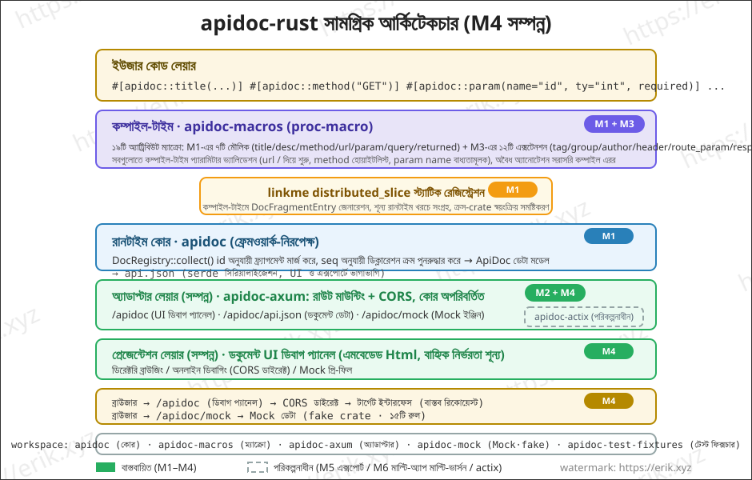
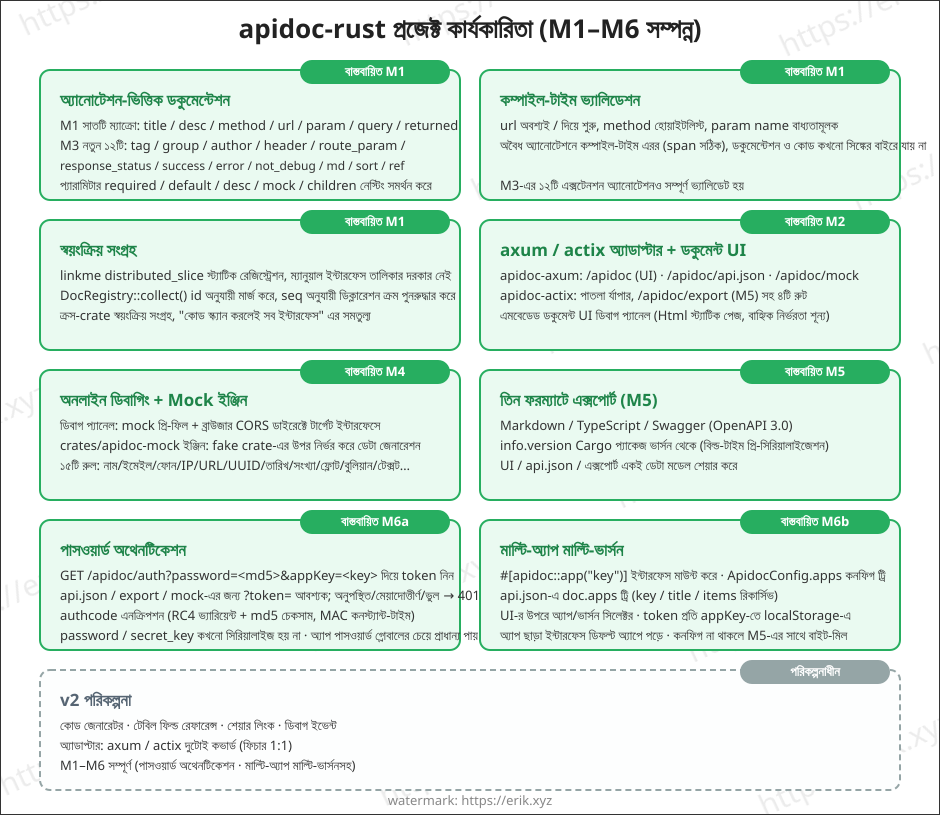
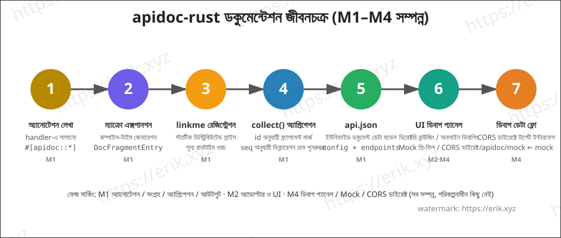

# Apidoc (apidoc-rust)

রাস্ট প্রসেস-ম্যাক্রো (proc-macro) ভিত্তিক API ডকুমেন্টেশন জেনারেশন ও ইন্টারফেস ডেভেলপমেন্ট টুলকিট, axum, actix-web-এর মতো প্রধান ফ্রেমওয়ার্কের সাথে সামঞ্জস্যপূর্ণ

[](https://github.com/erikwang2013/apidoc-rust)
[](https://github.com/erikwang2013/apidoc-rust)

[中文](../../README.md) ·
[English](README-en.md) ·
[한국어](README-ko.md) ·
[Русский](README-ru.md) ·
[Deutsch](README-de.md) ·
[Français](README-fr.md) ·
[Español](README-es.md) ·
[Português](README-pt.md) ·
[हिन्दी](README-hi.md) ·
[العربية](README-ar.md) ·
**[বাংলা](README-bn.md)** ·
[Bahasa Indonesia](README-id.md) ·
[日本語](README-ja.md)

## 📖প্রকল্প পরিচিতি

Apidoc হল একটি রাস্ট প্লাগইন লাইব্রেরি, যা **রাস্ট প্রসেস-ম্যাক্রো (proc-macro)** পার্স করে API ইন্টারফেস ডকুমেন্টেশন স্বয়ংক্রিয়ভাবে তৈরি করে এবং axum, actix-web-এর মতো প্রধান ফ্রেমওয়ার্কের সাথে সামঞ্জস্যপূর্ণ। ডকুমেন্টেশন স্বয়ংক্রিয়ভাবে তৈরির পাশাপাশি এতে অনলাইন ইন্টারফেস ডিবাগিং, Mock ডিবাগ ডেটা, Json/TypeScript কোড জেনারেশন, ইন্টারফেস জেনারেটর, কোড জেনারেটর ইত্যাদি সুবিধাও সংযুক্ত, যা ইন্টারফেস ডেভেলপমেন্ট, ডিবাগিং ও ডেলিভারির সম্পূর্ণ প্রক্রিয়া কভার করে এবং API ডেভেলপমেন্টের দক্ষতা বাড়ানোর লক্ষ্যে কাজ করে।

> **প্রকল্পের উৎস**: এই প্রকল্পটি [apidoc-php](https://github.com/erikwang2013/apidoc-php) (PHP 8 attributes-এর ভিত্তিতে API ডকুমেন্টেশন তৈরি করা composer এক্সটেনশন)-কে অনুসরণ করে "অ্যানোটেশনই ডকুমেন্টেশন" ধারণাটিকে রাস্টের নেটিভ উপায়ে বাস্তবায়ন করে, এবং erikwang2013 এটির ধারাবাহিক রক্ষণাবেক্ষণ ও সম্প্রসারণ করে যাচ্ছেন।

apidoc-rust-এর বাস্তবায়ন দৃষ্টিভঙ্গি:

- **কম্পাইল-টাইম জেনারেশন**: প্রসেস-ম্যাক্রো কম্পাইল-টাইমে ডকুমেন্টেশন তৈরি করে, ডকুমেন্টেশন ও কোড কখনোই সিঙ্কের বাইরে যায় না;
- **শূন্য-খরচ সংগ্রহ**: linkme স্ট্যাটিক রেজিস্ট্রেশনের মাধ্যমে, রানটাইমে একবার অ্যাগ্রিগেশন করলেই সব ইন্টারফেস ডকুমেন্টেশন পাওয়া যায়;
- **সাধারণ প্লাগইন**: কোর HTTP ফ্রেমওয়ার্ক-নিরপেক্ষ, পাতলা অ্যাডাপ্টার (axum / actix-web)-এর মাধ্যমে যেকোনো ফ্রেমওয়ার্কে সংযুক্ত হয়।

### ✨প্রকল্প বিবরণ

- **আউট-অব-দ্য-বক্স**: জটিল কনফিগারেশনের প্রয়োজন নেই; ইনস্টল করার পর ডকুমেন্টেশন অনুযায়ী অ্যানোটেশন লিখলেই API ডকুমেন্টেশন স্বয়ংক্রিয়ভাবে তৈরি হয়।
- **সহজ লেখা**: সাধারণ সংজ্ঞা (definitions) এবং ফিল্ডের `ref` রেফারেন্স সমর্থন করে; কয়েকটি অ্যানোটেশনেই সম্পূর্ণ ফিল্ড সংজ্ঞা তৈরি হয়ে যায়।
- **অনলাইন ডিবাগিং**: ডকুমেন্ট পেজেই সরাসরি ইন্টারফেস ডিবাগ করা যায়; গ্লোবাল প্যারামিটার পাস, Mock ডেটা ও ডিবাগ ইভেন্ট সমর্থিত।
- **মাল্টি-অ্যাপ/মাল্টি-ভার্সন**: সিঙ্গেল অ্যাপ, মাল্টি-অ্যাপ ও মাল্টি-ভার্সন প্রকল্প—সবই কনফিগার করা যায়; ইন্টারফেস অ্যাপ/ভার্সন অনুযায়ী গ্রুপ আকারে দেখানো ও পরিবর্তন করা যায়।
- **গ্রুপ/Tag**: ইন্টারফেসে বহু-স্তরের গ্রুপিং ও Tag চিহ্নিতকরণ সমর্থিত।
- **Markdown ডকুমেন্টেশন**: `md` অ্যানোটেশনের মাধ্যমে Markdown-কে ডকুমেন্ট পেজ হিসেবে মাউন্ট করা যায়।
- **Json/TypeScript জেনারেশন**: প্রতিটি ইন্টারফেসের জন্য Json রিকোয়েস্ট/রেসপন্স উদাহরণ ও TypeScript টাইপ ডেফিনিশন স্বয়ংক্রিয়ভাবে তৈরি হয়, যা সরাসরি ফ্রন্টএন্ডে ব্যবহার করা যায়।
- **কোড জেনারেটর**: কনফিগারেশন + টেমপ্লেট দিয়েই বিজনেস কোড ও ফ্রন্টএন্ড Api ফাইল তৈরি করা যায়।
- **ইন্টারফেস শেয়ার**: নির্দিষ্ট অ্যাপ/ইন্টারফেসের শেয়ার লিংক তৈরি করা যায় এবং `swagger.json` এক্সপোর্ট করা যায়।
- **নিরাপদ অ্যাক্সেস**: গ্লোবাল পাসওয়ার্ড এবং অ্যাপ/ভার্সনভিত্তিক স্বতন্ত্র পাসওয়ার্ড অনুমোদন সমর্থিত, সাথে ডকুমেন্ট ক্যাশ চালু করা যায়।

## বৈশিষ্ট্য

### বাস্তবায়িত (M1–M3)

- **অ্যানোটেশন-ভিত্তিক ডকুমেন্টেশন**: `title` / `desc` / `method` / `url` / `param` / `query` / `returned` সাতটি অ্যাট্রিবিউট ম্যাক্রো, একেকটি করে অ্যানোটেশন (PHP attributes লেখার সাথে সামঞ্জস্যপূর্ণ), প্যারামিটারগুলো `required` / `default` / `desc` / `mock` / `children` নেস্টিং সমর্থন করে
- **কম্পাইল-টাইম ভ্যালিডেশন**: url অবশ্যই `/` দিয়ে শুরু হতে হবে, method হোয়াইটলিস্ট, param name বাধ্যতামূলক ইত্যাদি — অবৈধ অ্যানোটেশনে কম্পাইল-টাইম এরর (span সঠিক)
- **স্বয়ংক্রিয় সংগ্রহ**: linkme `distributed_slice` স্ট্যাটিক রেজিস্ট্রেশন, ম্যানুয়াল ইন্টারফেস তালিকার দরকার নেই; `DocRegistry::collect()` id অনুযায়ী মার্জ করে, seq অনুযায়ী ডিক্লারেশন ক্রম পুনরুদ্ধার করে, ক্রস-crate স্বয়ংক্রিয় সংগ্রহ
- **api.json আউটপুট**: serde সিরিয়ালাইজেশনের মাধ্যমে ইউনিফাইড ডকুমেন্ট ডেটা মডেল (config + endpoints), ফিল্ডগুলো PHP সেমান্টিকসের সাথে সামঞ্জস্যপূর্ণ
- **axum অ্যাডাপ্টার + এমবেডেড ডকুমেন্ট UI**: রাউট মাউন্ট করলেই ডকুমেন্টেশন পেজ পাওয়া যায়, গ্রুপড ডিরেক্টরি ব্রাউজিং (M2)
- **অ্যানোটেশন সম্পূর্ণকরণ**: `tag` / `group` / `author` / `header` / `route_param` / `response_status` / `success` / `error` / `not_debug` / `md` / `sort` / `ref` ১২টি নতুন অ্যানোটেশন (M3)

### বাস্তবায়িত (M4)

- **অনলাইন ডিবাগিং**: ডকুমেন্ট পেজে বিল্ট-ইন «অনলাইন ডিবাগিং» প্যানেল — Base URL প্রি-ফিল হয় `location.origin` দিয়ে ক্রস-অরিজিনে সরাসরি টার্গেট সার্ভিসে, প্যারামিটার ফর্ম mock দিয়ে প্রি-ফিল, `{name}` / `:name` রাউট প্লেসহোল্ডার রিপ্লেসমেন্ট, GET/HEAD প্যারামিটার query-তে, বাকি methods JSON body হিসেবে, রিকোয়েস্ট হেডার এডিট + কাস্টম header, রেসপন্স ডিসপ্লে (স্ট্যাটাস / সময় / pretty JSON), CORS ফেল হলে হলুদ সতর্কতা
- **Mock ইঞ্জিন** (`crates/apidoc/src/mock.rs`, fake crate-এর উপর নির্ভরশীল, ১৫টি রুল: name / company / email / phone / url / ip / city / country / text / number / int / float / bool / uuid / date)। রুল প্রায়োরিটি: `mock="fake:xxx"` fake রুল টেবিলে যায় (অজানা নাম ডিফল্ট ভ্যালুতে ফলব্যাক) ← বাকি নন-খালি mock অপরিবর্তিত আউটপুট (যেমন `mock="1"`, `mock="erik"`) ← mock না থাকলে `ty` অনুযায়ী অটো-জেনারেশন (int←`"1"`, float←`"0.5"`, bool←`"true"`, object←`"{}"`, string←`"string"`)؛ children রিকার্সিভ নেস্টিং, array ফিক্সড ২টি আইটেম
- **mock ইন্টারফেস**: axum অ্যাডাপ্টারে নতুন `GET /apidoc/mock?url=&method=`, url + method এক্সাক্ট ম্যাচ, ম্যাচ না হলে 404; ডিবাগ প্যানেল ডিফল্টে `not_debug` এন্ডপয়েন্ট লুকিয়ে রাখে, «not_debug ইন্টারফেস দেখান» টিক দিলে দেখায়
- **CORS ডাইরেক্ট**: অনলাইন ডিবাগিং ব্রাউজার থেকে সরাসরি টার্গেট ইন্টারফেসে সংযোগ করে, অ্যাডাপ্টারের `cors_layer` পারমিশন দেয় (সার্ভার-সাইড রিভার্স প্রক্সি v2-তে)

### বাস্তবায়িত (M5)

- **তিন ফরম্যাটে এক্সপোর্ট** (`crates/apidoc/src/export/`): markdown / typescript / swagger (OpenAPI 3.0.0), কোর ক্রেট `export::markdown::render` / `export::typescript::render` / `export::swagger::render` সরবরাহ করে
- **এক্সপোর্ট রাউট**: অ্যাডাপ্টারে নতুন `GET /apidoc/export?format=md|ts|swagger`, অজানা format-এ 400; Content-Type যথাক্রমে `text/markdown` / `application/typescript` / `application/json`
- **markdown**: গ্রুপড ডিরেক্টরি + প্যারামিটার টেবিল + রেসপন্স ব্লক; **typescript**: group নেমস্পেস অনুযায়ী `{Name}Params` / `{Name}Result` টাইপ তৈরি, গ্রুপবিহীন ইন্টারফেস `defaultGroup`-এ পড়ে (`default` TS রিজার্ভড শব্দ); **swagger**: `info.version` Cargo প্যাকেজ ভার্সন থেকে নেওয়া
- **actix-web অ্যাডাপ্টার** (`crates/apidoc/src/actix.rs`): axum অ্যাডাপ্টারের সাথে 1:1 ফাংশনালিটি—`apidoc_routes(ApidocConfig) -> Scope` /apidoc, /apidoc/api.json, /apidoc/mock, /apidoc/export মাউন্ট করে, `cors_layer(CorsConfig)` ক্রস-অরিজিন পারমিশন দেয়
- **UI শেয়ারিং**: ডকুমেন্ট UI (`src/ui.html`) কোর ক্রেটে স্থানান্তরিত, `pub const UI_HTML` এক্সপোর্ট হয়, দুই অ্যাডাপ্টারই একই কপি রেফার করে (রিলিজ প্যাকেজিংয়ে নিরাপদ)

### বাস্তবায়িত (M6)

- **পাসওয়ার্ড অথেনটিকেশন (M6a)**: `AuthConfig { enable, password, secret_key, expire }` চালু করলে ক্লায়েন্ট `GET /apidoc/auth?password=<md5(পাসওয়ার্ড)>&appKey=<key>` দিয়ে token নেয়; ডেটা রাউট `/apidoc/api.json`, `/apidoc/export`, `/apidoc/mock`-এ `?token=xxx` লাগে, token না থাকলে/মেয়াদ শেষ হলে/ভুল হলে 401 রিটার্ন হয় এবং ডকুমেন্ট UI পাসওয়ার্ড মাস্ক দেখায়; token authcode এনক্রিপশন দিয়ে ইস্যু হয় (Discuz authcode লাইন বাই লাইন পোর্ট: RC4 ভ্যারিয়েন্ট + md5 চেকসাম + প্যাডিংবিহীন base64), পেলোড `{key: md5(md5(আসল পাসওয়ার্ড)), expire: now+expire}`, MAC তুলনা ধ্রুবক সময়ে
- **অথেনটিকেশন নিরাপত্তা লালরেখা**: `password` / `secret_key` কখনো সিরিয়ালাইজ হয় না — api.json আউটপুট অথেনটিকেশন বন্ধ অবস্থার সাথে বাইট-মিল; অথেনটিকেশন বন্ধ থাকলে `/apidoc/auth` 404 রিটার্ন করে এবং ডেটা রাউট সরাসরি পাস করে; কোনো অ্যাপ কনফিগে আলাদা পাসওয়ার্ড থাকলে অ্যাপ পাসওয়ার্ড গ্লোবালের চেয়ে প্রাধান্য পায়; `secret_key` ডিফল্ট `"apidoc#hgcode"` (চালু থাকা অবস্থায় কনফিগ না থাকলে একবার stderr সতর্কতা), `expire` ডিফল্ট ৮৬৪০০ সেকেন্ড
- **মাল্টি-অ্যাপ মাল্টি-ভার্সন (M6b)**: `ApidocConfig.apps: Vec<AppConfig>` (`key` / `title` / `items` রিকার্সিভ সাব-ভার্সন / `password`) অ্যাপ ট্রি কনফিগার করে, `#[apidoc::app("key")]` ইন্টারফেসগুলো নির্দিষ্ট অ্যাপ key-তে ঝুলিয়ে দেয়, key ছাড়া ইন্টারফেস ডিফল্ট অ্যাপে পড়ে; api.json আউটপুটে নতুন `doc.apps` ট্রি, UI-র উপরে অ্যাপ/ভার্সন সিলেক্টর, token প্রতি appKey আলাদা করে localStorage-এ (ভিন্ন অ্যাপের আলাদা পাসওয়ার্ড থাকতে পারে)

### বাস্তবায়িত (v2)

- **ডেটা টেবিল ফিল্ড রেফারেন্স (`table`)**: `#[apidoc::table("user")]` `ApidocConfig.tables`-এ কনফিগার করা টেবিল key অনুযায়ী ফিল্ডগুলো **সমতল** করে `returned`-এ যুক্ত করে (`ref`-এর সাথে একই অর্থ, পার্থক্য শুধু — ডেটা উৎস অন্য এন্ডপয়েন্ট নয়, বরং কনফিগ টেবিল); ফিল্ডে `required` / `default` / `desc` / `mock` সমর্থিত; কনফিগ না করা key-তে শুধু stderr সতর্কতা; এই অ্যানোটেশন ব্যবহার না করলে আউটপুট v1-এর সাথে বাইট-মিল
- **ডকুমেন্ট ক্যাশ**: `ApidocConfig.cache = Some(CacheConfig { enable, ttl })`——`/apidoc/mock`-এর আউটপুট `(url, method)` অনুযায়ী প্রসেস-মধ্যে মেমোইজ হয়, `ttl` সেকেন্ড পর মেয়াদোত্তীর্ণ হয়ে আবার তৈরি হয়, `ttl = 0` মানে স্থায়ী; কনফিগ না থাকলে বা চালু না থাকলে ক্যাশ পথ সম্পূর্ণ এড়ানো হয় (আউটপুটে শূন্য পরিবর্তন)। api.json / export রাউট মাউন্টের সময়ই একবার তৈরি হয়ে যায়, অর্থাৎ স্থায়ী ক্যাশের সমান
- **শেয়ার লিংক**: `GET /apidoc/share?app=&url=&method=&base=` → `{"url":"…"}` ডিপ-লিংক (`?app=<key>&ep=<接口 url>&method=<方法>[&token=…]`); ডকুমেন্ট পেজে প্রতিটি ইন্টারফেসের পাশে «শেয়ার» বাটন (ক্লিপবোর্ডে লেখে, ব্যর্থ হলে কপিযোগ্য ইনপুট বক্সে নেমে আসে), ডিপ-লিংক খুললেই সরাসরি সেই অ্যাপ/ইন্টারফেসে পৌঁছে যায়; অথেনটিকেশন চালু থাকলে লিংকে সার্ভার-ইস্যুড token যুক্ত হয় (অ্যাপের স্বতন্ত্র পাসওয়ার্ড গ্লোবালের চেয়ে প্রাধান্য পায়), খুললেই পাসওয়ার্ড ছাড়া প্রবেশ
- **কোড জেনারেটর**: `GET /apidoc/generate?template=<name>` → রেন্ডার করা টেক্সট (অজানা টেমপ্লেট 404); বিল্ট-ইন `api.ts` (ফ্রন্টএন্ড Api ফাইল), `handler.rs` (Rust ইন্টারফেস কঙ্কাল), `schema.sql` (`tables` অনুযায়ী CREATE TABLE স্টেটমেন্ট); `ApidocConfig.codegen`-এ একই নামের টেমপ্লেট বিল্ট-ইনকে ওভাররাইড করে। টেমপ্লেট সিনট্যাক্স মাত্র দুই রকম: `{{变量}}` (অসংজ্ঞায়িত হলে অপরিবর্তিত থাকে) ও `{{#each 列表}}…{{/each}}` (নেস্ট করা যায়, যেমন `tables` × `fields`)
- **ডিবাগ ইভেন্ট**: অনলাইন ডিবাগিং প্যানেলে নতুন ভাঁজযোগ্য «প্রি-স্ক্রিপ্ট / পোস্ট-স্ক্রিপ্ট» (localStorage-এ সংরক্ষিত)——প্রি-স্ক্রিপ্ট রিকোয়েস্ট পাঠানোর আগে `new Function('ctx', code)` দিয়ে চলে এবং `ctx.url/method/headers/body` বদলাতে পারে বা অবজেক্ট রিটার্ন করে শ্যালো-মার্জ করাতে পারে; পোস্ট-স্ক্রিপ্ট রেসপন্স আসার পর চলে এবং `status/ms/text/url/method/ep` পড়তে পারে, আর স্ট্রিং রিটার্ন করলে প্রদর্শিত রেসপন্স টেক্সট বদলে যায়; স্ক্রিপ্টের ত্রুটি শুধু ফলাফল এলাকায় দেখায়, রিকোয়েস্ট বাধাগ্রস্ত হয় না

## আর্কিটেকচার



## কার্যকারিতা



## জীবনচক্র



## প্রজেক্ট কাঠামো

```
apidoc-rust/
├── Cargo.toml                 # workspace কনফিগারেশন (resolver 2)
├── VERSION                    # প্রজেক্ট ভার্সন (v1.6.1)
├── crates/
│   ├── apidoc/                # রানটাইম কোর (ফ্রেমওয়ার্ক-নিরপেক্ষ)
│   │   ├── src/lib.rs         # ডেটা মডেল + DocRegistry অ্যাগ্রিগেশন + api.json + UI_HTML
│   │   ├── src/auth.rs        # M6a পাসওয়ার্ড অথেনটিকেশন (authcode token ইস্যু/যাচাই + রাউট গার্ড)
│   │   ├── src/export/        # M5 এক্সপোর্ট: markdown / typescript / swagger
│   │   ├── src/ui.html        # শেয়ারড ডকুমেন্ট UI (কোর ক্রেট এক্সপোর্ট, দুই অ্যাডাপ্টার রেফার করে)
│   │   ├── tests/             # ইন্টিগ্রেশন টেস্ট (ম্যাক্রো এক্সপানশন/অ্যাগ্রিগেশন/সিরিয়ালাইজেশন/ক্রস-crate)
│   │   └── examples/demo.rs   # উদাহরণ: অ্যানোটেশন + api.json আউটপুট
│   ├── apidoc-macros/         # proc-macro: ২০টি অ্যাট্রিবিউট ম্যাক্রো
│   │   └── src/lib.rs         # ম্যাক্রো সংজ্ঞা + প্যারামিটার পার্সিং + কম্পাইল-টাইম ভ্যালিডেশন

│   ├── apidoc-test-fixtures/  # ক্রস-crate রেজিস্ট্রেশন টেস্ট ফিক্সচার

├── .github/
│   └── workflows/release.yml  # রিলিজ ওয়ার্কফ্লো (VERSION পড়ে, ইনক্রিমেন্টাল tag+release তৈরি)
└── docs/
    ├── images/                # আর্কিটেকচার/কার্যকারিতা/জীবনচক্র চিত্র (SVG)
    └── i18n/                  # বহুভাষিক ডকুমেন্টেশন (১২টি ভাষা)
```

## ব্যবহার নির্দেশিকা

### ১. ডিপেন্ডেন্সি যোগ করা

```toml
[dependencies]
apidoc-rust = "1.6"        # অথবা path = "crates/apidoc"

serde_json = "1"      # api.json আউটপুটের জন্য
```

> অ্যাডাপ্টার ওয়েব ফ্রেমওয়ার্ক অনুযায়ী একটি বেছে নিন: axum-এ `features = ["axum"]`, actix-web-এ `features = ["actix"]` (দুটোর ফাংশনালিটি 1:1)। `mock` (Mock ইঞ্জিন) ফ্রেমওয়ার্কের অভ্যন্তরীণ ডিপেন্ডেন্সি, অ্যাডাপ্টারের মাধ্যমে স্বয়ংক্রিয়ভাবে যুক্ত হয়, সাধারণত ভোক্তাকে সরাসরি ব্যবহার করতে হয় না।

### ২. অ্যানোটেশন লেখা

handler ফাংশনে একেকটি করে অ্যানোটেশন লাগান, ডকুমেন্টেশন কম্পাইল-টাইমেই তৈরি হবে:

```rust
use apidoc::*;

#[apidoc::title("获取用户信息")]
#[apidoc::desc("根据用户 ID 查询用户详情")]
#[apidoc::url("/api/user/info")]
#[apidoc::method("GET")]
#[apidoc::param(name = "user_id", ty = "int", required, desc = "用户ID", mock = "1")]
#[apidoc::query(name = "lang", ty = "string", desc = "语言", default = "zh-CN")]
#[apidoc::returned(
    name = "data",
    ty = "object",
    desc = "用户数据",
    children = [
        { name = "id", ty = "int", required, desc = "用户ID" },
        { name = "name", ty = "string", required, desc = "用户名", mock = "erik" },
    ]
)]
fn get_user_info() -> String {
    unimplemented!()
}
```

### ৩. সংগ্রহ ও আউটপুট

```rust
fn main() {
    let doc = DocRegistry::collect_doc(ApidocConfig {
        title: "我的 API".to_string(),
        description: None,
        auth: None,    // M6a পাসওয়ার্ড অথেনটিকেশন, দেখুন «৮. পাসওয়ার্ড অথেনটিকেশন»
        apps: vec![],  // M6b মাল্টি-অ্যাপ মাল্টি-ভার্সন, দেখুন «৯. মাল্টি-অ্যাপ মাল্টি-ভার্সন»
    });
    println!("{}", serde_json::to_string_pretty(&doc).unwrap());
}
```

### ৪. উদাহরণ চালানো

```bash
cargo run --example demo -p apidoc
```

আউটপুট (নির্বাচিত অংশ):

```json
{
  "config": { "title": "demo api" },
  "endpoints": [
    {
      "title": "获取用户信息",
      "desc": "根据用户 ID 查询用户详情",
      "url": "/api/user/info",
      "method": "GET",
      "params": [
        { "name": "user_id", "type": "int", "required": true, "desc": "用户ID", "mock": "1" }
      ],
      "querys": [
        { "name": "lang", "type": "string", "required": false, "default": "zh-CN", "desc": "语言" }
      ],
      "returned": [
        {
          "name": "data",
          "type": "object",
          "required": false,
          "desc": "用户数据",
          "children": [
            { "name": "id", "type": "int", "required": true, "desc": "用户ID" },
            { "name": "name", "type": "string", "required": true, "desc": "用户名", "mock": "erik" }
          ]
        }
      ]
    }
  ]
}
```

### ৫. অনলাইন ডিবাগিং ও Mock (M4)

ডকুমেন্টেশন পেজ খুলুন ← ইন্টারফেস নির্বাচন করুন ← ডান পাশের «অনলাইন ডিবাগিং» প্যানেল mock রুল অনুযায়ী প্যারামিটার প্রি-ফিল করে ← Base URL টার্গেট সার্ভিসের ঠিকানায় দিন (ডিফল্ট `location.origin`, ক্রস-অরিজিনে সরাসরি সংযোগ) ← সেন্ড চাপলে আসল রেসপন্স পাবেন (স্ট্যাটাস কোড / সময় / pretty JSON)। ডিবাগ প্যানেল ডিফল্টে `not_debug` এন্ডপয়েন্ট লুকিয়ে রাখে, «not_debug ইন্টারফেস দেখান» টিক দিলে দেখায়।

**CORS প্রয়োজনীয়তা**: অনলাইন ডিবাগিং ব্রাউজার থেকে সরাসরি টার্গেট ইন্টারফেসে সংযোগ করে, তাই টার্গেট সার্ভিসকে অ্যাডাপ্টারের দেওয়া `cors_layer` মাউন্ট করতে হবে যাতে ক্রস-অরিজিন রিকোয়েস্ট অনুমোদিত হয়; CORS ব্যর্থ হলে প্যানেল হলুদ সতর্কতা দেখায়।

Mock রুল সিনট্যাক্স (তিনটি প্রায়োরিটি):

```rust
#[apidoc::param(name = "email", ty = "string", desc = "邮箱", mock = "fake:email")]  // fake 规则生成
#[apidoc::param(name = "status", ty = "string", desc = "状态", mock = "1")]          // 非空 mock 原样直出
#[apidoc::param(name = "name", ty = "string", desc = "用户名")]                       // 无 mock：按 ty 自动生成
#[apidoc::returned(
    name = "data",
    ty = "object",
    children = [
        { name = "id", ty = "int", required },       // 无 mock → "1"
        { name = "email", ty = "string", mock = "fake:email" },  // children 递归嵌套
    ]
)]
fn create_user() -> String {
    unimplemented!()
}
```

বিল্ট-ইন ১৫টি fake রুল: `name` / `company` / `email` / `phone` / `url` / `ip` / `city` / `country` / `text` / `number` / `int` / `float` / `bool` / `uuid` / `date`; অজানা নাম ডিফল্ট ভ্যালুতে ফলব্যাক। mock ছাড়া অটো-জেনারেশন রুল: int←`"1"`, float←`"0.5"`, bool←`"true"`, object←`"{}"`, string←`"string"`; array ফিক্সড ২টি আইটেম।

### ৬. অনলাইন এক্সপোর্ট (M5)

অ্যাডাপ্টারে তিন ফরম্যাটের এক্সপোর্ট ইন্টারফেস বিল্ট-ইন, মাউন্ট করলেই ব্যবহার করা যায় (অজানা `format`-এ 400):

```bash
GET /apidoc/export?format=md        # গ্রুপড ডিরেক্টরি + প্যারামিটার টেবিল + রেসপন্স ব্লক (text/markdown)
GET /apidoc/export?format=ts        # group নেমস্পেস অনুযায়ী {Name}Params / {Name}Result টাইপ (application/typescript)
GET /apidoc/export?format=swagger   # OpenAPI 3.0.0 বর্ণনা ফাইল (application/json)
```

- **markdown**: প্রজেক্ট Wiki / রিলিজ নোটে পেস্ট করার উপযুক্ত, গ্রুপ অনুযায়ী ডিরেক্টরি আউটপুট, প্রতিটি ইন্টারফেসে প্যারামিটার টেবিল ও রেসপন্স ব্লক;
- **typescript**: ফ্রন্টএন্ড সরাসরি টাইপ ডেফিনিশন হিসেবে পেস্ট করতে পারে; গ্রুপবিহীন ইন্টারফেস `defaultGroup` নেমস্পেসে পড়ে (`default` TS রিজার্ভড শব্দ, আইডেন্টিফায়ার হিসেবে ব্যবহার করা যাবে না);
- **swagger**: `info.version` Cargo প্যাকেজ ভার্সন থেকে নেওয়া (বর্তমানে 1.6.1), সরাসরি Swagger UI বা কোড জেনারেটরে ইমপোর্ট করা যায়।

### ৭. actix-web অ্যাডাপ্টার

ওয়েব ফ্রেমওয়ার্ক হিসেবে actix-web ব্যবহার করলে `features = ["actix"]` যুক্ত করুন (axum অ্যাডাপ্টারের সাথে 1:1 ফাংশনালিটি):

```toml
[dependencies]
apidoc-rust = { version = "1.6", features = ["actix"] }
```

```rust
use actix_web::{App, HttpServer};
use apidoc::actix::{apidoc_routes, cors_layer, CorsConfig};
use apidoc::ApidocConfig;

#[actix_web::main]
async fn main() -> std::io::Result<()> {
    HttpServer::new(|| {
        App::new()
            .service(apidoc_routes(ApidocConfig {
                title: "我的 API".to_string(),
                description: None,
                auth: None,    // M6a পাসওয়ার্ড অথেনটিকেশন, দেখুন «৮. পাসওয়ার্ড অথেনটিকেশন»
                apps: vec![],  // M6b মাল্টি-অ্যাপ মাল্টি-ভার্সন, দেখুন «৯. মাল্টি-অ্যাপ মাল্টি-ভার্সন»
            }))
            .wrap(cors_layer(CorsConfig::default()))   // M4 在线调试跨域放行
    })
    .bind("127.0.0.1:8080")?
    .run()
    .await
}
```

মাউন্ট করার পর `/apidoc` (ডকুমেন্ট UI), `/apidoc/api.json` (ডেটা), `/apidoc/mock` (Mock), `/apidoc/export` (এক্সপোর্ট) অ্যাক্সেস করা যায়। CORS খালি কনফিগ লিটারাল `*` পারমিশন দেয় (ক্রেডেনশিয়াল ছাড়া), `allow_origins` হোয়াইটলিস্ট কনফিগ করলে রিফ্লেক্টেড Origin-কে এক্সাক্ট ম্যাচ করে, দুই মোডেই ক্রেডেনশিয়াল খোলা হয় না।

### ৮. পাসওয়ার্ড অথেনটিকেশন (M6a)

`auth` চালু করলে ডকুমেন্টেশনে পাসওয়ার্ড ছাড়া প্রবেশ করা যায় না (আপস্ট্রিম apidoc-php-এর Auth.php-এর সাথে সামঞ্জস্যপূর্ণ, token হলো Discuz authcode এনক্রিপশনের লাইন বাই লাইন পোর্ট):

```rust
use apidoc::auth::AuthConfig;

let doc = DocRegistry::collect_doc(ApidocConfig {
    title: "我的 API".to_string(),
    description: None,
    auth: Some(AuthConfig {
        enable: true,
        password: "your-password".to_string(),
        secret_key: "your-secret-key".to_string(), // ডিফল্ট "apidoc#hgcode" (চালু থাকা অবস্থায় কনফিগ না থাকলে একবার stderr সতর্কতা)
        expire: 86400,                             // সেকেন্ড; ডিফল্ট 86400
    }),
    apps: vec![],
});
```

**প্রক্রিয়া**:

১. ক্লায়েন্ট `GET /apidoc/auth?password=<md5(পাসওয়ার্ড)>&appKey=<key>` কল করে token নেয় (সফল হলে `{"token":"..."}` রিটার্ন, পাসওয়ার্ড ভুল হলে 401); অথেনটিকেশন বন্ধ থাকলে এই রাউট 404 রিটার্ন করে এবং ডেটা রাউট সরাসরি পাস করে
২. ডেটা রাউট `GET /apidoc/api.json`, `/apidoc/export`, `/apidoc/mock`-এ `?token=xxx` লাগে (নির্দিষ্ট অ্যাপ নির্বাচন করলে সাথে `&appKey=`); token না থাকলে/মেয়াদ শেষ হলে/ভুল হলে 401 রিটার্ন হয়, ডকুমেন্ট UI স্বয়ংক্রিয়ভাবে পাসওয়ার্ড মাস্ক খোলে, এবং পাসওয়ার্ড দেওয়ার পর ফ্রন্টএন্ড লোকালি md5 হ্যাশ করে token নেয়
৩. token পেলোড `{key: md5(md5(আসল পাসওয়ার্ড)), expire: now+expire}`, `secret_key` দিয়ে authcode-তে এনক্রিপ্ট (RC4 ভ্যারিয়েন্ট + md5 চেকসাম + প্যাডিংবিহীন base64, টাইমিং সাইড-চ্যানেল রোধে ধ্রুবক সময়ে MAC তুলনা)
৪. `password` / `secret_key` কখনো সিরিয়ালাইজ হয় না — api.json আউটপুট অথেনটিকেশন বন্ধ অবস্থার সাথে বাইট-মিল; কোনো অ্যাপ কনফিগে নিজস্ব `password` থাকলে অ্যাপ পাসওয়ার্ড গ্লোবালের চেয়ে প্রাধান্য পায়

### ৯. মাল্টি-অ্যাপ মাল্টি-ভার্সন (M6b)

একটি প্রজেক্টকে একাধিক অ্যাপ/ভার্সনে ভাগ করা যায়, প্রতিটির নিজস্ব ডিসপ্লে ও অ্যাক্সেস নিয়ন্ত্রণ:

```rust
#[apidoc::title("获取用户信息")]
#[apidoc::app("demo")]   // key="demo" অ্যাপে ঝুলানো হয়; app অ্যানোটেশন ছাড়া ইন্টারফেস ডিফল্ট অ্যাপে পড়ে
fn get_user_info() -> String {
    unimplemented!()
}
```

```rust
let doc = DocRegistry::collect_doc(ApidocConfig {
    title: "我的 API".to_string(),
    description: None,
    auth: None,
    apps: vec![
        AppConfig {
            key: "demo".to_string(),
            title: "演示应用".to_string(),
            items: vec![AppConfig {
                key: "v1".to_string(),
                title: "v1".to_string(),
                items: vec![],
                password: None,
            }],
            password: None, // অ্যাপের স্বাধীন অ্যাক্সেস পাসওয়ার্ড, গ্লোবালের চেয়ে প্রাধান্য পায়, কখনো সিরিয়ালাইজ হয় না
        },
    ],
});
```

- `AppConfig { key, title, items, password }`: `key` হলো সেই ইউনিক আইডেন্টিফায়ার যাকে `#[apidoc::app("key")]` অ্যানোটেশন রেফার করে, `items` রিকার্সিভভাবে সাব-ভার্সন/সাব-অ্যাপ নেস্ট করে, `password` হলো অ্যাপের স্বাধীন অ্যাক্সেস পাসওয়ার্ড (স্বাধীন পাসওয়ার্ড থাকলে শুধু অ্যাপ token যাচাই হয়)
- api.json আউটপুটে নতুন `doc.apps` ট্রি (key / title / items / endpoints); UI-র উপরে অ্যাপ/ভার্সন সিলেক্টর — স্যুইচ করলে সেই নোডের ইন্টারফেস রেন্ডার হয় ও ডেটা নতুন করে আনা হয়, token প্রতি appKey আলাদা করে localStorage-এ থাকে
- `app` অ্যানোটেশন `apps`-এ কনফিগ না করা key রেফার করলে stderr সতর্কতা দিয়ে ইন্টারফেসটি ডিফল্ট অ্যাপে পড়ে; `app` অ্যানোটেশন ছাড়া বা `apps` কনফিগ না থাকলে আউটপুট M5-এর সাথে বাইট-মিল

### ১০. ডেটা টেবিল ফিল্ড রেফারেন্স · ডকুমেন্ট ক্যাশ (v2)

```rust
ApidocConfig {
    // টেবিল কাঠামো কনফিগ থেকেই আসে (Rust পক্ষ ডেটাবেসে সংযুক্ত হয় না), অ্যানোটেশন key দিয়ে রেফার করে
    tables: vec![TableDef {
        key: "user".into(),
        title: "用户表".into(),
        fields: vec![
            TableField { name: "id".into(), ty: "int".into(), required: true, desc: Some("用户ID".into()), ..Default::default() },
            TableField { name: "name".into(), ty: "string".into(), mock: Some("erik".into()), ..Default::default() },
        ],
    }],
    // ডকুমেন্ট ক্যাশ: /apidoc/mock-এর আউটপুট (url, method) অনুযায়ী মেমোইজ হয়, ttl সেকেন্ড পর পুনর্নির্মাণ (0 = স্থায়ী)
    cache: Some(CacheConfig { enable: true, ttl: 60 }),
    ..Default::default()   // title / description / auth / apps / codegen যথারীতি কনফিগার করুন
}
```

handler-এ `ref`-এর মতোই লিখুন: `#[apidoc::table("user")]`। ফিল্ডগুলো সেই ইন্টারফেসের `returned`-এ সমতলভাবে যুক্ত হয়; `tables`-এ না থাকা key-তে শুধু সতর্কতা, ত্রুটি নয়।

### ১১. শেয়ার লিংক · কোড জেনারেশন (v2)

- `GET /apidoc/share?app=api&url=/api/user/info&method=GET&base=https://example.com` → `{"url":"https://example.com/apidoc?app=api&ep=%2Fapi%2Fuser%2Finfo&method=GET"}` (অথেনটিকেশন চালু থাকলে লিংকের শেষে `&token=…`, খুললেই পাসওয়ার্ড ছাড়া প্রবেশ)
- `GET /apidoc/generate?template=api.ts` (বা `handler.rs` / `schema.sql`) → `text/plain; charset=utf-8`; অজানা টেমপ্লেট 404, প্যারামিটার অনুপস্থিত 400
- কাস্টম টেমপ্লেট (একই নামে বিল্ট-ইন ওভাররাইড):

```rust
ApidocConfig {
    codegen: vec![CodegenTemplate {
        name: "api.ts".into(),
        template: "// {{title}}\n{{#each endpoints}}// {{method}} {{url}}\n{{/each}}".into(),
    }],
    ..Default::default()
}
```

টেমপ্লেটে ব্যবহারযোগ্য ভেরিয়েবল: শীর্ষ স্তরে `title` / `description`; `{{#each endpoints}}`-এর ভেতরে `title` / `url` / `method` / `group` / `desc` / `author`; `{{#each tables}}`-এর ভেতরে `key` / `title`, আর তার `{{#each fields}}`-এর ভেতরে `name` / `ty` / `required` / `default` / `desc` / `mock`, সাথে উদ্ভূত ভেরিয়েবল `not_null` / `default_clause` / `comma` (সরাসরি বৈধ SQL তৈরি করতে)।

### ১২. ডিবাগ প্রি/পোস্ট স্ক্রিপ্ট (v2)

ডকুমেন্ট পেজের «অনলাইন ডিবাগিং» প্যানেলে «প্রি-স্ক্রিপ্ট» ও «পোস্ট-স্ক্রিপ্ট» খুলুন (কনটেন্ট localStorage-এ সংরক্ষিত):

```js
// প্রি-স্ক্রিপ্ট: রিকোয়েস্ট পাঠানোর আগে চলে, ctx.url / method / headers / body বদলাতে পারে, বা অবজেক্ট রিটার্ন করে শ্যালো-মার্জ করাতে পারে
ctx.headers['X-Token'] = localStorage.getItem('token') || '';
```

```js
// পোস্ট-স্ক্রিপ্ট: রেসপন্স আসার পর চলে, ctx = { status, ms, text, url, method, ep } (রিড-অনলি)
// স্ট্রিং রিটার্ন করলে ফলাফল এলাকায় প্রদর্শিত টেক্সট বদলে যায়
return 'HTTP ' + ctx.status + ' · ' + ctx.ms + 'ms\n' + ctx.text;
```

স্ক্রিপ্টের ত্রুটি শুধু ডিবাগ ফলাফল এলাকায় দেখায়, রিকোয়েস্ট বাধাগ্রস্ত হয় না (প্রি-স্ক্রিপ্ট ব্যর্থ হলে রিকোয়েস্ট যথারীতি পাঠানো হয়, পোস্ট-স্ক্রিপ্ট ব্যর্থ হলে মূল রেসপন্স যথারীতি দেখানো হয়)।

## উন্নয়ন পরিকল্পনা

| পর্যায় | বিষয়বস্তু | অবস্থা |
|------|------|------|
| M1 | workspace কঙ্কাল + ডেটা মডেল + ম্যাক্রো MVP + linkme রেজিস্ট্রেশন | ✅ সম্পন্ন |
| M2 | axum অ্যাডাপ্টার + এমবেডেড ডকুমেন্ট UI + গ্রুপড ডিরেক্টরি | ✅ সম্পন্ন |
| M3 | অ্যানোটেশন সম্পূর্ণকরণ (tag/group/author/header/route_param/response_status/success/error/not_debug/md/sort/ref) | ✅ সম্পন্ন |
| M4 | অনলাইন ডিবাগিং + Mock ইঞ্জিন | ✅ সম্পন্ন |
| M5 | markdown / typescript / swagger.json (OpenAPI3) এক্সপোর্ট | ✅ সম্পন্ন |
| —  | actix-web অ্যাডাপ্টার (axum-এর সাথে 1:1 ফাংশনালিটি) | ✅ সম্পন্ন |
| M6a | পাসওয়ার্ড অথেনটিকেশন (authcode token + পাসওয়ার্ড মাস্ক, অ্যাপ পাসওয়ার্ডের প্রাধান্য) | ✅ সম্পন্ন |
| M6b | মাল্টি-অ্যাপ মাল্টি-ভার্সন (apps কনফিগ ট্রি + app অ্যানোটেশন + UI সিলেক্টর) | ✅ সম্পন্ন |
| v2 | ডেটা টেবিল ফিল্ড রেফারেন্স + ডকুমেন্ট ক্যাশ + শেয়ার লিংক + কোড জেনারেটর + ডিবাগ ইভেন্ট | ✅ সম্পন্ন |

## বহুভাষিক ডকুমেন্টেশন

- [English](README-en.md)
- [한국어](README-ko.md)
- [Русский](README-ru.md)
- [Deutsch](README-de.md)
- [Français](README-fr.md)
- [Español](README-es.md)
- [Português](README-pt.md)
- [हिन्दी](README-hi.md)
- [العربية](README-ar.md)
- [বাংলা](README-bn.md)
- [Bahasa Indonesia](README-id.md)
- [日本語](README-ja.md)

## সমর্থন ও দান

এই প্রজেক্ট যদি আপনার কাজে লাগে, তাহলে ⭐ Star দিয়ে আমাদের সমর্থন করুন, এবং ওপেন-সোর্স সমর্থনে দানও স্বাগতম!

### 微信支付 / 支付宝 (WeChat Pay / Alipay)

| 微信支付 | 支付宝 |
|---|---|
|  |  |

### বৈশ্বিক ব্যাংক ট্রান্সফার দান

**【প্রাপকের তথ্য】**

- প্রাপকের নাম: WANG KEXUN
- প্রাপক অ্যাকাউন্ট নম্বর: 881015918251

**【প্রাপক ব্যাংক】**

- ZA Bank SWIFT Code: AABLHKHHXXX
- ব্যাংকের নাম: ZA Bank Limited
- ব্যাংক কোড: 387
- ব্যাংকের ঠিকানা: Core F, Cyberport 3, 100 Cyberport Road, Hong Kong

**【ক্রস-বর্ডার রেমিট্যান্স করেসপন্ডেন্ট ব্যাংক (যদি প্রয়োজন হয়)】**

> দয়া করে লক্ষ্য করুন, এটি ক্রস-বর্ডার রেমিট্যান্স করেসপন্ডেন্ট (মধ্যস্থ ব্যাংক) এর তথ্য, প্রাপক ব্যাংকের তথ্য নয়। রেমিট্যান্স পাঠানোর ব্যাংককে জিজ্ঞাসা করুন ক্রস-বর্ডার করেসপন্ডেন্ট ব্যাংকের তথ্য প্রদান প্রয়োজন কিনা।

- **হংকং ডলার, চাইনিজ ইউয়ান ও মার্কিন ডলার জমা হলে করেসপন্ডেন্ট ব্যাংক Citibank:**
  - ব্যাংকের নাম: Citibank N.A. Hong Kong
  - SWIFT Code: CITIHKHXXXX
  - ব্যাংক কোড: 006
  - শাখার নাম: Hong Kong Branch
  - শাখা কোড: 391
  - ব্যাংকের ঠিকানা: Citibank Tower, Citibank Plaza, 3 Garden Road, Central, Hong Kong
- **অন্যান্য মুদ্রা জমা হলে করেসপন্ডেন্ট ব্যাংক BNY Mellon:**
  - ব্যাংকের নাম: THE BANK OF NEW YORK MELLON
  - SWIFT Code: IRVTUS3NXXX
  - ব্যাংকের ঠিকানা: THE BANK OF NEW YORK MELLON, 240 GREENWICH STREET, NEW YORK, United States

## লাইসেন্স

[MIT](../../LICENSE)
