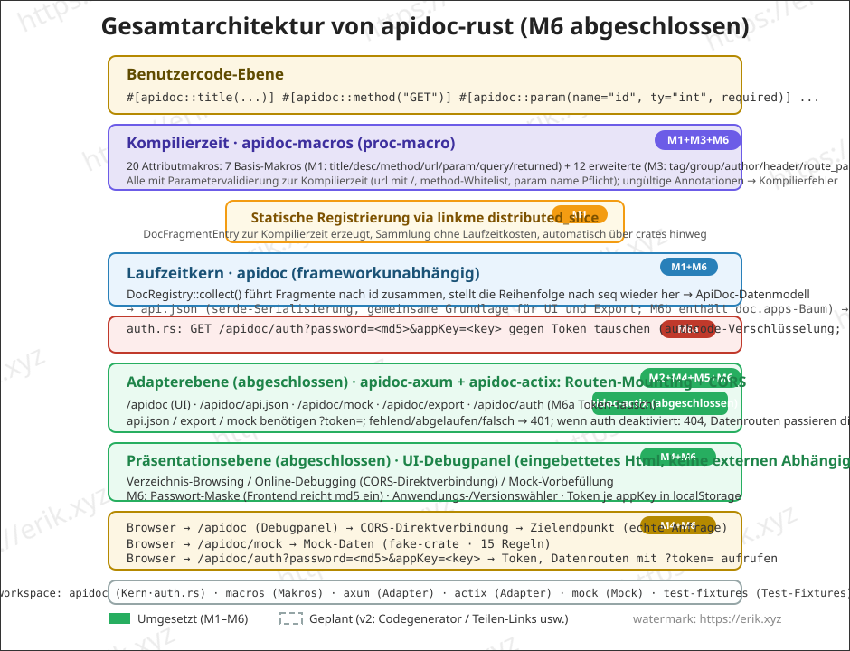
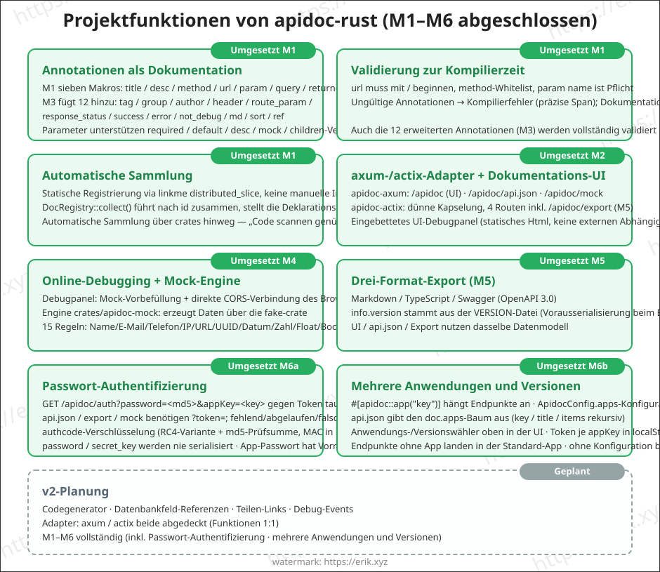
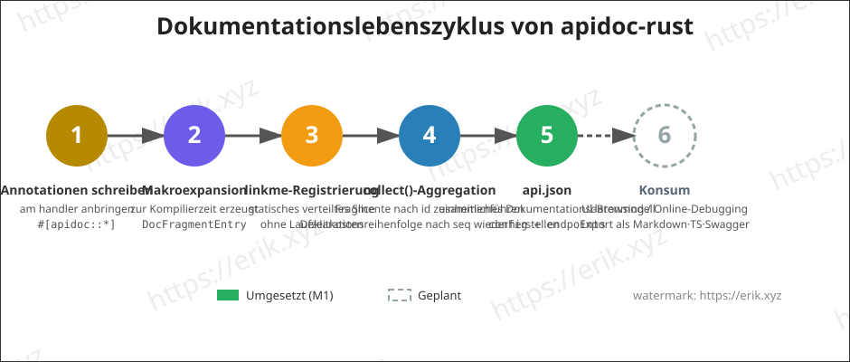

<h1 align="center">Apidoc (apidoc-rust)</h1>

<div align="center">
  Universelle Plugin-Bibliothek zur Generierung von API-Dokumentation per Rust-Prozessmakro (proc-macro)
</div>

<div align="center">
<a href="https://github.com/erikwang2013/apidoc-rust"></a>
<a href="https://github.com/erikwang2013/apidoc-rust"></a>
</div>

<div align="center">
<a href="../../README.md">中文</a> ·
<a href="README-en.md">English</a> ·
<a href="README-ko.md">한국어</a> ·
<a href="README-ru.md">Русский</a> ·
<a href="README-de.md"><strong>Deutsch</strong></a> ·
<a href="README-fr.md">Français</a> ·
<a href="README-es.md">Español</a> ·
<a href="README-pt.md">Português</a> ·
<a href="README-hi.md">हिन्दी</a> ·
<a href="README-ar.md">العربية</a> ·
<a href="README-bn.md">বাংলা</a> ·
<a href="README-id.md">Bahasa Indonesia</a> ·
<a href="README-ja.md">日本語</a>
</div>

## Projektvorstellung

apidoc-rust ist ein in Rust implementierter **universeller Plugin-API-Dokumentationsgenerator** in Anlehnung an [apidoc-php](https://github.com/erikwang2013/apidoc-php) (eine Composer-Erweiterung, die API-Dokumentation auf Basis von PHP-8-Attributen erzeugt). Es setzt das Konzept „Annotationen sind Dokumentation" auf native Rust-Art um:

- **Generierung zur Kompilierzeit**: Die Dokumentation wird von Prozessmakros zur Kompilierzeit erzeugt — Dokumentation und Code geraten nie aus dem Gleichschritt;
- **Sammlung ohne Laufzeitkosten**: statische Registrierung über linkme, ein einziger Sammelvorgang zur Laufzeit liefert die gesamte API-Dokumentation;
- **Universelle Plugins**: Der Kern ist unabhängig vom HTTP-Framework; beliebige Frameworks werden über dünne Adapter (axum / actix-web) angebunden.

## Funktionen

### Umgesetzt (M1)

- **Annotationen als Dokumentation**: sieben Attributmakros `title` / `desc` / `method` / `url` / `param` / `query` / `returned`, jeweils als Annotation (entspricht der PHP-attributes-Schreibweise); Parameter unterstützen `required` / `default` / `desc` / `mock` / `children`-Verschachtelung
- **Validierung zur Kompilierzeit**: url muss mit `/` beginnen, method-Whitelist, param name ist Pflicht usw.; ungültige Annotationen führen zur Kompilierzeit zu Fehlern (präzise Span)
- **Automatische Sammlung**: statische Registrierung über linkme `distributed_slice`, keine manuelle Interface-Liste nötig; `DocRegistry::collect()` führt nach id zusammen und stellt die Deklarationsreihenfolge nach seq wieder her, automatische Sammlung über crates hinweg
- **api.json-Ausgabe**: serde serialisiert das einheitliche Dokumentationsdatenmodell (config + endpoints), Felder semantisch an PHP ausgerichtet

### Geplant

- Online-Debugging (Browser stellt per CORS direkt eine Verbindung zum Zielendpunkt her), Mock-Daten (Generierung nach fake-Regeln)
- Mehrere Anwendungen / mehrere Versionen / Zugriffspasswort
- Export als Markdown / TypeScript / Swagger (OpenAPI3)
- Multi-Framework-Adapter (apidoc-axum / apidoc-actix)
- v2: Code-Generator, Referenzen auf Datenbankfelder, Teilen-Links, Debug-Events

## Architektur



## Funktionen



## Lebenszyklus



## Projektstruktur

```
apidoc-rust/
├── Cargo.toml                 # Workspace-Konfiguration (resolver 2)
├── crates/
│   ├── apidoc/                # Laufzeitkern (frameworkunabhängig)
│   │   ├── src/lib.rs         # Datenmodell + DocRegistry-Aggregation + api.json
│   │   ├── tests/             # Integrationstests (Makroexpansion/Aggregation/Serialisierung/über crates hinweg)
│   │   └── examples/demo.rs   # Beispiel: Annotationen + Ausgabe von api.json
│   ├── apidoc-macros/         # proc-macro: 7 Attributmakros
│   │   └── src/lib.rs         # Makrodefinitionen + Parameterparsing + Validierung zur Kompilierzeit
│   └── apidoc-test-fixtures/  # Test-Fixtures für die Registrierung über crates hinweg
└── docs/
    ├── images/                # Architektur-/Funktions-/Lebenszyklusdiagramme (SVG)
    └── i18n/                  # Mehrsprachige Dokumentation (12 Sprachen)
```

## Verwendung

### 1. Abhängigkeiten hinzufügen

```toml
[dependencies]
apidoc = "0.1"        # oder path = "crates/apidoc"
apidoc-macros = "0.1"
linkme = "0.3"        # Die Makroexpansion referenziert linkme-Pfade direkt; Verbraucher müssen direkt abhängig sein
serde_json = "1"      # für die Ausgabe von api.json
```

### 2. Annotationen schreiben

Die Annotationen werden einzeln auf die Handler-Funktionen gesetzt, die Dokumentation entsteht zur Kompilierzeit:

```rust
use apidoc::*;

#[apidoc::title("获取用户信息")]
#[apidoc::desc("根据用户 ID 查询用户详情")]
#[apidoc::url("/api/user/info")]
#[apidoc::method("GET")]
#[apidoc::param(name = "user_id", ty = "int", required, desc = "用户ID", mock = "1")]
#[apidoc::query(name = "lang", ty = "string", desc = "语言", default = "zh-CN")]
#[apidoc::returned(
    name = "data",
    ty = "object",
    desc = "用户数据",
    children = [
        { name = "id", ty = "int", required, desc = "用户ID" },
        { name = "name", ty = "string", required, desc = "用户名", mock = "erik" },
    ]
)]
fn get_user_info() -> String {
    unimplemented!()
}
```

### 3. Sammeln und ausgeben

```rust
fn main() {
    let endpoints = DocRegistry::collect();
    let doc = ApiDoc {
        config: ApidocConfig {
            title: "我的 API".to_string(),
            description: None,
        },
        endpoints,
    };
    println!("{}", serde_json::to_string_pretty(&doc).unwrap());
}
```

### 4. Beispiel ausführen

```bash
cargo run --example demo -p apidoc
```

Ausgabe (Auszug):

```json
{
  "config": { "title": "demo api" },
  "endpoints": [
    {
      "title": "获取用户信息",
      "desc": "根据用户 ID 查询用户详情",
      "url": "/api/user/info",
      "method": "GET",
      "params": [
        { "name": "user_id", "type": "int", "required": true, "desc": "用户ID", "mock": "1" }
      ],
      "querys": [
        { "name": "lang", "type": "string", "required": false, "default": "zh-CN", "desc": "语言" }
      ],
      "returned": [
        {
          "name": "data",
          "type": "object",
          "required": false,
          "desc": "用户数据",
          "children": [
            { "name": "id", "type": "int", "required": true, "desc": "用户ID" },
            { "name": "name", "type": "string", "required": true, "desc": "用户名", "mock": "erik" }
          ]
        }
      ]
    }
  ]
}
```

## Entwicklungsplan

| Phase | Inhalt | Status |
|-------|--------|--------|
| M1 | Workspace-Gerüst + Datenmodell + Makro-MVP + linkme-Registrierung | ✅ Abgeschlossen |
| M2 | axum-Adapter + eingebettete Dokumentations-UI + gruppierte Verzeichnisse | ⏳ Geplant |
| M3 | Annotationen vervollständigen (tag/group/author/header/route_param/response_status/success/error/not_debug/md/sort/ref) | Geplant |
| M4 | Online-Debugging + Mock-Engine | Geplant |
| M5 | Export als markdown / typescript / swagger.json | Geplant |
| M6 | Passwort-Authentifizierung, mehrere Anwendungen und Versionen, Veröffentlichung | Geplant |

## Mehrsprachige Dokumentation

- [English](README-en.md)
- [한국어](README-ko.md)
- [Русский](README-ru.md)
- [Deutsch](README-de.md)
- [Français](README-fr.md)
- [Español](README-es.md)
- [Português](README-pt.md)
- [हिन्दी](README-hi.md)
- [العربية](README-ar.md)
- [বাংলা](README-bn.md)
- [Bahasa Indonesia](README-id.md)
- [日本語](README-ja.md)

## Unterstützung und Spenden

Wenn dieses Projekt für Sie hilfreich ist, freuen wir uns über einen ⭐ Star zur Unterstützung — und auch über Spenden zur Förderung von Open Source!

### 微信 / 支付宝 (WeChat / Alipay)

<table>
  <tr>
    <td align="center">
      <br/>
      <strong>微信支付</strong>
    </td>
    <td align="center">
      <br/>
      <strong>支付宝</strong>
    </td>
  </tr>
</table>

### Spenden per internationaler Überweisung

**【Empfängerinformationen】**

- Name des Empfängers: WANG KEXUN
- Kontonummer des Empfängers: 881015918251

**【Empfängerbank】**

- ZA Bank SWIFT-Code: AABLHKHHXXX
- Bankname: ZA Bank Limited
- Bankleitzahl: 387
- Bankadresse: Core F, Cyberport 3, 100 Cyberport Road, Hong Kong

**【Korrespondenzbank für grenzüberschreitende Überweisungen (falls erforderlich)】**

> Bitte beachten Sie: Dies sind die Informationen der Korrespondenzbank (Zwischenbank) für grenzüberschreitende Überweisungen, nicht die der Empfängerbank. Fragen Sie bei Ihrer überweisenden Bank nach, ob Angaben zur Korrespondenzbank für grenzüberschreitende Überweisungen erforderlich sind.

- **Korrespondenzbank für Überweisungen in Hongkong-Dollar, Renminbi und US-Dollar: Citibank:**
  - Bankname: Citibank N.A. Hong Kong
  - SWIFT-Code: CITIHKHXXXX
  - Bankleitzahl: 006
  - Filialname: Hong Kong Branch
  - Filialnummer: 391
  - Bankadresse: Citibank Tower, Citibank Plaza, 3 Garden Road, Central, Hong Kong
- **Korrespondenzbank für Überweisungen in anderen Währungen: BNY Mellon:**
  - Bankname: THE BANK OF NEW YORK MELLON
  - SWIFT-Code: IRVTUS3NXXX
  - Bankadresse: THE BANK OF NEW YORK MELLON, 240 GREENWICH STREET, NEW YORK, United States

## License

[MIT](../../LICENSE)
