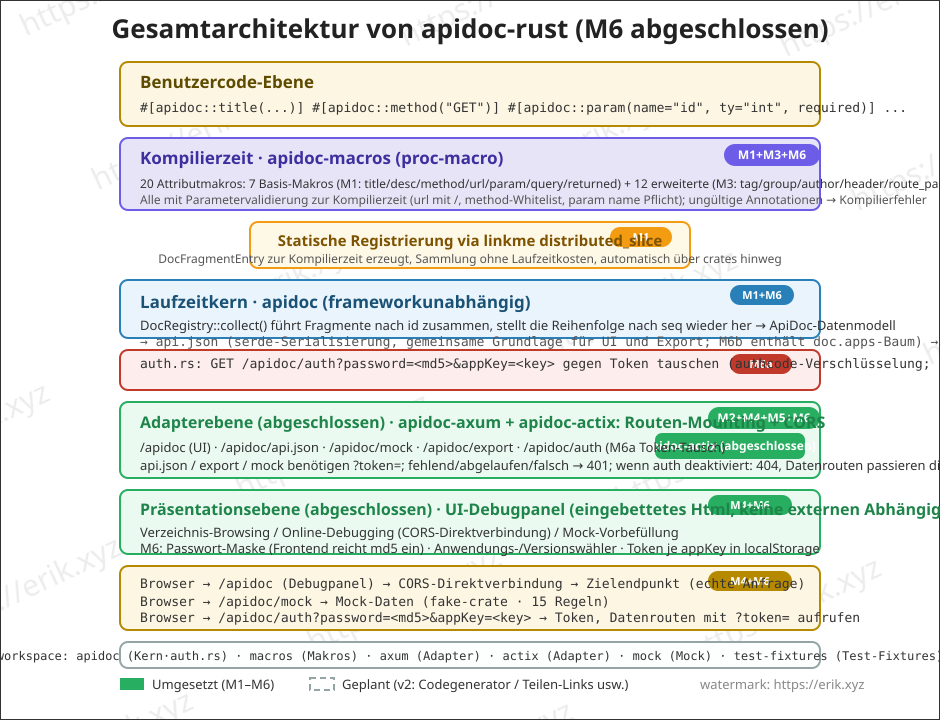
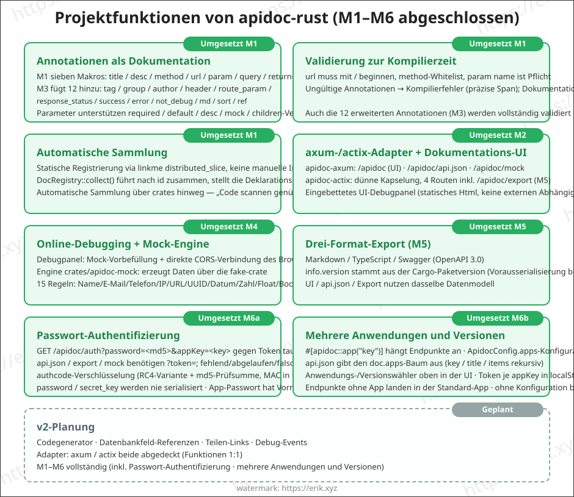
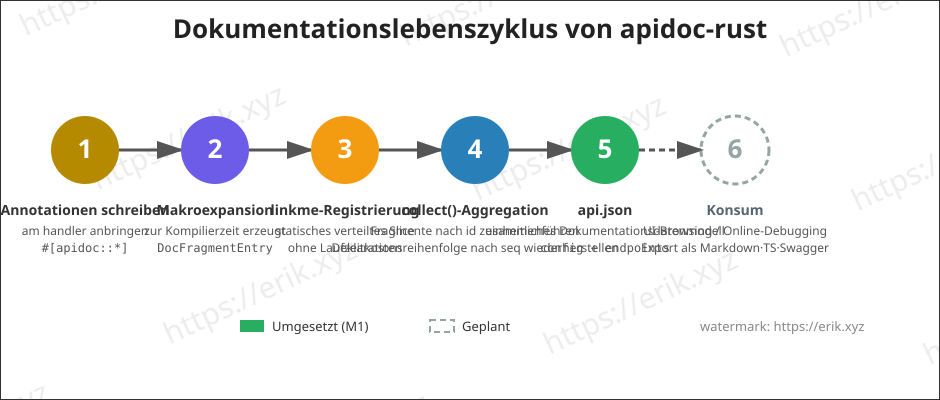

# Apidoc (apidoc-rust)

Toolkit für die Generierung von API-Dokumentation und die Entwicklung von Schnittstellen auf Basis von Rust-Prozessmakros (proc-macro), kompatibel mit axum, actix-web und weiteren gängigen Frameworks

[](https://github.com/erikwang2013/apidoc-rust)
[](https://github.com/erikwang2013/apidoc-rust)

[中文](../../README.md) ·
[English](README-en.md) ·
[한국어](README-ko.md) ·
[Русский](README-ru.md) ·
**[Deutsch](README-de.md)** ·
[Français](README-fr.md) ·
[Español](README-es.md) ·
[Português](README-pt.md) ·
[हिन्दी](README-hi.md) ·
[العربية](README-ar.md) ·
[বাংলা](README-bn.md) ·
[Bahasa Indonesia](README-id.md) ·
[日本語](README-ja.md)

## 📖Projektvorstellung

Apidoc ist eine Rust-Plugin-Bibliothek, die durch die Auswertung von **Rust-Prozessmakros (proc-macro)** automatisch API-Dokumentation erzeugt und mit axum, actix-web und weiteren gängigen Frameworks kompatibel ist. Neben der automatischen Dokumentationserzeugung vereint sie Online-Schnittstellen-Debugging, Mock-Debug-Daten, Json/TypeScript-Codegenerierung, einen Schnittstellen-Generator und einen Code-Generator und deckt damit den gesamten Ablauf von Entwicklung, Debugging und Auslieferung der Schnittstellen ab — mit dem Ziel, die Effizienz der API-Entwicklung zu steigern.

> **Projektursprung**: apidoc-rust entstand in Anlehnung an [apidoc-php](https://github.com/erikwang2013/apidoc-php) (eine Composer-Erweiterung, die API-Dokumentation auf Basis von PHP-8-Attributen erzeugt) und setzt das Konzept „Annotationen sind Dokumentation" auf native Rust-Art um; es wird von erikwang2013 kontinuierlich gepflegt und erweitert.

Der Umsetzungsansatz von apidoc-rust:

- **Generierung zur Kompilierzeit**: Die Dokumentation wird von Prozessmakros zur Kompilierzeit erzeugt — Dokumentation und Code geraten nie aus dem Gleichschritt;
- **Sammlung ohne Laufzeitkosten**: statische Registrierung über linkme, ein einziger Sammelvorgang zur Laufzeit liefert die gesamte API-Dokumentation;
- **Universelle Plugins**: Der Kern ist unabhängig vom HTTP-Framework; beliebige Frameworks werden über dünne Adapter (axum / actix-web) angebunden.

### ✨Projektbeschreibung

- **Sofort einsatzbereit**: Ohne aufwendige Konfiguration — nach der Installation genügt es, die Annotationen gemäß der Dokumentation zu schreiben, und die API-Dokumentation wird automatisch erzeugt.
- **Müheloses Schreiben**: Unterstützung für allgemeine Definitionen (definitions) und `ref`-Verweise auf Felder — mit wenigen Annotationen ist eine vollständige Felddefinition fertig.
- **Online-Debugging**: Schnittstellen direkt auf der Dokumentationsseite debuggen, mit globalen Parametern, Mock-Daten und Debug-Events.
- **Mehrere Apps/Versionen**: Projekte mit einer App, mehreren Apps oder mehreren Versionen sind konfigurierbar; die Schnittstellen werden nach App/Version gruppiert angezeigt und umgeschaltet.
- **Gruppen/Tags**: Schnittstellen unterstützen mehrstufige Gruppen und Tag-Markierungen.
- **Markdown-Dokumentation**: Die `md`-Annotation bindet Markdown als Dokumentationsseite ein.
- **Json/TypeScript-Generierung**: Für jede Schnittstelle werden automatisch Json-Request/Response-Beispiele und TypeScript-Typdefinitionen erzeugt — direkt einsetzbar im Frontend.
- **Code-Generator**: Konfiguration + Vorlagen erzeugen den Business-Code und die Frontend-Api-Dateien.
- **Schnittstellen-Sharing**: Freigabelinks für ausgewählte Apps/Schnittstellen generieren und `swagger.json` exportieren.
- **Sicherer Zugriff**: Unterstützung für ein globales Passwort und unabhängige Passwörter je App/Version; der Dokumentations-Cache kann aktiviert werden.

## Funktionen

### Umgesetzt (M1-M3)

- **Annotationen als Dokumentation**: sieben Attributmakros `title` / `desc` / `method` / `url` / `param` / `query` / `returned`, jeweils als Annotation (entspricht der PHP-attributes-Schreibweise); Parameter unterstützen `required` / `default` / `desc` / `mock` / `children`-Verschachtelung
- **Validierung zur Kompilierzeit**: url muss mit `/` beginnen, method-Whitelist, param name ist Pflicht usw.; ungültige Annotationen führen zur Kompilierzeit zu Fehlern (präzise Span)
- **Automatische Sammlung**: statische Registrierung über linkme `distributed_slice`, keine manuelle Interface-Liste nötig; `DocRegistry::collect()` führt nach id zusammen und stellt die Deklarationsreihenfolge nach seq wieder her, automatische Sammlung über crates hinweg
- **api.json-Ausgabe**: serde serialisiert das einheitliche Dokumentationsdatenmodell (config + endpoints), Felder semantisch an PHP ausgerichtet
- **axum-Adapter + eingebettete Dokumentations-UI**: Route einhängen genügt für die Dokumentationsseite, mit gruppiertem Verzeichnis (M2)
- **Annotationen vervollständigt**: 12 neue Annotationen `tag` / `group` / `author` / `header` / `route_param` / `response_status` / `success` / `error` / `not_debug` / `md` / `sort` / `ref` (M3)

### Umgesetzt (M4)

- **Online-Debugging**: Die Dokumentationsseite enthält ein eingebettetes „Online-Debugging"-Panel — Base URL wird mit `location.origin` vorbefüllt für die direkte Cross-Origin-Verbindung zum Zielservice, Parameterformular wird nach Mock-Regeln vorbefüllt, `{name}` / `:name`-Platzhalter im Routenpfad werden ersetzt, GET/HEAD-Parameter wandern in die Query, andere Methoden werden als JSON-Body zusammengesetzt, Anfrage-Header bearbeitbar + eigene Header, Antwortanzeige (Status / Dauer / pretty JSON), gelber Hinweis bei CORS-Fehler
- **Mock-Engine** (`crates/apidoc/src/mock.rs`, abhängig von der fake-crate, 15 Regeln: name / company / email / phone / url / ip / city / country / text / number / int / float / bool / uuid / date). Regelpriorität: `mock="fake:xxx"` läuft über die fake-Regeltabelle (unbekannte Namen fallen auf Standardwerte zurück) → andere nicht-leere mock-Werte werden unverändert ausgegeben (z. B. `mock="1"`, `mock="erik"`) → ohne mock automatisch nach `ty` erzeugt (int→`"1"`, float→`"0.5"`, bool→`"true"`, object→`"{}"`, string→`"string"`); children werden rekursiv verschachtelt, arrays haben fest 2 Einträge
- **Mock-Endpunkt**: Der axum-Adapter erhält `GET /apidoc/mock?url=&method=` — exakte Übereinstimmung von url + method, sonst 404; das Debug-Panel blendet `not_debug`-Endpunkte standardmäßig aus, sie erscheinen erst nach dem Anhaken von „not_debug-Schnittstellen anzeigen"
- **Direkte CORS-Verbindung**: Online-Debugging verbindet der Browser direkt mit dem Zielendpunkt; der `cors_layer` des Adapters erlaubt dies (serverseitiger Reverse-Proxy bleibt v2)

### Umgesetzt (M5)

- **Export in drei Formaten** (`crates/apidoc/src/export/`): markdown / typescript / swagger (OpenAPI 3.0.0); das Kern-Crate stellt `export::markdown::render` / `export::typescript::render` / `export::swagger::render` bereit
- **Export-Route**: der Adapter erhält `GET /apidoc/export?format=md|ts|swagger` — unbekannte Formate liefern 400; Content-Type jeweils `text/markdown` / `application/typescript` / `application/json`
- **markdown**: gruppiertes Verzeichnis + Parametertabellen + Antwortblöcke; **typescript**: erzeugt `{Name}Params` / `{Name}Result`-Typen im Namensraum je group, nicht gruppierte Schnittstellen landen in `defaultGroup` (`default` ist ein TS-Schlüsselwort); **swagger**: `info.version` stammt aus der Datei `VERSION` im Wurzelverzeichnis
- **actix-web-Adapter** (`crates/apidoc/src/actix.rs`): funktional 1:1 zum axum-Adapter — `apidoc_routes(ApidocConfig) -> Scope` bindet /apidoc, /apidoc/api.json, /apidoc/mock, /apidoc/export ein, `cors_layer(CorsConfig)` erlaubt Cross-Origin
- **UI gemeinsam genutzt**: Die Dokumentations-UI (`src/ui.html`) wurde in das Kern-Crate verlagert und als `pub const UI_HTML` exportiert; beide Adapter verweisen auf dieselbe Kopie (sicher fürs Veröffentlichen)

### Umgesetzt (M6)

- **Passwort-Authentifizierung (M6a)**: Mit aktiviertem `AuthConfig { enable, password, secret_key, expire }` tauscht der Client `GET /apidoc/auth?password=<md5(Passwort)>&appKey=<key>` gegen ein Token; die Datenrouten `/apidoc/api.json`, `/apidoc/export`, `/apidoc/mock` benötigen `?token=xxx`, ein fehlendes/abgelaufenes/falsches Token liefert 401, und die Dokumentations-UI zeigt ein Passwort-Overlay; das Token wird mit der authcode-Verschlüsselung ausgestellt (Zeile für Zeile von Discuz authcode portiert: RC4-Variante + md5-Prüfsumme + Base64 ohne Padding), Payload `{key: md5(md5(Passwort im Klartext)), expire: now+expire}`, MAC-Vergleich in konstanter Zeit
- **Sicherheits-Rotlinien der Authentifizierung**: `password` / `secret_key` werden nie serialisiert — die api.json-Ausgabe ist byte-identisch zum Zustand ohne aktivierte Authentifizierung; bei deaktivierter Auth liefert `/apidoc/auth` 404 und die Datenrouten sind direkt durchlässig; hat eine App-Konfiguration ein eigenes Passwort, hat das App-Passwort Vorrang vor dem globalen; `secret_key` hat als Standard `"apidoc#hgcode"` (bei aktivierter, aber nicht konfigurierter Auth einmalige stderr-Warnung), `expire` hat als Standard 86400 Sekunden
- **Mehrere Anwendungen und Versionen (M6b)**: `ApidocConfig.apps: Vec<AppConfig>` (`key` / `title` / rekursive Unterversionen in `items` / `password`) konfiguriert den App-Baum; `#[apidoc::app("key")]` hängt Schnittstellen an eine bestimmte App-Key, Schnittstellen ohne Key landen in der Standard-App; die api.json-Ausgabe erhält den `doc.apps`-Baum, oben in der UI erscheint ein App-/Versions-Auswahlfeld, und Tokens werden je appKey getrennt im localStorage gespeichert (verschiedene Apps können unabhängige Passwörter haben)

### Umgesetzt (v2)

- **Feldreferenzen auf Datenbanktabellen (`table`)**: `#[apidoc::table("user")]` **faltet** die Felder der per Key in `ApidocConfig.tables` konfigurierten Tabelle in `returned` ein (gleiche Semantik wie `ref`, Unterschied: Datenquelle ist die konfigurierte Tabelle statt eines anderen Endpunkts); Felder unterstützen `required` / `default` / `desc` / `mock`; ein nicht konfigurierter Key erzeugt nur eine stderr-Warnung; ohne diese Annotation ist die Ausgabe byte-identisch zu v1
- **Dokumentations-Cache**: `ApidocConfig.cache = Some(CacheConfig { enable, ttl })` — die `/apidoc/mock`-Ausgabe wird prozessintern nach `(url, method)` memoisiert und nach `ttl` Sekunden neu aufgebaut, `ttl = 0` bedeutet dauerhaft; ohne Konfiguration oder bei deaktiviertem Cache wird der Cache-Pfad gar nicht erst beschritten (keinerlei Ausgabänderung). api.json / export werden beim Einhängen der Routen einmal erzeugt — das entspricht einem permanenten Cache
- **Teilen-Links**: `GET /apidoc/share?app=&url=&method=&base=` → `{"url":"…"}` als Deep-Link (`?app=<key>&ep=<Endpunkt-URL>&method=<Methode>[&token=…]`); neben jeder Schnittstelle auf der Dokumentationsseite gibt es einen „Teilen"-Button (schreibt in die Zwischenablage, bei Fehlern ersatzweise ein kopierbares Eingabefeld), und das Öffnen des Deep-Links springt direkt zu dieser App/Schnittstelle; bei aktivierter Authentifizierung trägt der Link ein serverseitig ausgestelltes Token (App-Passwort hat Vorrang vor dem globalen) und öffnet ohne Passworteingabe
- **Code-Generator**: `GET /apidoc/generate?template=<name>` → gerenderter Text (unbekanntes Template — 404); eingebaut sind `api.ts` (Frontend-Api-Datei), `handler.rs` (Rust-Schnittstellengerüst) und `schema.sql` (CREATE-TABLE-Anweisungen aus `tables`); ein gleichnamiges Template in `ApidocConfig.codegen` überschreibt das eingebaute. Die Template-Syntax kennt nur zwei Konstrukte: `{{变量}}` (bleibt unverändert, wenn nicht definiert) und `{{#each 列表}}…{{/each}}` (verschachtelbar, z. B. `tables` × `fields`)
- **Debug-Events**: Das Online-Debugging-Panel erhält ausklappbare „Vor-Skript / Nach-Skript"-Bereiche (in localStorage persistiert) — das Vor-Skript läuft vor der Anfrage über `new Function('ctx', code)` und kann `ctx.url/method/headers/body` ändern oder ein Objekt für eine flache Zusammenführung zurückgeben; das Nach-Skript läuft nach der Antwort, kann `status/ms/text/url/method/ep` lesen und durch die Rückgabe eines Strings den angezeigten Antworttext ersetzen; Skriptfehler werden nur im Ergebnisbereich gemeldet und brechen die Anfrage nicht ab

## Architektur



## Funktionen



## Lebenszyklus



## Projektstruktur

```
apidoc-rust/
├── Cargo.toml                 # Workspace-Konfiguration (resolver 2)
├── VERSION                    # Projektversion (v1.6.0)
├── crates/
│   ├── apidoc/                # Laufzeitkern (frameworkunabhängig)
│   │   ├── src/lib.rs         # Datenmodell + DocRegistry-Aggregation + api.json + UI_HTML
│   │   ├── src/auth.rs        # M6a-Passwort-Authentifizierung (authcode-Token-Ausstellung/-Prüfung + Routenwächter)
│   │   ├── src/export/        # M5-Exporte: markdown / typescript / swagger
│   │   ├── src/ui.html        # gemeinsame Dokumentations-UI (vom Kern-Crate exportiert, beide Adapter verweisen darauf)
│   │   ├── tests/             # Integrationstests (Makroexpansion/Aggregation/Serialisierung/über crates hinweg)
│   │   └── examples/demo.rs   # Beispiel: Annotationen + Ausgabe von api.json
│   ├── apidoc-macros/         # proc-macro: 20 Attributmakros
│   │   └── src/lib.rs         # Makrodefinitionen + Parameterparsing + Validierung zur Kompilierzeit

│   ├── apidoc-test-fixtures/  # Test-Fixtures für die Registrierung über crates hinweg

├── .github/
│   └── workflows/release.yml  # Release-Workflow (liest VERSION, erstellt inkrementell tag+release)
└── docs/
    ├── images/                # Architektur-/Funktions-/Lebenszyklusdiagramme (SVG)
    └── i18n/                  # Mehrsprachige Dokumentation (12 Sprachen)
```

## Verwendung

### 1. Abhängigkeiten hinzufügen

```toml
[dependencies]
apidoc-rust = "1.6"        # oder path = "crates/apidoc"

serde_json = "1"      # für die Ausgabe von api.json
```

> Adapter je nach Web-Framework wählen: für axum `features = ["axum"]`, für actix-web `features = ["actix"]` (beide funktional 1:1). `mock` (Mock-Engine) ist eine interne Framework-Abhängigkeit, die automatisch vom Adapter eingebunden wird; Verbraucher müssen sie in der Regel nicht direkt verwenden.

### 2. Annotationen schreiben

Die Annotationen werden einzeln auf die Handler-Funktionen gesetzt, die Dokumentation entsteht zur Kompilierzeit:

```rust
use apidoc::*;

#[apidoc::title("获取用户信息")]
#[apidoc::desc("根据用户 ID 查询用户详情")]
#[apidoc::url("/api/user/info")]
#[apidoc::method("GET")]
#[apidoc::param(name = "user_id", ty = "int", required, desc = "用户ID", mock = "1")]
#[apidoc::query(name = "lang", ty = "string", desc = "语言", default = "zh-CN")]
#[apidoc::returned(
    name = "data",
    ty = "object",
    desc = "用户数据",
    children = [
        { name = "id", ty = "int", required, desc = "用户ID" },
        { name = "name", ty = "string", required, desc = "用户名", mock = "erik" },
    ]
)]
fn get_user_info() -> String {
    unimplemented!()
}
```

### 3. Sammeln und ausgeben

```rust
fn main() {
    let doc = DocRegistry::collect_doc(ApidocConfig {
        title: "我的 API".to_string(),
        description: None,
        auth: None,    // M6a-Passwort-Authentifizierung, siehe „8. Passwort-Authentifizierung"
        apps: vec![],  // M6b mehrere Anwendungen und Versionen, siehe „9. Mehrere Anwendungen und Versionen"
    });
    println!("{}", serde_json::to_string_pretty(&doc).unwrap());
}
```

### 4. Beispiel ausführen

```bash
cargo run --example demo -p apidoc
```

Ausgabe (Auszug):

```json
{
  "config": { "title": "demo api" },
  "endpoints": [
    {
      "title": "获取用户信息",
      "desc": "根据用户 ID 查询用户详情",
      "url": "/api/user/info",
      "method": "GET",
      "params": [
        { "name": "user_id", "type": "int", "required": true, "desc": "用户ID", "mock": "1" }
      ],
      "querys": [
        { "name": "lang", "type": "string", "required": false, "default": "zh-CN", "desc": "语言" }
      ],
      "returned": [
        {
          "name": "data",
          "type": "object",
          "required": false,
          "desc": "用户数据",
          "children": [
            { "name": "id", "type": "int", "required": true, "desc": "用户ID" },
            { "name": "name", "type": "string", "required": true, "desc": "用户名", "mock": "erik" }
          ]
        }
      ]
    }
  ]
}
```

### 5. Online-Debugging und Mock (M4)

Dokumentationsseite öffnen → Endpunkt auswählen → das Panel „Online-Debugging" rechts befüllt die Parameter nach den Mock-Regeln vor → Base URL auf den Zielservice richten (Standard `location.origin`, direkte Cross-Origin-Verbindung) → „Senden" klicken, um die echte Antwort zu erhalten (Statuscode / Dauer / pretty JSON). Das Debug-Panel blendet `not_debug`-Endpunkte standardmäßig aus; sie erscheinen erst nach dem Anhaken von „not_debug-Schnittstellen anzeigen".

**CORS-Anforderung**: Online-Debugging verbindet der Browser direkt mit dem Zielendpunkt, daher muss der Zielservice den vom Adapter bereitgestellten `cors_layer` einbinden, um Cross-Origin-Anfragen zu erlauben; bei CORS-Fehlern zeigt das Panel einen gelben Hinweis.

Mock-Regelsyntax (drei Prioritätsstufen):

```rust
#[apidoc::param(name = "email", ty = "string", desc = "邮箱", mock = "fake:email")]  // Generierung per fake-Regel
#[apidoc::param(name = "status", ty = "string", desc = "状态", mock = "1")]          // nicht-leerer mock wird unverändert ausgegeben
#[apidoc::param(name = "name", ty = "string", desc = "用户名")]                       // ohne mock: automatisch nach ty
#[apidoc::returned(
    name = "data",
    ty = "object",
    children = [
        { name = "id", ty = "int", required },       // ohne mock → "1"
        { name = "email", ty = "string", mock = "fake:email" },  // children rekursiv verschachtelt
    ]
)]
fn create_user() -> String {
    unimplemented!()
}
```

15 eingebaute fake-Regeln: `name` / `company` / `email` / `phone` / `url` / `ip` / `city` / `country` / `text` / `number` / `int` / `float` / `bool` / `uuid` / `date`; unbekannte Regelnamen fallen auf Standardwerte zurück. Automatische Generierung ohne mock: int→`"1"`, float→`"0.5"`, bool→`"true"`, object→`"{}"`, string→`"string"`; Arrays haben fest 2 Einträge.

### 6. Online-Export (M5)

Der Adapter bietet drei integrierte Export-Endpunkte — nach dem Einhängen sofort nutzbar (unbekanntes `format` liefert 400):

```bash
GET /apidoc/export?format=md        # gruppiertes Verzeichnis + Parametertabellen + Antwortblöcke (text/markdown)
GET /apidoc/export?format=ts        # erzeugt {Name}Params / {Name}Result-Typen je group-Namensraum (application/typescript)
GET /apidoc/export?format=swagger   # OpenAPI-3.0.0-Beschreibungsdatei (application/json)
```

- **markdown**: geeignet zum Einfügen in Projekt-Wiki / Release-Notizen, Ausgabe eines Verzeichnisses nach Gruppen, jede Schnittstelle mit Parametertabelle und Antwortblock;
- **typescript**: das Frontend kann es direkt als Typdefinitionen einfügen; nicht gruppierte Schnittstellen landen im Namensraum `defaultGroup` (`default` ist ein TS-Schlüsselwort und kann kein Bezeichner sein);
- **swagger**: `info.version` stammt aus der Datei `VERSION` im Wurzelverzeichnis (aktuell 1.6.0), direkt importierbar in Swagger UI oder Code-Generatoren.

### 7. actix-web-Adapter

Bei Verwendung von actix-web `features = ["actix"]` einbinden (funktional 1:1 zum axum-Adapter):

```toml
[dependencies]
apidoc-rust = { version = "1.6", features = ["actix"] }
```

```rust
use actix_web::{App, HttpServer};
use apidoc::actix::{apidoc_routes, cors_layer, CorsConfig};
use apidoc::ApidocConfig;

#[actix_web::main]
async fn main() -> std::io::Result<()> {
    HttpServer::new(|| {
        App::new()
            .service(apidoc_routes(ApidocConfig {
                title: "我的 API".to_string(),
                description: None,
                auth: None,    // M6a-Passwort-Authentifizierung, siehe „8. Passwort-Authentifizierung"
                apps: vec![],  // M6b mehrere Anwendungen und Versionen, siehe „9. Mehrere Anwendungen und Versionen"
            }))
            .wrap(cors_layer(CorsConfig::default()))   // M4: Cross-Origin-Freigabe für Online-Debugging
    })
    .bind("127.0.0.1:8080")?
    .run()
    .await
}
```

Nach dem Einhängen sind `/apidoc` (Dokumentations-UI), `/apidoc/api.json` (Daten), `/apidoc/mock` (Mock) und `/apidoc/export` (Export) erreichbar. Eine leere CORS-Konfiguration erlaubt das literale `*` (ohne Anmeldedaten); mit einer `allow_origins`-Whitelist wird der Origin per exakter Übereinstimmung reflektiert — in beiden Modi werden keine Anmeldedaten aktiviert.

### 8. Passwort-Authentifizierung (M6a)

Mit aktiviertem `auth` benötigt die Dokumentation ein Passwort (angelehnt an die Auth.php des Upstreams apidoc-php; das Token ist eine Zeile-für-Zeile-Portierung der Discuz-authcode-Verschlüsselung):

```rust
use apidoc::auth::AuthConfig;

let doc = DocRegistry::collect_doc(ApidocConfig {
    title: "我的 API".to_string(),
    description: None,
    auth: Some(AuthConfig {
        enable: true,
        password: "your-password".to_string(),
        secret_key: "your-secret-key".to_string(), // Standard „apidoc#hgcode" (einmalige stderr-Warnung bei aktivierter, aber nicht konfigurierter Auth)
        expire: 86400,                             // Sekunden; Standard 86400
    }),
    apps: vec![],
});
```

**Ablauf**:

1. Der Client ruft `GET /apidoc/auth?password=<md5(Passwort)>&appKey=<key>` auf und erhält ein Token (bei Erfolg `{"token":"..."}`, bei falschem Passwort 401); bei deaktivierter Auth liefert diese Route 404 und die Datenrouten sind direkt durchlässig
2. Die Datenrouten `GET /apidoc/api.json`, `/apidoc/export`, `/apidoc/mock` benötigen `?token=xxx` (bei ausgewählter App zusätzlich `&appKey=`); ein fehlendes/abgelaufenes/falsches Token liefert 401, die Dokumentations-UI öffnet automatisch das Passwort-Overlay, und nach Eingabe des Passworts hasht das Frontend es lokal per md5 und tauscht es gegen ein Token
3. Die Token-Payload ist `{key: md5(md5(Passwort im Klartext)), expire: now+expire}`, per `secret_key` mit authcode verschlüsselt (RC4-Variante + md5-Prüfsumme + Base64 ohne Padding, MAC-Vergleich in konstanter Zeit gegen Timing-Seitenkanäle)
4. `password` / `secret_key` werden nie serialisiert — die api.json-Ausgabe ist byte-identisch zum Zustand ohne aktivierte Authentifizierung; hat eine App-Konfiguration ein eigenes `password`, hat das App-Passwort Vorrang vor dem globalen

### 9. Mehrere Anwendungen und Versionen (M6b)

Ein Projekt lässt sich in mehrere Apps/Versionen aufteilen, jeweils mit eigener Anzeige und Zugriffskontrolle:

```rust
#[apidoc::title("获取用户信息")]
#[apidoc::app("demo")]   // an die App mit key="demo" hängen; Schnittstellen ohne app-Annotation landen in der Standard-App
fn get_user_info() -> String {
    unimplemented!()
}
```

```rust
let doc = DocRegistry::collect_doc(ApidocConfig {
    title: "我的 API".to_string(),
    description: None,
    auth: None,
    apps: vec![
        AppConfig {
            key: "demo".to_string(),
            title: "演示应用".to_string(),
            items: vec![AppConfig {
                key: "v1".to_string(),
                title: "v1".to_string(),
                items: vec![],
                password: None,
            }],
            password: None, // unabhängiges Zugriffspasswort der App, Vorrang vor dem globalen, wird nie serialisiert
        },
    ],
});
```

- `AppConfig { key, title, items, password }`: `key` ist die eindeutige Kennung, auf die die `#[apidoc::app("key")]`-Annotation verweist, `items` verschachtelt rekursiv Unterversionen/Unter-Apps, `password` ist das unabhängige Zugriffspasswort der App (mit unabhängigem Passwort wird nur das App-Token geprüft)
- Die api.json-Ausgabe erhält den `doc.apps`-Baum (key / title / items / endpoints); oben in der UI erscheint ein App-/Versions-Auswahlfeld — beim Wechsel werden die Schnittstellen dieses Knotens gerendert und die Daten neu geladen, Tokens werden je appKey getrennt im localStorage gespeichert
- Verweist die `app`-Annotation auf einen nicht in `apps` konfigurierten Key, erfolgt eine stderr-Warnung und die Schnittstelle landet in der Standard-App; ohne `app`-Annotationen oder ohne konfiguriertes `apps` ist die Ausgabe byte-identisch zu M5

### 10. Feldreferenzen auf Datenbanktabellen · Dokumentations-Cache (v2)

```rust
ApidocConfig {
    // Tabellenstruktur kommt aus der Konfiguration (die Rust-Seite verbindet sich nicht mit der Datenbank), die Annotation referenziert per Key
    tables: vec![TableDef {
        key: "user".into(),
        title: "用户表".into(),
        fields: vec![
            TableField { name: "id".into(), ty: "int".into(), required: true, desc: Some("用户ID".into()), ..Default::default() },
            TableField { name: "name".into(), ty: "string".into(), mock: Some("erik".into()), ..Default::default() },
        ],
    }],
    // Dokumentations-Cache: /apidoc/mock-Ausgabe wird nach (url, method) memoisiert und nach ttl Sekunden neu aufgebaut (0 = dauerhaft)
    cache: Some(CacheConfig { enable: true, ttl: 60 }),
    ..Default::default()   // title / description / auth / apps / codegen werden wie gewohnt konfiguriert
}
```

Am Handler dieselbe Schreibweise wie bei `ref`: `#[apidoc::table("user")]`. Die Felder werden in `returned` dieser Schnittstelle eingefaltet; ein in `tables` fehlender Key erzeugt nur eine Warnung, keinen Fehler.

### 11. Teilen-Links · Code-Generierung (v2)

- `GET /apidoc/share?app=api&url=/api/user/info&method=GET&base=https://example.com` → `{"url":"https://example.com/apidoc?app=api&ep=%2Fapi%2Fuser%2Finfo&method=GET"}` (bei aktivierter Authentifizierung wird `&token=…` angehängt, das Öffnen erfolgt ohne Passwort)
- `GET /apidoc/generate?template=api.ts` (oder `handler.rs` / `schema.sql`) → `text/plain; charset=utf-8`; unbekanntes Template — 404, fehlender Parameter — 400
- Eigene Templates (gleichnamige überschreiben die eingebauten):

```rust
ApidocConfig {
    codegen: vec![CodegenTemplate {
        name: "api.ts".into(),
        template: "// {{title}}\n{{#each endpoints}}// {{method}} {{url}}\n{{/each}}".into(),
    }],
    ..Default::default()
}
```

Verfügbare Template-Variablen: oberste Ebene `title` / `description`; innerhalb `{{#each endpoints}}` `title` / `url` / `method` / `group` / `desc` / `author`; innerhalb `{{#each tables}}` `key` / `title` und darin innerhalb `{{#each fields}}` `name` / `ty` / `required` / `default` / `desc` / `mock`; dazu die abgeleiteten Variablen `not_null` / `default_clause` / `comma` (für direkt gültiges SQL).

### 12. Debug-Vor- und Nachskripte (v2)

Auf der Dokumentationsseite lassen sich im Panel „Online-Debugging" die Bereiche „Vor-Skript" und „Nach-Skript" ausklappen (Inhalt wird in localStorage gespeichert):

```js
// Vor-Skript: läuft vor dem Absenden der Anfrage, kann ctx.url / method / headers / body ändern oder ein Objekt für eine flache Zusammenführung zurückgeben
ctx.headers['X-Token'] = localStorage.getItem('token') || '';
```

```js
// Nach-Skript: läuft nach der Antwort, ctx = { status, ms, text, url, method, ep } (nur lesend)
// die Rückgabe eines Strings ersetzt den im Ergebnisbereich angezeigten Text
return 'HTTP ' + ctx.status + ' · ' + ctx.ms + 'ms\n' + ctx.text;
```

Skriptfehler werden nur im Debug-Ergebnisbereich gemeldet und brechen die Anfrage nicht ab (bei fehlgeschlagenem Vor-Skript wird die Anfrage wie gewohnt gesendet, bei fehlgeschlagenem Nach-Skript die Originalantwort wie gewohnt angezeigt).

## Entwicklungsplan

| Phase | Inhalt | Status |
|-------|--------|--------|
| M1 | Workspace-Gerüst + Datenmodell + Makro-MVP + linkme-Registrierung | ✅ Abgeschlossen |
| M2 | axum-Adapter + eingebettete Dokumentations-UI + gruppierte Verzeichnisse | ✅ Abgeschlossen |
| M3 | Annotationen vervollständigen (tag/group/author/header/route_param/response_status/success/error/not_debug/md/sort/ref) | ✅ Abgeschlossen |
| M4 | Online-Debugging + Mock-Engine | ✅ Abgeschlossen |
| M5 | Export als markdown / typescript / swagger.json (OpenAPI3) | ✅ Abgeschlossen |
| —  | actix-web-Adapter (funktional 1:1 zu axum) | ✅ Abgeschlossen |
| M6a | Passwort-Authentifizierung (authcode-Token + Passwort-Overlay, App-Passwort hat Vorrang) | ✅ Abgeschlossen |
| M6b | Mehrere Anwendungen und Versionen (apps-Konfigurationsbaum + app-Annotation + UI-Auswahl) | ✅ Abgeschlossen |
| v2 | Feldreferenzen auf Datenbanktabellen + Dokumentations-Cache + Teilen-Links + Code-Generator + Debug-Events | ✅ Abgeschlossen |

## Mehrsprachige Dokumentation

- [English](README-en.md)
- [한국어](README-ko.md)
- [Русский](README-ru.md)
- [Deutsch](README-de.md)
- [Français](README-fr.md)
- [Español](README-es.md)
- [Português](README-pt.md)
- [हिन्दी](README-hi.md)
- [العربية](README-ar.md)
- [বাংলা](README-bn.md)
- [Bahasa Indonesia](README-id.md)
- [日本語](README-ja.md)

## Unterstützung und Spenden

Wenn dieses Projekt für Sie hilfreich ist, freuen wir uns über einen ⭐ Star zur Unterstützung — und auch über Spenden zur Förderung von Open Source!

### 微信 / 支付宝 (WeChat / Alipay)

| 微信支付 | 支付宝 |
|---|---|
|  |  |

### Spenden per internationaler Überweisung

**【Empfängerinformationen】**

- Name des Empfängers: WANG KEXUN
- Kontonummer des Empfängers: 881015918251

**【Empfängerbank】**

- ZA Bank SWIFT-Code: AABLHKHHXXX
- Bankname: ZA Bank Limited
- Bankleitzahl: 387
- Bankadresse: Core F, Cyberport 3, 100 Cyberport Road, Hong Kong

**【Korrespondenzbank für grenzüberschreitende Überweisungen (falls erforderlich)】**

> Bitte beachten Sie: Dies sind die Informationen der Korrespondenzbank (Zwischenbank) für grenzüberschreitende Überweisungen, nicht die der Empfängerbank. Fragen Sie bei Ihrer überweisenden Bank nach, ob Angaben zur Korrespondenzbank für grenzüberschreitende Überweisungen erforderlich sind.

- **Korrespondenzbank für Überweisungen in Hongkong-Dollar, Renminbi und US-Dollar: Citibank:**
  - Bankname: Citibank N.A. Hong Kong
  - SWIFT-Code: CITIHKHXXXX
  - Bankleitzahl: 006
  - Filialname: Hong Kong Branch
  - Filialnummer: 391
  - Bankadresse: Citibank Tower, Citibank Plaza, 3 Garden Road, Central, Hong Kong
- **Korrespondenzbank für Überweisungen in anderen Währungen: BNY Mellon:**
  - Bankname: THE BANK OF NEW YORK MELLON
  - SWIFT-Code: IRVTUS3NXXX
  - Bankadresse: THE BANK OF NEW YORK MELLON, 240 GREENWICH STREET, NEW YORK, United States

## License

[MIT](../../LICENSE)
