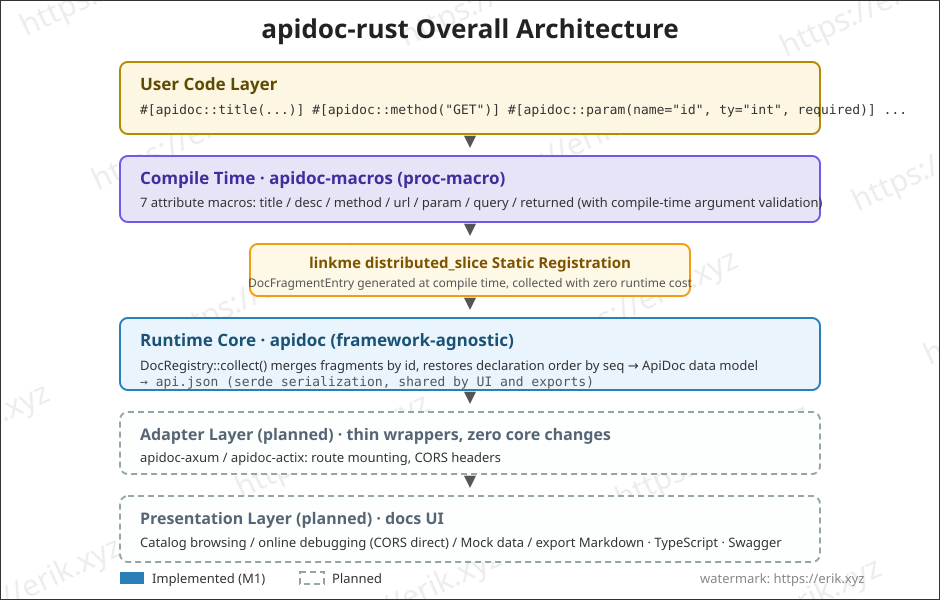
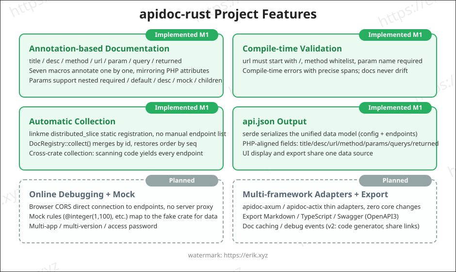
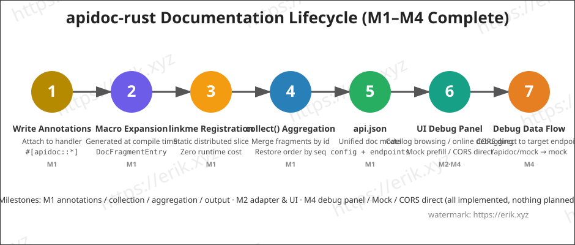

<h1 align="center">Apidoc (apidoc-rust)</h1>

<div align="center">
 A general-purpose plugin library that generates API documentation from Rust procedural macros (proc-macro)
</div>

<div align="center">
<a href="https://github.com/erikwang2013/apidoc-rust"></a>
<a href="https://github.com/erikwang2013/apidoc-rust"></a>
</div>

<div align="center">
<a href="../../README.md">中文</a> ·
<a href="README-en.md"><strong>English</strong></a> ·
<a href="README-ko.md">한국어</a> ·
<a href="README-ru.md">Русский</a> ·
<a href="README-de.md">Deutsch</a> ·
<a href="README-fr.md">Français</a> ·
<a href="README-es.md">Español</a> ·
<a href="README-pt.md">Português</a> ·
<a href="README-hi.md">हिन्दी</a> ·
<a href="README-ar.md">العربية</a> ·
<a href="README-bn.md">বাংলা</a> ·
<a href="README-id.md">Bahasa Indonesia</a> ·
<a href="README-ja.md">日本語</a>
</div>

## Introduction

apidoc-rust is a **general-purpose pluggable API documentation generator** implemented in Rust, inspired by [apidoc-php](https://github.com/erikwang2013/apidoc-php) (a composer extension that generates API documentation from PHP 8 attributes). It brings "annotations as documentation" to the Rust ecosystem the native way:

- **Generated at compile time**: documentation is produced by procedural macros during compilation, so the docs can never drift out of sync with the code;
- **Zero-cost collection**: static registration via linkme, a single pass at runtime aggregates all endpoint documentation;
- **Generic plugin core**: the core is HTTP-framework-agnostic and plugs into any framework through thin adapters (axum / actix-web).

## Features

### Implemented (M1-M3)

- **Annotation-based documentation**: seven attribute macros — `title` / `desc` / `method` / `url` / `param` / `query` / `returned` — annotated one by one (mirroring the PHP attributes style); parameters support nested `required` / `default` / `desc` / `mock` / `children`
- **Compile-time validation**: url must start with `/`, method whitelist, param name is required, etc.; invalid annotations fail at compile time with precise spans
- **Automatic collection**: static registration via linkme `distributed_slice`, no manual endpoint manifest needed; `DocRegistry::collect()` merges fragments by id and restores declaration order by seq, collecting automatically across crates
- **api.json output**: serde serializes the unified document data model (config + endpoints), with fields aligned to PHP semantics
- **axum adapter + embedded docs UI**: mount the routes to get a documentation page with grouped catalog browsing (M2)
- **Extended annotations**: 12 new annotations — `tag` / `group` / `author` / `header` / `route_param` / `response_status` / `success` / `error` / `not_debug` / `md` / `sort` / `ref` (M3)

### Implemented (M4)

- **Online debugging**: the docs page embeds an "Online Debugging" panel — Base URL prefilled with `location.origin` for cross-origin direct connection to the target service, parameter form prefilled from mock rules, `{name}` / `:name` route placeholder replacement, GET/HEAD params merged into the query string, other methods assembled as a JSON body, request header editing + custom headers, response display (status / elapsed time / pretty JSON), yellow hint on CORS failure
- **Mock engine** (`crates/apidoc-mock`, depends on the fake crate, 15 rules: name / company / email / phone / url / ip / city / country / text / number / int / float / bool / uuid / date). Rule priority: `mock="fake:xxx"` resolves via the fake rule table (unknown names fall back to defaults) → other non-empty mock values pass through as-is (e.g. `mock="1"`, `mock="erik"`) → no mock: auto-generated from `ty` (int→`"1"`, float→`"0.5"`, bool→`"true"`, object→`"{}"`, string→`"string"`); children are nested recursively, arrays are fixed at 2 items
- **Mock endpoint**: the axum adapter adds `GET /apidoc/mock?url=&method=` — exact match on url + method, 404 when unmatched; the debug panel hides `not_debug` endpoints by default, they only appear after checking "Show not_debug endpoints"
- **CORS direct connection**: online debugging connects from the browser directly to the target endpoint, allowed by the adapter's `cors_layer` (server-side reverse proxy deferred to v2)

### Implemented (M5)

- **Three-format export** (`crates/apidoc/src/export/`): markdown / typescript / swagger (OpenAPI 3.0.0); the core crate provides `export::markdown::render` / `export::typescript::render` / `export::swagger::render`
- **Export route**: the adapter adds `GET /apidoc/export?format=md|ts|swagger` — unknown formats return 400; Content-Type is `text/markdown` / `application/typescript` / `application/json` respectively
- **markdown**: grouped catalog + parameter tables + response blocks; **typescript**: generates `{Name}Params` / `{Name}Result` types in per-group namespaces, ungrouped endpoints fall into `defaultGroup` (`default` is a TS reserved word); **swagger**: `info.version` is read from the root `VERSION` file
- **actix-web adapter** (`crates/apidoc-actix`): 1:1 feature parity with the axum adapter — `apidoc_routes(ApidocConfig) -> Scope` mounts /apidoc, /apidoc/api.json, /apidoc/mock, /apidoc/export, and `cors_layer(CorsConfig)` allows cross-origin
- **Shared UI**: the docs UI (`src/ui.html`) was moved up into the core crate and exported as `pub const UI_HTML`; both adapters reference the same copy (safe for published packages)

### Planned

- Multi-app / multi-version / access password
- v2: code generator, data-table field references, share links, debug events

## Architecture



## Features



## Lifecycle



## Project Structure

```
apidoc-rust/
├── Cargo.toml                 # workspace config (resolver 2)
├── VERSION                    # project version (v1.1.0, separate from the framework version 0.1.0)
├── crates/
│   ├── apidoc/                # runtime core (framework-agnostic)
│   │   ├── src/lib.rs         # data model + DocRegistry aggregation + api.json + UI_HTML
│   │   ├── src/export/        # M5 exports: markdown / typescript / swagger
│   │   ├── src/ui.html        # shared docs UI (exported by the core crate, referenced by both adapters)
│   │   ├── tests/             # integration tests (macro expansion/aggregation/serialization/cross-crate)
│   │   └── examples/demo.rs   # example: annotations + api.json output
│   ├── apidoc-macros/         # proc-macro: 19 attribute macros
│   │   └── src/lib.rs         # macro definitions + argument parsing + compile-time validation
│   ├── apidoc-mock/           # Mock engine (generates mock data via fake rules)
│   ├── apidoc-test-fixtures/  # cross-crate registration test fixtures
│   ├── apidoc-axum/           # axum adapter (docs routes + cors_layer + mock + export)
│   └── apidoc-actix/          # actix-web adapter (1:1 feature parity with axum)
├── .github/
│   └── workflows/release.yml  # release workflow (reads VERSION, incrementally creates tag+release)
└── docs/
    ├── images/                # architecture/features/lifecycle diagrams (SVG)
    └── i18n/                  # multilingual documentation (12 languages)
```

## Usage

### 1. Add the dependency

```toml
[dependencies]
apidoc = "0.1"        # or path = "crates/apidoc"
apidoc-macros = "0.1"
linkme = "0.3"        # macro expansion references the linkme path directly; consumers must depend on it
serde_json = "1"      # for api.json output
```

> Pick the adapter by web framework: `apidoc-axum` for axum, `apidoc-actix` for actix-web (both with 1:1 feature parity). `apidoc-mock` (Mock engine) is an internal framework dependency, pulled in automatically by the adapter; consumers generally don't need to use it directly.

### 2. Write annotations

Attach annotations to handler functions one by one, and the documentation is generated at compile time:

```rust
use apidoc::*;

#[apidoc::title("获取用户信息")]
#[apidoc::desc("根据用户 ID 查询用户详情")]
#[apidoc::url("/api/user/info")]
#[apidoc::method("GET")]
#[apidoc::param(name = "user_id", ty = "int", required, desc = "用户ID", mock = "1")]
#[apidoc::query(name = "lang", ty = "string", desc = "语言", default = "zh-CN")]
#[apidoc::returned(
    name = "data",
    ty = "object",
    desc = "用户数据",
    children = [
        { name = "id", ty = "int", required, desc = "用户ID" },
        { name = "name", ty = "string", required, desc = "用户名", mock = "erik" },
    ]
)]
fn get_user_info() -> String {
    unimplemented!()
}
```

### 3. Collect and output

```rust
fn main() {
    let endpoints = DocRegistry::collect();
    let doc = ApiDoc {
        config: ApidocConfig {
            title: "我的 API".to_string(),
            description: None,
        },
        endpoints,
    };
    println!("{}", serde_json::to_string_pretty(&doc).unwrap());
}
```

### 4. Run the example

```bash
cargo run --example demo -p apidoc
```

Output (excerpt):

```json
{
  "config": { "title": "demo api" },
  "endpoints": [
    {
      "title": "获取用户信息",
      "desc": "根据用户 ID 查询用户详情",
      "url": "/api/user/info",
      "method": "GET",
      "params": [
        { "name": "user_id", "type": "int", "required": true, "desc": "用户ID", "mock": "1" }
      ],
      "querys": [
        { "name": "lang", "type": "string", "required": false, "default": "zh-CN", "desc": "语言" }
      ],
      "returned": [
        {
          "name": "data",
          "type": "object",
          "required": false,
          "desc": "用户数据",
          "children": [
            { "name": "id", "type": "int", "required": true, "desc": "用户ID" },
            { "name": "name", "type": "string", "required": true, "desc": "用户名", "mock": "erik" }
          ]
        }
      ]
    }
  ]
}
```

### 5. Online Debugging & Mock (M4)

Open the docs page → select an endpoint → the "Online Debugging" panel on the right prefills parameters from the mock rules → point the Base URL at the target service (default `location.origin`, cross-origin direct connection) → click Send to get the real response (status code / elapsed time / pretty JSON). The debug panel hides `not_debug` endpoints by default; they only appear after checking "Show not_debug endpoints".

**CORS requirement**: online debugging connects from the browser directly to the target endpoint, so the target service must mount the adapter-provided `cors_layer` to allow cross-origin requests; the panel shows a yellow hint when CORS fails.

Mock rule syntax (three priority levels):

```rust
#[apidoc::param(name = "email", ty = "string", desc = "邮箱", mock = "fake:email")]  // fake rule generation
#[apidoc::param(name = "status", ty = "string", desc = "状态", mock = "1")]          // non-empty mock passes through as-is
#[apidoc::param(name = "name", ty = "string", desc = "用户名")]                       // no mock: auto-generated from ty
#[apidoc::returned(
    name = "data",
    ty = "object",
    children = [
        { name = "id", ty = "int", required },       // no mock → "1"
        { name = "email", ty = "string", mock = "fake:email" },  // children nested recursively
    ]
)]
fn create_user() -> String {
    unimplemented!()
}
```

The 15 built-in fake rules: `name` / `company` / `email` / `phone` / `url` / `ip` / `city` / `country` / `text` / `number` / `int` / `float` / `bool` / `uuid` / `date`; unknown rule names fall back to default values. Auto-generation rules without mock: int→`"1"`, float→`"0.5"`, bool→`"true"`, object→`"{}"`, string→`"string"`; arrays are fixed at 2 items.

### 6. Online Export (M5)

The adapter ships three built-in export endpoints, usable immediately after mounting (unknown `format` returns 400):

```bash
GET /apidoc/export?format=md        # grouped catalog + parameter tables + response blocks (text/markdown)
GET /apidoc/export?format=ts        # generates {Name}Params / {Name}Result types in per-group namespaces (application/typescript)
GET /apidoc/export?format=swagger   # OpenAPI 3.0.0 description file (application/json)
```

- **markdown**: great for pasting into a project Wiki / release notes; outputs a catalog by group, each endpoint with parameter tables and response blocks;
- **typescript**: the frontend can paste it directly as type definitions; ungrouped endpoints fall into the `defaultGroup` namespace (`default` is a TS reserved word and cannot be an identifier);
- **swagger**: `info.version` is read from the root `VERSION` file (currently 1.1.0), importable directly into Swagger UI or code generators.

### 7. actix-web adapter

When using actix-web, add `apidoc-actix` (1:1 feature parity with the axum adapter):

```toml
[dependencies]
apidoc-actix = "0.1"     # or path = "crates/apidoc-actix"
```

```rust
use actix_web::{App, HttpServer};
use apidoc_actix::{apidoc_routes, cors_layer, ApidocConfig, CorsConfig};

#[actix_web::main]
async fn main() -> std::io::Result<()> {
    HttpServer::new(|| {
        App::new()
            .service(apidoc_routes(ApidocConfig {
                title: "我的 API".to_string(),
                description: None,
            }))
            .wrap(cors_layer(CorsConfig::default()))   // M4 online debugging cross-origin allowance
    })
    .bind("127.0.0.1:8080")?
    .run()
    .await
}
```

After mounting, `/apidoc` (docs UI), `/apidoc/api.json` (data), `/apidoc/mock` (Mock), and `/apidoc/export` (export) are all accessible. An empty CORS config allows the literal `*` (without credentials); with an `allow_origins` whitelist configured, the Origin is reflected with exact matching — neither mode enables credentials.

## Roadmap

| Phase | Content | Status |
|-------|---------|--------|
| M1 | workspace skeleton + data model + macro MVP + linkme registration | ✅ Done |
| M2 | axum adapter + embedded docs UI + grouped catalog | ✅ Done |
| M3 | annotation completion (tag/group/author/header/route_param/response_status/success/error/not_debug/md/sort/ref) | ✅ Done |
| M4 | online debugging + Mock engine | ✅ Done |
| M5 | export markdown / typescript / swagger.json (OpenAPI3) | ✅ Done |
| —  | actix-web adapter (1:1 feature parity with axum) | ✅ Done |
| M6 | password auth, multi-app multi-version, release | Planned |

## Multilingual Documentation

- [English](README-en.md)
- [한국어](README-ko.md)
- [Русский](README-ru.md)
- [Deutsch](README-de.md)
- [Français](README-fr.md)
- [Español](README-es.md)
- [Português](README-pt.md)
- [हिन्दी](README-hi.md)
- [العربية](README-ar.md)
- [বাংলা](README-bn.md)
- [Bahasa Indonesia](README-id.md)
- [日本語](README-ja.md)

## Support & Donations

If this project helps you, feel free to give us a ⭐ Star — donations to support open source are also welcome!

### 微信支付 (WeChat Pay) / 支付宝 (Alipay)

<table>
  <tr>
    <td align="center">
      <br/>
      <strong>微信支付 (WeChat Pay)</strong>
    </td>
    <td align="center">
      <br/>
      <strong>支付宝 (Alipay)</strong>
    </td>
  </tr>
</table>

### Global Bank Transfer Donation

**Recipient Information**

- Recipient name: WANG KEXUN
- Recipient account number: 881015918251

**Receiving Bank**

- ZA Bank SWIFT Code: AABLHKHHXXX
- Bank name: ZA Bank Limited
- Bank code: 387
- Bank address: Core F, Cyberport 3, 100 Cyberport Road, Hong Kong

**Correspondent Bank for Cross-Border Remittance (if required)**

> Please note that the following is the correspondent (intermediary) bank for cross-border remittance, not the receiving bank. Please check with your remitting bank whether correspondent bank information is required.

- **Citibank is the correspondent bank for HKD, CNY and USD remittances:**
  - Bank name: Citibank N.A. Hong Kong
  - SWIFT Code: CITIHKHXXXX
  - Bank code: 006
  - Branch name: Hong Kong Branch
  - Branch code: 391
  - Bank address: Citibank Tower, Citibank Plaza, 3 Garden Road, Central, Hong Kong
- **BNY Mellon is the correspondent bank for remittances in other currencies:**
  - Bank name: THE BANK OF NEW YORK MELLON
  - SWIFT Code: IRVTUS3NXXX
  - Bank address: THE BANK OF NEW YORK MELLON, 240 GREENWICH STREET, NEW YORK, United States

## License

[MIT](../../LICENSE)
