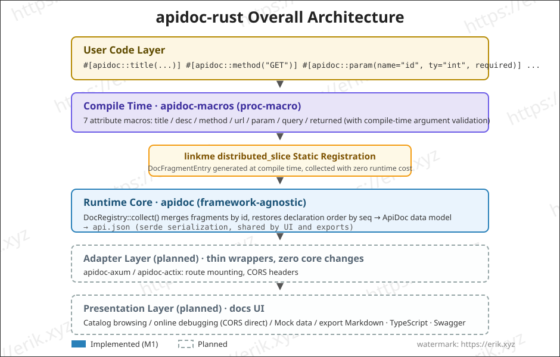
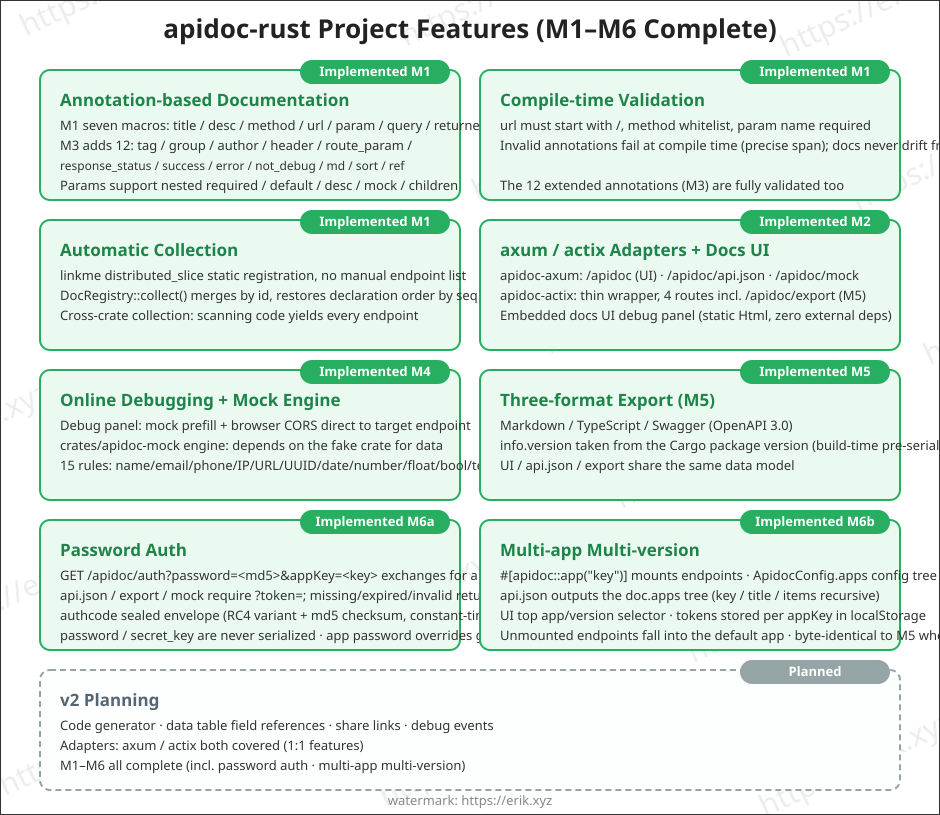
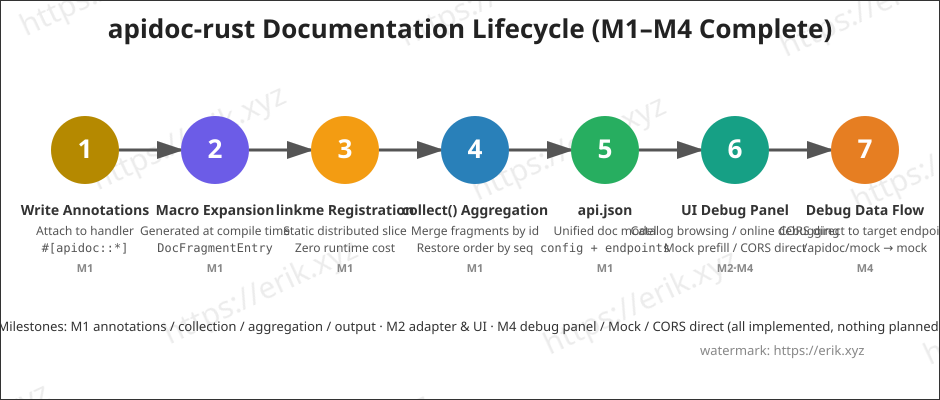

# Apidoc (apidoc-rust)

Rust proc-macro powered API documentation generation and interface development toolkit, compatible with axum, actix-web and other mainstream frameworks

[](https://github.com/erikwang2013/apidoc-rust)
[](https://github.com/erikwang2013/apidoc-rust)

[中文](../../README.md) ·
**[English](README-en.md)** ·
[한국어](README-ko.md) ·
[Русский](README-ru.md) ·
[Deutsch](README-de.md) ·
[Français](README-fr.md) ·
[Español](README-es.md) ·
[Português](README-pt.md) ·
[हिन्दी](README-hi.md) ·
[العربية](README-ar.md) ·
[বাংলা](README-bn.md) ·
[Bahasa Indonesia](README-id.md) ·
[日本語](README-ja.md)

## 📖Introduction

Apidoc is a Rust plugin library that parses **Rust procedural macros (proc-macro)** to automatically generate API documentation, and is compatible with mainstream frameworks such as axum and actix-web. Beyond automatic documentation generation, it also integrates online endpoint debugging, mock debugging data, Json/TypeScript code generation, an interface generator, a code generator and more, covering the entire workflow of API development, debugging and delivery, all aimed at making API development more efficient.

> **Project origin**: this project is inspired by [apidoc-php](https://github.com/erikwang2013/apidoc-php) (a composer extension that generates API documentation from PHP 8 attributes), bringing "annotations as documentation" to the Rust ecosystem the native way; it is continuously maintained and extended by erikwang2013.

apidoc-rust's implementation approach:

- **Generated at compile time**: documentation is produced by procedural macros during compilation, so the docs can never drift out of sync with the code;
- **Zero-cost collection**: static registration via linkme, a single pass at runtime aggregates all endpoint documentation;
- **Generic plugin core**: the core is HTTP-framework-agnostic and plugs into any framework through thin adapters (axum / actix-web).

### ✨Project Description

- **Out of the box**: no complicated configuration needed — install it, write annotations as documented, and the API documentation is generated automatically.
- **Effortless authoring**: common definitions (`definitions`) and field `ref` references are supported; a few annotations are enough to complete a full field definition.
- **Online debugging**: debug endpoints directly inside the docs page, with global parameters carried in, mock data and debug events.
- **Multi-app / multi-version**: single-app, multi-app and multi-version projects are all supported, with endpoints grouped by app/version for display and switching.
- **Groups / Tags**: endpoints support multi-level groups and Tag markers.
- **Markdown docs**: the `md` annotation mounts Markdown as a documentation page.
- **Json / TypeScript generation**: every endpoint automatically generates Json request/response examples and TypeScript type definitions, ready for direct use in the frontend.
- **Code generator**: configuration + templates generate business code and frontend Api files.
- **Endpoint sharing**: generate share links for a chosen app/endpoint and export `swagger.json`.
- **Secure access**: global password and per-app/version independent password authorization, with optional documentation caching.

## Features

### Implemented (M1-M3)

- **Annotation-based documentation**: seven attribute macros — `title` / `desc` / `method` / `url` / `param` / `query` / `returned` — annotated one by one (mirroring the PHP attributes style); parameters support nested `required` / `default` / `desc` / `mock` / `children`
- **Compile-time validation**: url must start with `/`, method whitelist, param name is required, etc.; invalid annotations fail at compile time with precise spans
- **Automatic collection**: static registration via linkme `distributed_slice`, no manual endpoint manifest needed; `DocRegistry::collect()` merges fragments by id and restores declaration order by seq, collecting automatically across crates
- **api.json output**: serde serializes the unified document data model (config + endpoints), with fields aligned to PHP semantics
- **axum adapter + embedded docs UI**: mount the routes to get a documentation page with grouped catalog browsing (M2)
- **Extended annotations**: 12 new annotations — `tag` / `group` / `author` / `header` / `route_param` / `response_status` / `success` / `error` / `not_debug` / `md` / `sort` / `ref` (M3)

### Implemented (M4)

- **Online debugging**: the docs page embeds an "Online Debugging" panel — Base URL prefilled with `location.origin` for cross-origin direct connection to the target service, parameter form prefilled from mock rules, `{name}` / `:name` route placeholder replacement, GET/HEAD params merged into the query string, other methods assembled as a JSON body, request header editing + custom headers, response display (status / elapsed time / pretty JSON), yellow hint on CORS failure
- **Mock engine** (`crates/apidoc/src/mock.rs`, depends on the fake crate, 15 rules: name / company / email / phone / url / ip / city / country / text / number / int / float / bool / uuid / date). Rule priority: `mock="fake:xxx"` resolves via the fake rule table (unknown names fall back to defaults) → other non-empty mock values pass through as-is (e.g. `mock="1"`, `mock="erik"`) → no mock: auto-generated from `ty` (int→`"1"`, float→`"0.5"`, bool→`"true"`, object→`"{}"`, string→`"string"`); children are nested recursively, arrays are fixed at 2 items
- **Mock endpoint**: the axum adapter adds `GET /apidoc/mock?url=&method=` — exact match on url + method, 404 when unmatched; the debug panel hides `not_debug` endpoints by default, they only appear after checking "Show not_debug endpoints"
- **CORS direct connection**: online debugging connects from the browser directly to the target endpoint, allowed by the adapter's `cors_layer` (server-side reverse proxy deferred to v2)

### Implemented (M5)

- **Three-format export** (`crates/apidoc/src/export/`): markdown / typescript / swagger (OpenAPI 3.0.0); the core crate provides `export::markdown::render` / `export::typescript::render` / `export::swagger::render`
- **Export route**: the adapter adds `GET /apidoc/export?format=md|ts|swagger` — unknown formats return 400; Content-Type is `text/markdown` / `application/typescript` / `application/json` respectively
- **markdown**: grouped catalog + parameter tables + response blocks; **typescript**: generates `{Name}Params` / `{Name}Result` types in per-group namespaces, ungrouped endpoints fall into `defaultGroup` (`default` is a TS reserved word); **swagger**: `info.version` is read from the Cargo package version
- **actix-web adapter** (`crates/apidoc/src/actix.rs`): 1:1 feature parity with the axum adapter — `apidoc_routes(ApidocConfig) -> Scope` mounts /apidoc, /apidoc/api.json, /apidoc/mock, /apidoc/export, and `cors_layer(CorsConfig)` allows cross-origin
- **Shared UI**: the docs UI (`src/ui.html`) was moved up into the core crate and exported as `pub const UI_HTML`; both adapters reference the same copy (safe for published packages)

### Implemented (M6)

- **Password authentication (M6a)**: with `AuthConfig { enable, password, secret_key, expire }` enabled, the client exchanges `GET /apidoc/auth?password=<md5(password)>&appKey=<key>` for a token; the data routes `/apidoc/api.json`, `/apidoc/export`, `/apidoc/mock` require `?token=xxx`, and a missing/expired/wrong token returns 401 while the docs UI shows a password overlay; the token is issued with the authcode encryption suite (line-by-line port of Discuz authcode: RC4 variant + md5 checksum + padding-free base64), payload `{key: md5(md5(raw password)), expire: now+expire}`, constant-time MAC comparison
- **Auth security red lines**: `password` / `secret_key` are never serialized — the api.json output is byte-identical to when auth is disabled; with auth disabled, `/apidoc/auth` returns 404 and data routes pass through directly; when an app config has its own password, the app password takes precedence over the global one; `secret_key` defaults to `"apidoc#hgcode"` (stderr warning once when enabled but unconfigured), `expire` defaults to 86400 seconds
- **Multi-app multi-version (M6b)**: `ApidocConfig.apps: Vec<AppConfig>` (`key` / `title` / recursive sub-versions in `items` / `password`) configures an app tree; `#[apidoc::app("key")]` attaches endpoints to a specific app key, endpoints without a key land in the default app; the api.json output gains the `doc.apps` tree, an app/version selector appears at the top of the UI, and tokens are stored in localStorage separately per appKey (different apps can have independent passwords)

### Implemented (v2)

- **Data-table field references (`table`)**: `#[apidoc::table("user")]` **flattens** the fields of the table configured under that key in `ApidocConfig.tables` into `returned` (same semantics as `ref`; the only difference is that the data source is a configuration table rather than another endpoint); fields support `required` / `default` / `desc` / `mock`; an unconfigured key only produces a stderr warning; the output is byte-identical to v1 when the annotation is unused
- **Documentation caching**: `ApidocConfig.cache = Some(CacheConfig { enable, ttl })` — the `/apidoc/mock` output is memoized in-process by `(url, method)` and rebuilt after `ttl` seconds, with `ttl = 0` meaning permanent; when unconfigured or disabled the cache path is bypassed entirely (zero output change). api.json / export are already built once when the routes are mounted, which is equivalent to permanent caching
- **Share links**: `GET /apidoc/share?app=&url=&method=&base=` → `{"url":"…"}` deep link (`?app=<key>&ep=<endpoint url>&method=<method>[&token=…]`); every endpoint in the docs page has a "Share" button (writes to the clipboard, falling back to a copyable input field when that fails), and opening the deep link jumps straight to that app/endpoint; with auth enabled the link carries a server-issued token (an app's independent password takes precedence over the global one), so it opens without a password
- **Code generator**: `GET /apidoc/generate?template=<name>` → the rendered text (404 for an unknown template); built-in templates `api.ts` (frontend Api file), `handler.rs` (Rust endpoint skeleton) and `schema.sql` (generates CREATE TABLE statements from `tables`); a template with the same name in `ApidocConfig.codegen` overrides the built-in one. The template syntax has only two forms: `{{variable}}` (kept as-is when undefined) and `{{#each list}}…{{/each}}` (nestable, e.g. `tables` × `fields`)
- **Debug events**: the online debugging panel gains collapsible "Pre-script / Post-script" editors (persisted to localStorage) — the pre-script runs before the request via `new Function('ctx', code)` and can modify `ctx.url/method/headers/body` or return an object for a shallow merge; the post-script runs after the response and can read `status/ms/text/url/method/ep`, returning a string to replace the displayed response text; script errors are only reported in the result area and never abort the request

## Architecture



## Features



## Lifecycle



## Project Structure

```
apidoc-rust/
├── Cargo.toml                 # workspace config (resolver 2)
├── VERSION                    # project version (v1.6.2)
├── crates/
│   ├── apidoc/                # runtime core (framework-agnostic)
│   │   ├── src/lib.rs         # data model + DocRegistry aggregation + api.json + UI_HTML
│   │   ├── src/auth.rs        # M6a password authentication (authcode token issuance/verification + route guard)
│   │   ├── src/export/        # M5 exports: markdown / typescript / swagger
│   │   ├── src/ui.html        # shared docs UI (exported by the core crate, referenced by both adapters)
│   │   ├── tests/             # integration tests (macro expansion/aggregation/serialization/cross-crate)
│   │   └── examples/demo.rs   # example: annotations + api.json output
│   ├── apidoc-macros/         # proc-macro: 20 attribute macros
│   │   └── src/lib.rs         # macro definitions + argument parsing + compile-time validation

│   ├── apidoc-test-fixtures/  # cross-crate registration test fixtures

├── .github/
│   └── workflows/release.yml  # release workflow (reads VERSION, incrementally creates tag+release)
└── docs/
    ├── images/                # architecture/features/lifecycle diagrams (SVG)
    └── i18n/                  # multilingual documentation (12 languages)
```

## Usage

### 1. Add the dependency

```toml
[dependencies]
apidoc-rust = "1.6"        # or path = "crates/apidoc"

serde_json = "1"      # for api.json output
```

> Pick the adapter by web framework: `features = ["axum"]` for axum, `features = ["actix"]` for actix-web (both with 1:1 feature parity). `mock` (Mock engine) is an internal framework dependency, pulled in automatically by the adapter; consumers generally don't need to use it directly.

### 2. Write annotations

Attach annotations to handler functions one by one, and the documentation is generated at compile time:

```rust
use apidoc::*;

#[apidoc::title("获取用户信息")]
#[apidoc::desc("根据用户 ID 查询用户详情")]
#[apidoc::url("/api/user/info")]
#[apidoc::method("GET")]
#[apidoc::param(name = "user_id", ty = "int", required, desc = "用户ID", mock = "1")]
#[apidoc::query(name = "lang", ty = "string", desc = "语言", default = "zh-CN")]
#[apidoc::returned(
    name = "data",
    ty = "object",
    desc = "用户数据",
    children = [
        { name = "id", ty = "int", required, desc = "用户ID" },
        { name = "name", ty = "string", required, desc = "用户名", mock = "erik" },
    ]
)]
fn get_user_info() -> String {
    unimplemented!()
}
```

### 3. Collect and output

```rust
fn main() {
    let doc = DocRegistry::collect_doc(ApidocConfig {
        title: "我的 API".to_string(),
        description: None,
        auth: None,    // M6a password authentication, see "8. Password Authentication"
        apps: vec![],  // M6b multi-app multi-version, see "9. Multi-App & Multi-Version"
    });
    println!("{}", serde_json::to_string_pretty(&doc).unwrap());
}
```

### 4. Run the example

```bash
cargo run --example demo -p apidoc
```

Output (excerpt):

```json
{
  "config": { "title": "demo api" },
  "endpoints": [
    {
      "title": "获取用户信息",
      "desc": "根据用户 ID 查询用户详情",
      "url": "/api/user/info",
      "method": "GET",
      "params": [
        { "name": "user_id", "type": "int", "required": true, "desc": "用户ID", "mock": "1" }
      ],
      "querys": [
        { "name": "lang", "type": "string", "required": false, "default": "zh-CN", "desc": "语言" }
      ],
      "returned": [
        {
          "name": "data",
          "type": "object",
          "required": false,
          "desc": "用户数据",
          "children": [
            { "name": "id", "type": "int", "required": true, "desc": "用户ID" },
            { "name": "name", "type": "string", "required": true, "desc": "用户名", "mock": "erik" }
          ]
        }
      ]
    }
  ]
}
```

### 5. Online Debugging & Mock (M4)

Open the docs page → select an endpoint → the "Online Debugging" panel on the right prefills parameters from the mock rules → point the Base URL at the target service (default `location.origin`, cross-origin direct connection) → click Send to get the real response (status code / elapsed time / pretty JSON). The debug panel hides `not_debug` endpoints by default; they only appear after checking "Show not_debug endpoints".

**CORS requirement**: online debugging connects from the browser directly to the target endpoint, so the target service must mount the adapter-provided `cors_layer` to allow cross-origin requests; the panel shows a yellow hint when CORS fails.

Mock rule syntax (three priority levels):

```rust
#[apidoc::param(name = "email", ty = "string", desc = "邮箱", mock = "fake:email")]  // fake rule generation
#[apidoc::param(name = "status", ty = "string", desc = "状态", mock = "1")]          // non-empty mock passes through as-is
#[apidoc::param(name = "name", ty = "string", desc = "用户名")]                       // no mock: auto-generated from ty
#[apidoc::returned(
    name = "data",
    ty = "object",
    children = [
        { name = "id", ty = "int", required },       // no mock → "1"
        { name = "email", ty = "string", mock = "fake:email" },  // children nested recursively
    ]
)]
fn create_user() -> String {
    unimplemented!()
}
```

The 15 built-in fake rules: `name` / `company` / `email` / `phone` / `url` / `ip` / `city` / `country` / `text` / `number` / `int` / `float` / `bool` / `uuid` / `date`; unknown rule names fall back to default values. Auto-generation rules without mock: int→`"1"`, float→`"0.5"`, bool→`"true"`, object→`"{}"`, string→`"string"`; arrays are fixed at 2 items.

### 6. Online Export (M5)

The adapter ships three built-in export endpoints, usable immediately after mounting (unknown `format` returns 400):

```bash
GET /apidoc/export?format=md        # grouped catalog + parameter tables + response blocks (text/markdown)
GET /apidoc/export?format=ts        # generates {Name}Params / {Name}Result types in per-group namespaces (application/typescript)
GET /apidoc/export?format=swagger   # OpenAPI 3.0.0 description file (application/json)
```

- **markdown**: great for pasting into a project Wiki / release notes; outputs a catalog by group, each endpoint with parameter tables and response blocks;
- **typescript**: the frontend can paste it directly as type definitions; ungrouped endpoints fall into the `defaultGroup` namespace (`default` is a TS reserved word and cannot be an identifier);
- **swagger**: `info.version` is read from the Cargo package version (currently 1.6.2), importable directly into Swagger UI or code generators.

### 7. actix-web adapter

When using actix-web, add `features = ["actix"]` (1:1 feature parity with the axum adapter):

```toml
[dependencies]
apidoc-rust = { version = "1.6", features = ["actix"] }
```

```rust
use actix_web::{App, HttpServer};
use apidoc::actix::{apidoc_routes, cors_layer, CorsConfig};
use apidoc::ApidocConfig;

#[actix_web::main]
async fn main() -> std::io::Result<()> {
    HttpServer::new(|| {
        App::new()
            .service(apidoc_routes(ApidocConfig {
                title: "我的 API".to_string(),
                description: None,
                auth: None,    // M6a password authentication, see "8. Password Authentication"
                apps: vec![],  // M6b multi-app multi-version, see "9. Multi-App & Multi-Version"
            }))
            .wrap(cors_layer(CorsConfig::default()))   // M4 online debugging cross-origin allowance
    })
    .bind("127.0.0.1:8080")?
    .run()
    .await
}
```

After mounting, `/apidoc` (docs UI), `/apidoc/api.json` (data), `/apidoc/mock` (Mock), and `/apidoc/export` (export) are all accessible. An empty CORS config allows the literal `*` (without credentials); with an `allow_origins` whitelist configured, the Origin is reflected with exact matching — neither mode enables credentials.

### 8. Password Authentication (M6a)

With `auth` enabled, the documentation requires a password to access (aligned with the upstream apidoc-php Auth.php; the token is a line-by-line port of the Discuz authcode encryption suite):

```rust
use apidoc::auth::AuthConfig;

let doc = DocRegistry::collect_doc(ApidocConfig {
    title: "我的 API".to_string(),
    description: None,
    auth: Some(AuthConfig {
        enable: true,
        password: "your-password".to_string(),
        secret_key: "your-secret-key".to_string(), // defaults to "apidoc#hgcode" (stderr warning once when enabled but unconfigured)
        expire: 86400,                             // seconds; defaults to 86400
    }),
    apps: vec![],
});
```

**Flow**:

1. The client calls `GET /apidoc/auth?password=<md5(password)>&appKey=<key>` to exchange for a token (returns `{"token":"..."}` on success, 401 on wrong password); with auth disabled this route returns 404 and data routes pass through directly
2. The data routes `GET /apidoc/api.json`, `/apidoc/export`, `/apidoc/mock` require `?token=xxx` (also `&appKey=` when a specific app is selected); a missing/expired/wrong token returns 401, the docs UI automatically pops up the password overlay, and after entering the password the frontend hashes it with md5 locally and exchanges it for a token
3. The token payload is `{key: md5(md5(raw password)), expire: now+expire}`, encrypted with `secret_key` via authcode (RC4 variant + md5 checksum + padding-free base64, constant-time MAC comparison against timing side channels)
4. `password` / `secret_key` are never serialized — the api.json output is byte-identical to when auth is disabled; when an app config has its own `password`, the app password takes precedence over the global one

### 9. Multi-App & Multi-Version (M6b)

A project can be split into multiple apps/versions, each displayed and access-controlled independently:

```rust
#[apidoc::title("获取用户信息")]
#[apidoc::app("demo")]   // attach to the app with key="demo"; endpoints without an app annotation land in the default app
fn get_user_info() -> String {
    unimplemented!()
}
```

```rust
let doc = DocRegistry::collect_doc(ApidocConfig {
    title: "我的 API".to_string(),
    description: None,
    auth: None,
    apps: vec![
        AppConfig {
            key: "demo".to_string(),
            title: "演示应用".to_string(),
            items: vec![AppConfig {
                key: "v1".to_string(),
                title: "v1".to_string(),
                items: vec![],
                password: None,
            }],
            password: None, // independent app access password, takes precedence over the global one, never serialized
        },
    ],
});
```

- `AppConfig { key, title, items, password }`: `key` is the unique identifier referenced by the `#[apidoc::app("key")]` annotation, `items` recursively nests sub-versions/sub-apps, `password` is the app's independent access password (with an independent password, only the app token is validated)
- The api.json output gains the `doc.apps` tree (key / title / items / endpoints); an app/version selector appears at the top of the UI — switching renders the endpoints of that node and re-fetches the data, and tokens are stored in localStorage separately per appKey
- When the `app` annotation references a key not configured in `apps`, a stderr warning is issued and the endpoint lands in the default app; without `app` annotations or without `apps` configured, the output is byte-identical to M5

### 10. Data-Table Field References · Documentation Cache (v2)

```rust
ApidocConfig {
    // table structure is provided by configuration (the Rust side does not connect to a database); annotations reference it by key
    tables: vec![TableDef {
        key: "user".into(),
        title: "用户表".into(),
        fields: vec![
            TableField { name: "id".into(), ty: "int".into(), required: true, desc: Some("用户ID".into()), ..Default::default() },
            TableField { name: "name".into(), ty: "string".into(), mock: Some("erik".into()), ..Default::default() },
        ],
    }],
    // documentation cache: the /apidoc/mock output is memoized by (url, method) and rebuilt after ttl seconds (0 = permanent)
    cache: Some(CacheConfig { enable: true, ttl: 60 }),
    ..Default::default()   // title / description / auth / apps / codegen are configured as usual
}
```

In a handler it is written exactly like `ref`: `#[apidoc::table("user")]`. The fields are flattened into that endpoint's `returned`; a key missing from `tables` only warns, it does not error.

### 11. Share Links · Code Generation (v2)

- `GET /apidoc/share?app=api&url=/api/user/info&method=GET&base=https://example.com` → `{"url":"https://example.com/apidoc?app=api&ep=%2Fapi%2Fuser%2Finfo&method=GET"}` (with auth enabled, `&token=…` is appended to the link so it opens without a password)
- `GET /apidoc/generate?template=api.ts` (or `handler.rs` / `schema.sql`) → `text/plain; charset=utf-8`; unknown template 404, missing parameter 400
- Custom templates (a template with the same name overrides the built-in one):

```rust
ApidocConfig {
    codegen: vec![CodegenTemplate {
        name: "api.ts".into(),
        template: "// {{title}}\n{{#each endpoints}}// {{method}} {{url}}\n{{/each}}".into(),
    }],
    ..Default::default()
}
```

Available template variables: top-level `title` / `description`; inside `{{#each endpoints}}`: `title` / `url` / `method` / `group` / `desc` / `author`; inside `{{#each tables}}`: `key` / `title`, and inside its `{{#each fields}}`: `name` / `ty` / `required` / `default` / `desc` / `mock`, plus the derived variables `not_null` / `default_clause` / `comma` (handy for generating valid SQL directly).

### 12. Debug Pre/Post Scripts (v2)

In the docs page, expand "Pre-script" / "Post-script" in the "Online Debugging" panel (contents stored in localStorage):

```js
// pre-script: runs before the request is sent; can modify ctx.url / method / headers / body, or return an object for a shallow merge
ctx.headers['X-Token'] = localStorage.getItem('token') || '';
```

```js
// post-script: runs after the response arrives; ctx = { status, ms, text, url, method, ep } (read-only)
// returning a string replaces the text shown in the result area
return 'HTTP ' + ctx.status + ' · ' + ctx.ms + 'ms\n' + ctx.text;
```

Script errors are only reported in the debug result area and never abort the request (a failing pre-script still sends the request, a failing post-script still shows the raw response).

## Roadmap

| Phase | Content | Status |
|-------|---------|--------|
| M1 | workspace skeleton + data model + macro MVP + linkme registration | ✅ Done |
| M2 | axum adapter + embedded docs UI + grouped catalog | ✅ Done |
| M3 | annotation completion (tag/group/author/header/route_param/response_status/success/error/not_debug/md/sort/ref) | ✅ Done |
| M4 | online debugging + Mock engine | ✅ Done |
| M5 | export markdown / typescript / swagger.json (OpenAPI3) | ✅ Done |
| —  | actix-web adapter (1:1 feature parity with axum) | ✅ Done |
| M6a | password authentication (authcode token + password overlay, app password takes precedence) | ✅ Done |
| M6b | multi-app multi-version (apps config tree + app annotation + UI selector) | ✅ Done |
| v2 | data-table field references + documentation caching + share links + code generator + debug events | ✅ Done |

## Multilingual Documentation

- [English](README-en.md)
- [한국어](README-ko.md)
- [Русский](README-ru.md)
- [Deutsch](README-de.md)
- [Français](README-fr.md)
- [Español](README-es.md)
- [Português](README-pt.md)
- [हिन्दी](README-hi.md)
- [العربية](README-ar.md)
- [বাংলা](README-bn.md)
- [Bahasa Indonesia](README-id.md)
- [日本語](README-ja.md)

## Support & Donations

If this project helps you, feel free to give us a ⭐ Star — donations to support open source are also welcome!

### 微信支付 (WeChat Pay) / 支付宝 (Alipay)

| 微信支付 (WeChat Pay) | 支付宝 (Alipay) |
|---|---|
|  |  |

### Global Bank Transfer Donation

**Recipient Information**

- Recipient name: WANG KEXUN
- Recipient account number: 881015918251

**Receiving Bank**

- ZA Bank SWIFT Code: AABLHKHHXXX
- Bank name: ZA Bank Limited
- Bank code: 387
- Bank address: Core F, Cyberport 3, 100 Cyberport Road, Hong Kong

**Correspondent Bank for Cross-Border Remittance (if required)**

> Please note that the following is the correspondent (intermediary) bank for cross-border remittance, not the receiving bank. Please check with your remitting bank whether correspondent bank information is required.

- **Citibank is the correspondent bank for HKD, CNY and USD remittances:**
  - Bank name: Citibank N.A. Hong Kong
  - SWIFT Code: CITIHKHXXXX
  - Bank code: 006
  - Branch name: Hong Kong Branch
  - Branch code: 391
  - Bank address: Citibank Tower, Citibank Plaza, 3 Garden Road, Central, Hong Kong
- **BNY Mellon is the correspondent bank for remittances in other currencies:**
  - Bank name: THE BANK OF NEW YORK MELLON
  - SWIFT Code: IRVTUS3NXXX
  - Bank address: THE BANK OF NEW YORK MELLON, 240 GREENWICH STREET, NEW YORK, United States

## License

[MIT](../../LICENSE)
