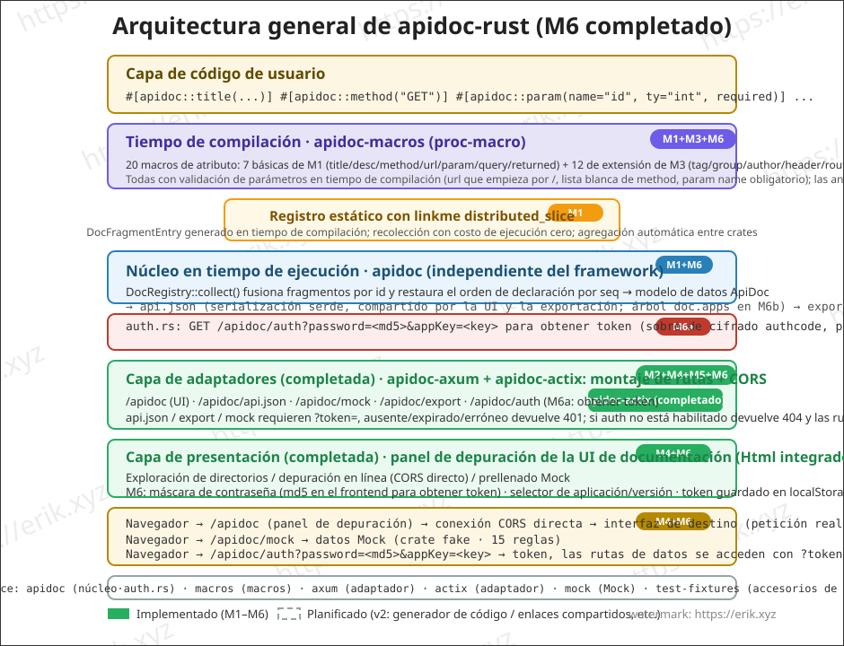
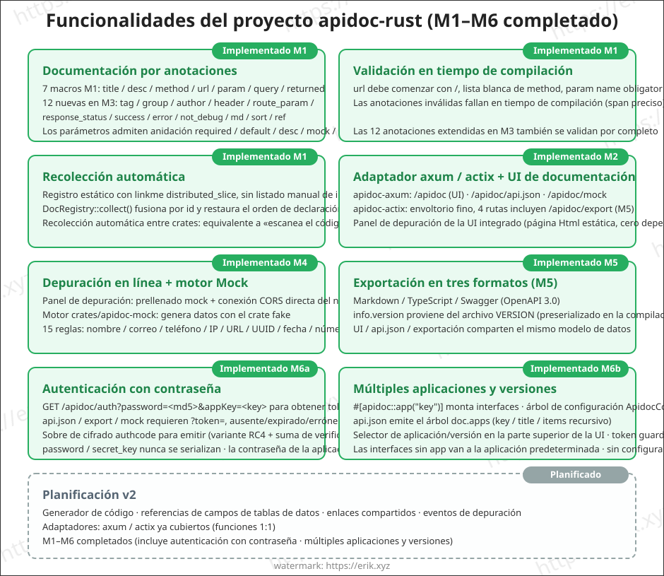
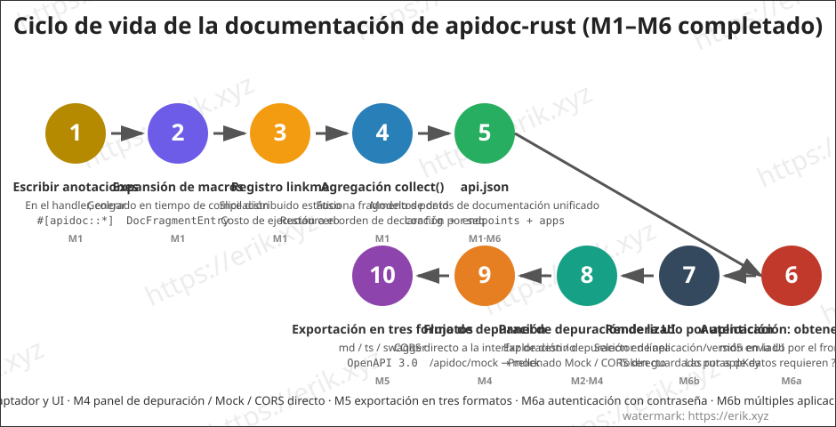

<h1 align="center">Apidoc (apidoc-rust)</h1>

<div align="center">
 Librería de plugins universal para generar documentación de interfaces de API mediante macros de procedimiento (proc-macro) de Rust
</div>

<div align="center">
<a href="https://github.com/erikwang2013/apidoc-rust"></a>
<a href="https://github.com/erikwang2013/apidoc-rust"></a>
</div>

<div align="center">
<a href="../../README.md"><strong>中文</strong></a> ·
<a href="README-en.md">English</a> ·
<a href="README-ko.md">한국어</a> ·
<a href="README-ru.md">Русский</a> ·
<a href="README-de.md">Deutsch</a> ·
<a href="README-fr.md">Français</a> ·
<strong>Español</strong> ·
<a href="README-pt.md">Português</a> ·
<a href="README-hi.md">हिन्दी</a> ·
<a href="README-ar.md">العربية</a> ·
<a href="README-bn.md">বাংলা</a> ·
<a href="README-id.md">Bahasa Indonesia</a> ·
<a href="README-ja.md">日本語</a>
</div>

## Introducción

apidoc-rust es un **generador de documentación de API universal y basado en plugins** implementado en Rust, inspirado en [apidoc-php](https://github.com/erikwang2013/apidoc-php) (una extensión de composer que genera documentación de API con atributos PHP 8). Lleva la capacidad de "las anotaciones como documentación" al estilo nativo de Rust:

- **Generación en tiempo de compilación**: la documentación se genera mediante macros de procedimiento en tiempo de compilación; la documentación nunca se desincroniza del código;
- **Recolección de costo cero**: registro estático con linkme; una sola agregación en tiempo de ejecución obtiene toda la documentación de las interfaces;
- **Plugins universales**: el núcleo es independiente del framework HTTP; se conecta a cualquier framework mediante adaptadores finos (axum / actix-web).

## Características

### Implementado (M1-M3)

- **Documentación por anotaciones**: siete macros de atributo — `title` / `desc` / `method` / `url` / `param` / `query` / `returned` —, una anotación por entrada (equivalente a la sintaxis de PHP attributes); los parámetros admiten anidación `required` / `default` / `desc` / `mock` / `children`
- **Validación en tiempo de compilación**: la url debe comenzar con `/`, lista blanca de method, param name obligatorio, etc.; las anotaciones inválidas fallan en tiempo de compilación (span preciso)
- **Recolección automática**: registro estático con linkme `distributed_slice`, sin listado manual de interfaces; `DocRegistry::collect()` fusiona por id y restaura el orden de declaración por seq, con recolección automática entre crates
- **Salida api.json**: serde serializa un modelo de datos de documentación unificado (config + endpoints); los campos se alinean con la semántica de PHP
- **Adaptador axum + UI de documentación integrada**: montar la ruta y ya está la página de documentación; navegación por directorios agrupados (M2)
- **Ampliación de anotaciones**: 12 anotaciones nuevas — `tag` / `group` / `author` / `header` / `route_param` / `response_status` / `success` / `error` / `not_debug` / `md` / `sort` / `ref` (M3)

### Implementado (M4)

- **Depuración en línea**: la página de documentación incluye el panel «Depuración en línea» — Base URL prellenada con `location.origin` para conexión directa entre dominios al servicio de destino, parámetros del formulario prellenados con mock, sustitución de marcadores de ruta `{name}` / `:name`, parámetros GET/HEAD incorporados a la query string, cuerpo JSON ensamblado para el resto de métodos, edición de cabeceras de petición + cabeceras personalizadas, visualización de la respuesta (estado / tiempo / JSON bonito), aviso amarillo si falla CORS
- **Motor Mock** (`crates/apidoc/src/mock.rs`, depende del crate fake, 15 reglas: name / company / email / phone / url / ip / city / country / text / number / int / float / bool / uuid / date). Prioridad de reglas: `mock="fake:xxx"` usa la tabla de reglas fake (nombre desconocido → valor por defecto) → el resto de mock no vacíos se devuelven tal cual (p. ej. `mock="1"`, `mock="erik"`) → sin mock, generación automática según `ty` (int→`"1"`, float→`"0.5"`, bool→`"true"`, object→`"{}"`, string→`"string"`); los children se anidan recursivamente, los array fijan 2 elementos
- **Interfaz mock**: el adaptador axum añade `GET /apidoc/mock?url=&method=`, coincidencia exacta de url + method, devuelve 404 si no coincide; el panel de depuración oculta por defecto los endpoints `not_debug`, que solo se muestran al marcar «Mostrar interfaces not_debug»
- **Conexión CORS directa**: la depuración en línea conecta el navegador directamente a la interfaz de destino; el `cors_layer` del adaptador permite el paso (proxy inverso del servidor reservado para v2)

### Implementado (M5)

- **Exportación en tres formatos** (`crates/apidoc/src/export/`): markdown / typescript / swagger (OpenAPI 3.0.0), el crate central proporciona `export::markdown::render` / `export::typescript::render` / `export::swagger::render`
- **Rutas de exportación**: los adaptadores añaden `GET /apidoc/export?format=md|ts|swagger`, formato desconocido → 400; Content-Type: `text/markdown` / `application/typescript` / `application/json`
- **markdown**: índice por grupos + tabla de parámetros + bloque de respuesta; **typescript**: genera los tipos `{Name}Params` / `{Name}Result` por namespace de grupo, las interfaces sin grupo caen en `defaultGroup` (`default` es palabra reservada de TS); **swagger**: `info.version` toma el contenido del archivo `VERSION` de la raíz
- **Adaptador actix-web** (`crates/apidoc/src/actix.rs`): funcionalidad 1:1 con el adaptador axum — `apidoc_routes(ApidocConfig) -> Scope` monta /apidoc, /apidoc/api.json, /apidoc/mock, /apidoc/export, `cors_layer(CorsConfig)` permite CORS
- **UI compartida**: la UI de documentación (`src/ui.html`) sube al crate central, exportada como `pub const UI_HTML`, ambos adaptadores referencian la misma copia (seguro para el empaquetado de publicación)

### Implementado (M6)

- **Autenticación con contraseña (M6a)**: con `AuthConfig { enable, password, secret_key, expire }` activado, el cliente usa `GET /apidoc/auth?password=<md5(contraseña)>&appKey=<key>` para obtener un token; las rutas de datos `/apidoc/api.json`, `/apidoc/export`, `/apidoc/mock` requieren `?token=xxx`; token ausente/expirado/incorrecto → 401 y la UI de documentación muestra una máscara de contraseña; el token se emite con el cifrado authcode (portado línea a línea del authcode de Discuz: variante RC4 + checksum md5 + base64 sin padding), con payload `{key: md5(md5(contraseña original)), expire: now+expire}` y comparación MAC en tiempo constante
- **Línea roja de seguridad de la autenticación**: `password` / `secret_key` nunca se serializan; la salida api.json es byte a byte idéntica a la de autenticación desactivada; con auth desactivado, `/apidoc/auth` devuelve 404 y las rutas de datos pasan directamente; si una aplicación configura su propio `password`, la contraseña de la aplicación prevalece sobre la global; `secret_key` por defecto `"apidoc#hgcode"` (advertencia stderr una vez si está activado sin configurar) y `expire` por defecto 86400 segundos
- **Múltiples aplicaciones y versiones (M6b)**: `ApidocConfig.apps: Vec<AppConfig>` (`key` / `title` / `items` subversiones recursivas / `password`) configura el árbol de aplicaciones; `#[apidoc::app("key")]` cuelga la interfaz en la aplicación de esa key y las interfaces sin key caen en la aplicación por defecto; la salida api.json añade el árbol `doc.apps`; aparece un selector de aplicación/versión en la parte superior de la UI y los tokens se guardan en localStorage separados por appKey (distintas aplicaciones pueden tener contraseñas independientes)

### Planificado (v2)

- v2: generador de código, referencias a campos de tablas de datos, enlaces para compartir, eventos de depuración

## Arquitectura



## Funcionalidades



## Ciclo de vida



## Estructura del proyecto

```
apidoc-rust/
├── Cargo.toml                 # configuración del workspace (resolver 2)
├── VERSION                    # versión del proyecto (v1.3.0, separada de la versión del framework 0.1.0)
├── crates/
│   ├── apidoc/                # núcleo en tiempo de ejecución (independiente del framework)
│   │   ├── src/lib.rs         # modelo de datos + agregación DocRegistry + api.json + UI_HTML
│   │   ├── src/auth.rs        # autenticación M6a (emisión/validación de token authcode + guardia de rutas)
│   │   ├── src/export/        # exportación M5: markdown / typescript / swagger
│   │   ├── src/ui.html        # UI de documentación compartida (exportada por el crate central, referenciada por ambos adaptadores)
│   │   ├── tests/             # pruebas de integración (expansión de macros / agregación / serialización / entre crates)
│   │   └── examples/demo.rs   # ejemplo: anotaciones + salida api.json
│   ├── apidoc-macros/         # proc-macro: 20 macros de atributo
│   │   └── src/lib.rs         # definición de macros + análisis de parámetros + validación en tiempo de compilación

│   ├── apidoc-test-fixtures/  # accesorios de prueba para registro entre crates


├── .github/
│   └── workflows/release.yml  # workflow de publicación (lee VERSION, crea tag + release de forma incremental)
└── docs/
    ├── images/                # diagramas de arquitectura / funcionalidades / ciclo de vida (SVG)
    └── i18n/                  # documentación multilingüe (12 idiomas)
```

## Instrucciones de uso

### 1. Agregar dependencias

```toml
[dependencies]
apidoc-rs = "0.1"        # o path = "crates/apidoc"


serde_json = "1"      # para generar api.json
```

> Adaptador según el framework Web: `features = ["axum"]` para axum, `features = ["actix"]` para actix-web (ambos con funcionalidad 1:1). `mock` (motor Mock) es dependencia interna del framework, la importa automáticamente el adaptador; el consumidor normalmente no necesita usarlo directamente.

### 2. Escribir anotaciones

Cuelga anotaciones en las funciones handler; la documentación se genera en tiempo de compilación:

```rust
use apidoc::*;

#[apidoc::title("获取用户信息")]
#[apidoc::desc("根据用户 ID 查询用户详情")]
#[apidoc::url("/api/user/info")]
#[apidoc::method("GET")]
#[apidoc::param(name = "user_id", ty = "int", required, desc = "用户ID", mock = "1")]
#[apidoc::query(name = "lang", ty = "string", desc = "语言", default = "zh-CN")]
#[apidoc::returned(
    name = "data",
    ty = "object",
    desc = "用户数据",
    children = [
        { name = "id", ty = "int", required, desc = "用户ID" },
        { name = "name", ty = "string", required, desc = "用户名", mock = "erik" },
    ]
)]
fn get_user_info() -> String {
    unimplemented!()
}
```

### 3. Recolección y salida

```rust
fn main() {
    let doc = DocRegistry::collect_doc(ApidocConfig {
        title: "我的 API".to_string(),
        description: None,
        auth: None,    // autenticación M6a, ver «8. Autenticación con contraseña»
        apps: vec![],  // M6b multi-aplicaciones y versiones, ver «9. Multi-aplicaciones y versiones»
    });
    println!("{}", serde_json::to_string_pretty(&doc).unwrap());
}
```

### 4. Ejecutar el ejemplo

```bash
cargo run --example demo -p apidoc
```

Salida (extracto):

```json
{
  "config": { "title": "demo api" },
  "endpoints": [
    {
      "title": "获取用户信息",
      "desc": "根据用户 ID 查询用户详情",
      "url": "/api/user/info",
      "method": "GET",
      "params": [
        { "name": "user_id", "type": "int", "required": true, "desc": "用户ID", "mock": "1" }
      ],
      "querys": [
        { "name": "lang", "type": "string", "required": false, "default": "zh-CN", "desc": "语言" }
      ],
      "returned": [
        {
          "name": "data",
          "type": "object",
          "required": false,
          "desc": "用户数据",
          "children": [
            { "name": "id", "type": "int", "required": true, "desc": "用户ID" },
            { "name": "name", "type": "string", "required": true, "desc": "用户名", "mock": "erik" }
          ]
        }
      ]
    }
  ]
}
```

### 5. Depuración en línea y Mock (M4)

Abra la página de documentación → seleccione una interfaz → el panel «Depuración en línea» de la derecha prellena los parámetros según las reglas Mock → apunte la Base URL a la dirección del servicio de destino (por defecto `location.origin`, conexión directa entre dominios) → haga clic en Enviar y obtendrá la respuesta real (código de estado / tiempo / JSON bonito). El panel de depuración oculta por defecto los endpoints `not_debug`, que solo se muestran tras marcar «Mostrar interfaces not_debug».

**Requisito CORS**: la depuración en línea conecta el navegador directamente a la interfaz de destino; el servicio de destino debe montar el `cors_layer` proporcionado por el adaptador para permitir peticiones entre dominios; si CORS falla, el panel muestra un aviso amarillo.

Sintaxis de las reglas Mock (tres prioridades):

```rust
#[apidoc::param(name = "email", ty = "string", desc = "邮箱", mock = "fake:email")]  // generado por la regla fake
#[apidoc::param(name = "status", ty = "string", desc = "状态", mock = "1")]          // mock no vacío devuelto tal cual
#[apidoc::param(name = "name", ty = "string", desc = "用户名")]                       // sin mock: generación automática según ty
#[apidoc::returned(
    name = "data",
    ty = "object",
    children = [
        { name = "id", ty = "int", required },       // sin mock → "1"
        { name = "email", ty = "string", mock = "fake:email" },  // anidación recursiva de children
    ]
)]
fn create_user() -> String {
    unimplemented!()
}
```

15 reglas fake integradas: `name` / `company` / `email` / `phone` / `url` / `ip` / `city` / `country` / `text` / `number` / `int` / `float` / `bool` / `uuid` / `date`; los nombres de regla desconocidos vuelven al valor por defecto. Generación automática sin mock: int→`"1"`, float→`"0.5"`, bool→`"true"`, object→`"{}"`, string→`"string"`; los array fijan 2 elementos.

### 6. Exportación en línea (M5)

Los adaptadores integran rutas de exportación en tres formatos, listas al conectar (formato desconocido → 400):

```bash
GET /apidoc/export?format=md        # índice por grupos + tabla de parámetros + bloques de respuesta (text/markdown)
GET /apidoc/export?format=ts        # genera los tipos {Name}Params / {Name}Result por namespace de grupo (application/typescript)
GET /apidoc/export?format=swagger   # archivo descriptivo OpenAPI 3.0.0 (application/json)
```

- **markdown**: ideal para pegar en el Wiki del proyecto / notas de versión, índice por grupos, cada interfaz con tabla de parámetros y bloque de respuesta;
- **typescript**: el front puede pegar directamente las definiciones de tipos; las interfaces sin grupo caen en el namespace `defaultGroup` (`default` es palabra reservada de TS, no puede usarse como identificador);
- **swagger**: `info.version` toma el contenido del archivo `VERSION` de la raíz (actualmente 1.3.0), importable directamente en Swagger UI o en un generador de código.

### 7. Adaptador actix-web

Si el framework Web es actix-web, conecte `features = ["actix"]` (funcionalidad 1:1 con el adaptador axum):

```toml
[dependencies]
apidoc-rs = { version = "0.1", features = ["actix"] }
```

```rust
use actix_web::{App, HttpServer};
use apidoc::actix::{apidoc_routes, cors_layer, CorsConfig};
use apidoc::ApidocConfig;

#[actix_web::main]
async fn main() -> std::io::Result<()> {
    HttpServer::new(|| {
        App::new()
            .service(apidoc_routes(ApidocConfig {
                title: "我的 API".to_string(),
                description: None,
                auth: None,    // autenticación M6a, ver «8. Autenticación con contraseña»
                apps: vec![],  // M6b multi-aplicaciones y versiones, ver «9. Multi-aplicaciones y versiones»
            }))
            .wrap(cors_layer(CorsConfig::default()))   // permite CORS para la depuración en línea (M4)
    })
    .bind("127.0.0.1:8080")?
    .run()
    .await
}
```

Una vez montados, son accesibles `/apidoc` (UI de documentación), `/apidoc/api.json` (datos), `/apidoc/mock` (Mock) y `/apidoc/export` (exportación). La configuración CORS vacía permite literalmente `*` (sin cookies); con lista blanca `allow_origins`, hace coincidencia exacta reflejando el Origin; ningún modo envía cookies.

### 8. Autenticación con contraseña (M6a)

Al activar `auth`, la documentación exige contraseña para acceder (alineado con Auth.php de apidoc-php; el token es un portado línea a línea del cifrado authcode de Discuz):

```rust
use apidoc::auth::AuthConfig;

let doc = DocRegistry::collect_doc(ApidocConfig {
    title: "我的 API".to_string(),
    description: None,
    auth: Some(AuthConfig {
        enable: true,
        password: "your-password".to_string(),
        secret_key: "your-secret-key".to_string(), // por defecto "apidoc#hgcode" (advertencia stderr única si activado sin configurar)
        expire: 86400,                             // segundos; por defecto 86400
    }),
    apps: vec![],
});
```

**Flujo**:

1. El cliente llama `GET /apidoc/auth?password=<md5(contraseña)>&appKey=<key>` para obtener el token (éxito → `{"token":"..."}`, contraseña incorrecta → 401); si auth no está activado, esta ruta devuelve 404 y las rutas de datos pasan directamente
2. Las rutas de datos `GET /apidoc/api.json`, `/apidoc/export`, `/apidoc/mock` requieren `?token=xxx` (y `&appKey=` a la vez si se ha elegido una aplicación concreta); token ausente/vencido/incorrecto → 401 y la UI de documentación muestra automáticamente la máscara de contraseña; al introducir la contraseña, el front calcula el md5 localmente y lo envía para obtener el token
3. El payload del token es `{key: md5(md5(contraseña original)), expire: now+expire}`, cifrado por `secret_key` mediante authcode (variante RC4 + checksum md5 + base64 sin padding, comparación MAC en tiempo constante contra canales laterales de tiempo)
4. `password` / `secret_key` nunca se serializan; la salida api.json es byte a byte idéntica a la de autenticación desactivada; si una aplicación configura su propio `password`, la contraseña de la aplicación prevalece sobre la global

### 9. Múltiples aplicaciones y versiones (M6b)

Un proyecto puede dividirse en varias aplicaciones/versiones, cada una con su propia visualización y control de acceso:

```rust
#[apidoc::title("获取用户信息")]
#[apidoc::app("demo")]   // cuelga en la aplicación con key="demo"; las interfaces sin app caen en la aplicación por defecto
fn get_user_info() -> String {
    unimplemented!()
}
```

```rust
let doc = DocRegistry::collect_doc(ApidocConfig {
    title: "我的 API".to_string(),
    description: None,
    auth: None,
    apps: vec![
        AppConfig {
            key: "demo".to_string(),
            title: "演示应用".to_string(),
            items: vec![AppConfig {
                key: "v1".to_string(),
                title: "v1".to_string(),
                items: vec![],
                password: None,
            }],
            password: None, // contraseña de acceso independiente de la aplicación, prevalece sobre la global, nunca se serializa
        },
    ],
});
```

- `AppConfig { key, title, items, password }`: `key` es el identificador único referenciado por la anotación `#[apidoc::app("key")]`; `items` anida recursivamente subversiones/sub-aplicaciones; `password` es la contraseña de acceso independiente de la aplicación (con contraseña independiente solo se valida el token de la aplicación)
- La salida api.json añade el árbol `doc.apps` (key / title / items / endpoints); aparece un selector de aplicación/versión en la parte superior de la UI; al cambiar, las interfaces se renderizan según ese nodo y se recargan los datos; los tokens se guardan en localStorage separados por appKey
- Si la anotación `app` referencia una key no configurada en `apps`, aviso en stderr y cae en la aplicación por defecto; sin anotación `app` ni `apps` configurado, la salida es byte a byte idéntica a M5

## Plan de desarrollo

| Fase | Contenido | Estado |
|------|-----------|--------|
| M1 | esqueleto del workspace + modelo de datos + MVP de macros + registro linkme | ✅ Completado |
| M2 | adaptador axum + UI de documentación integrada + directorio por grupos | ✅ Completado |
| M3 | completar anotaciones (tag/group/author/header/route_param/response_status/success/error/not_debug/md/sort/ref) | ✅ Completado |
| M4 | depuración en línea + motor Mock | ✅ Completado |
| M5 | exportar markdown / typescript / swagger.json (OpenAPI3) | ✅ Completado |
| —  | adaptador actix-web (funcionalidad 1:1 con axum) | ✅ Completado |
| M6a | Autenticación con contraseña (token authcode + máscara de contraseña, contraseña de la aplicación prevalece) | ✅ Completado |
| M6b | Múltiples aplicaciones y versiones (árbol de configuración apps + anotación app + selector de UI) | ✅ Completado |

## Documentación multilingüe

- [English](README-en.md)
- [한국어](README-ko.md)
- [Русский](README-ru.md)
- [Deutsch](README-de.md)
- [Français](README-fr.md)
- [Español](README-es.md)
- [Português](README-pt.md)
- [हिन्दी](README-hi.md)
- [العربية](README-ar.md)
- [বাংলা](README-bn.md)
- [Bahasa Indonesia](README-id.md)
- [日本語](README-ja.md)

## Apoyo y donaciones

Si este proyecto le resulta útil, ¡dé una ⭐ Star para apoyarnos! También puede hacer una donación para apoyar el código abierto.

### 微信支付 (WeChat Pay) / 支付宝 (Alipay)

<table>
  <tr>
    <td align="center">
      <br/>
      <strong>微信支付</strong>
    </td>
    <td align="center">
      <br/>
      <strong>支付宝</strong>
    </td>
  </tr>
</table>

### Donaciones por transferencia internacional

**【Información del beneficiario】**

- Nombre del beneficiario: WANG KEXUN
- Número de cuenta del beneficiario: 881015918251

**【Banco del beneficiario】**

- ZA Bank SWIFT Code：AABLHKHHXXX
- Nombre del banco: ZA Bank Limited
- Código bancario: 387
- Dirección del banco: Core F, Cyberport 3, 100 Cyberport Road, Hong Kong

**【Banco intermediario para transferencias transfronterizas (si es necesario)】**

> Tenga en cuenta que esta es la información del banco intermediario (banco corresponsal) para transferencias transfronterizas, no la del banco del beneficiario. Consulte con su banco si es necesario proporcionar la información del banco intermediario.

- **El banco intermediario para transferencias en dólares de Hong Kong (HKD), yuanes (CNY) y dólares estadounidenses (USD) es Citibank:**
  - Nombre del banco: Citibank N.A. Hong Kong
  - SWIFT Code：CITIHKHXXXX
  - Código bancario: 006
  - Nombre de la sucursal: Hong Kong Branch
  - Código de sucursal: 391
  - Dirección del banco: Citibank Tower, Citibank Plaza, 3 Garden Road, Central, Hong Kong
- **El banco intermediario para otras divisas es BNY Mellon:**
  - Nombre del banco: THE BANK OF NEW YORK MELLON
  - SWIFT Code：IRVTUS3NXXX
  - Dirección del banco: THE BANK OF NEW YORK MELLON, 240 GREENWICH STREET, NEW YORK, United States

## License

[MIT](../../LICENSE)
