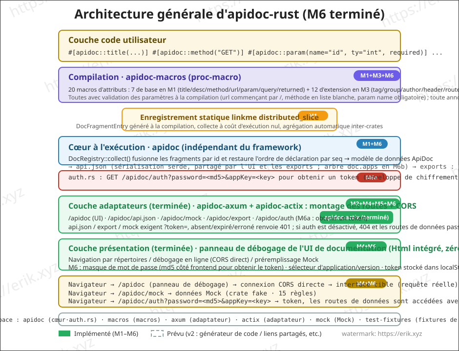
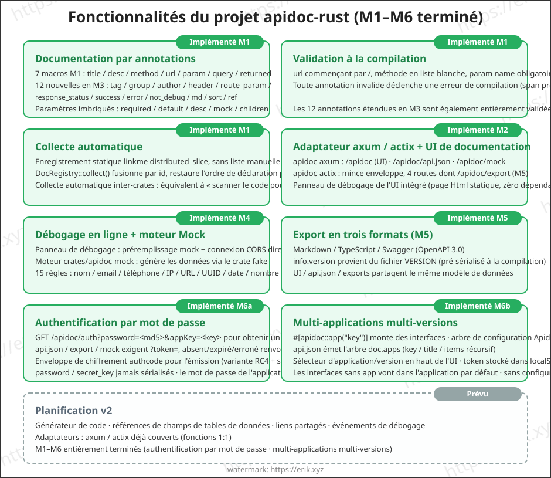
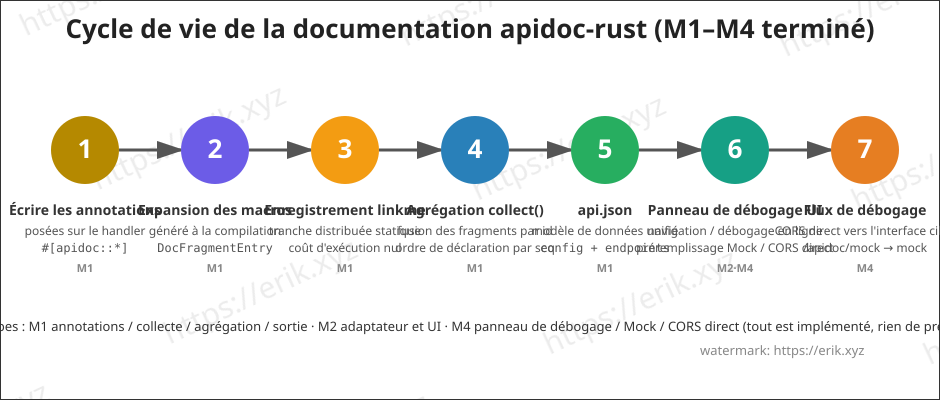

<h1 align="center">Apidoc (apidoc-rust)</h1>

<div align="center">
 Bibliothèque de plugins générique générant la documentation d'API via les proc-macros (proc-macro) de Rust
</div>

<div align="center">
<a href="https://github.com/erikwang2013/apidoc-rust"></a>
<a href="https://github.com/erikwang2013/apidoc-rust"></a>
</div>

<div align="center">
<a href="../../README.md">中文</a> ·
<a href="README-en.md">English</a> ·
<a href="README-ko.md">한국어</a> ·
<a href="README-ru.md">Русский</a> ·
<a href="README-de.md">Deutsch</a> ·
<a href="README-fr.md"><strong>Français</strong></a> ·
<a href="README-es.md">Español</a> ·
<a href="README-pt.md">Português</a> ·
<a href="README-hi.md">हिन्दी</a> ·
<a href="README-ar.md">العربية</a> ·
<a href="README-bn.md">বাংলা</a> ·
<a href="README-id.md">Bahasa Indonesia</a> ·
<a href="README-ja.md">日本語</a>
</div>

## Présentation du projet

apidoc-rust est un **générateur de documentation d'API générique et modulaire** implémenté en Rust, inspiré de [apidoc-php](https://github.com/erikwang2013/apidoc-php) (une extension composer qui génère de la documentation d'API à partir des attributs PHP 8), transposant le principe « les annotations sont la documentation » de façon native en Rust :

- **Génération à la compilation** : la documentation est générée par les proc-macros à la compilation ; elle ne se désynchronise jamais du code ;
- **Collecte à coût nul** : enregistrement statique via linkme, une seule agrégation à l'exécution suffit pour obtenir toute la documentation des interfaces ;
- **Plugin générique** : le cœur est indépendant du framework HTTP et se connecte à n'importe quel framework via de minces adaptateurs (axum / actix-web).

## Fonctionnalités

### Implémenté (M1)

- **Documentation par annotations** : sept macros d'attributs `title` / `desc` / `method` / `url` / `param` / `query` / `returned`, appliquées annotation par annotation (équivalent de la syntaxe des attributs PHP), avec paramètres imbriqués `required` / `default` / `desc` / `mock` / `children`
- **Validation à la compilation** : l'url doit commencer par `/`, méthode soumise à une liste blanche, `name` de paramètre obligatoire, etc. ; toute annotation invalide déclenche une erreur de compilation (span précis)
- **Collecte automatique** : enregistrement statique via linkme `distributed_slice`, sans liste manuelle d'interfaces ; `DocRegistry::collect()` fusionne par id et restaure l'ordre de déclaration par seq, avec collecte automatique inter-crates
- **Sortie api.json** : sérialisation serde du modèle de données unifié de la documentation (config + endpoints), champs alignés sur la sémantique PHP

### Prévu

- Débogage en ligne (connexion CORS directe du navigateur à l'interface cible), données Mock (génération via règles fake)
- Multi-applications / multi-versions / mot de passe d'accès
- Export Markdown / TypeScript / Swagger (OpenAPI3)
- Adaptation multi-frameworks (apidoc-axum / apidoc-actix)
- v2 : générateur de code, référencement des champs de tables de données, liens de partage, événements de débogage

## Architecture



## Fonctionnalités



## Cycle de vie



## Structure du projet

```
apidoc-rust/
├── Cargo.toml                 # configuration du workspace (resolver 2)
├── crates/
│   ├── apidoc/                # cœur à l'exécution (indépendant du framework)
│   │   ├── src/lib.rs         # modèle de données + agrégation DocRegistry + api.json
│   │   ├── tests/             # tests d'intégration (expansion des macros/agrégation/sérialisation/inter-crates)
│   │   └── examples/demo.rs   # exemple : annotations + sortie api.json
│   ├── apidoc-macros/         # proc-macro : 7 macros d'attributs
│   │   └── src/lib.rs         # définitions des macros + analyse des paramètres + validation à la compilation
│   └── apidoc-test-fixtures/  # fixtures de test d'enregistrement inter-crates
└── docs/
    ├── images/                # schémas d'architecture/fonctionnalités/cycle de vie (SVG)
    └── i18n/                  # documentation multilingue (12 langues)
```

## Mode d'emploi

### 1. Ajouter les dépendances

```toml
[dependencies]
apidoc = "0.1"        # ou path = "crates/apidoc"
apidoc-macros = "0.1"
linkme = "0.3"        # l'expansion des macros référence directement le chemin linkme, le consommateur doit en dépendre directement
serde_json = "1"      # pour la sortie api.json
```

### 2. Écrire les annotations

En posant des annotations sur les fonctions handler, la documentation est générée à la compilation :

```rust
use apidoc::*;

#[apidoc::title("获取用户信息")]
#[apidoc::desc("根据用户 ID 查询用户详情")]
#[apidoc::url("/api/user/info")]
#[apidoc::method("GET")]
#[apidoc::param(name = "user_id", ty = "int", required, desc = "用户ID", mock = "1")]
#[apidoc::query(name = "lang", ty = "string", desc = "语言", default = "zh-CN")]
#[apidoc::returned(
    name = "data",
    ty = "object",
    desc = "用户数据",
    children = [
        { name = "id", ty = "int", required, desc = "用户ID" },
        { name = "name", ty = "string", required, desc = "用户名", mock = "erik" },
    ]
)]
fn get_user_info() -> String {
    unimplemented!()
}
```

### 3. Collecter et exporter

```rust
fn main() {
    let endpoints = DocRegistry::collect();
    let doc = ApiDoc {
        config: ApidocConfig {
            title: "我的 API".to_string(),
            description: None,
        },
        endpoints,
    };
    println!("{}", serde_json::to_string_pretty(&doc).unwrap());
}
```

### 4. Exécuter l'exemple

```bash
cargo run --example demo -p apidoc
```

Sortie (extrait) :

```json
{
  "config": { "title": "demo api" },
  "endpoints": [
    {
      "title": "获取用户信息",
      "desc": "根据用户 ID 查询用户详情",
      "url": "/api/user/info",
      "method": "GET",
      "params": [
        { "name": "user_id", "type": "int", "required": true, "desc": "用户ID", "mock": "1" }
      ],
      "querys": [
        { "name": "lang", "type": "string", "required": false, "default": "zh-CN", "desc": "语言" }
      ],
      "returned": [
        {
          "name": "data",
          "type": "object",
          "required": false,
          "desc": "用户数据",
          "children": [
            { "name": "id", "type": "int", "required": true, "desc": "用户ID" },
            { "name": "name", "type": "string", "required": true, "desc": "用户名", "mock": "erik" }
          ]
        }
      ]
    }
  ]
}
```

## Feuille de route

| Phase | Contenu | Statut |
|------|------|------|
| M1 | squelette du workspace + modèle de données + MVP des macros + enregistrement linkme | ✅ Terminé |
| M2 | adaptateur axum + UI de documentation intégrée + répertoires groupés | ⏳ Prévu |
| M3 | complément d'annotations (tag/group/author/header/route_param/response_status/success/error/not_debug/md/sort/ref) | Prévu |
| M4 | débogage en ligne + moteur Mock | Prévu |
| M5 | export markdown / typescript / swagger.json | Prévu |
| M6 | authentification par mot de passe, multi-applications multi-versions, publication | Prévu |

## Documentation multilingue

- [English](README-en.md)
- [한국어](README-ko.md)
- [Русский](README-ru.md)
- [Deutsch](README-de.md)
- [Français](README-fr.md)
- [Español](README-es.md)
- [Português](README-pt.md)
- [हिन्दी](README-hi.md)
- [العربية](README-ar.md)
- [বাংলা](README-bn.md)
- [Bahasa Indonesia](README-id.md)
- [日本語](README-ja.md)

## Soutien et dons

Si ce projet vous est utile, n'hésitez pas à nous soutenir avec une ⭐ Star, et les dons sont également les bienvenus pour l'open source !

### WeChat Pay (微信支付) / Alipay (支付宝)

<table>
  <tr>
    <td align="center">
      <br/>
      <strong>微信支付 (WeChat Pay)</strong>
    </td>
    <td align="center">
      <br/>
      <strong>支付宝 (Alipay)</strong>
    </td>
  </tr>
</table>

### Dons par virement international

**【Informations du bénéficiaire】**

- Nom du bénéficiaire : WANG KEXUN
- Numéro de compte : 881015918251

**【Banque du bénéficiaire】**

- Code SWIFT de ZA Bank : AABLHKHHXXX
- Nom de la banque : ZA Bank Limited
- Code banque : 387
- Adresse de la banque : Core F, Cyberport 3, 100 Cyberport Road, Hong Kong

**【Banque correspondante pour virements transfrontaliers (si nécessaire)】**

> Veuillez noter qu'il s'agit de la banque correspondante (banque intermédiaire) pour les virements transfrontaliers, et non de la banque du bénéficiaire. Renseignez-vous auprès de votre banque émettrice pour savoir si ces informations sont requises.

- **La banque correspondante pour les virements en HKD, CNY et USD est Citibank :**
  - Nom de la banque : Citibank N.A. Hong Kong
  - Code SWIFT : CITIHKHXXXX
  - Code banque : 006
  - Nom de l'agence : Hong Kong Branch
  - Code d'agence : 391
  - Adresse de la banque : Citibank Tower, Citibank Plaza, 3 Garden Road, Central, Hong Kong
- **La banque correspondante pour les autres devises est BNY Mellon :**
  - Nom de la banque : THE BANK OF NEW YORK MELLON
  - Code SWIFT : IRVTUS3NXXX
  - Adresse de la banque : THE BANK OF NEW YORK MELLON, 240 GREENWICH STREET, NEW YORK, États-Unis

## License

[MIT](LICENSE)
