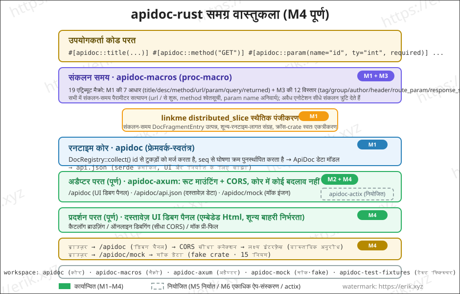
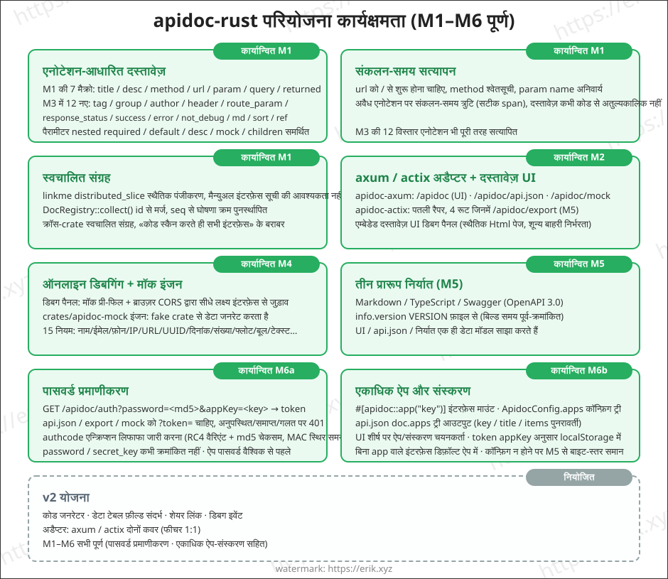
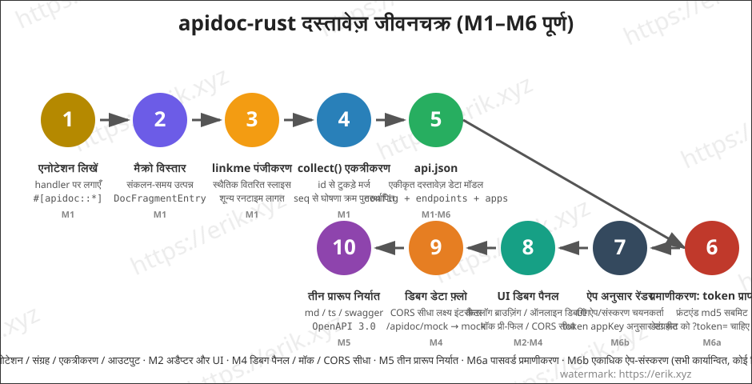

<h1 align="center">Apidoc (apidoc-rust)</h1>

<div align="center">
 Rust प्रोसेस मैक्रो (proc-macro) के आधार पर API इंटरफ़ेस दस्तावेज़ उत्पन्न करने वाली सामान्य प्लगइन लाइब्रेरी
</div>

<div align="center">
<a href="https://github.com/erikwang2013/apidoc-rust"></a>
<a href="https://github.com/erikwang2013/apidoc-rust"></a>
</div>

<div align="center">
<a href="../../README.md">中文</a> ·
<a href="README-en.md">English</a> ·
<a href="README-ko.md">한국어</a> ·
<a href="README-ru.md">Русский</a> ·
<a href="README-de.md">Deutsch</a> ·
<a href="README-fr.md">Français</a> ·
<a href="README-es.md">Español</a> ·
<a href="README-pt.md">Português</a> ·
<a href="README-hi.md"><strong>हिन्दी</strong></a> ·
<a href="README-ar.md">العربية</a> ·
<a href="README-bn.md">বাংলা</a> ·
<a href="README-id.md">Bahasa Indonesia</a> ·
<a href="README-ja.md">日本語</a>
</div>

## परियोजना परिचय

apidoc-rust एक Rust में कार्यान्वित **सामान्य प्लगइन-आधारित API इंटरफ़ेस दस्तावेज़ जनरेटर** है, जो [apidoc-php](https://github.com/erikwang2013/apidoc-php) (PHP 8 attributes के आधार पर API दस्तावेज़ उत्पन्न करने वाला composer एक्सटेंशन) का संदर्भ लेता है और "एनोटेशन ही दस्तावेज़ है" की क्षमता को Rust के मूल तरीके से लागू करता है:

- **संकलन-समय उत्पादन**: दस्तावेज़ संकलन के समय प्रोसेस मैक्रो द्वारा उत्पन्न होते हैं, दस्तावेज़ और कोड कभी भी अतुल्यकालिक नहीं होते;
- **शून्य-लागत संग्रह**: linkme स्थैतिक पंजीकरण, रनटाइम पर एक बार एकत्रित करने पर सभी इंटरफ़ेस दस्तावेज़ प्राप्त हो जाते हैं;
- **सामान्य प्लगइन**: कोर HTTP फ्रेमवर्क से स्वतंत्र है, पतले अडैप्टर (axum / actix-web) के माध्यम से किसी भी फ्रेमवर्क से जोड़ा जा सकता है।

## विशेषताएँ

### कार्यान्वित (M1-M3)

- **एनोटेशन-आधारित दस्तावेज़**: `title` / `desc` / `method` / `url` / `param` / `query` / `returned` सात एट्रिब्यूट मैक्रो, एक-एक करके एनोटेट करें (PHP attributes लेखन शैली के अनुरूप), पैरामीटर `required` / `default` / `desc` / `mock` / `children` नेस्टिंग का समर्थन करते हैं
- **संकलन-समय सत्यापन**: url को `/` से शुरू होना चाहिए, method श्वेतसूची, param name अनिवार्य आदि; अवैध एनोटेशन संकलन के समय त्रुटि देते हैं (सटीक span के साथ)
- **स्वचालित संग्रह**: linkme `distributed_slice` स्थैतिक पंजीकरण, मैन्युअल इंटरफ़ेस सूची की आवश्यकता नहीं; `DocRegistry::collect()` id के आधार पर मर्ज करता है, seq के आधार पर घोषणा क्रम पुनर्स्थापित करता है, क्रॉस-crate स्वचालित संग्रह
- **api.json आउटपुट**: serde एकीकृत दस्तावेज़ डेटा मॉडल (config + endpoints) का क्रमांकन करता है, फ़ील्ड PHP शब्दार्थ के अनुरूप हैं
- **axum अडैप्टर + एम्बेडेड दस्तावेज़ UI**: रूट माउंट करते ही दस्तावेज़ पेज मिलता है, समूहित कैटलॉग ब्राउज़िंग (M2)
- **एनोटेशन पूरा करना**: 12 नए एनोटेशन — `tag` / `group` / `author` / `header` / `route_param` / `response_status` / `success` / `error` / `not_debug` / `md` / `sort` / `ref` (M3)

### कार्यान्वित (M4)

- **ऑनलाइन डिबगिंग**: दस्तावेज़ पेज में «ऑनलाइन डिबगिंग» पैनल बिल्ट-इन है — Base URL `location.origin` से प्री-फिल होकर लक्ष्य सेवा से सीधे क्रॉस-डोमेन जुड़ता है, पैरामीटर फ़ॉर्म mock से प्री-फिल, `{name}` / `:name` रूट प्लेसहोल्डर प्रतिस्थापन, GET/HEAD पैरामीटर query में जोड़े जाते हैं, बाकी method का JSON body बनता है, रिक्वेस्ट हेडर संपादन + कस्टम header, रिस्पॉन्स प्रदर्शन (स्थिति / समय / pretty JSON), CORS विफलता पर पीली चेतावनी
- **मॉक इंजन** (`crates/apidoc/src/mock.rs`, fake crate पर निर्भर, 15 नियम: name / company / email / phone / url / ip / city / country / text / number / int / float / bool / uuid / date)। नियम प्राथमिकता: `mock="fake:xxx"` fake नियम तालिका से (अज्ञात नाम → डिफ़ॉल्ट मान) → बाकी गैर-खाली mock ज्यों-का-त्यों आउटपुट (जैसे `mock="1"`, `mock="erik"`) → बिना mock के `ty` के अनुसार स्वतः जनरेट (int→`"1"`, float→`"0.5"`, bool→`"true"`, object→`"{}"`, string→`"string"`); children रिकर्सिव रूप से नेस्टेड, array में निश्चित 2 आइटम
- **mock इंटरफ़ेस**: axum अडैप्टर में नया `GET /apidoc/mock?url=&method=`, url + method का सटीक मिलान, न मिलने पर 404; डिबग पैनल डिफ़ॉल्ट रूप से `not_debug` एंडपॉइंट छिपाता है, «not_debug इंटरफ़ेस दिखाएँ» चेक करने पर ही दिखते हैं
- **CORS सीधा कनेक्शन**: ऑनलाइन डिबगिंग में ब्राउज़र सीधे लक्ष्य इंटरफ़ेस से जुड़ता है, अडैप्टर का `cors_layer` अनुमति देता है (सर्वर-साइड रिवर्स प्रॉक्सी v2 के लिए)

### कार्यान्वित (M5)

- **तीन प्रारूपों में निर्यात** (`crates/apidoc/src/export/`): markdown / typescript / swagger (OpenAPI 3.0.0), कोर crate `export::markdown::render` / `export::typescript::render` / `export::swagger::render` प्रदान करता है
- **निर्यात रूट**: अडैप्टर में नया `GET /apidoc/export?format=md|ts|swagger`, अज्ञात format पर 400; Content-Type क्रमशः `text/markdown` / `application/typescript` / `application/json`
- **markdown**: समूहित कैटलॉग + पैरामीटर तालिका + रिस्पॉन्स ब्लॉक; **typescript**: group namespace के अनुसार `{Name}Params` / `{Name}Result` टाइप जनरेट होते हैं, बिना समूह वाले इंटरफ़ेस `defaultGroup` में जाते हैं (`default` TS का आरक्षित शब्द है); **swagger**: `info.version` रूट में `VERSION` फ़ाइल की सामग्री से लिया जाता है
- **actix-web अडैप्टर** (`crates/apidoc/src/actix.rs`): axum अडैप्टर के साथ कार्यक्षमता 1:1 — `apidoc_routes(ApidocConfig) -> Scope` /apidoc, /apidoc/api.json, /apidoc/mock, /apidoc/export माउंट करता है, `cors_layer(CorsConfig)` क्रॉस-डोमेन की अनुमति देता है
- **UI साझाकरण**: दस्तावेज़ UI (`src/ui.html`) कोर crate में ऊपर स्थानांतरित, `pub const UI_HTML` निर्यात, दोनों अडैप्टर एक ही प्रति संदर्भित करते हैं (रिलीज़ पैकेजिंग सुरक्षित)

### कार्यान्वित (M6)

- **पासवर्ड प्रमाणीकरण (M6a)**: `AuthConfig { enable, password, secret_key, expire }` चालू होने पर, क्लाइंट `GET /apidoc/auth?password=<md5(पासवर्ड)>&appKey=<key>` से token प्राप्त करता है; डेटा रूट `/apidoc/api.json`, `/apidoc/export`, `/apidoc/mock` को `?token=xxx` चाहिए; token गायब/समाप्त/गलत होने पर 401 मिलता है और दस्तावेज़ UI में पासवर्ड मास्क दिखता है; token authcode एन्क्रिप्शन सुइट से जारी होता है (Discuz authcode का लाइन-दर-लाइन पोर्ट: RC4 वेरिएंट + md5 चेकसम + बिना padding base64), पेलोड `{key: md5(md5(मूल पासवर्ड)), expire: now+expire}`, MAC तुलना स्थिर समय में
- **प्रमाणीकरण सुरक्षा रेखा**: `password` / `secret_key` कभी क्रमांकित नहीं होते; api.json आउटपुट प्रमाणीकरण बंद होने पर बाइट-स्तर समान होता है; auth बंद होने पर `/apidoc/auth` 404 देता है और डेटा रूट सीधे पास होते हैं; ऐप का अपना `password` कॉन्फ़िगर होने पर ऐप पासवर्ड वैश्विक से पहले लागू होता है; `secret_key` डिफ़ॉल्ट `"apidoc#hgcode"` (चालू और बिना कॉन्फ़िगर होने पर stderr पर एक बार चेतावनी), `expire` डिफ़ॉल्ट 86400 सेकंड
- **एकाधिक ऐप और संस्करण (M6b)**: `ApidocConfig.apps: Vec<AppConfig>` (`key` / `title` / `items` रिकर्सिव उप-संस्करण / `password`) ऐप ट्री कॉन्फ़िगर करता है; `#[apidoc::app("key")]` इंटरफ़ेस को निर्दिष्ट ऐप key से जोड़ता है और बिना key वाले इंटरफ़ेस डिफ़ॉल्ट ऐप में जाते हैं; api.json आउटपुट में नया `doc.apps` ट्री; UI के ऊपर ऐप/संस्करण सेलेक्टर दिखता है और token appKey के अनुसार अलग-अलग localStorage में सहेजे जाते हैं (अलग-अलग ऐप के स्वतंत्र पासवर्ड हो सकते हैं)

### नियोजित (v2)

- v2: कोड जनरेटर, डेटा तालिका फ़ील्ड संदर्भ, साझा लिंक, डिबग इवेंट

## वास्तुकला



## कार्यक्षमता



## जीवनचक्र



## परियोजना संरचना

```
apidoc-rust/
├── Cargo.toml                 # workspace कॉन्फ़िगरेशन (resolver 2)
├── VERSION                    # परियोजना संस्करण (v1.3.0, फ्रेमवर्क संस्करण 0.1.0 से अलग)
├── crates/
│   ├── apidoc/                # रनटाइम कोर (फ्रेमवर्क-स्वतंत्र)
│   │   ├── src/lib.rs         # डेटा मॉडल + DocRegistry एकत्रीकरण + api.json + UI_HTML
│   │   ├── src/auth.rs        # M6a पासवर्ड प्रमाणीकरण (authcode token जारी/सत्यापन + रूट गार्ड)
│   │   ├── src/export/        # M5 निर्यात: markdown / typescript / swagger
│   │   ├── src/ui.html        # साझा दस्तावेज़ UI (कोर crate द्वारा निर्यात, दोनों अडैप्टर संदर्भित करते हैं)
│   │   ├── tests/             # इंटीग्रेशन टेस्ट (मैक्रो विस्तार/एकत्रीकरण/क्रमांकन/क्रॉस-crate)
│   │   └── examples/demo.rs   # उदाहरण: एनोटेशन + api.json आउटपुट
│   ├── apidoc-macros/         # proc-macro: 20 एट्रिब्यूट मैक्रो
│   │   └── src/lib.rs         # मैक्रो परिभाषाएँ + पैरामीटर पार्सिंग + संकलन-समय सत्यापन

│   ├── apidoc-test-fixtures/  # क्रॉस-crate पंजीकरण टेस्ट फिक्स्चर


├── .github/
│   └── workflows/release.yml  # रिलीज़ वर्कफ़्लो (VERSION पढ़कर, incremental tag+release बनाता है)
└── docs/
    ├── images/                # वास्तुकला/कार्यक्षमता/जीवनचक्र आरेख (SVG)
    └── i18n/                  # बहुभाषी दस्तावेज़ (12 भाषाएँ)
```

## उपयोग निर्देश

### 1. निर्भरताएँ जोड़ें

```toml
[dependencies]
apidoc-rs = "0.1"        # या path = "crates/apidoc"


serde_json = "1"      # api.json आउटपुट के लिए
```

> Web फ्रेमवर्क के अनुसार अडैप्टर चुनें: axum के लिए `features = ["axum"]`, actix-web के लिए `features = ["actix"]` (दोनों की कार्यक्षमता 1:1 है)। `mock` (मॉक इंजन) फ्रेमवर्क की आंतरिक निर्भरता है, अडैप्टर द्वारा स्वतः जोड़ी जाती है, आम उपभोक्ता को सीधे उपयोग करने की आवश्यकता नहीं।

### 2. एनोटेशन लिखें

handler फ़ंक्शन पर एक-एक करके एनोटेशन लगाएँ, दस्तावेज़ संकलन के समय उत्पन्न हो जाता है:

```rust
use apidoc::*;

#[apidoc::title("获取用户信息")]
#[apidoc::desc("根据用户 ID 查询用户详情")]
#[apidoc::url("/api/user/info")]
#[apidoc::method("GET")]
#[apidoc::param(name = "user_id", ty = "int", required, desc = "用户ID", mock = "1")]
#[apidoc::query(name = "lang", ty = "string", desc = "语言", default = "zh-CN")]
#[apidoc::returned(
    name = "data",
    ty = "object",
    desc = "用户数据",
    children = [
        { name = "id", ty = "int", required, desc = "用户ID" },
        { name = "name", ty = "string", required, desc = "用户名", mock = "erik" },
    ]
)]
fn get_user_info() -> String {
    unimplemented!()
}
```

### 3. संग्रह और आउटपुट

```rust
fn main() {
    let doc = DocRegistry::collect_doc(ApidocConfig {
        title: "我的 API".to_string(),
        description: None,
        auth: None,    // M6a पासवर्ड प्रमाणीकरण, देखें «8. पासवर्ड प्रमाणीकरण»
        apps: vec![],  // M6b एकाधिक ऐप और संस्करण, देखें «9. एकाधिक ऐप और संस्करण»
    });
    println!("{}", serde_json::to_string_pretty(&doc).unwrap());
}
```

### 4. उदाहरण चलाएँ

```bash
cargo run --example demo -p apidoc
```

आउटपुट (अंश):

```json
{
  "config": { "title": "demo api" },
  "endpoints": [
    {
      "title": "获取用户信息",
      "desc": "根据用户 ID 查询用户详情",
      "url": "/api/user/info",
      "method": "GET",
      "params": [
        { "name": "user_id", "type": "int", "required": true, "desc": "用户ID", "mock": "1" }
      ],
      "querys": [
        { "name": "lang", "type": "string", "required": false, "default": "zh-CN", "desc": "语言" }
      ],
      "returned": [
        {
          "name": "data",
          "type": "object",
          "required": false,
          "desc": "用户数据",
          "children": [
            { "name": "id", "type": "int", "required": true, "desc": "用户ID" },
            { "name": "name", "type": "string", "required": true, "desc": "用户名", "mock": "erik" }
          ]
        }
      ]
    }
  ]
}
```

### 5. ऑनलाइन डिबगिंग और मॉक (M4)

दस्तावेज़ पेज खोलें → इंटरफ़ेस चुनें → दाईं ओर «ऑनलाइन डिबगिंग» पैनल mock नियमों के अनुसार पैरामीटर प्री-फिल करता है → Base URL को लक्ष्य सेवा के पते पर ले जाएँ (डिफ़ॉल्ट `location.origin`, सीधा क्रॉस-डोमेन कनेक्शन) → भेजें पर क्लिक करें, वास्तविक रिस्पॉन्स मिलता है (स्टेटस कोड / समय / pretty JSON)। डिबग पैनल डिफ़ॉल्ट रूप से `not_debug` एंडपॉइंट छिपाता है, «not_debug इंटरफ़ेस दिखाएँ» चेक करने के बाद ही दिखते हैं।

**CORS आवश्यकता**: ऑनलाइन डिबगिंग में ब्राउज़र सीधे लक्ष्य इंटरफ़ेस से जुड़ता है; लक्ष्य सेवा को अडैप्टर द्वारा प्रदान किया गया `cors_layer` माउंट करना होगा ताकि क्रॉस-डोमेन अनुरोध अनुमत हों; CORS विफल होने पर पैनल पीली चेतावनी दिखाता है।

मॉक नियम सिंटैक्स (तीन प्राथमिकताएँ):

```rust
#[apidoc::param(name = "email", ty = "string", desc = "邮箱", mock = "fake:email")]  // fake नियम से जनरेट
#[apidoc::param(name = "status", ty = "string", desc = "状态", mock = "1")]          // गैर-खाली mock ज्यों-का-त्यों
#[apidoc::param(name = "name", ty = "string", desc = "用户名")]                       // बिना mock: ty के अनुसार स्वतः जनरेट
#[apidoc::returned(
    name = "data",
    ty = "object",
    children = [
        { name = "id", ty = "int", required },       // बिना mock → "1"
        { name = "email", ty = "string", mock = "fake:email" },  // children रिकर्सिव नेस्टिंग
    ]
)]
fn create_user() -> String {
    unimplemented!()
}
```

15 अंतर्निर्मित fake नियम: `name` / `company` / `email` / `phone` / `url` / `ip` / `city` / `country` / `text` / `number` / `int` / `float` / `bool` / `uuid` / `date`; अज्ञात नियम नाम डिफ़ॉल्ट मान पर वापस चला जाता है। बिना mock के स्वतः जनरेशन: int→`"1"`, float→`"0.5"`, bool→`"true"`, object→`"{}"`, string→`"string"`; array में निश्चित 2 आइटम।

### 6. ऑनलाइन निर्यात (M5)

अडैप्टर में तीन प्रारूपों का निर्यात इंटरफ़ेस बिल्ट-इन है, जोड़ते ही उपयोग होता है (अज्ञात `format` पर 400):

```bash
GET /apidoc/export?format=md        # समूहित कैटलॉग + पैरामीटर तालिका + रिस्पॉन्स ब्लॉक (text/markdown)
GET /apidoc/export?format=ts        # group namespace के अनुसार {Name}Params / {Name}Result टाइप जनरेट (application/typescript)
GET /apidoc/export?format=swagger   # OpenAPI 3.0.0 विवरण फ़ाइल (application/json)
```

- **markdown**: प्रोजेक्ट Wiki / रिलीज़ नोट्स में चिपकाने के लिए उपयुक्त, समूह के अनुसार कैटलॉग, प्रत्येक इंटरफ़ेस में पैरामीटर तालिका और रिस्पॉन्स ब्लॉक;
- **typescript**: फ्रंटएंड सीधे टाइप परिभाषाओं के रूप में चिपका सकता है; बिना समूह वाले इंटरफ़ेस `defaultGroup` namespace में जाते हैं (`default` TS का आरक्षित शब्द है, पहचानकर्ता नहीं बन सकता);
- **swagger**: `info.version` रूट की `VERSION` फ़ाइल की सामग्री से लिया जाता है (वर्तमान में 1.3.0), सीधे Swagger UI या कोड जनरेटर में आयात किया जा सकता है।

### 7. actix-web अडैप्टर

Web फ्रेमवर्क actix-web होने पर `features = ["actix"]` जोड़ें (axum अडैप्टर के साथ कार्यक्षमता 1:1):

```toml
[dependencies]
apidoc-rs = { version = "0.1", features = ["actix"] }
```

```rust
use actix_web::{App, HttpServer};
use apidoc::actix::{apidoc_routes, cors_layer, CorsConfig};
use apidoc::ApidocConfig;

#[actix_web::main]
async fn main() -> std::io::Result<()> {
    HttpServer::new(|| {
        App::new()
            .service(apidoc_routes(ApidocConfig {
                title: "我的 API".to_string(),
                description: None,
                auth: None,    // M6a पासवर्ड प्रमाणीकरण, देखें «8. पासवर्ड प्रमाणीकरण»
                apps: vec![],  // M6b एकाधिक ऐप और संस्करण, देखें «9. एकाधिक ऐप और संस्करण»
            }))
            .wrap(cors_layer(CorsConfig::default()))   // M4 ऑनलाइन डिबगिंग क्रॉस-डोमेन अनुमति
    })
    .bind("127.0.0.1:8080")?
    .run()
    .await
}
```

माउंट करने के बाद `/apidoc` (दस्तावेज़ UI), `/apidoc/api.json` (डेटा), `/apidoc/mock` (मॉक), `/apidoc/export` (निर्यात) उपलब्ध होते हैं। CORS खाली कॉन्फ़िगरेशन शाब्दिक `*` की अनुमति देता है (बिना क्रेडेंशियल), `allow_origins` व्हाइटलिस्ट कॉन्फ़िगर करने पर सटीक मिलान कर Origin प्रतिबिंबित करता है, दोनों मोड में क्रेडेंशियल नहीं भेजे जाते।

### 8. पासवर्ड प्रमाणीकरण (M6a)

`auth` चालू करने पर दस्तावेज़ तक पहुँचने के लिए पासवर्ड आवश्यक है (apidoc-php के Auth.php के अनुरूप, token Discuz authcode एन्क्रिप्शन सुइट का लाइन-दर-लाइन पोर्ट है):

```rust
use apidoc::auth::AuthConfig;

let doc = DocRegistry::collect_doc(ApidocConfig {
    title: "我的 API".to_string(),
    description: None,
    auth: Some(AuthConfig {
        enable: true,
        password: "your-password".to_string(),
        secret_key: "your-secret-key".to_string(), // डिफ़ॉल्ट "apidoc#hgcode" (चालू और बिना कॉन्फ़िगर होने पर stderr पर एक बार चेतावनी)
        expire: 86400,                             // सेकंड; डिफ़ॉल्ट 86400
    }),
    apps: vec![],
});
```

**प्रक्रिया**:

1. क्लाइंट `GET /apidoc/auth?password=<md5(पासवर्ड)>&appKey=<key>` से token प्राप्त करता है (सफलता पर `{"token":"..."}`, गलत पासवर्ड पर 401); auth बंद होने पर यह रूट 404 देता है और डेटा रूट सीधे पास होते हैं
2. डेटा रूट `GET /apidoc/api.json`, `/apidoc/export`, `/apidoc/mock` को `?token=xxx` चाहिए (विशिष्ट ऐप चुने जाने पर साथ में `&appKey=` भी); token गायब/समाप्त/गलत होने पर 401 मिलता है और दस्तावेज़ UI अपने आप पासवर्ड मास्क दिखाता है; पासवर्ड डालने के बाद फ्रंटएंड स्थानीय md5 करके token प्राप्त करता है
3. token पेलोड `{key: md5(md5(मूल पासवर्ड)), expire: now+expire}` है, `secret_key` से authcode एन्क्रिप्शन द्वारा (RC4 वेरिएंट + md5 चेकसम + बिना padding base64, टाइमिंग साइड-चैनल से बचाव हेतु MAC तुलना स्थिर समय में)
4. `password` / `secret_key` कभी क्रमांकित नहीं होते; api.json आउटपुट प्रमाणीकरण बंद होने पर बाइट-स्तर समान होता है; ऐप का अपना `password` कॉन्फ़िगर होने पर ऐप पासवर्ड वैश्विक से पहले लागू होता है

### 9. एकाधिक ऐप और संस्करण (M6b)

एक प्रोजेक्ट को कई ऐप/संस्करणों में बाँटा जा सकता है, प्रत्येक की अपनी स्वतंत्र प्रदर्शन और पहुँच नियंत्रण होती है:

```rust
#[apidoc::title("获取用户信息")]
#[apidoc::app("demo")]   // key="demo" वाले ऐप से जोड़ता है; बिना app वाले इंटरफ़ेस डिफ़ॉल्ट ऐप में जाते हैं
fn get_user_info() -> String {
    unimplemented!()
}
```

```rust
let doc = DocRegistry::collect_doc(ApidocConfig {
    title: "我的 API".to_string(),
    description: None,
    auth: None,
    apps: vec![
        AppConfig {
            key: "demo".to_string(),
            title: "演示应用".to_string(),
            items: vec![AppConfig {
                key: "v1".to_string(),
                title: "v1".to_string(),
                items: vec![],
                password: None,
            }],
            password: None, // ऐप की स्वतंत्र एक्सेस पासवर्ड, वैश्विक से पहले लागू, कभी क्रमांकित नहीं
        },
    ],
});
```

- `AppConfig { key, title, items, password }`: `key` `#[apidoc::app("key")]` एनोटेशन द्वारा संदर्भित अद्वितीय पहचान है; `items` रिकर्सिव रूप से उप-संस्करण/उप-ऐप नेस्ट करता है; `password` ऐप की स्वतंत्र एक्सेस पासवर्ड है (स्वतंत्र पासवर्ड होने पर केवल ऐप token की जाँच होती है)
- api.json आउटपुट में नया `doc.apps` ट्री (key / title / items / endpoints); UI के ऊपर ऐप/संस्करण सेलेक्टर दिखता है; बदलने पर उस नोड के अनुसार इंटरफ़ेस रेंडर होते हैं और डेटा फिर से खींचा जाता है; token appKey के अनुसार अलग-अलग localStorage में सहेजे जाते हैं
- `app` एनोटेशन किसी ऐसी key का संदर्भ देता है जो `apps` में कॉन्फ़िगर नहीं है तो stderr चेतावनी और डिफ़ॉल्ट ऐप में जाना; बिना `app` एनोटेशन या बिना `apps` कॉन्फ़िगरेशन के आउटपुट M5 के साथ बाइट-स्तर समान होता है

## विकास योजना

| चरण | विवरण | स्थिति |
|------|------|------|
| M1 | workspace ढाँचा + डेटा मॉडल + मैक्रो MVP + linkme पंजीकरण | ✅ पूर्ण |
| M2 | axum अडैप्टर + एम्बेडेड दस्तावेज़ UI + समूहित कैटलॉग | ✅ पूर्ण |
| M3 | एनोटेशन पूरा करना (tag/group/author/header/route_param/response_status/success/error/not_debug/md/sort/ref) | ✅ पूर्ण |
| M4 | ऑनलाइन डिबगिंग + मॉक इंजन | ✅ पूर्ण |
| M5 | निर्यात markdown / typescript / swagger.json (OpenAPI3) | ✅ पूर्ण |
| —  | actix-web अडैप्टर (axum के साथ कार्यक्षमता 1:1) | ✅ पूर्ण |
| M6a | पासवर्ड प्रमाणीकरण (authcode token + पासवर्ड मास्क, ऐप पासवर्ड वैश्विक से पहले) | ✅ पूर्ण |
| M6b | एकाधिक ऐप और संस्करण (apps कॉन्फ़िग ट्री + app एनोटेशन + UI सेलेक्टर) | ✅ पूर्ण |

## बहुभाषी दस्तावेज़

- [English](README-en.md)
- [한국어](README-ko.md)
- [Русский](README-ru.md)
- [Deutsch](README-de.md)
- [Français](README-fr.md)
- [Español](README-es.md)
- [Português](README-pt.md)
- [हिन्दी](README-hi.md)
- [العربية](README-ar.md)
- [বাংলা](README-bn.md)
- [Bahasa Indonesia](README-id.md)
- [日本語](README-ja.md)

## समर्थन और दान

यदि यह परियोजना आपके लिए उपयोगी है, तो कृपया ⭐ Star देकर हमारा समर्थन करें, और ओपन-सोर्स के लिए दान का भी स्वागत है!

### 微信支付 (WeChat Pay) / 支付宝 (Alipay)

<table>
  <tr>
    <td align="center">
      <br/>
      <strong>微信支付</strong>
    </td>
    <td align="center">
      <br/>
      <strong>支付宝</strong>
    </td>
  </tr>
</table>

### वैश्विक बैंक हस्तांतरण दान

**【प्राप्तकर्ता जानकारी】**

- प्राप्तकर्ता का नाम: WANG KEXUN
- प्राप्तकर्ता खाता संख्या: 881015918251

**【प्राप्तकर्ता बैंक】**

- ZA Bank SWIFT कोड: AABLHKHHXXX
- बैंक का नाम: ZA Bank Limited
- बैंक कोड: 387
- बैंक का पता: Core F, Cyberport 3, 100 Cyberport Road, Hong Kong

**【सीमा-पार रेमिटेंस एजेंट बैंक (यदि आवश्यक हो)】**

> कृपया ध्यान दें, यह सीमा-पार रेमिटेंस एजेंट बैंक (मध्यस्थ बैंक) की जानकारी है, प्राप्तकर्ता बैंक की नहीं। कृपया अपने रेमिटेंस बैंक से पूछें कि क्या सीमा-पार रेमिटेंस एजेंट बैंक की जानकारी प्रदान करना आवश्यक है।

- **हाँगकाँग डॉलर, चीनी युआन और अमेरिकी डॉलर के लिए एजेंट बैंक Citibank है:**
  - बैंक का नाम: Citibank N.A. Hong Kong
  - SWIFT कोड: CITIHKHXXXX
  - बैंक कोड: 006
  - शाखा का नाम: Hong Kong Branch
  - शाखा कोड: 391
  - बैंक का पता: Citibank Tower, Citibank Plaza, 3 Garden Road, Central, Hong Kong
- **अन्य मुद्राओं के लिए एजेंट बैंक BNY Mellon है:**
  - बैंक का नाम: THE BANK OF NEW YORK MELLON
  - SWIFT कोड: IRVTUS3NXXX
  - बैंक का पता: THE BANK OF NEW YORK MELLON, 240 GREENWICH STREET, NEW YORK, United States

## License

[MIT](../../LICENSE)
