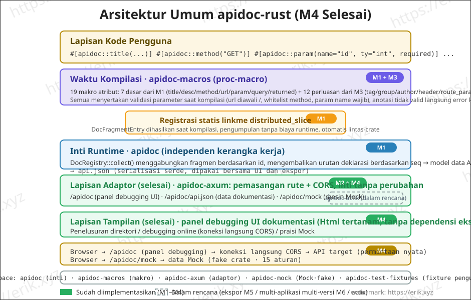
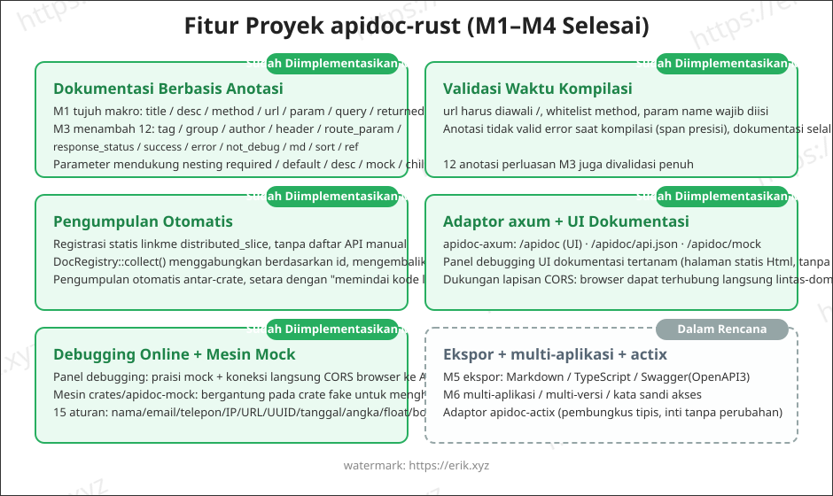
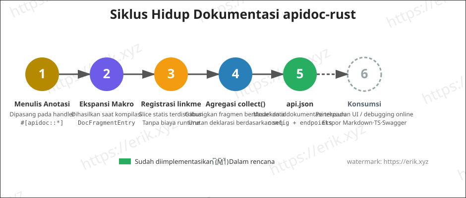

<h1 align="center">Apidoc (apidoc-rust)</h1>

<div align="center">
 Perpustakaan plugin umum untuk menghasilkan dokumentasi API berdasarkan makro prosedural (proc-macro) Rust
</div>

<div align="center">
<a href="https://github.com/erikwang2013/apidoc-rust"></a>
<a href="https://github.com/erikwang2013/apidoc-rust"></a>
</div>

<div align="center">
<a href="../../README.md">中文</a> ·
<a href="README-en.md">English</a> ·
<a href="README-ko.md">한국어</a> ·
<a href="README-ru.md">Русский</a> ·
<a href="README-de.md">Deutsch</a> ·
<a href="README-fr.md">Français</a> ·
<a href="README-es.md">Español</a> ·
<a href="README-pt.md">Português</a> ·
<a href="README-hi.md">हिन्दी</a> ·
<a href="README-ar.md">العربية</a> ·
<a href="README-bn.md">বাংলা</a> ·
<a href="README-id.md"><strong>Bahasa Indonesia</strong></a> ·
<a href="README-ja.md">日本語</a>
</div>

## Pengenalan Proyek

apidoc-rust adalah **pembuat dokumentasi API plugin-umum** yang diimplementasikan dalam Rust, mengacu pada [apidoc-php](https://github.com/erikwang2013/apidoc-php) (ekstensi composer yang menghasilkan dokumentasi API berdasarkan PHP 8 attributes), mewujudkan kemampuan "anotasi sebagai dokumentasi" secara native di Rust:

- **Dihasilkan saat kompilasi**: dokumentasi dihasilkan oleh makro prosedural pada waktu kompilasi, dokumentasi tidak akan pernah kehilangan sinkronisasi dengan kode;
- **Pengumpulan biaya nol**: registrasi statis linkme, satu kali agregasi saat runtime langsung mendapatkan seluruh dokumentasi API;
- **Plugin umum**: inti tidak terikat kerangka kerja HTTP mana pun, terhubung ke kerangka kerja apa pun melalui adaptor tipis (axum / actix-web).

## Fitur

### Sudah Diimplementasikan (M1–M3)

- **Dokumentasi berbasis anotasi**: tujuh makro atribut `title` / `desc` / `method` / `url` / `param` / `query` / `returned`, anotasi satu per satu (setara dengan penulisan PHP attributes), parameter mendukung nesting `required` / `default` / `desc` / `mock` / `children`
- **Validasi waktu kompilasi**: url harus diawali `/`, whitelist method, param name wajib diisi, dll.; anotasi tidak valid menghasilkan error saat kompilasi (span presisi)
- **Pengumpulan otomatis**: registrasi statis linkme `distributed_slice`, tanpa daftar API manual; `DocRegistry::collect()` menggabungkan berdasarkan id, mengembalikan urutan deklarasi berdasarkan seq, pengumpulan otomatis antar-crate
- **Output api.json**: serde melakukan serialisasi model data dokumentasi terpadu (config + endpoints), field selaras dengan semantik PHP
- **Adaptor axum + UI dokumentasi tertanam**: pasang rute langsung dapat halaman dokumentasi, penelusuran direktori berkelompok (M2)
- **Pelengkapan anotasi**: 12 anotasi baru `tag` / `group` / `author` / `header` / `route_param` / `response_status` / `success` / `error` / `not_debug` / `md` / `sort` / `ref` (M3)

### Sudah Diimplementasikan (M4)

- **Debugging online**: panel «Debugging Online» bawaan di halaman dokumentasi — Base URL terisi otomatis `location.origin` untuk koneksi langsung lintas-domain ke layanan target, form parameter terisi otomatis dengan mock, penggantian placeholder rute `{name}` / `:name`, parameter GET/HEAD digabung ke query, method lainnya dirangkai sebagai JSON body, edit header permintaan + header kustom, tampilan respons (status / durasi / pretty JSON), peringatan kuning saat CORS gagal
- **Mesin Mock** (`crates/apidoc-mock`, bergantung pada crate fake, 15 aturan: name / company / email / phone / url / ip / city / country / text / number / int / float / bool / uuid / date). Prioritas aturan: `mock="fake:xxx"` memakai tabel aturan fake (nama tidak dikenal kembali ke nilai default) ← mock non-kosong lainnya langsung dikeluarkan apa adanya (mis. `mock="1"`, `mock="erik"`) ← tanpa mock dibuat otomatis sesuai `ty` (int→`"1"`, float→`"0.5"`, bool→`"true"`, object→`"{}"`, string→`"string"`); children bersarang rekursif, array tetap 2 item
- **Antarmuka mock**: adaptor axum menambah `GET /apidoc/mock?url=&method=`, pencocokan presisi url + method, tidak cocok mengembalikan 404; panel debugging menyembunyikan endpoint `not_debug` secara default, baru tampil setelah mencentang «Tampilkan antarmuka not_debug»
- **Koneksi langsung CORS**: debugging online dijalankan browser langsung ke antarmuka target, `cors_layer` dari adaptor yang mengizinkan (proksi balik sisi server disisakan untuk v2)

### Sudah Diimplementasikan (M5)

- **Ekspor tiga format** (`crates/apidoc/src/export/`): markdown / typescript / swagger (OpenAPI 3.0.0), crate inti menyediakan `export::markdown::render` / `export::typescript::render` / `export::swagger::render`
- **Rute ekspor**: adaptor menambah `GET /apidoc/export?format=md|ts|swagger`, format tidak dikenal mengembalikan 400; Content-Type masing-masing `text/markdown` / `application/typescript` / `application/json`
- **markdown**: direktori berkelompok + tabel parameter + blok respons; **typescript**: menghasilkan tipe `{Name}Params` / `{Name}Result` per namespace group, antarmuka tanpa group masuk ke `defaultGroup` (`default` kata cadangan TS); **swagger**: `info.version` diambil dari isi file `VERSION` di root
- **Adaptor actix-web** (`crates/apidoc-actix`): fungsionalitas 1:1 dengan adaptor axum — `apidoc_routes(ApidocConfig) -> Scope` memasang /apidoc, /apidoc/api.json, /apidoc/mock, /apidoc/export, `cors_layer(CorsConfig)` mengizinkan lintas-domain
- **Berbagi UI**: UI dokumentasi (`src/ui.html`) dipindahkan ke atas ke crate inti, diekspor sebagai `pub const UI_HTML`, kedua adaptor merujuk salinan yang sama (aman saat packaging rilis)

### Sudah Diimplementasikan (M6)

- **Otentikasi Kata Sandi (M6a)**: dengan `AuthConfig { enable, password, secret_key, expire }` diaktifkan, klien memanggil `GET /apidoc/auth?password=<md5(kata sandi)>&appKey=<key>` untuk mendapatkan token; rute data `/apidoc/api.json`, `/apidoc/export`, `/apidoc/mock` wajib menyertakan `?token=xxx`; token hilang/kedaluwarsa/salah mengembalikan 401 dan UI dokumentasi menampilkan masker kata sandi; token diterbitkan dengan enkripsi authcode (porting baris per baris dari authcode Discuz: varian RC4 + checksum md5 + base64 tanpa padding), payload `{key: md5(md5(kata sandi asli)), expire: now+expire}`, perbandingan MAC waktu konstan
- **Garis merah keamanan autentikasi**: `password` / `secret_key` tidak pernah diserialisasi; output api.json identik byte demi byte dengan saat autentikasi nonaktif; saat auth nonaktif, `/apidoc/auth` mengembalikan 404 dan rute data langsung diizinkan; saat aplikasi mengonfigurasi `password` sendiri, kata sandi aplikasi diutamakan dari kata sandi global; `secret_key` default `"apidoc#hgcode"` (peringatan stderr sekali jika diaktifkan tanpa konfigurasi), `expire` default 86400 detik
- **Multi-Aplikasi Multi-Versi (M6b)**: `ApidocConfig.apps: Vec<AppConfig>` (`key` / `title` / `items` sub-versi rekursif / `password`) mengonfigurasi pohon aplikasi; `#[apidoc::app("key")]` menggantung antarmuka ke aplikasi dengan key tersebut dan antarmuka tanpa key masuk ke aplikasi default; output api.json menambah pohon `doc.apps`; muncul pemilih aplikasi/versi di bagian atas UI dan token disimpan terpisah di localStorage per appKey (aplikasi berbeda dapat memiliki kata sandi independen)

### Dalam Rencana (v2)

- v2: generator kode, referensi field tabel data, tautan berbagi, peristiwa debugging

## Arsitektur



## Fitur



## Siklus Hidup



## Struktur Proyek

```
apidoc-rust/
├── Cargo.toml                 # Konfigurasi workspace (resolver 2)
├── VERSION                    # Versi proyek (v1.1.0, terpisah dari versi kerangka 0.1.0)
├── crates/
│   ├── apidoc/                # Inti runtime (independen kerangka kerja)
│   │   ├── src/lib.rs         # Model data + agregasi DocRegistry + api.json + UI_HTML
│   │   ├── src/auth.rs        # otentikasi M6a (penerbitan/validasi token authcode + pengawal rute)
│   │   ├── src/export/        # Ekspor M5: markdown / typescript / swagger
│   │   ├── src/ui.html        # UI dokumentasi bersama (diekspor crate inti, dirujuk kedua adaptor)
│   │   ├── tests/             # Tes integrasi (ekspansi makro/agregasi/serialisasi/antar-crate)
│   │   └── examples/demo.rs   # Contoh: anotasi + output api.json
│   ├── apidoc-macros/         # proc-macro: 20 makro atribut
│   │   └── src/lib.rs         # Definisi makro + parsing parameter + validasi waktu kompilasi
│   ├── apidoc-mock/           # Mesin Mock (pembuatan data mock dengan aturan fake)
│   ├── apidoc-test-fixtures/  # Fixture pengujian registrasi antar-crate
│   ├── apidoc-axum/           # Adaptor axum (rute dokumentasi + cors_layer + mock + export)
│   └── apidoc-actix/          # Adaptor actix-web (fungsionalitas 1:1 dengan axum)
├── .github/
│   └── workflows/release.yml  # Workflow rilis (membaca VERSION, membuat tag+release inkremental)
└── docs/
    ├── images/                # Diagram arsitektur/fitur/siklus hidup (SVG)
    └── i18n/                  # Dokumentasi multibahasa (12 bahasa)
```

## Panduan Penggunaan

### 1. Menambahkan Dependensi

```toml
[dependencies]
apidoc = "0.1"        # atau path = "crates/apidoc"
apidoc-macros = "0.1"
linkme = "0.3"        # ekspansi makro merujuk langsung ke path linkme, konsumen wajib dependensi langsung
serde_json = "1"      # untuk output api.json
```

> Adaptor dipilih salah satu sesuai kerangka web: axum memakai `apidoc-axum`, actix-web memakai `apidoc-actix` (keduanya fungsionalitas 1:1). `apidoc-mock` (mesin Mock) adalah dependensi internal kerangka kerja, ditambahkan otomatis melalui adaptor, umumnya konsumen tidak perlu menggunakannya langsung.

### 2. Menulis Anotasi

Pasang anotasi satu per satu pada fungsi handler, dokumentasi langsung dihasilkan saat kompilasi:

```rust
use apidoc::*;

#[apidoc::title("Mendapatkan Info Pengguna")]
#[apidoc::desc("Mengambil detail pengguna berdasarkan ID pengguna")]
#[apidoc::url("/api/user/info")]
#[apidoc::method("GET")]
#[apidoc::param(name = "user_id", ty = "int", required, desc = "ID Pengguna", mock = "1")]
#[apidoc::query(name = "lang", ty = "string", desc = "Bahasa", default = "zh-CN")]
#[apidoc::returned(
    name = "data",
    ty = "object",
    desc = "Data Pengguna",
    children = [
        { name = "id", ty = "int", required, desc = "ID Pengguna" },
        { name = "name", ty = "string", required, desc = "Nama Pengguna", mock = "erik" },
    ]
)]
fn get_user_info() -> String {
    unimplemented!()
}
```

### 3. Mengumpulkan dan Menghasilkan Output

```rust
fn main() {
    let doc = DocRegistry::collect_doc(ApidocConfig {
        title: "API Saya".to_string(),
        description: None,
        auth: None,    // M6a otentikasi kata sandi, lihat «8. Otentikasi Kata Sandi»
        apps: vec![],  // M6b multi-aplikasi multi-versi, lihat «9. Multi-Aplikasi Multi-Versi»
    });
    println!("{}", serde_json::to_string_pretty(&doc).unwrap());
}
```

### 4. Menjalankan Contoh

```bash
cargo run --example demo -p apidoc
```

Output (cuplikan):

```json
{
  "config": { "title": "demo api" },
  "endpoints": [
    {
      "title": "Mendapatkan Info Pengguna",
      "desc": "Mengambil detail pengguna berdasarkan ID pengguna",
      "url": "/api/user/info",
      "method": "GET",
      "params": [
        { "name": "user_id", "type": "int", "required": true, "desc": "ID Pengguna", "mock": "1" }
      ],
      "querys": [
        { "name": "lang", "type": "string", "required": false, "default": "zh-CN", "desc": "Bahasa" }
      ],
      "returned": [
        {
          "name": "data",
          "type": "object",
          "required": false,
          "desc": "Data Pengguna",
          "children": [
            { "name": "id", "type": "int", "required": true, "desc": "ID Pengguna" },
            { "name": "name", "type": "string", "required": true, "desc": "Nama Pengguna", "mock": "erik" }
          ]
        }
      ]
    }
  ]
}
```

### 5. Debugging Online dan Mock (M4)

Buka halaman dokumentasi → pilih antarmuka → panel «Debugging Online» di kanan terisi otomatis sesuai aturan mock → arahkan Base URL ke alamat layanan target (default `location.origin`, koneksi langsung lintas-domain) → klik Kirim, dapatkan respons asli (kode status / durasi / pretty JSON). Panel debugging menyembunyikan endpoint `not_debug` secara default, baru ditampilkan setelah mencentang «Tampilkan antarmuka not_debug».

**Persyaratan CORS**: debugging online dijalankan browser langsung ke antarmuka target, sehingga layanan target perlu memasang `cors_layer` yang disediakan adaptor untuk mengizinkan permintaan lintas-domain; saat CORS gagal, panel menampilkan peringatan kuning.

Sintaks aturan Mock (tiga prioritas):

```rust
#[apidoc::param(name = "email", ty = "string", desc = "Email", mock = "fake:email")]  // dihasilkan aturan fake
#[apidoc::param(name = "status", ty = "string", desc = "Status", mock = "1")]          // mock non-kosong langsung apa adanya
#[apidoc::param(name = "name", ty = "string", desc = "Nama Pengguna")]                  // tanpa mock: otomatis sesuai ty
#[apidoc::returned(
    name = "data",
    ty = "object",
    children = [
        { name = "id", ty = "int", required },       // tanpa mock → "1"
        { name = "email", ty = "string", mock = "fake:email" },  // children bersarang rekursif
    ]
)]
fn create_user() -> String {
    unimplemented!()
}
```

15 aturan fake bawaan: `name` / `company` / `email` / `phone` / `url` / `ip` / `city` / `country` / `text` / `number` / `int` / `float` / `bool` / `uuid` / `date`; nama tidak dikenal kembali ke nilai default. Aturan pembuatan otomatis tanpa mock: int→`"1"`, float→`"0.5"`, bool→`"true"`, object→`"{}"`, string→`"string"`; array tetap 2 item.

### 6. Ekspor Online (M5)

Adaptor memiliki antarmuka ekspor tiga format bawaan, langsung bisa dipakai setelah dipasang (format `format` tidak dikenal mengembalikan 400):

```bash
GET /apidoc/export?format=md        # direktori berkelompok + tabel parameter + blok respons (text/markdown)
GET /apidoc/export?format=ts        # menghasilkan tipe {Name}Params / {Name}Result per namespace group (application/typescript)
GET /apidoc/export?format=swagger   # file deskripsi OpenAPI 3.0.0 (application/json)
```

- **markdown**: cocok ditempel ke Wiki proyek / catatan rilis, mengeluarkan direktori per grup, setiap antarmuka dengan tabel parameter dan blok respons;
- **typescript**: frontend bisa langsung ditempel sebagai definisi tipe; antarmuka tanpa group masuk ke namespace `defaultGroup` (`default` kata cadangan TS, tidak bisa dijadikan pengenal);
- **swagger**: `info.version` diambil dari isi file `VERSION` di root (saat ini 1.1.0), bisa langsung diimpor ke Swagger UI atau generator kode.

### 7. Adaptor actix-web

Saat kerangka web memakai actix-web, pasang `apidoc-actix` (fungsionalitas 1:1 dengan adaptor axum):

```toml
[dependencies]
apidoc-actix = "0.1"     # atau path = "crates/apidoc-actix"
```

```rust
use actix_web::{App, HttpServer};
use apidoc_actix::{apidoc_routes, cors_layer, ApidocConfig, CorsConfig};

#[actix_web::main]
async fn main() -> std::io::Result<()> {
    HttpServer::new(|| {
        App::new()
            .service(apidoc_routes(ApidocConfig {
                title: "API Saya".to_string(),
                description: None,
                auth: None,    // M6a otentikasi kata sandi, lihat «8. Otentikasi Kata Sandi»
                apps: vec![],  // M6b multi-aplikasi multi-versi, lihat «9. Multi-Aplikasi Multi-Versi»
            }))
            .wrap(cors_layer(CorsConfig::default()))   // M4 izin lintas-domain debug online
    })
    .bind("127.0.0.1:8080")?
    .run()
    .await
}
```

Setelah dipasang bisa mengakses `/apidoc` (UI dokumentasi), `/apidoc/api.json` (data), `/apidoc/mock` (Mock), `/apidoc/export` (ekspor). Konfigurasi CORS kosong mengizinkan literal `*` (tanpa membawa kredensial), jika mengonfigurasi whitelist `allow_origins` maka mencocokkan Origin yang dipantulkan secara presisi, kedua mode tidak membuka kredensial.

### 8. Otentikasi Kata Sandi (M6a)

Setelah `auth` diaktifkan, dokumentasi memerlukan kata sandi untuk diakses (selaras dengan Auth.php apidoc-php, token merupakan porting baris per baris enkripsi authcode Discuz):

```rust
use apidoc::auth::AuthConfig;

let doc = DocRegistry::collect_doc(ApidocConfig {
    title: "API Saya".to_string(),
    description: None,
    auth: Some(AuthConfig {
        enable: true,
        password: "your-password".to_string(),
        secret_key: "your-secret-key".to_string(), // default "apidoc#hgcode" (peringatan stderr sekali jika diaktifkan tanpa konfigurasi)
        expire: 86400,                             // detik; default 86400
    }),
    apps: vec![],
});
```

**Alur**:

1. Klien memanggil `GET /apidoc/auth?password=<md5(kata sandi)>&appKey=<key>` untuk mendapatkan token (sukses → `{"token":"..."}`, kata sandi salah → 401); saat auth nonaktif rute ini mengembalikan 404 dan rute data langsung diizinkan
2. Rute data `GET /apidoc/api.json`, `/apidoc/export`, `/apidoc/mock` wajib menyertakan `?token=xxx` (serta `&appKey=` bila aplikasi tertentu dipilih); token hilang/kedaluwarsa/salah mengembalikan 401 dan UI dokumentasi otomatis menampilkan masker kata sandi; setelah memasukkan kata sandi, frontend menghitung md5 lokal lalu mengirim untuk mendapatkan token
3. Payload token adalah `{key: md5(md5(kata sandi asli)), expire: now+expire}`, dienkripsi oleh `secret_key` melalui authcode (varian RC4 + checksum md5 + base64 tanpa padding, perbandingan MAC waktu konstan mencegah side-channel waktu)
4. `password` / `secret_key` tidak pernah diserialisasi; output api.json identik byte demi byte dengan saat autentikasi nonaktif; saat aplikasi mengonfigurasi `password` sendiri, kata sandi aplikasi diutamakan dari kata sandi global

### 9. Multi-Aplikasi Multi-Versi (M6b)

Satu proyek dapat dipecah menjadi beberapa aplikasi/versi, masing-masing dengan tampilan dan kontrol akses independen:

```rust
#[apidoc::title("Mendapatkan Info Pengguna")]
#[apidoc::app("demo")]   // menggantung ke aplikasi key="demo"; antarmuka tanpa app masuk ke aplikasi default
fn get_user_info() -> String {
    unimplemented!()
}
```

```rust
let doc = DocRegistry::collect_doc(ApidocConfig {
    title: "API Saya".to_string(),
    description: None,
    auth: None,
    apps: vec![
        AppConfig {
            key: "demo".to_string(),
            title: "Aplikasi Demo".to_string(),
            items: vec![AppConfig {
                key: "v1".to_string(),
                title: "v1".to_string(),
                items: vec![],
                password: None,
            }],
            password: None, // kata sandi akses independen aplikasi, diutamakan dari kata sandi global, tidak pernah diserialisasi
        },
    ],
});
```

- `AppConfig { key, title, items, password }`: `key` adalah identitas unik yang dirujuk anotasi `#[apidoc::app("key")]`; `items` menyarangkan sub-versi/sub-aplikasi secara rekursif; `password` adalah kata sandi akses independen aplikasi (dengan kata sandi independen hanya token aplikasi yang divalidasi)
- Output api.json menambah pohon `doc.apps` (key / title / items / endpoints); muncul pemilih aplikasi/versi di bagian atas UI; setelah berpindah, antarmuka dirender sesuai node tersebut dan data ditarik ulang; token disimpan terpisah di localStorage per appKey
- Bila anotasi `app` merujuk key yang tidak dikonfigurasi di `apps`, peringatan stderr dan jatuh ke aplikasi default; tanpa anotasi `app` atau tanpa konfigurasi `apps`, output identik byte demi byte dengan M5

## Rencana Pengembangan

| Tahap | Konten | Status |
|------|------|------|
| M1 | Kerangka workspace + model data + MVP makro + registrasi linkme | ✅ Selesai |
| M2 | Adaptor axum + UI dokumentasi tertanam + direktori berkelompok | ✅ Selesai |
| M3 | Melengkapi anotasi (tag/group/author/header/route_param/response_status/success/error/not_debug/md/sort/ref) | ✅ Selesai |
| M4 | Debugging online + mesin Mock | ✅ Selesai |
| M5 | Ekspor markdown / typescript / swagger.json (OpenAPI3) | ✅ Selesai |
| —  | Adaptor actix-web (fungsionalitas 1:1 dengan axum) | ✅ Selesai |
| M6a | Otentikasi kata sandi (token authcode + masker kata sandi, kata sandi aplikasi diutamakan) | ✅ Selesai |
| M6b | Multi-aplikasi multi-versi (pohon konfigurasi apps + anotasi app + pemilih UI) | ✅ Selesai |

## Dokumentasi Multibahasa

- [English](README-en.md)
- [한국어](README-ko.md)
- [Русский](README-ru.md)
- [Deutsch](README-de.md)
- [Français](README-fr.md)
- [Español](README-es.md)
- [Português](README-pt.md)
- [हिन्दी](README-hi.md)
- [العربية](README-ar.md)
- [বাংলা](README-bn.md)
- [Bahasa Indonesia](README-id.md)
- [日本語](README-ja.md)

## Dukungan dan Donasi

Jika proyek ini bermanfaat bagi Anda, silakan beri ⭐ Star untuk mendukung kami, dan donasi untuk mendukung open source juga sangat diterima!

### 微信支付 / 支付宝 (WeChat Pay / Alipay)

<table>
  <tr>
    <td align="center">
      <br/>
      <strong>微信支付 (WeChat Pay)</strong>
    </td>
    <td align="center">
      <br/>
      <strong>支付宝 (Alipay)</strong>
    </td>
  </tr>
</table>

### Donasi Transfer Global

**【Informasi Penerima】**

- Nama penerima: WANG KEXUN
- Nomor rekening penerima: 881015918251

**【Bank Penerima】**

- SWIFT Code ZA Bank: AABLHKHHXXX
- Nama bank: ZA Bank Limited
- Nomor bank: 387
- Alamat bank: Core F, Cyberport 3, 100 Cyberport Road, Hong Kong

**【Bank Perantara Transfer Lintas Negara (Jika Diperlukan)】**

> Perlu diperhatikan: ini adalah informasi bank perantara (bank pengirim) untuk transfer lintas negara, bukan informasi bank penerima. Silakan tanyakan kepada bank pengirim apakah perlu menyediakan informasi bank perantara.

- **Bank perantara untuk transfer HKD, CNY, dan USD adalah Citibank:**
  - Nama bank: Citibank N.A. Hong Kong
  - SWIFT Code: CITIHKHXXXX
  - Nomor bank: 006
  - Nama cabang: Hong Kong Branch
  - Nomor cabang: 391
  - Alamat bank: Citibank Tower, Citibank Plaza, 3 Garden Road, Central, Hong Kong
- **Bank perantara untuk mata uang lainnya adalah BNY Mellon:**
  - Nama bank: THE BANK OF NEW YORK MELLON
  - SWIFT Code: IRVTUS3NXXX
  - Alamat bank: THE BANK OF NEW YORK MELLON, 240 GREENWICH STREET, NEW YORK, United States

## License

[MIT](../../LICENSE)
