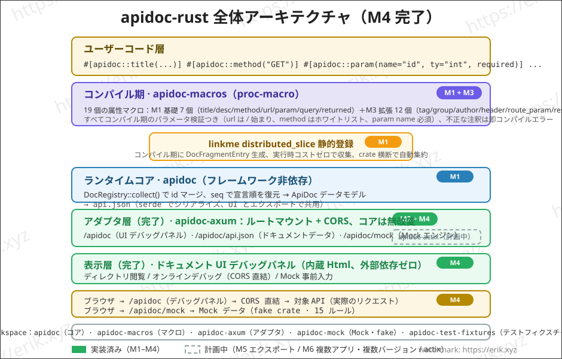
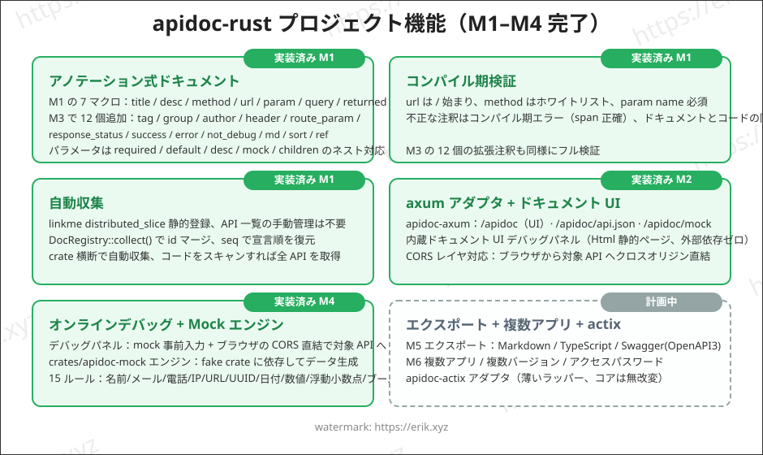
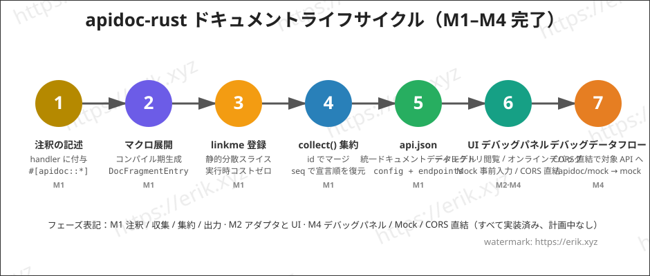

<h1 align="center">Apidoc (apidoc-rust)</h1>

<div align="center">
 Rust の手続きマクロ（proc-macro）で API インターフェースドキュメントを生成する汎用プラグインライブラリ
</div>

<div align="center">
<a href="https://github.com/erikwang2013/apidoc-rust"></a>
<a href="https://github.com/erikwang2013/apidoc-rust"></a>
</div>

<div align="center">
<a href="../../README.md">中文</a> ·
<a href="README-en.md">English</a> ·
<a href="README-ko.md">한국어</a> ·
<a href="README-ru.md">Русский</a> ·
<a href="README-de.md">Deutsch</a> ·
<a href="README-fr.md">Français</a> ·
<a href="README-es.md">Español</a> ·
<a href="README-pt.md">Português</a> ·
<a href="README-hi.md">हिन्दी</a> ·
<a href="README-ar.md">العربية</a> ·
<a href="README-bn.md">বাংলা</a> ·
<a href="README-id.md">Bahasa Indonesia</a> ·
<a href="README-ja.md"><strong>日本語</strong></a>
</div>

## プロジェクト紹介

apidoc-rust は Rust で実装された**汎用プラグイン型 API インターフェースドキュメントジェネレータ**です。[apidoc-php](https://github.com/erikwang2013/apidoc-php)（PHP 8 の attributes で API ドキュメントを生成する composer 拡張）を参考に、「注釈＝ドキュメント」という能力を Rust ネイティブな形で実現します：

- **コンパイル期生成**：ドキュメントは手続きマクロによりコンパイル期に生成され、ドキュメントとコードの同期が常に保たれます；
- **ゼロコスト収集**：linkme による静的登録で、実行時に一度集約するだけで全インターフェースドキュメントを取得できます；
- **汎用プラグイン**：コアは HTTP フレームワークに依存せず、薄いアダプタ（axum / actix-web）経由で任意のフレームワークに接続できます。

## 特徴

### 実装済み（M1–M3）

- **注釈式ドキュメント**：`title` / `desc` / `method` / `url` / `param` / `query` / `returned` の 7 つの属性マクロで項目ごとに注釈します（PHP attributes の書き方に対応）。パラメータは `required` / `default` / `desc` / `mock` / `children` のネストに対応
- **コンパイル期検証**：url は `/` で始まる必要があり、method はホワイトリスト、param の name は必須など、不正な注釈はコンパイル期にエラーになります（span 単位で正確）
- **自動収集**：linkme の `distributed_slice` による静的登録で、手動のインターフェース一覧は不要。`DocRegistry::collect()` が id でマージし、seq で宣言順を復元、crate をまたいで自動収集します
- **api.json 出力**：serde で統一ドキュメントデータモデル（config + endpoints）をシリアライズし、フィールドは PHP のセマンティクスに合わせます
- **axum アダプタ + 組み込みドキュメント UI**：ルートをマウントするだけでドキュメントページが使え、グループ別ディレクトリで閲覧できます（M2）
- **注釈の拡充**：`tag` / `group` / `author` / `header` / `route_param` / `response_status` / `success` / `error` / `not_debug` / `md` / `sort` / `ref` の 12 個の新注釈（M3）

### 実装済み（M4）

- **オンラインデバッグ**：ドキュメントページに組み込みの「オンラインデバッグ」パネル——Base URL は `location.origin` で事前入力されクロスオリジンで対象サービスに直結、パラメータフォームは mock で事前入力、`{name}` / `:name` のルートプレースホルダー置換、GET/HEAD パラメータは query に統合、その他の method は JSON body に組み立て、リクエストヘッダー編集 + カスタム header、レスポンス表示（ステータス / 所要時間 / pretty JSON）、CORS 失敗時は黄色の警告
- **Mock エンジン**（`crates/apidoc-mock`、fake crate 依存、15 ルール：name / company / email / phone / url / ip / city / country / text / number / int / float / bool / uuid / date）。ルール優先度：`mock="fake:xxx"` は fake ルール表を通る（不明な名前はデフォルト値にフォールバック）→ その他の非空 mock はそのまま出力（例：`mock="1"`、`mock="erik"`）→ mock なしは `ty` に応じて自動生成（int→`"1"`、float→`"0.5"`、bool→`"true"`、object→`"{}"`、string→`"string"`）；children は再帰的にネスト、array は固定 2 項目
- **mock インターフェース**：axum アダプタに `GET /apidoc/mock?url=&method=` を追加、url + method を完全一致で照合し、不一致は 404；デバッグパネルはデフォルトで `not_debug` エンドポイントを非表示にし、「not_debug インターフェースを表示」にチェックすると表示
- **CORS 直結**：オンラインデバッグはブラウザから対象インターフェースに直接接続し、アダプタの `cors_layer` が許可します（サーバー側リバースプロキシは v2 に持ち越し）

### 実装済み（M5）

- **3 形式エクスポート**（`crates/apidoc/src/export/`）：markdown / typescript / swagger（OpenAPI 3.0.0）、コア crate が `export::markdown::render` / `export::typescript::render` / `export::swagger::render` を提供
- **エクスポートルート**：アダプタに `GET /apidoc/export?format=md|ts|swagger` を追加、未知の format は 400 を返す；Content-Type はそれぞれ `text/markdown` / `application/typescript` / `application/json`
- **markdown**：グループ別ディレクトリ + パラメータ表 + レスポンスブロック；**typescript**：group ごとに名前空間で `{Name}Params` / `{Name}Result` 型を生成、未グループのインターフェースは `defaultGroup` に入る（`default` は TS の予約語）；**swagger**：`info.version` はルートの `VERSION` ファイルの内容を取得
- **actix-web アダプタ**（`crates/apidoc-actix`）：axum アダプタと機能 1:1——`apidoc_routes(ApidocConfig) -> Scope` で /apidoc、/apidoc/api.json、/apidoc/mock、/apidoc/export をマウント、`cors_layer(CorsConfig)` がクロスオリジンを許可
- **UI 共有**：ドキュメント UI（`src/ui.html`）をコア crate に移動し、`pub const UI_HTML` としてエクスポート、両アダプタは同一のものを参照（リリースパッケージングでも安全）

### 計画中

- 複数アプリ / 複数バージョン / アクセスパスワード
- v2：コードジェネレータ、データテーブルフィールド参照、共有リンク、デバッグイベント

## アーキテクチャ



## 機能



## ライフサイクル



## プロジェクト構成

```
apidoc-rust/
├── Cargo.toml                 # workspace 設定（resolver 2）
├── VERSION                    # プロジェクトバージョン（v1.1.0、フレームワーク 0.1.0 と分離）
├── crates/
│   ├── apidoc/                # ランタイムコア（フレームワーク非依存）
│   │   ├── src/lib.rs         # データモデル + DocRegistry 集約 + api.json + UI_HTML
│   │   ├── src/export/        # M5 エクスポート：markdown / typescript / swagger
│   │   ├── src/ui.html        # 共有ドキュメント UI（コア crate がエクスポート、両アダプタが参照）
│   │   ├── tests/             # 統合テスト（マクロ展開/集約/シリアライズ/クロス crate）
│   │   └── examples/demo.rs   # サンプル：注釈 + api.json 出力
│   ├── apidoc-macros/         # proc-macro：19 つの属性マクロ
│   │   └── src/lib.rs         # マクロ定義 + パラメータ解析 + コンパイル期検証
│   ├── apidoc-mock/           # Mock エンジン（fake ルールで mock データ生成）
│   ├── apidoc-test-fixtures/  # クロス crate 登録テストフィクスチャ
│   ├── apidoc-axum/           # axum アダプタ（ドキュメントルート + cors_layer + mock + export）
│   └── apidoc-actix/          # actix-web アダプタ（axum と機能 1:1）
├── .github/
│   └── workflows/release.yml  # リリースワークフロー（VERSION を読み、tag+release を増分作成）
└── docs/
    ├── images/                # アーキテクチャ/機能/ライフサイクル図（SVG）
    └── i18n/                  # 多言語ドキュメント（12 言語）
```

## 使い方

### 1. 依存関係の追加

```toml
[dependencies]
apidoc = "0.1"        # または path = "crates/apidoc"
apidoc-macros = "0.1"
linkme = "0.3"        # マクロ展開が linkme のパスを直接参照するため、利用側は直接依存が必要
serde_json = "1"      # api.json 出力用
```

> アダプタは Web フレームワークに応じてどちらか一方を選びます：axum は `apidoc-axum`、actix-web は `apidoc-actix`（両者の機能は 1:1）。`apidoc-mock`（Mock エンジン）はフレームワーク内部の依存で、アダプタ経由で自動的に導入されるため、通常は利用側が直接使う必要はありません。

### 2. 注釈の記述

handler 関数に注釈を 1 つずつ付けると、ドキュメントはコンパイル期に生成されます：

```rust
use apidoc::*;

#[apidoc::title("获取用户信息")]
#[apidoc::desc("根据用户 ID 查询用户详情")]
#[apidoc::url("/api/user/info")]
#[apidoc::method("GET")]
#[apidoc::param(name = "user_id", ty = "int", required, desc = "用户ID", mock = "1")]
#[apidoc::query(name = "lang", ty = "string", desc = "语言", default = "zh-CN")]
#[apidoc::returned(
    name = "data",
    ty = "object",
    desc = "用户数据",
    children = [
        { name = "id", ty = "int", required, desc = "用户ID" },
        { name = "name", ty = "string", required, desc = "用户名", mock = "erik" },
    ]
)]
fn get_user_info() -> String {
    unimplemented!()
}
```

### 3. 収集と出力

```rust
fn main() {
    let endpoints = DocRegistry::collect();
    let doc = ApiDoc {
        config: ApidocConfig {
            title: "我的 API".to_string(),
            description: None,
        },
        endpoints,
    };
    println!("{}", serde_json::to_string_pretty(&doc).unwrap());
}
```

### 4. サンプルの実行

```bash
cargo run --example demo -p apidoc
```

出力（抜粋）：

```json
{
  "config": { "title": "demo api" },
  "endpoints": [
    {
      "title": "获取用户信息",
      "desc": "根据用户 ID 查询用户详情",
      "url": "/api/user/info",
      "method": "GET",
      "params": [
        { "name": "user_id", "type": "int", "required": true, "desc": "用户ID", "mock": "1" }
      ],
      "querys": [
        { "name": "lang", "type": "string", "required": false, "default": "zh-CN", "desc": "语言" }
      ],
      "returned": [
        {
          "name": "data",
          "type": "object",
          "required": false,
          "desc": "用户数据",
          "children": [
            { "name": "id", "type": "int", "required": true, "desc": "用户ID" },
            { "name": "name", "type": "string", "required": true, "desc": "用户名", "mock": "erik" }
          ]
        }
      ]
    }
  ]
}
```

### 5. オンラインデバッグと Mock（M4）

ドキュメントページを開く → インターフェースを選択 → 右側の「オンラインデバッグ」パネルが mock ルールに従ってパラメータを事前入力 → Base URL を対象サービスのアドレスに指定（デフォルトは `location.origin`、クロスオリジン直結）→ 送信をクリックすると実際のレスポンス（ステータスコード / 所要時間 / pretty JSON）が得られます。デバッグパネルはデフォルトで `not_debug` エンドポイントを非表示にし、「not_debug インターフェースを表示」にチェックすると表示されます。

**CORS 要件**：オンラインデバッグはブラウザから対象インターフェースに直接接続するため、対象サービスはアダプタが提供する `cors_layer` をマウントしてクロスオリジンリクエストを許可する必要があります。CORS 失敗時はパネルに黄色の警告が表示されます。

Mock ルールの構文（3 つの優先度）：

```rust
#[apidoc::param(name = "email", ty = "string", desc = "邮箱", mock = "fake:email")]  // fake 规则生成
#[apidoc::param(name = "status", ty = "string", desc = "状态", mock = "1")]          // 非空 mock 原样直出
#[apidoc::param(name = "name", ty = "string", desc = "用户名")]                       // 无 mock：按 ty 自动生成
#[apidoc::returned(
    name = "data",
    ty = "object",
    children = [
        { name = "id", ty = "int", required },       // 无 mock → "1"
        { name = "email", ty = "string", mock = "fake:email" },  // children 递归嵌套
    ]
)]
fn create_user() -> String {
    unimplemented!()
}
```

組み込みの 15 個の fake ルール：`name` / `company` / `email` / `phone` / `url` / `ip` / `city` / `country` / `text` / `number` / `int` / `float` / `bool` / `uuid` / `date`；不明な名前はデフォルト値にフォールバックします。mock なしの自動生成ルール：int→`"1"`、float→`"0.5"`、bool→`"true"`、object→`"{}"`、string→`"string"`；array は固定 2 項目です。

### 6. オンラインエクスポート（M5）

アダプタに 3 形式のエクスポートインターフェースが組み込まれており、マウントするだけで使えます（未知の `format` は 400 を返します）：

```bash
GET /apidoc/export?format=md        # グループ別ディレクトリ + パラメータ表 + レスポンスブロック（text/markdown）
GET /apidoc/export?format=ts        # group ごとに名前空間で {Name}Params / {Name}Result 型を生成（application/typescript）
GET /apidoc/export?format=swagger   # OpenAPI 3.0.0 記述ファイル（application/json）
```

- **markdown**：プロジェクト Wiki / リリースノートに貼り付けるのに適しており、グループごとにディレクトリを出力し、各インターフェースにパラメータ表とレスポンスブロック付き；
- **typescript**：フロントエンドがそのまま型定義として貼り付け可能；未グループのインターフェースは `defaultGroup` 名前空間に入る（`default` は TS の予約語のため識別子にできない）；
- **swagger**：`info.version` はルートの `VERSION` ファイルの内容を取得（現在 1.1.0）、そのまま Swagger UI やコードジェネレータにインポート可能。

### 7. actix-web アダプタ

Web フレームワークに actix-web を使う場合は `apidoc-actix` を接続します（axum アダプタと機能 1:1）：

```toml
[dependencies]
apidoc-actix = "0.1"     # または path = "crates/apidoc-actix"
```

```rust
use actix_web::{App, HttpServer};
use apidoc_actix::{apidoc_routes, cors_layer, ApidocConfig, CorsConfig};

#[actix_web::main]
async fn main() -> std::io::Result<()> {
    HttpServer::new(|| {
        App::new()
            .service(apidoc_routes(ApidocConfig {
                title: "我的 API".to_string(),
                description: None,
            }))
            .wrap(cors_layer(CorsConfig::default()))   // M4 在线调试跨域放行
    })
    .bind("127.0.0.1:8080")?
    .run()
    .await
}
```

マウント後は `/apidoc`（ドキュメント UI）、`/apidoc/api.json`（データ）、`/apidoc/mock`（Mock）、`/apidoc/export`（エクスポート）にアクセスできます。CORS 空設定はリテラル `*` を許可し（クレデンシャルなし）、`allow_origins` ホワイトリストを設定するとリフレクトされた Origin を正確に一致させます。どちらのモードもクレデンシャルは有効にしません。

## 開発ロードマップ

| フェーズ | 内容 | ステータス |
|------|------|------|
| M1 | workspace の骨組み + データモデル + マクロ MVP + linkme 登録 | ✅ 完了 |
| M2 | axum アダプタ + 組み込みドキュメント UI + グループ別ディレクトリ | ✅ 完了 |
| M3 | 注釈の拡充（tag/group/author/header/route_param/response_status/success/error/not_debug/md/sort/ref） | ✅ 完了 |
| M4 | オンラインデバッグ + Mock エンジン | ✅ 完了 |
| M5 | markdown / typescript / swagger.json（OpenAPI3）のエクスポート | ✅ 完了 |
| —  | actix-web アダプタ（axum と機能 1:1） | ✅ 完了 |
| M6 | パスワード認証、複数アプリ・複数バージョン、リリース | 計画中 |

## 多言語ドキュメント

- [English](README-en.md)
- [한국어](README-ko.md)
- [Русский](README-ru.md)
- [Deutsch](README-de.md)
- [Français](README-fr.md)
- [Español](README-es.md)
- [Português](README-pt.md)
- [हिन्दी](README-hi.md)
- [العربية](README-ar.md)
- [বাংলা](README-bn.md)
- [Bahasa Indonesia](README-id.md)
- [日本語](README-ja.md)

## サポートと寄付

本プロジェクトがお役に立ちましたら、ぜひ ⭐ Star でのサポートをお願いします。オープンソースへの寄付も大歓迎です！

### 微信 / 支付宝

<table>
  <tr>
    <td align="center">
      <br/>
      <strong>微信支付（WeChat Pay）</strong>
    </td>
    <td align="center">
      <br/>
      <strong>支付宝（Alipay）</strong>
    </td>
  </tr>
</table>

### 海外送金での寄付

**【受取人情報】**

- 受取人名：WANG KEXUN
- 受取口座番号：881015918251

**【受取銀行】**

- ZA Bank SWIFT Code：AABLHKHHXXX
- 銀行名：ZA Bank Limited
- 銀行番号：387
- 銀行住所：Core F, Cyberport 3, 100 Cyberport Road, Hong Kong

**【クロスボーダー送金代理銀行（必要な場合）】**

> ご注意：これはクロスボーダー送金の代理銀行（中継銀行）情報であり、受取銀行の情報ではありません。送金銀行に代理銀行情報の提供が必要かどうかをご確認ください。

- **香港ドル・人民元・米ドルでの送金時の代理銀行は Citibank です：**
  - 銀行名：Citibank N.A. Hong Kong
  - SWIFT Code：CITIHKHXXXX
  - 銀行番号：006
  - 支店名：Hong Kong Branch
  - 支店番号：391
  - 銀行住所：Citibank Tower, Citibank Plaza, 3 Garden Road, Central, Hong Kong
- **その他の通貨での送金時の代理銀行は BNY Mellon です：**
  - 銀行名：THE BANK OF NEW YORK MELLON
  - SWIFT Code：IRVTUS3NXXX
  - 銀行住所：THE BANK OF NEW YORK MELLON, 240 GREENWICH STREET, NEW YORK, United States

## License

[MIT](../../LICENSE)
