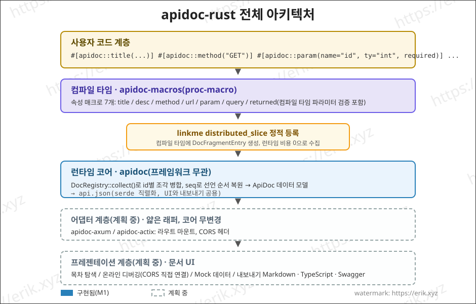
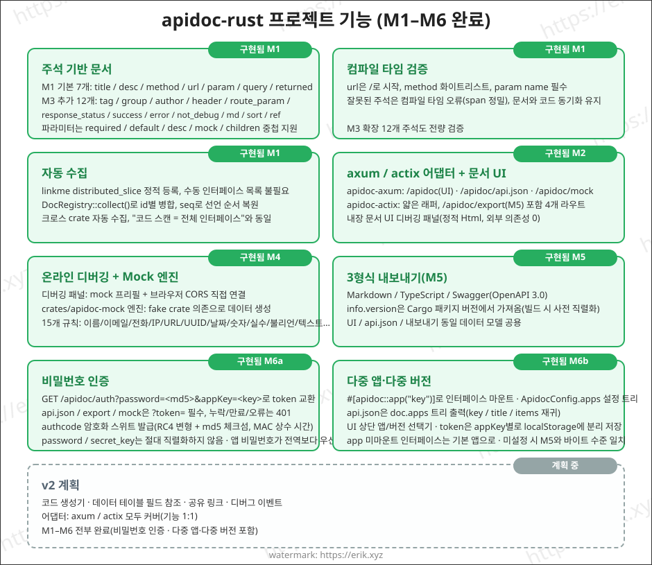
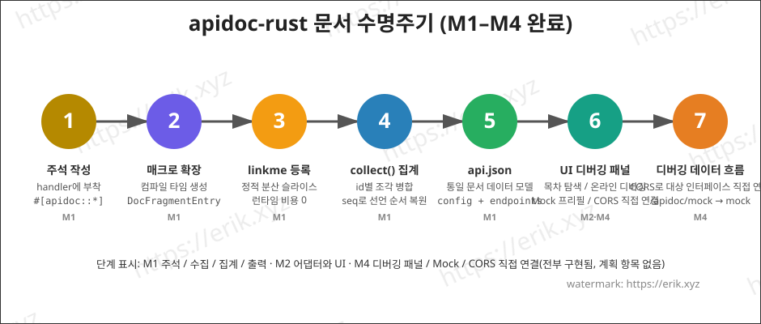

# Apidoc (apidoc-rust)

Rust 프로시저 매크로(proc-macro) 기반 API 문서 생성·인터페이스 개발 도구, axum·actix-web 등 주요 프레임워크 지원

[](https://github.com/erikwang2013/apidoc-rust)
[](https://github.com/erikwang2013/apidoc-rust)

[中文](../../README.md) ·
[English](README-en.md) ·
**[한국어](README-ko.md)** ·
[Русский](README-ru.md) ·
[Deutsch](README-de.md) ·
[Français](README-fr.md) ·
[Español](README-es.md) ·
[Português](README-pt.md) ·
[हिन्दी](README-hi.md) ·
[العربية](README-ar.md) ·
[বাংলা](README-bn.md) ·
[Bahasa Indonesia](README-id.md) ·
[日本語](README-ja.md)

## 📖프로젝트 소개

Apidoc은 **Rust 프로시저 매크로(proc-macro)** 를 파싱해 API 인터페이스 문서를 자동 생성하는 Rust 플러그인 라이브러리로, axum·actix-web 등 주요 프레임워크를 지원합니다. 문서 자동 생성 외에도 온라인 인터페이스 디버깅, Mock 디버깅 데이터, Json/TypeScript 코드 생성, 인터페이스 생성기, 코드 생성기 등의 기능을 통합해 인터페이스 개발·디버깅·납품의 전 과정을 아우르며, API 개발 효율 향상을 목표로 합니다.

> **프로젝트 출처**: 본 프로젝트는 [apidoc-php](https://github.com/erikwang2013/apidoc-php)(PHP 8 attributes 기반으로 API 문서를 생성하는 composer 확장)를 참고해 "주석이 곧 문서"라는 능력을 Rust 네이티브 방식으로 구현한 것으로, erikwang2013이 지속적으로 유지·확장하고 있습니다.

apidoc-rust의 구현 방향:

- **컴파일 타임 생성**: 문서는 프로시저 매크로에 의해 컴파일 타임에 생성되어, 문서와 코드가 결코 동기화되지 않을 일이 없습니다;
- **제로 비용 수집**: linkme 정적 등록으로 런타임에 한 번의 집계로 모든 인터페이스 문서를 얻습니다;
- **범용 플러그인**: 코어는 HTTP 프레임워크와 무관하며, 얇은 어댑터(axum / actix-web)로 어떤 프레임워크에도 연결됩니다.

### ✨프로젝트 설명

- **설치 즉시 사용**: 복잡한 설정 없이 설치 후 문서에 따라 주석을 작성하면 API 문서가 자동으로 생성됩니다.
- **간편한 작성**: 공통 정의(definitions)와 필드 `ref` 참조를 지원하며, 몇 줄의 주석만으로 완전한 필드 정의를 완성할 수 있습니다.
- **온라인 디버깅**: 문서 페이지에서 인터페이스를 바로 디버깅할 수 있으며, 전역 파라미터 전달, Mock 데이터, 디버깅 이벤트를 지원합니다.
- **다중 앱·다중 버전**: 단일 앱, 다중 앱, 다중 버전 프로젝트를 모두 설정할 수 있고, 인터페이스는 앱/버전별로 그룹화되어 표시·전환됩니다.
- **그룹·Tag**: 인터페이스는 다단계 그룹과 Tag 표시를 지원합니다.
- **Markdown 문서**: `md` 주석으로 Markdown을 문서 페이지로 마운트할 수 있습니다.
- **Json·TypeScript 생성**: 각 인터페이스의 Json 요청/응답 예시와 TypeScript 타입 정의를 자동 생성해 프런트엔드에서 바로 사용할 수 있습니다.
- **코드 생성기**: 설정 + 템플릿으로 비즈니스 코드와 프런트엔드 Api 파일을 생성합니다.
- **인터페이스 공유**: 지정한 앱/인터페이스의 공유 링크를 생성하고 `swagger.json`을 내보낼 수 있습니다.
- **안전한 접근**: 전역 비밀번호와 앱/버전별 독립 비밀번호 권한 부여를 지원하며, 문서 캐시를 켤 수 있습니다.

## 기능

### 구현됨 (M1-M3)

- **주석 기반 문서**: `title` / `desc` / `method` / `url` / `param` / `query` / `returned` 7개 속성 매크로로 개별 주석 작성(PHP attributes 방식에 대응), 파라미터는 `required` / `default` / `desc` / `mock` / `children` 중첩 지원
- **컴파일 타임 검증**: url은 반드시 `/`로 시작, method 화이트리스트, param name 필수 등, 잘못된 주석은 컴파일 타임에 오류 발생(span 정밀)
- **자동 수집**: linkme `distributed_slice` 정적 등록으로 수동 인터페이스 목록 불필요; `DocRegistry::collect()`가 id별로 병합하고 seq로 선언 순서를 복원하며, 크로스 crate 자동 수집
- **api.json 출력**: serde 직렬화로 통일된 문서 데이터 모델(config + endpoints) 생성, 필드는 PHP 의미론에 정렬
- **axum 어댑터 + 내장 문서 UI**: 라우트를 마운트하면 문서 페이지가 제공되며, 그룹 목차 탐색 지원(M2)
- **주석 보강**: `tag` / `group` / `author` / `header` / `route_param` / `response_status` / `success` / `error` / `not_debug` / `md` / `sort` / `ref` 12개 신규 주석(M3)

### 구현됨 (M4)

- **온라인 디버깅**: 문서 페이지에 내장된 「온라인 디버깅」 패널 — Base URL을 `location.origin`으로 미리 채워 크로스 오리진으로 대상 서비스에 직접 연결, 파라미터 폼에 mock 미리 채움, `{name}` / `:name` 라우트 플레이스홀더 치환, GET/HEAD 파라미터는 query로 병합, 나머지 method는 JSON body로 조립, 요청 헤더 편집 + 커스텀 헤더, 응답 표시(상태 / 소요 시간 / pretty JSON), CORS 실패 시 노란색 힌트
- **Mock 엔진**(`crates/apidoc/src/mock.rs`, fake crate 의존, 15개 규칙: name / company / email / phone / url / ip / city / country / text / number / int / float / bool / uuid / date). 규칙 우선순위: `mock="fake:xxx"`는 fake 규칙 테이블로 처리(미지정명은 기본값으로 폴백) → 그 외 비어 있지 않은 mock은 그대로 출력(예: `mock="1"`, `mock="erik"`) → mock 없으면 `ty`로 자동 생성(int→`"1"`, float→`"0.5"`, bool→`"true"`, object→`"{}"`, string→`"string"`); children은 재귀 중첩, array는 고정 2항목
- **mock 인터페이스**: axum 어댑터에 `GET /apidoc/mock?url=&method=` 추가, url + method 정확 일치, 불일치 시 404 반환; 디버깅 패널은 기본적으로 `not_debug` 엔드포인트를 숨기고, 「not_debug 인터페이스 표시」를 체크해야만 표시
- **CORS 직접 연결**: 온라인 디버깅은 브라우저가 대상 인터페이스에 직접 연결하며, 어댑터의 `cors_layer`가 허용 처리(서버 측 리버스 프록시는 v2에 예정)

### 구현됨 (M5)

- **3가지 형식 내보내기**(`crates/apidoc/src/export/`): markdown / typescript / swagger(OpenAPI 3.0.0), 코어 crate가 `export::markdown::render` / `export::typescript::render` / `export::swagger::render` 제공
- **내보내기 라우트**: 어댑터에 `GET /apidoc/export?format=md|ts|swagger` 추가, 알 수 없는 format은 400 반환; Content-Type은 각각 `text/markdown` / `application/typescript` / `application/json`
- **markdown**: 그룹 목차 + 파라미터 테이블 + 응답 블록; **typescript**: group별 네임스페이스로 `{Name}Params` / `{Name}Result` 타입 생성, 그룹 없는 인터페이스는 `defaultGroup`에 포함(`default`는 TS 예약어); **swagger**: `info.version`은 Cargo 패키지 버전 사용
- **actix-web 어댑터**(`crates/apidoc/src/actix.rs`): axum 어댑터와 기능 1:1 — `apidoc_routes(ApidocConfig) -> Scope`로 /apidoc, /apidoc/api.json, /apidoc/mock, /apidoc/export 마운트, `cors_layer(CorsConfig)`로 크로스 오리진 허용
- **UI 공유**: 문서 UI(`src/ui.html`)를 코어 crate로 이동해 `pub const UI_HTML`로 내보내며, 두 어댑터가 동일한 파일 참조(배포 패키징 안전)

### 구현됨 (M6)

- **비밀번호 인증(M6a)**: `AuthConfig { enable, password, secret_key, expire }` 활성화 시 클라이언트가 `GET /apidoc/auth?password=<md5(비밀번호)>&appKey=<key>`로 token 교환; 데이터 라우트 `/apidoc/api.json`, `/apidoc/export`, `/apidoc/mock`에는 `?token=xxx`를 첨부해야 하며, token이 없거나/만료/오류면 401 반환, 문서 UI에 비밀번호 마스크 팝업; token은 authcode 암호화 스위트로 서명(Discuz authcode를 줄 단위로 이식: RC4 변형 + md5 체크섬 + 패딩 없는 base64), 페이로드는 `{key: md5(md5(원본 비밀번호)), expire: now+expire}`, MAC 비교는 상수 시간
- **인증 보안 레드라인**: `password` / `secret_key`는 절대 직렬화되지 않으며, api.json 출력은 인증 미활성화 시와 바이트 수준 동일; auth 미활성화 시 `/apidoc/auth`는 404 반환, 데이터 라우트는 그냥 통과; 앱 설정에 독립 password가 있으면 앱 비밀번호가 전역 비밀번호보다 우선; `secret_key` 기본값 `"apidoc#hgcode"`(활성화 시 미설정이면 stderr 경고 1회), `expire` 기본값 86400초
- **다중 앱·다중 버전(M6b)**: `ApidocConfig.apps: Vec<AppConfig>`(`key` / `title` / `items` 재귀 하위 버전 / `password`)로 앱 트리 설정, `#[apidoc::app("key")]`로 인터페이스를 지정 앱 key에 연결, key 미지정 인터페이스는 기본 앱에 포함; api.json 출력에 `doc.apps` 트리 추가, UI 상단에 앱/버전 선택기 등장, token은 appKey별로 localStorage에 분리 저장(앱마다 독립 비밀번호 가능)

### 구현됨 (v2)

- **데이터 테이블 필드 참조(`table`)**: `#[apidoc::table("user")]`는 `ApidocConfig.tables`에 해당 key로 설정된 테이블의 필드를 `returned`에 **평탄화**해 병합합니다(`ref`와 같은 의미이며, 데이터 소스가 다른 엔드포인트가 아니라 설정 테이블이라는 점만 다릅니다); 필드는 `required` / `default` / `desc` / `mock` 지원; 설정되지 않은 key는 stderr 경고만 발생; 이 주석을 사용하지 않으면 출력은 v1과 바이트 수준 동일
- **문서 캐시**: `ApidocConfig.cache = Some(CacheConfig { enable, ttl })` — `/apidoc/mock` 출력을 `(url, method)` 기준으로 프로세스 내 메모이제이션하고 `ttl`초 후 만료되어 재생성, `ttl = 0`은 영구를 의미; 미설정이거나 비활성이면 캐시 경로를 전혀 타지 않음(출력 변화 없음). api.json / export는 라우트 마운트 시 이미 한 번 생성되므로 영구 캐시와 동등
- **공유 링크**: `GET /apidoc/share?app=&url=&method=&base=` → `{"url":"…"}` 딥링크(`?app=<key>&ep=<인터페이스 url>&method=<메서드>[&token=…]`); 문서 페이지의 각 인터페이스 옆에 「공유」 버튼(클립보드에 기록, 실패 시 복사 가능한 입력 상자로 폴백)이 있고, 딥링크를 열면 해당 앱/인터페이스로 바로 이동; 인증 활성화 시 링크에 서버가 발급한 token이 붙어(앱 독립 비밀번호가 전역 비밀번호보다 우선) 열면 비밀번호 불필요
- **코드 생성기**: `GET /apidoc/generate?template=<name>` → 렌더링된 텍스트(알 수 없는 템플릿은 404); 내장 `api.ts`(프런트엔드 Api 파일), `handler.rs`(Rust 인터페이스 골격), `schema.sql`(`tables` 기준 CREATE TABLE 문 생성); `ApidocConfig.codegen`의 동명 템플릿이 내장을 덮어씀. 템플릿 문법은 두 가지뿐: `{{변수}}`(정의되지 않으면 그대로 유지)와 `{{#each 목록}}…{{/each}}`(중첩 가능, 예: `tables` × `fields`)
- **디버깅 이벤트**: 온라인 디버깅 패널에 접이식 「사전 스크립트 / 사후 스크립트」(localStorage에 영속화) 추가 — 사전 스크립트는 `new Function('ctx', code)`로 요청 전에 실행되며 `ctx.url/method/headers/body`를 변경하거나 객체를 반환해 얕게 병합할 수 있고; 사후 스크립트는 응답 후 실행되어 `status/ms/text/url/method/ep`를 읽을 수 있으며 문자열을 반환하면 표시되는 응답 텍스트를 교체; 스크립트 오류는 결과 영역에만 표시되고 요청을 중단하지 않음

## 아키텍처



## 기능



## 수명주기



## 프로젝트 구조

```
apidoc-rust/
├── Cargo.toml                 # workspace 설정(resolver 2)
├── VERSION                    # 프로젝트 버전(v1.6.2)
├── crates/
│   ├── apidoc/                # 런타임 코어(프레임워크 무관)
│   │   ├── src/lib.rs         # 데이터 모델 + DocRegistry 집계 + api.json + UI_HTML
│   │   ├── src/auth.rs        # M6a 비밀번호 인증(authcode token 발급/검증 + 라우트 가드)
│   │   ├── src/export/        # M5 내보내기: markdown / typescript / swagger
│   │   ├── src/ui.html        # 공유 문서 UI(코어 crate에서 내보내며, 두 어댑터가 참조)
│   │   ├── tests/             # 통합 테스트(매크로 확장/집계/직렬화/크로스 crate)
│   │   └── examples/demo.rs   # 예제: 주석 + api.json 출력
│   ├── apidoc-macros/         # proc-macro: 20개 속성 매크로
│   │   └── src/lib.rs         # 매크로 정의 + 파라미터 파싱 + 컴파일 타임 검증

│   ├── apidoc-test-fixtures/  # 크로스 crate 등록 테스트 픽스처

├── .github/
│   └── workflows/release.yml  # 릴리스 워크플로(VERSION 읽기, 태그+릴리스 증분 생성)
└── docs/
    ├── images/                # 아키텍처/기능/수명주기 다이어그램(SVG)
    └── i18n/                  # 다국어 문서(12개 언어)
```

## 사용 방법

### 1. 의존성 추가

```toml
[dependencies]
apidoc-rust = "1.6"        # 또는 path = "crates/apidoc"

serde_json = "1"      # api.json 출력용
```

> Web 프레임워크에 따라 어댑터를 선택: axum은 `features = ["axum"]`, actix-web은 `features = ["actix"]`(둘 다 기능 1:1). `mock`(Mock 엔진)은 프레임워크 내부 의존성으로 어댑터가 자동으로 가져오므로, 일반적인 소비 측은 직접 사용할 필요가 없습니다.

### 2. 주석 작성

handler 함수에 개별 주석을 달면 문서가 컴파일 타임에 생성됩니다:

```rust
use apidoc::*;

#[apidoc::title("사용자 정보 조회")]
#[apidoc::desc("사용자 ID로 사용자 상세 조회")]
#[apidoc::url("/api/user/info")]
#[apidoc::method("GET")]
#[apidoc::param(name = "user_id", ty = "int", required, desc = "사용자 ID", mock = "1")]
#[apidoc::query(name = "lang", ty = "string", desc = "언어", default = "zh-CN")]
#[apidoc::returned(
    name = "data",
    ty = "object",
    desc = "사용자 데이터",
    children = [
        { name = "id", ty = "int", required, desc = "사용자 ID" },
        { name = "name", ty = "string", required, desc = "사용자 이름", mock = "erik" },
    ]
)]
fn get_user_info() -> String {
    unimplemented!()
}
```

### 3. 수집과 출력

```rust
fn main() {
    let doc = DocRegistry::collect_doc(ApidocConfig {
        title: "내 API".to_string(),
        description: None,
        auth: None,    // M6a 비밀번호 인증, 「8. 비밀번호 인증」참조
        apps: vec![],  // M6b 다중 앱·다중 버전, 「9. 다중 앱·다중 버전」참조
    });
    println!("{}", serde_json::to_string_pretty(&doc).unwrap());
}
```

### 4. 예제 실행

```bash
cargo run --example demo -p apidoc
```

출력(발췌):

```json
{
  "config": { "title": "demo api" },
  "endpoints": [
    {
      "title": "사용자 정보 조회",
      "desc": "사용자 ID로 사용자 상세 조회",
      "url": "/api/user/info",
      "method": "GET",
      "params": [
        { "name": "user_id", "type": "int", "required": true, "desc": "사용자 ID", "mock": "1" }
      ],
      "querys": [
        { "name": "lang", "type": "string", "required": false, "default": "zh-CN", "desc": "언어" }
      ],
      "returned": [
        {
          "name": "data",
          "type": "object",
          "required": false,
          "desc": "사용자 데이터",
          "children": [
            { "name": "id", "type": "int", "required": true, "desc": "사용자 ID" },
            { "name": "name", "type": "string", "required": true, "desc": "사용자 이름", "mock": "erik" }
          ]
        }
      ]
    }
  ]
}
```

### 5. 온라인 디버깅과 Mock(M4)

문서 페이지를 열고 → 인터페이스를 선택하면 → 오른쪽 「온라인 디버깅」 패널에 mock 규칙대로 파라미터가 미리 채워집니다 → Base URL을 대상 서비스 주소로 지정하고(기본 `location.origin`, 크로스 오리진 직접 연결) → 보내기를 누르면 실제 응답(상태 코드 / 소요 시간 / pretty JSON)을 얻습니다. 디버깅 패널은 기본적으로 `not_debug` 엔드포인트를 숨기며, 「not_debug 인터페이스 표시」를 체크한 후에만 보여줍니다.

**CORS 요구 사항**: 온라인 디버깅은 브라우저가 대상 인터페이스에 직접 연결하므로, 대상 서비스는 어댑터가 제공하는 `cors_layer`를 마운트해 크로스 오리진 요청을 허용해야 합니다. CORS 실패 시 패널에 노란색 힌트가 표시됩니다.

Mock 규칙 문법(3단계 우선순위):

```rust
#[apidoc::param(name = "email", ty = "string", desc = "邮箱", mock = "fake:email")]  // fake 규칙 생성
#[apidoc::param(name = "status", ty = "string", desc = "状态", mock = "1")]          // 비어 있지 않은 mock은 그대로 출력
#[apidoc::param(name = "name", ty = "string", desc = "用户名")]                       // mock 없음: ty로 자동 생성
#[apidoc::returned(
    name = "data",
    ty = "object",
    children = [
        { name = "id", ty = "int", required },       // mock 없음 → "1"
        { name = "email", ty = "string", mock = "fake:email" },  // children 재귀 중첩
    ]
)]
fn create_user() -> String {
    unimplemented!()
}
```

내장 fake 규칙 15개: `name` / `company` / `email` / `phone` / `url` / `ip` / `city` / `country` / `text` / `number` / `int` / `float` / `bool` / `uuid` / `date`; 알 수 없는 규칙명은 기본값으로 폴백됩니다. mock 없는 자동 생성 규칙: int→`"1"`, float→`"0.5"`, bool→`"true"`, object→`"{}"`, string→`"string"`; array는 고정 2항목.

### 6. 온라인 내보내기(M5)

어댑터에 내장된 3가지 형식 내보내기 인터페이스, 연결 후 바로 사용(알 수 없는 `format`은 400 반환):

```bash
GET /apidoc/export?format=md        # 그룹 목차 + 파라미터 테이블 + 응답 블록(text/markdown)
GET /apidoc/export?format=ts        # group별 네임스페이스로 {Name}Params / {Name}Result 타입 생성(application/typescript)
GET /apidoc/export?format=swagger   # OpenAPI 3.0.0 설명 파일(application/json)
```

- **markdown**: 프로젝트 Wiki / 릴리스 노트에 붙여넣기 적합, 그룹별 목차 출력, 각 인터페이스에 파라미터 테이블과 응답 블록 포함;
- **typescript**: 프론트엔드가 바로 타입 정의로 붙여넣기 가능; 그룹 없는 인터페이스는 `defaultGroup` 네임스페이스에 포함(`default`는 TS 예약어라 식별자로 사용 불가);
- **swagger**: `info.version`은 Cargo 패키지 버전 사용(현재 1.6.2), Swagger UI나 코드 생성기에 바로 가져오기 가능.

### 7. actix-web 어댑터

Web 프레임워크로 actix-web을 사용할 때 `features = ["actix"]` 연결(axum 어댑터와 기능 1:1):

```toml
[dependencies]
apidoc-rust = { version = "1.6", features = ["actix"] }
```

```rust
use actix_web::{App, HttpServer};
use apidoc::actix::{apidoc_routes, cors_layer, CorsConfig};
use apidoc::ApidocConfig;

#[actix_web::main]
async fn main() -> std::io::Result<()> {
    HttpServer::new(|| {
        App::new()
            .service(apidoc_routes(ApidocConfig {
                title: "내 API".to_string(),
                description: None,
                auth: None,    // M6a 비밀번호 인증, 「8. 비밀번호 인증」참조
                apps: vec![],  // M6b 다중 앱·다중 버전, 「9. 다중 앱·다중 버전」참조
            }))
            .wrap(cors_layer(CorsConfig::default()))   // M4 온라인 디버깅 크로스 오리진 허용
    })
    .bind("127.0.0.1:8080")?
    .run()
    .await
}
```

마운트 후 `/apidoc`(문서 UI), `/apidoc/api.json`(데이터), `/apidoc/mock`(Mock), `/apidoc/export`(내보내기)에 접근할 수 있습니다. CORS 빈 설정은 리터럴 `*`를 허용(자격 증명 미포함), `allow_origins` 화이트리스트를 설정하면 정확 일치로 Origin을 반사하며, 두 모드 모두 자격 증명을 열지 않습니다.

### 8. 비밀번호 인증(M6a)

`auth`를 활성화하면 문서에 비밀번호가 필요합니다(상위 apidoc-php의 Auth.php에 맞춰 token은 Discuz authcode 암호화 스위트를 줄 단위로 이식):

```rust
use apidoc::auth::AuthConfig;

let doc = DocRegistry::collect_doc(ApidocConfig {
    title: "내 API".to_string(),
    description: None,
    auth: Some(AuthConfig {
        enable: true,
        password: "your-password".to_string(),
        secret_key: "your-secret-key".to_string(), // 기본값 "apidoc#hgcode"(활성화 시 미설정이면 stderr 경고 1회)
        expire: 86400,                             // 초; 기본값 86400
    }),
    apps: vec![],
});
```

**흐름**:

1. 클라이언트가 `GET /apidoc/auth?password=<md5(비밀번호)>&appKey=<key>`로 token 교환(성공 시 `{"token":"..."}` 반환, 비밀번호 오류는 401); auth 미활성화 시 이 라우트는 404 반환, 데이터 라우트는 그냥 통과
2. 데이터 라우트 `GET /apidoc/api.json`, `/apidoc/export`, `/apidoc/mock`에는 `?token=xxx` 첨부 필요(특정 앱 선택 시 동시에 `&appKey=` 첨부); token이 없거나/만료/오류면 401 반환, 문서 UI가 자동으로 비밀번호 마스크 팝업, 비밀번호 입력 후 프론트엔드에서 md5로 제출해 token 교환
3. token 페이로드는 `{key: md5(md5(원본 비밀번호)), expire: now+expire}`, `secret_key`로 authcode 암호화(RC4 변형 + md5 체크섬 + 패딩 없는 base64, MAC 비교 상수 시간으로 타이밍 사이드 채널 방지)
4. `password` / `secret_key`는 절대 직렬화되지 않으며, api.json 출력은 인증 미활성화 시와 바이트 수준 동일; 앱에 독립 `password`를 설정하면 앱 비밀번호가 전역 비밀번호보다 우선

### 9. 다중 앱·다중 버전(M6b)

하나의 프로젝트를 여러 앱/버전으로 나눌 수 있으며, 각각 독립적으로 표시하고 접근을 제어합니다:

```rust
#[apidoc::title("获取用户信息")]
#[apidoc::app("demo")]   // key="demo" 앱에 연결; app 미지정 인터페이스는 기본 앱에 포함
fn get_user_info() -> String {
    unimplemented!()
}
```

```rust
let doc = DocRegistry::collect_doc(ApidocConfig {
    title: "내 API".to_string(),
    description: None,
    auth: None,
    apps: vec![
        AppConfig {
            key: "demo".to_string(),
            title: "演示应用".to_string(),
            items: vec![AppConfig {
                key: "v1".to_string(),
                title: "v1".to_string(),
                items: vec![],
                password: None,
            }],
            password: None, // 앱 독립 접근 비밀번호, 전역 비밀번호보다 우선, 절대 직렬화되지 않음
        },
    ],
});
```

- `AppConfig { key, title, items, password }`: `key`는 `#[apidoc::app("key")]` 주석이 참조하는 고유 식별자, `items`는 하위 버전/하위 앱을 재귀 중첩, `password`는 앱 독립 접근 비밀번호(독립 비밀번호가 있으면 앱 token만 검증)
- api.json 출력에 `doc.apps` 트리(key / title / items / endpoints) 추가; UI 상단에 앱/버전 선택기가 등장하며, 전환 시 해당 노드 기준으로 인터페이스를 렌더링하고 데이터를 다시 가져옴, token은 appKey별로 localStorage에 분리 저장
- `app` 주석이 `apps`에 설정되지 않은 key를 참조하면 stderr 경고 후 기본 앱에 포함; `app` 주석이 없거나 `apps` 미설정이면 M5와 바이트 수준 동일한 출력

### 10. 데이터 테이블 필드 참조 · 문서 캐시(v2)

```rust
ApidocConfig {
    // 테이블 구조는 설정으로 제공(Rust 측은 DB에 연결하지 않음), 주석은 key로 참조
    tables: vec![TableDef {
        key: "user".into(),
        title: "用户表".into(),
        fields: vec![
            TableField { name: "id".into(), ty: "int".into(), required: true, desc: Some("用户ID".into()), ..Default::default() },
            TableField { name: "name".into(), ty: "string".into(), mock: Some("erik".into()), ..Default::default() },
        ],
    }],
    // 문서 캐시: /apidoc/mock 출력을 (url, method) 기준으로 메모이제이션, ttl초 후 재생성(0 = 영구)
    cache: Some(CacheConfig { enable: true, ttl: 60 }),
    ..Default::default()   // title / description / auth / apps / codegen은 평소대로 설정
}
```

handler에서는 `ref`와 같은 방식으로 작성합니다: `#[apidoc::table("user")]`. 필드는 해당 인터페이스의 `returned`에 평탄화되어 병합됩니다; `tables`에 없는 key는 경고만 하고 오류를 내지 않습니다.

### 11. 공유 링크 · 코드 생성(v2)

- `GET /apidoc/share?app=api&url=/api/user/info&method=GET&base=https://example.com` → `{"url":"https://example.com/apidoc?app=api&ep=%2Fapi%2Fuser%2Finfo&method=GET"}` (인증 활성화 시 링크 끝에 `&token=…`이 붙어 열면 비밀번호 불필요)
- `GET /apidoc/generate?template=api.ts`(또는 `handler.rs` / `schema.sql`) → `text/plain; charset=utf-8`; 알 수 없는 템플릿은 404, 파라미터 누락은 400
- 사용자 정의 템플릿(동명 템플릿이 내장을 덮어씀):

```rust
ApidocConfig {
    codegen: vec![CodegenTemplate {
        name: "api.ts".into(),
        template: "// {{title}}\n{{#each endpoints}}// {{method}} {{url}}\n{{/each}}".into(),
    }],
    ..Default::default()
}
```

사용 가능한 템플릿 변수: 최상위 `title` / `description`; `{{#each endpoints}}` 내부 `title` / `url` / `method` / `group` / `desc` / `author`; `{{#each tables}}` 내부 `key` / `title`, 그 안의 `{{#each fields}}` 내부 `name` / `ty` / `required` / `default` / `desc` / `mock`, 그 외 파생 변수 `not_null` / `default_clause` / `comma`(유효한 SQL을 바로 생성하기 편리).

### 12. 디버그 사전/사후 스크립트(v2)

문서 페이지 「온라인 디버깅」 패널에서 「사전 스크립트」「사후 스크립트」를 펼칩니다(내용은 localStorage에 저장):

```js
// 사전: 요청 전송 전 실행, ctx.url / method / headers / body 변경 가능, 또는 객체를 반환해 얕은 병합
ctx.headers['X-Token'] = localStorage.getItem('token') || '';
```

```js
// 사후: 응답 수신 후 실행, ctx = { status, ms, text, url, method, ep }(읽기 전용)
// 문자열을 반환하면 결과 영역에 표시되는 텍스트를 교체
return 'HTTP ' + ctx.status + ' · ' + ctx.ms + 'ms\n' + ctx.text;
```

스크립트 오류는 디버깅 결과 영역에만 표시되고 요청을 중단하지 않습니다(사전 실패 시에도 요청은 정상 전송, 사후 실패 시에도 원본 응답을 그대로 표시).

## 개발 계획

| 단계 | 내용 | 상태 |
|------|------|------|
| M1 | workspace 뼈대 + 데이터 모델 + 매크로 MVP + linkme 등록 | ✅ 완료 |
| M2 | axum 어댑터 + 내장 문서 UI + 그룹 목차 | ✅ 완료 |
| M3 | 주석 보강(tag/group/author/header/route_param/response_status/success/error/not_debug/md/sort/ref) | ✅ 완료 |
| M4 | 온라인 디버깅 + Mock 엔진 | ✅ 완료 |
| M5 | markdown / typescript / swagger.json 내보내기(OpenAPI3) | ✅ 완료 |
| —  | actix-web 어댑터(axum과 기능 1:1) | ✅ 완료 |
| M6a | 비밀번호 인증(authcode token + 비밀번호 마스크, 앱 비밀번호 우선) | ✅ 완료 |
| M6b | 다중 앱·다중 버전(apps 설정 트리 + app 주석 + UI 선택기) | ✅ 완료 |
| v2 | 데이터 테이블 필드 참조 + 문서 캐시 + 공유 링크 + 코드 생성기 + 디버깅 이벤트 | ✅ 완료 |

## 다국어 문서

- [English](README-en.md)
- [한국어](README-ko.md)
- [Русский](README-ru.md)
- [Deutsch](README-de.md)
- [Français](README-fr.md)
- [Español](README-es.md)
- [Português](README-pt.md)
- [हिन्दी](README-hi.md)
- [العربية](README-ar.md)
- [বাংলা](README-bn.md)
- [Bahasa Indonesia](README-id.md)
- [日本語](README-ja.md)

## 후원과 기부

이 프로젝트가 도움이 되셨다면 ⭐ Star로 응원해 주시고, 오픈소스 후원 기부도 환영합니다!

### 微信支付 / 支付宝 (WeChat Pay / Alipay)

| 微信支付 (WeChat Pay) | 支付宝 (Alipay) |
|---|---|
|  |  |

### 글로벌 송금 기부

**【수취인 정보】**

- 수취인 이름: WANG KEXUN
- 수취 계좌 번호: 881015918251

**【수취 은행】**

- ZA Bank SWIFT Code: AABLHKHHXXX
- 은행 이름: ZA Bank Limited
- 은행 번호: 387
- 은행 주소: Core F, Cyberport 3, 100 Cyberport Road, Hong Kong

**【해외 송금 중개 은행(필요 시)】**

> 참고: 이는 해외 송금 중개 은행(중개 은행) 정보이며 수취 은행 정보가 아닙니다. 송금 은행에 중개 은행 정보 제공이 필요한지 문의하시기 바랍니다.

- **홍콩 달러, 위안화, 미국 달러 송금 시 중개 은행은 Citibank:**
  - 은행 이름: Citibank N.A. Hong Kong
  - SWIFT Code: CITIHKHXXXX
  - 은행 번호: 006
  - 지점 이름: Hong Kong Branch
  - 지점 번호: 391
  - 은행 주소: Citibank Tower, Citibank Plaza, 3 Garden Road, Central, Hong Kong
- **기타 통화 송금 시 중개 은행은 BNY Mellon:**
  - 은행 이름: THE BANK OF NEW YORK MELLON
  - SWIFT Code: IRVTUS3NXXX
  - 은행 주소: THE BANK OF NEW YORK MELLON, 240 GREENWICH STREET, NEW YORK, United States

## License

[MIT](LICENSE)
