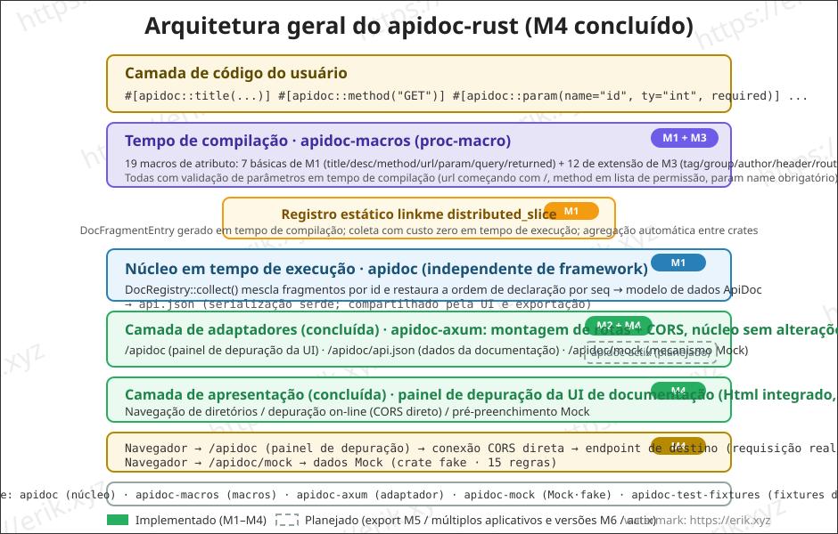
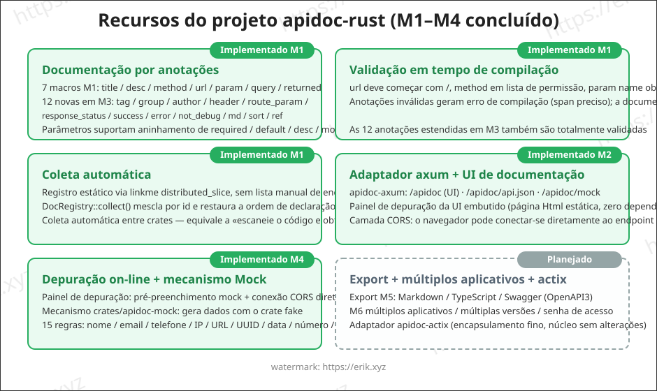
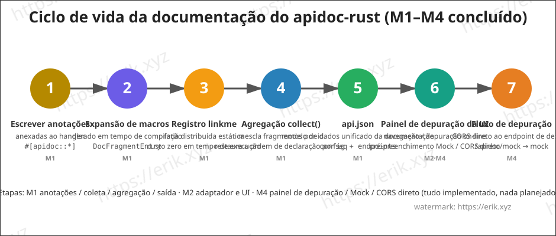

<h1 align="center">Apidoc (apidoc-rust)</h1>

<div align="center">
 Biblioteca de plugins universal para gerar documentação de API a partir de macros de procedimento (proc-macro) do Rust
</div>

<div align="center">
<a href="https://github.com/erikwang2013/apidoc-rust"></a>
<a href="https://github.com/erikwang2013/apidoc-rust"></a>
</div>

<div align="center">
<a href="../../README.md">中文</a> ·
<a href="README-en.md">English</a> ·
<a href="README-ko.md">한국어</a> ·
<a href="README-ru.md">Русский</a> ·
<a href="README-de.md">Deutsch</a> ·
<a href="README-fr.md">Français</a> ·
<a href="README-es.md">Español</a> ·
<a href="README-pt.md"><strong>Português</strong></a> ·
<a href="README-hi.md">हिन्दी</a> ·
<a href="README-ar.md">العربية</a> ·
<a href="README-bn.md">বাংলা</a> ·
<a href="README-id.md">Bahasa Indonesia</a> ·
<a href="README-ja.md">日本語</a>
</div>

## Introdução

apidoc-rust é um **gerador de documentação de API universal e baseado em plugins** implementado em Rust, inspirado no [apidoc-php](https://github.com/erikwang2013/apidoc-php) (uma extensão do Composer que gera documentação de API a partir dos attributes do PHP 8). Ele concretiza o conceito de "anotações como documentação" na forma nativa do Rust:

- **Geração em tempo de compilação**: a documentação é gerada por macros de procedimento durante a compilação, garantindo que ela nunca fique dessincronizada do código;
- **Coleta de custo zero**: registro estático via linkme; uma única agregação em tempo de execução obtém toda a documentação da API;
- **Plugin universal**: o núcleo é independente do framework HTTP e se conecta a qualquer framework por meio de adaptadores finos (axum / actix-web).

## Recursos

### Implementado (M1-M3)

- **Documentação por anotações**: sete macros de atributo — `title` / `desc` / `method` / `url` / `param` / `query` / `returned` — para anotar item a item (equivalente à sintaxe de attributes do PHP); os parâmetros suportam aninhamento de `required` / `default` / `desc` / `mock` / `children`
- **Validação em tempo de compilação**: url deve começar com `/`, method em lista de permissão, param name obrigatório etc.; anotações inválidas geram erro de compilação (com span preciso)
- **Coleta automática**: registro estático via `distributed_slice` do linkme, sem necessidade de lista manual de endpoints; `DocRegistry::collect()` mescla por id e restaura a ordem de declaração por seq, coletando automaticamente entre crates
- **Saída api.json**: o serde serializa um modelo de dados unificado da documentação (config + endpoints), com campos alinhados à semântica do PHP
- **Adaptador axum + UI de documentação embutida**: montar a rota já fornece a página de documentação; navegação por diretórios agrupados (M2)
- **Complemento de anotações**: 12 novas anotações — `tag` / `group` / `author` / `header` / `route_param` / `response_status` / `success` / `error` / `not_debug` / `md` / `sort` / `ref` (M3)

### Implementado (M4)

- **Depuração on-line**: a página de documentação inclui o painel «Depuração on-line» — Base URL pré-preenchida com `location.origin` para conexão direta entre domínios ao serviço de destino, parâmetros do formulário pré-preenchidos com mock, substituição de placeholders de rota `{name}` / `:name`, parâmetros GET/HEAD incorporados à query string, corpo JSON montado para os demais métodos, edição de cabeçalhos da requisição + cabeçalhos personalizados, exibição da resposta (status / tempo / JSON bonito), aviso amarelo em caso de falha de CORS
- **Mecanismo Mock** (`crates/apidoc-mock`, depende do crate fake, 15 regras: name / company / email / phone / url / ip / city / country / text / number / int / float / bool / uuid / date). Prioridade das regras: `mock="fake:xxx"` usa a tabela de regras fake (nome desconhecido → valor padrão) → demais mock não vazios são emitidos como estão (ex.: `mock="1"`, `mock="erik"`) → sem mock, geração automática conforme `ty` (int→`"1"`, float→`"0.5"`, bool→`"true"`, object→`"{}"`, string→`"string"`); children aninhados recursivamente, array fixado em 2 itens
- **Endpoint mock**: o adaptador axum adiciona `GET /apidoc/mock?url=&method=`, correspondência exata de url + method, retorna 404 se não houver correspondência; o painel de depuração oculta por padrão os endpoints `not_debug`, que só aparecem ao marcar «Mostrar endpoints not_debug»
- **Conexão CORS direta**: a depuração on-line conecta o navegador diretamente ao endpoint de destino; o `cors_layer` do adaptador libera o acesso (proxy reverso no servidor fica para v2)

### Implementado (M5)

- **Exportação em três formatos** (`crates/apidoc/src/export/`): markdown / typescript / swagger (OpenAPI 3.0.0); o crate central fornece `export::markdown::render` / `export::typescript::render` / `export::swagger::render`
- **Rotas de exportação**: os adaptadores adicionam `GET /apidoc/export?format=md|ts|swagger`, formato desconhecido → 400; Content-Type: `text/markdown` / `application/typescript` / `application/json`
- **markdown**: índice por grupos + tabela de parâmetros + bloco de resposta; **typescript**: gera os tipos `{Name}Params` / `{Name}Result` por namespace de grupo, endpoints sem grupo caem em `defaultGroup` (`default` é palavra reservada de TS); **swagger**: `info.version` vem do conteúdo do arquivo `VERSION` da raiz
- **Adaptador actix-web** (`crates/apidoc-actix`): funcionalidade 1:1 com o adaptador axum — `apidoc_routes(ApidocConfig) -> Scope` monta /apidoc, /apidoc/api.json, /apidoc/mock, /apidoc/export, `cors_layer(CorsConfig)` libera CORS
- **UI compartilhada**: a UI de documentação (`src/ui.html`) sobe para o crate central, exportada como `pub const UI_HTML`; os dois adaptadores referenciam a mesma cópia (seguro para empacotamento de publicação)

### Planejado

- Múltiplos aplicativos / múltiplas versões / senha de acesso
- v2: gerador de código, referência de campos de tabelas de dados, links de compartilhamento, eventos de depuração

## Arquitetura



## Funcionalidades



## Ciclo de vida



## Estrutura do projeto

```
apidoc-rust/
├── Cargo.toml                 # configuração do workspace (resolver 2)
├── VERSION                    # versão do projeto (v1.1.0, separada da versão do framework 0.1.0)
├── crates/
│   ├── apidoc/                # núcleo em tempo de execução (independente de framework)
│   │   ├── src/lib.rs         # modelo de dados + agregação DocRegistry + api.json + UI_HTML
│   │   ├── src/export/        # exportação M5: markdown / typescript / swagger
│   │   ├── src/ui.html        # UI de documentação compartilhada (exportada pelo crate central, referenciada pelos dois adaptadores)
│   │   ├── tests/             # testes de integração (expansão de macros/agregação/serialização/entre crates)
│   │   └── examples/demo.rs   # exemplo: anotações + saída api.json
│   ├── apidoc-macros/         # proc-macro: 19 macros de atributo
│   │   └── src/lib.rs         # definição de macros + análise de parâmetros + validação em tempo de compilação
│   ├── apidoc-mock/           # mecanismo Mock (geração de dados Mock por regras fake)
│   ├── apidoc-test-fixtures/  # fixture de teste para registro entre crates
│   ├── apidoc-axum/           # adaptador axum (rotas de documentação + cors_layer + mock + export)
│   └── apidoc-actix/          # adaptador actix-web (funcionalidade 1:1 com axum)
├── .github/
│   └── workflows/release.yml  # workflow de lançamento (lê VERSION, cria tag + release de forma incremental)
└── docs/
    ├── images/                # diagramas de arquitetura/recursos/ciclo de vida (SVG)
    └── i18n/                  # documentação multilíngue (12 idiomas)
```

## Como usar

### 1. Adicionar dependências

```toml
[dependencies]
apidoc = "0.1"        # ou path = "crates/apidoc"
apidoc-macros = "0.1"
linkme = "0.3"        # a expansão de macros referencia diretamente o caminho do linkme; consumidores precisam depender dele diretamente
serde_json = "1"      # usado para gerar o api.json
```

> Adaptador conforme o framework Web: `apidoc-axum` para axum, `apidoc-actix` para actix-web (ambos com funcionalidade 1:1). `apidoc-mock` (mecanismo Mock) é dependência interna do framework, importada automaticamente pelo adaptador; normalmente o consumidor não precisa usá-lo diretamente.

### 2. Escrever anotações

Anexe as anotações item a item às funções handler e a documentação será gerada em tempo de compilação:

```rust
use apidoc::*;

#[apidoc::title("获取用户信息")]
#[apidoc::desc("根据用户 ID 查询用户详情")]
#[apidoc::url("/api/user/info")]
#[apidoc::method("GET")]
#[apidoc::param(name = "user_id", ty = "int", required, desc = "用户ID", mock = "1")]
#[apidoc::query(name = "lang", ty = "string", desc = "语言", default = "zh-CN")]
#[apidoc::returned(
    name = "data",
    ty = "object",
    desc = "用户数据",
    children = [
        { name = "id", ty = "int", required, desc = "用户ID" },
        { name = "name", ty = "string", required, desc = "用户名", mock = "erik" },
    ]
)]
fn get_user_info() -> String {
    unimplemented!()
}
```

### 3. Coleta e saída

```rust
fn main() {
    let endpoints = DocRegistry::collect();
    let doc = ApiDoc {
        config: ApidocConfig {
            title: "我的 API".to_string(),
            description: None,
        },
        endpoints,
    };
    println!("{}", serde_json::to_string_pretty(&doc).unwrap());
}
```

### 4. Executar o exemplo

```bash
cargo run --example demo -p apidoc
```

Saída (trecho):

```json
{
  "config": { "title": "demo api" },
  "endpoints": [
    {
      "title": "获取用户信息",
      "desc": "根据用户 ID 查询用户详情",
      "url": "/api/user/info",
      "method": "GET",
      "params": [
        { "name": "user_id", "type": "int", "required": true, "desc": "用户ID", "mock": "1" }
      ],
      "querys": [
        { "name": "lang", "type": "string", "required": false, "default": "zh-CN", "desc": "语言" }
      ],
      "returned": [
        {
          "name": "data",
          "type": "object",
          "required": false,
          "desc": "用户数据",
          "children": [
            { "name": "id", "type": "int", "required": true, "desc": "用户ID" },
            { "name": "name", "type": "string", "required": true, "desc": "用户名", "mock": "erik" }
          ]
        }
      ]
    }
  ]
}
```

### 5. Depuração on-line e Mock (M4)

Abra a página de documentação → selecione um endpoint → o painel «Depuração on-line» à direita pré-preenche os parâmetros conforme as regras de Mock → aponte a Base URL para o endereço do serviço de destino (padrão `location.origin`, conexão direta entre domínios) → clique em Enviar e obtenha a resposta real (código de status / tempo / JSON bonito). O painel de depuração oculta por padrão os endpoints `not_debug`, que só aparecem após marcar «Mostrar endpoints not_debug».

**Requisito de CORS**: a depuração on-line conecta o navegador diretamente ao endpoint de destino; o serviço de destino precisa montar o `cors_layer` fornecido pelo adaptador para liberar requisições entre domínios; se o CORS falhar, o painel exibe um aviso amarelo.

Sintaxe das regras Mock (três prioridades):

```rust
#[apidoc::param(name = "email", ty = "string", desc = "邮箱", mock = "fake:email")]  // gerado pela regra fake
#[apidoc::param(name = "status", ty = "string", desc = "状态", mock = "1")]          // mock não vazio emitido como está
#[apidoc::param(name = "name", ty = "string", desc = "用户名")]                       // sem mock: geração automática conforme ty
#[apidoc::returned(
    name = "data",
    ty = "object",
    children = [
        { name = "id", ty = "int", required },       // sem mock → "1"
        { name = "email", ty = "string", mock = "fake:email" },  // aninhamento recursivo de children
    ]
)]
fn create_user() -> String {
    unimplemented!()
}
```

15 regras fake integradas: `name` / `company` / `email` / `phone` / `url` / `ip` / `city` / `country` / `text` / `number` / `int` / `float` / `bool` / `uuid` / `date`; nomes de regra desconhecidos voltam ao valor padrão. Geração automática sem mock: int→`"1"`, float→`"0.5"`, bool→`"true"`, object→`"{}"`, string→`"string"`; array fixado em 2 itens.

### 6. Exportação on-line (M5)

Os adaptadores integram rotas de exportação em três formatos, prontas ao conectar (formato desconhecido → 400):

```bash
GET /apidoc/export?format=md        # índice por grupos + tabela de parâmetros + blocos de resposta (text/markdown)
GET /apidoc/export?format=ts        # gera os tipos {Name}Params / {Name}Result por namespace de grupo (application/typescript)
GET /apidoc/export?format=swagger   # arquivo descritivo OpenAPI 3.0.0 (application/json)
```

- **markdown**: ideal para colar no Wiki do projeto / notas de versão, índice por grupos, cada endpoint com tabela de parâmetros e bloco de resposta;
- **typescript**: o front pode colar diretamente as definições de tipos; endpoints sem grupo caem no namespace `defaultGroup` (`default` é palavra reservada de TS, não pode ser usado como identificador);
- **swagger**: `info.version` vem do conteúdo do arquivo `VERSION` da raiz (atualmente 1.1.0), importável diretamente no Swagger UI ou em um gerador de código.

### 7. Adaptador actix-web

Se o framework Web for actix-web, conecte `apidoc-actix` (funcionalidade 1:1 com o adaptador axum):

```toml
[dependencies]
apidoc-actix = "0.1"     # ou path = "crates/apidoc-actix"
```

```rust
use actix_web::{App, HttpServer};
use apidoc_actix::{apidoc_routes, cors_layer, ApidocConfig, CorsConfig};

#[actix_web::main]
async fn main() -> std::io::Result<()> {
    HttpServer::new(|| {
        App::new()
            .service(apidoc_routes(ApidocConfig {
                title: "我的 API".to_string(),
                description: None,
            }))
            .wrap(cors_layer(CorsConfig::default()))   // libera CORS para a depuração on-line (M4)
    })
    .bind("127.0.0.1:8080")?
    .run()
    .await
}
```

Após montar, ficam acessíveis `/apidoc` (UI de documentação), `/apidoc/api.json` (dados), `/apidoc/mock` (Mock) e `/apidoc/export` (exportação). A configuração CORS vazia libera literalmente `*` (sem cookies); com lista de permissões `allow_origins`, há correspondência exata refletindo o Origin; nenhum dos modos envia cookies.

## Roteiro de desenvolvimento

| Fase | Conteúdo | Status |
|------|----------|--------|
| M1 | esqueleto do workspace + modelo de dados + MVP de macros + registro linkme | ✅ Concluído |
| M2 | adaptador axum + UI de documentação embutida + diretório agrupado | ✅ Concluído |
| M3 | macros de atributo complementares (tag/group/author/header/route_param/response_status/success/error/not_debug/md/sort/ref) | ✅ Concluído |
| M4 | depuração on-line + mecanismo Mock | ✅ Concluído |
| M5 | exportação markdown / typescript / swagger.json (OpenAPI3) | ✅ Concluído |
| —  | adaptador actix-web (funcionalidade 1:1 com axum) | ✅ Concluído |
| M6 | autenticação por senha, múltiplos aplicativos e versões, lançamento | Planejado |

## Documentação multilíngue

- [English](README-en.md)
- [한국어](README-ko.md)
- [Русский](README-ru.md)
- [Deutsch](README-de.md)
- [Français](README-fr.md)
- [Español](README-es.md)
- [Português](README-pt.md)
- [हिन्दी](README-hi.md)
- [العربية](README-ar.md)
- [বাংলা](README-bn.md)
- [Bahasa Indonesia](README-id.md)
- [日本語](README-ja.md)

## Suporte e doações

Se este projeto foi útil para você, considere dar uma ⭐ Star para nos apoiar — também aceitamos doações para apoiar o código aberto!

### WeChat Pay (微信支付) / Alipay (支付宝)

<table>
  <tr>
    <td align="center">
      <br/>
      <strong>WeChat Pay (微信支付)</strong>
    </td>
    <td align="center">
      <br/>
      <strong>Alipay (支付宝)</strong>
    </td>
  </tr>
</table>

### Doações por transferência internacional

**【Informações do beneficiário】**

- Nome do beneficiário: WANG KEXUN
- Número da conta do beneficiário: 881015918251

**【Banco do beneficiário】**

- Código SWIFT do ZA Bank: AABLHKHHXXX
- Nome do banco: ZA Bank Limited
- Código do banco: 387
- Endereço do banco: Core F, Cyberport 3, 100 Cyberport Road, Hong Kong

**【Banco intermediário para remessas internacionais (se necessário)】**

> Atenção: estas são informações do banco intermediário (correspondente) para remessas internacionais, e não do banco do beneficiário. Consulte o seu banco remetente para saber se as informações do banco intermediário são necessárias.

- **O banco intermediário para depósitos em dólares de Hong Kong (HKD), RMB e dólares americanos (USD) é o Citibank:**
  - Nome do banco: Citibank N.A. Hong Kong
  - Código SWIFT: CITIHKHXXXX
  - Código do banco: 006
  - Nome da agência: Hong Kong Branch
  - Número da agência: 391
  - Endereço do banco: Citibank Tower, Citibank Plaza, 3 Garden Road, Central, Hong Kong
- **O banco intermediário para outras moedas é o BNY Mellon:**
  - Nome do banco: THE BANK OF NEW YORK MELLON
  - Código SWIFT: IRVTUS3NXXX
  - Endereço do banco: THE BANK OF NEW YORK MELLON, 240 GREENWICH STREET, NEW YORK, United States

## License

[MIT](../../LICENSE)
