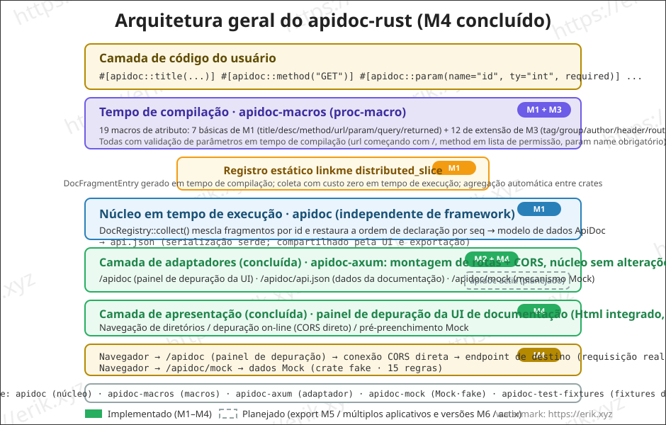
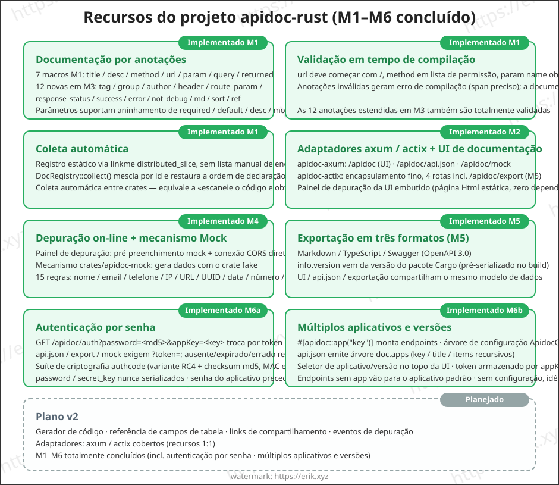
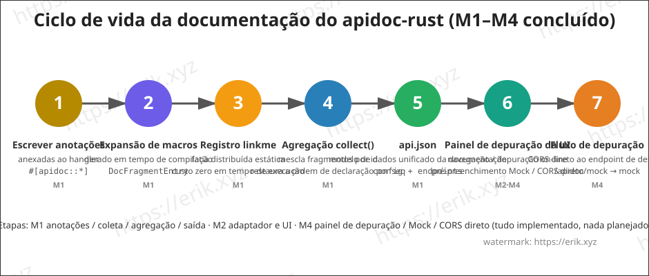

# Apidoc (apidoc-rust)

Ferramenta de geração de documentação de API e desenvolvimento de interfaces baseada em macros de procedimento (proc-macro) do Rust, compatível com axum, actix-web e outros frameworks populares

[](https://github.com/erikwang2013/apidoc-rust)
[](https://github.com/erikwang2013/apidoc-rust)

[中文](../../README.md) ·
[English](README-en.md) ·
[한국어](README-ko.md) ·
[Русский](README-ru.md) ·
[Deutsch](README-de.md) ·
[Français](README-fr.md) ·
[Español](README-es.md) ·
**[Português](README-pt.md)** ·
[हिन्दी](README-hi.md) ·
[العربية](README-ar.md) ·
[বাংলা](README-bn.md) ·
[Bahasa Indonesia](README-id.md) ·
[日本語](README-ja.md)

## 📖Introdução

O Apidoc é uma biblioteca de plugins em Rust que gera automaticamente documentação de interfaces de API analisando **macros de procedimento (proc-macro) do Rust**, compatível com frameworks populares como axum e actix-web. Além da geração automática de documentação, integra depuração de interfaces on-line, dados de teste Mock, geração de código Json/TypeScript, gerador de endpoints, gerador de código e outros recursos, cobrindo todo o fluxo de desenvolvimento, depuração e entrega de interfaces, com o objetivo de aumentar a eficiência do desenvolvimento de APIs.

> **Origem do projeto**: este projeto toma como referência o [apidoc-php](https://github.com/erikwang2013/apidoc-php) (uma extensão do Composer que gera documentação de API a partir dos attributes do PHP 8), concretizando o conceito de «anotações como documentação» na forma nativa do Rust, com manutenção e ampliação contínuas por parte de erikwang2013.

Abordagem de implementação do apidoc-rust:

- **Geração em tempo de compilação**: a documentação é gerada por macros de procedimento durante a compilação, garantindo que ela nunca fique dessincronizada do código;
- **Coleta de custo zero**: registro estático via linkme; uma única agregação em tempo de execução obtém toda a documentação da API;
- **Plugin universal**: o núcleo é independente do framework HTTP e se conecta a qualquer framework por meio de adaptadores finos (axum / actix-web).

### ✨Descrição do projeto

- **Pronto para usar**: sem configurações complicadas; após a instalação, basta escrever as anotações conforme a documentação para gerar automaticamente a documentação da API.
- **Escrita simples**: suporta definições gerais (definitions) e referências `ref` de campos; algumas poucas anotações bastam para completar a definição de todos os campos.
- **Depuração on-line**: depure os endpoints diretamente na página de documentação, com suporte a parâmetros globais, dados Mock e eventos de depuração.
- **Múltiplos aplicativos/versões**: projetos com aplicativo único, múltiplos aplicativos e múltiplas versões são configuráveis; os endpoints são exibidos e alternados por aplicativo/versão.
- **Grupos/Tag**: os endpoints suportam agrupamento multinível e marcação por Tag.
- **Documentação Markdown**: a anotação `md` permite montar Markdown como página de documentação.
- **Geração Json/TypeScript**: cada endpoint gera automaticamente exemplos de requisição/resposta Json e definições de tipos TypeScript, prontos para uso direto no frontend.
- **Gerador de código**: com configuração + templates é possível gerar o código de negócio e os arquivos Api do frontend.
- **Compartilhamento de endpoints**: permite gerar links de compartilhamento de um aplicativo/endpoint específico e exportar `swagger.json`.
- **Acesso seguro**: suporta autorização com senha global e senhas independentes por aplicativo/versão, além de permitir ativar o cache de documentação.

## Recursos

### Implementado (M1-M3)

- **Documentação por anotações**: sete macros de atributo — `title` / `desc` / `method` / `url` / `param` / `query` / `returned` — para anotar item a item (equivalente à sintaxe de attributes do PHP); os parâmetros suportam aninhamento de `required` / `default` / `desc` / `mock` / `children`
- **Validação em tempo de compilação**: url deve começar com `/`, method em lista de permissão, param name obrigatório etc.; anotações inválidas geram erro de compilação (com span preciso)
- **Coleta automática**: registro estático via `distributed_slice` do linkme, sem necessidade de lista manual de endpoints; `DocRegistry::collect()` mescla por id e restaura a ordem de declaração por seq, coletando automaticamente entre crates
- **Saída api.json**: o serde serializa um modelo de dados unificado da documentação (config + endpoints), com campos alinhados à semântica do PHP
- **Adaptador axum + UI de documentação embutida**: montar a rota já fornece a página de documentação; navegação por diretórios agrupados (M2)
- **Complemento de anotações**: 12 novas anotações — `tag` / `group` / `author` / `header` / `route_param` / `response_status` / `success` / `error` / `not_debug` / `md` / `sort` / `ref` (M3)

### Implementado (M4)

- **Depuração on-line**: a página de documentação inclui o painel «Depuração on-line» — Base URL pré-preenchida com `location.origin` para conexão direta entre domínios ao serviço de destino, parâmetros do formulário pré-preenchidos com mock, substituição de placeholders de rota `{name}` / `:name`, parâmetros GET/HEAD incorporados à query string, corpo JSON montado para os demais métodos, edição de cabeçalhos da requisição + cabeçalhos personalizados, exibição da resposta (status / tempo / JSON bonito), aviso amarelo em caso de falha de CORS
- **Mecanismo Mock** (`crates/apidoc/src/mock.rs`, depende do crate fake, 15 regras: name / company / email / phone / url / ip / city / country / text / number / int / float / bool / uuid / date). Prioridade das regras: `mock="fake:xxx"` usa a tabela de regras fake (nome desconhecido → valor padrão) → demais mock não vazios são emitidos como estão (ex.: `mock="1"`, `mock="erik"`) → sem mock, geração automática conforme `ty` (int→`"1"`, float→`"0.5"`, bool→`"true"`, object→`"{}"`, string→`"string"`); children aninhados recursivamente, array fixado em 2 itens
- **Endpoint mock**: o adaptador axum adiciona `GET /apidoc/mock?url=&method=`, correspondência exata de url + method, retorna 404 se não houver correspondência; o painel de depuração oculta por padrão os endpoints `not_debug`, que só aparecem ao marcar «Mostrar endpoints not_debug»
- **Conexão CORS direta**: a depuração on-line conecta o navegador diretamente ao endpoint de destino; o `cors_layer` do adaptador libera o acesso (proxy reverso no servidor fica para v2)

### Implementado (M5)

- **Exportação em três formatos** (`crates/apidoc/src/export/`): markdown / typescript / swagger (OpenAPI 3.0.0); o crate central fornece `export::markdown::render` / `export::typescript::render` / `export::swagger::render`
- **Rotas de exportação**: os adaptadores adicionam `GET /apidoc/export?format=md|ts|swagger`, formato desconhecido → 400; Content-Type: `text/markdown` / `application/typescript` / `application/json`
- **markdown**: índice por grupos + tabela de parâmetros + bloco de resposta; **typescript**: gera os tipos `{Name}Params` / `{Name}Result` por namespace de grupo, endpoints sem grupo caem em `defaultGroup` (`default` é palavra reservada de TS); **swagger**: `info.version` vem do conteúdo do arquivo `VERSION` da raiz
- **Adaptador actix-web** (`crates/apidoc/src/actix.rs`): funcionalidade 1:1 com o adaptador axum — `apidoc_routes(ApidocConfig) -> Scope` monta /apidoc, /apidoc/api.json, /apidoc/mock, /apidoc/export, `cors_layer(CorsConfig)` libera CORS
- **UI compartilhada**: a UI de documentação (`src/ui.html`) sobe para o crate central, exportada como `pub const UI_HTML`; os dois adaptadores referenciam a mesma cópia (seguro para empacotamento de publicação)

### Implementado (M6)

- **Autenticação por senha (M6a)**: com `AuthConfig { enable, password, secret_key, expire }` ativado, o cliente troca por um token via `GET /apidoc/auth?password=<md5(senha)>&appKey=<key>`; as rotas de dados `/apidoc/api.json`, `/apidoc/export` e `/apidoc/mock` exigem `?token=xxx` — token ausente/expirado/incorreto retorna 401, e a UI da documentação mostra uma máscara de senha; o token é assinado com o conjunto de criptografia authcode (porta linha por linha do Discuz authcode: variante RC4 + soma de verificação md5 + base64 sem padding), com payload `{key: md5(md5(senha original)), expire: now+expire}` e comparação MAC em tempo constante
- **Linhas vermelhas de segurança da autenticação**: `password` / `secret_key` nunca são serializados — a saída do api.json é idêntica byte a byte à versão sem autenticação; com auth desativado, `/apidoc/auth` retorna 404 e as rotas de dados liberam direto; quando um aplicativo define password próprio, a senha do aplicativo tem prioridade sobre a global; `secret_key` padrão `"apidoc#hgcode"` (aviso único no stderr se ativado e não configurado), `expire` padrão 86400 segundos
- **Múltiplos aplicativos e versões (M6b)**: `ApidocConfig.apps: Vec<AppConfig>` (`key` / `title` / `items` com subversões recursivas / `password`) configura a árvore de aplicativos; `#[apidoc::app("key")]` vincula o endpoint ao key de um aplicativo; endpoints sem key caem no aplicativo padrão; a saída do api.json ganha a árvore `doc.apps`, o seletor de aplicativo/versão aparece no topo da UI, e o token é guardado no localStorage separado por appKey (aplicativos diferentes podem ter senhas independentes)

### Implementado (v2)

- **Referência de campos de tabelas de dados (`table`)**: `#[apidoc::table("user")]` mescla (achatando-os) os campos da tabela configurada pela key em `ApidocConfig.tables` dentro de `returned` (mesma semântica do `ref`; a diferença é que a fonte de dados é uma tabela de configuração e não outro endpoint); os campos suportam `required` / `default` / `desc` / `mock`; uma key não configurada gera apenas um aviso no stderr; sem usar essa anotação, a saída é idêntica byte a byte à da v1
- **Cache de documentação**: `ApidocConfig.cache = Some(CacheConfig { enable, ttl })` — a saída de `/apidoc/mock` é memorizada no processo por `(url, method)` e reconstruída após `ttl` segundos; `ttl = 0` significa permanente; se não configurado ou desativado, o caminho de cache não é usado (saída inalterada). api.json / export já são construídos uma vez ao montar as rotas, o que equivale a um cache permanente
- **Links de compartilhamento**: `GET /apidoc/share?app=&url=&method=&base=` → link profundo `{"url":"…"}` (`?app=<key>&ep=<url do endpoint>&method=<método>[&token=…]`); na página de documentação cada endpoint tem um botão «Compartilhar» (escreve na área de transferência; em caso de falha, recorre a um campo de texto copiável); abrir o link profundo posiciona no aplicativo/endpoint correspondente; com a autenticação ativada o link inclui o token emitido pelo servidor (a senha independente do aplicativo prevalece sobre a global) e abre sem exigir senha
- **Gerador de código**: `GET /apidoc/generate?template=<name>` → o texto renderizado (template desconhecido → 404); inclui `api.ts` (arquivo Api do frontend), `handler.rs` (esqueleto de endpoint em Rust) e `schema.sql` (instruções de criação de tabela geradas a partir de `tables`); um template de mesmo nome em `ApidocConfig.codegen` substitui o embutido. A sintaxe de template tem apenas duas formas: `{{variável}}` (se não definida, é mantida como está) e `{{#each lista}}…{{/each}}` (aninhável, ex.: `tables` × `fields`)
- **Eventos de depuração**: o painel de depuração on-line ganha os blocos recolhíveis «Script prévio» / «Script posterior» (persistidos no localStorage) — o prévio é executado antes da requisição com `new Function('ctx', code)` e pode alterar `ctx.url/method/headers/body` ou devolver um objeto para mesclagem superficial; o posterior é executado após a resposta e pode ler `status/ms/text/url/method/ep`; se devolver uma string, ela substitui o texto de resposta exibido; erro no script é apenas avisado na área de resultados e não interrompe a requisição

## Arquitetura



## Funcionalidades



## Ciclo de vida



## Estrutura do projeto

```
apidoc-rust/
├── Cargo.toml                 # configuração do workspace (resolver 2)
├── VERSION                    # versão do projeto (v1.6.0)
├── crates/
│   ├── apidoc/                # núcleo em tempo de execução (independente de framework)
│   │   ├── src/lib.rs         # modelo de dados + agregação DocRegistry + api.json + UI_HTML
│   │   ├── src/auth.rs        # M6a autenticação por senha (emissão/verificação de token authcode + guarda de rotas)
│   │   ├── src/export/        # exportação M5: markdown / typescript / swagger
│   │   ├── src/ui.html        # UI de documentação compartilhada (exportada pelo crate central, referenciada pelos dois adaptadores)
│   │   ├── tests/             # testes de integração (expansão de macros/agregação/serialização/entre crates)
│   │   └── examples/demo.rs   # exemplo: anotações + saída api.json
│   ├── apidoc-macros/         # proc-macro: 20 macros de atributo
│   │   └── src/lib.rs         # definição de macros + análise de parâmetros + validação em tempo de compilação

│   ├── apidoc-test-fixtures/  # fixture de teste para registro entre crates

├── .github/
│   └── workflows/release.yml  # workflow de lançamento (lê VERSION, cria tag + release de forma incremental)
└── docs/
    ├── images/                # diagramas de arquitetura/recursos/ciclo de vida (SVG)
    └── i18n/                  # documentação multilíngue (12 idiomas)
```

## Como usar

### 1. Adicionar dependências

```toml
[dependencies]
apidoc-rust = "1.6"        # ou path = "crates/apidoc"

serde_json = "1"      # usado para gerar o api.json
```

> Adaptador conforme o framework Web: `features = ["axum"]` para axum, `features = ["actix"]` para actix-web (ambos com funcionalidade 1:1). `mock` (mecanismo Mock) é dependência interna do framework, importada automaticamente pelo adaptador; normalmente o consumidor não precisa usá-lo diretamente.

### 2. Escrever anotações

Anexe as anotações item a item às funções handler e a documentação será gerada em tempo de compilação:

```rust
use apidoc::*;

#[apidoc::title("获取用户信息")]
#[apidoc::desc("根据用户 ID 查询用户详情")]
#[apidoc::url("/api/user/info")]
#[apidoc::method("GET")]
#[apidoc::param(name = "user_id", ty = "int", required, desc = "用户ID", mock = "1")]
#[apidoc::query(name = "lang", ty = "string", desc = "语言", default = "zh-CN")]
#[apidoc::returned(
    name = "data",
    ty = "object",
    desc = "用户数据",
    children = [
        { name = "id", ty = "int", required, desc = "用户ID" },
        { name = "name", ty = "string", required, desc = "用户名", mock = "erik" },
    ]
)]
fn get_user_info() -> String {
    unimplemented!()
}
```

### 3. Coleta e saída

```rust
fn main() {
    let doc = DocRegistry::collect_doc(ApidocConfig {
        title: "我的 API".to_string(),
        description: None,
        auth: None,    // M6a autenticação por senha, veja «8. Autenticação por senha»
        apps: vec![],  // M6b múltiplos aplicativos e versões, veja «9. Múltiplos aplicativos e versões»
    });
    println!("{}", serde_json::to_string_pretty(&doc).unwrap());
}
```

### 4. Executar o exemplo

```bash
cargo run --example demo -p apidoc
```

Saída (trecho):

```json
{
  "config": { "title": "demo api" },
  "endpoints": [
    {
      "title": "获取用户信息",
      "desc": "根据用户 ID 查询用户详情",
      "url": "/api/user/info",
      "method": "GET",
      "params": [
        { "name": "user_id", "type": "int", "required": true, "desc": "用户ID", "mock": "1" }
      ],
      "querys": [
        { "name": "lang", "type": "string", "required": false, "default": "zh-CN", "desc": "语言" }
      ],
      "returned": [
        {
          "name": "data",
          "type": "object",
          "required": false,
          "desc": "用户数据",
          "children": [
            { "name": "id", "type": "int", "required": true, "desc": "用户ID" },
            { "name": "name", "type": "string", "required": true, "desc": "用户名", "mock": "erik" }
          ]
        }
      ]
    }
  ]
}
```

### 5. Depuração on-line e Mock (M4)

Abra a página de documentação → selecione um endpoint → o painel «Depuração on-line» à direita pré-preenche os parâmetros conforme as regras de Mock → aponte a Base URL para o endereço do serviço de destino (padrão `location.origin`, conexão direta entre domínios) → clique em Enviar e obtenha a resposta real (código de status / tempo / JSON bonito). O painel de depuração oculta por padrão os endpoints `not_debug`, que só aparecem após marcar «Mostrar endpoints not_debug».

**Requisito de CORS**: a depuração on-line conecta o navegador diretamente ao endpoint de destino; o serviço de destino precisa montar o `cors_layer` fornecido pelo adaptador para liberar requisições entre domínios; se o CORS falhar, o painel exibe um aviso amarelo.

Sintaxe das regras Mock (três prioridades):

```rust
#[apidoc::param(name = "email", ty = "string", desc = "邮箱", mock = "fake:email")]  // gerado pela regra fake
#[apidoc::param(name = "status", ty = "string", desc = "状态", mock = "1")]          // mock não vazio emitido como está
#[apidoc::param(name = "name", ty = "string", desc = "用户名")]                       // sem mock: geração automática conforme ty
#[apidoc::returned(
    name = "data",
    ty = "object",
    children = [
        { name = "id", ty = "int", required },       // sem mock → "1"
        { name = "email", ty = "string", mock = "fake:email" },  // aninhamento recursivo de children
    ]
)]
fn create_user() -> String {
    unimplemented!()
}
```

15 regras fake integradas: `name` / `company` / `email` / `phone` / `url` / `ip` / `city` / `country` / `text` / `number` / `int` / `float` / `bool` / `uuid` / `date`; nomes de regra desconhecidos voltam ao valor padrão. Geração automática sem mock: int→`"1"`, float→`"0.5"`, bool→`"true"`, object→`"{}"`, string→`"string"`; array fixado em 2 itens.

### 6. Exportação on-line (M5)

Os adaptadores integram rotas de exportação em três formatos, prontas ao conectar (formato desconhecido → 400):

```bash
GET /apidoc/export?format=md        # índice por grupos + tabela de parâmetros + blocos de resposta (text/markdown)
GET /apidoc/export?format=ts        # gera os tipos {Name}Params / {Name}Result por namespace de grupo (application/typescript)
GET /apidoc/export?format=swagger   # arquivo descritivo OpenAPI 3.0.0 (application/json)
```

- **markdown**: ideal para colar no Wiki do projeto / notas de versão, índice por grupos, cada endpoint com tabela de parâmetros e bloco de resposta;
- **typescript**: o front pode colar diretamente as definições de tipos; endpoints sem grupo caem no namespace `defaultGroup` (`default` é palavra reservada de TS, não pode ser usado como identificador);
- **swagger**: `info.version` vem do conteúdo do arquivo `VERSION` da raiz (atualmente 1.6.0), importável diretamente no Swagger UI ou em um gerador de código.

### 7. Adaptador actix-web

Se o framework Web for actix-web, conecte `features = ["actix"]` (funcionalidade 1:1 com o adaptador axum):

```toml
[dependencies]
apidoc-rust = { version = "1.6", features = ["actix"] }
```

```rust
use actix_web::{App, HttpServer};
use apidoc::actix::{apidoc_routes, cors_layer, CorsConfig};
use apidoc::ApidocConfig;

#[actix_web::main]
async fn main() -> std::io::Result<()> {
    HttpServer::new(|| {
        App::new()
            .service(apidoc_routes(ApidocConfig {
                title: "我的 API".to_string(),
                description: None,
                auth: None,    // M6a autenticação por senha, veja «8. Autenticação por senha»
                apps: vec![],  // M6b múltiplos aplicativos e versões, veja «9. Múltiplos aplicativos e versões»
            }))
            .wrap(cors_layer(CorsConfig::default()))   // libera CORS para a depuração on-line (M4)
    })
    .bind("127.0.0.1:8080")?
    .run()
    .await
}
```

Após montar, ficam acessíveis `/apidoc` (UI de documentação), `/apidoc/api.json` (dados), `/apidoc/mock` (Mock) e `/apidoc/export` (exportação). A configuração CORS vazia libera literalmente `*` (sem cookies); com lista de permissões `allow_origins`, há correspondência exata refletindo o Origin; nenhum dos modos envia cookies.

### 8. Autenticação por senha (M6a)

Com `auth` ativado, a documentação exige senha para acesso (alinhado ao Auth.php do apidoc-php upstream; o token é a porta linha por linha do conjunto de criptografia Discuz authcode):

```rust
use apidoc::auth::AuthConfig;

let doc = DocRegistry::collect_doc(ApidocConfig {
    title: "我的 API".to_string(),
    description: None,
    auth: Some(AuthConfig {
        enable: true,
        password: "your-password".to_string(),
        secret_key: "your-secret-key".to_string(), // padrão "apidoc#hgcode" (aviso único no stderr se ativado e não configurado)
        expire: 86400,                             // segundos; padrão 86400
    }),
    apps: vec![],
});
```

**Fluxo**:

1. O cliente troca por um token via `GET /apidoc/auth?password=<md5(senha)>&appKey=<key>` (sucesso retorna `{"token":"..."}`, senha incorreta retorna 401); com auth desativado, essa rota retorna 404 e as rotas de dados liberam direto
2. As rotas de dados `GET /apidoc/api.json`, `/apidoc/export` e `/apidoc/mock` exigem `?token=xxx` (e `&appKey=` quando um aplicativo específico é selecionado); token ausente/expirado/incorreto retorna 401, a UI da documentação mostra automaticamente a máscara de senha e, após digitar a senha, o front calcula o md5 e envia para obter o token
3. O payload do token é `{key: md5(md5(senha original)), expire: now+expire}`, criptografado com `secret_key` via authcode (variante RC4 + soma de verificação md5 + base64 sem padding; comparação MAC em tempo constante para evitar ataques de tempo)
4. `password` / `secret_key` nunca são serializados — a saída do api.json é idêntica byte a byte à versão sem autenticação; quando um aplicativo define `password` próprio, a senha do aplicativo tem prioridade sobre a global

### 9. Múltiplos aplicativos e versões (M6b)

Um projeto pode ser dividido em vários aplicativos/versões, cada um com exibição e controle de acesso independentes:

```rust
#[apidoc::title("获取用户信息")]
#[apidoc::app("demo")]   // vincula ao aplicativo de key="demo"; endpoints sem app caem no aplicativo padrão
fn get_user_info() -> String {
    unimplemented!()
}
```

```rust
let doc = DocRegistry::collect_doc(ApidocConfig {
    title: "我的 API".to_string(),
    description: None,
    auth: None,
    apps: vec![
        AppConfig {
            key: "demo".to_string(),
            title: "演示应用".to_string(),
            items: vec![AppConfig {
                key: "v1".to_string(),
                title: "v1".to_string(),
                items: vec![],
                password: None,
            }],
            password: None, // senha de acesso independente do aplicativo, prioridade sobre a global, nunca serializada
        },
    ],
});
```

- `AppConfig { key, title, items, password }`: `key` é o identificador único referenciado pela anotação `#[apidoc::app("key")]`; `items` aninha recursivamente subversões/sub aplicativos; `password` é a senha de acesso independente do aplicativo (com senha própria, apenas o token do aplicativo é validado)
- A saída do api.json ganha a árvore `doc.apps` (key / title / items / endpoints); o seletor de aplicativo/versão aparece no topo da UI — ao alternar, os endpoints são renderizados pelo nó escolhido e os dados são recarregados; o token é guardado no localStorage separado por appKey
- Se a anotação `app` referenciar um key não configurado em `apps`, há um aviso no stderr e o endpoint cai no aplicativo padrão; sem anotação `app` ou sem `apps` configurado, a saída é idêntica byte a byte à do M5

### 10. Referência de campos de tabelas de dados · Cache de documentação (v2)

```rust
ApidocConfig {
    // A estrutura da tabela vem da configuração (o lado Rust não se conecta ao banco de dados); as anotações referenciam por key
    tables: vec![TableDef {
        key: "user".into(),
        title: "用户表".into(),
        fields: vec![
            TableField { name: "id".into(), ty: "int".into(), required: true, desc: Some("用户ID".into()), ..Default::default() },
            TableField { name: "name".into(), ty: "string".into(), mock: Some("erik".into()), ..Default::default() },
        ],
    }],
    // Cache de documentação: a saída de /apidoc/mock é memorizada por (url, method) e reconstruída após ttl segundos (0 = permanente)
    cache: Some(CacheConfig { enable: true, ttl: 60 }),
    ..Default::default()   // title / description / auth / apps / codegen configurados como sempre
}
```

No handler usa-se a mesma forma do `ref`: `#[apidoc::table("user")]`. Os campos são achatados no `returned` daquele endpoint; uma key ausente em `tables` gera apenas um aviso, não um erro.

### 11. Links de compartilhamento · Geração de código (v2)

- `GET /apidoc/share?app=api&url=/api/user/info&method=GET&base=https://example.com` → `{"url":"https://example.com/apidoc?app=api&ep=%2Fapi%2Fuser%2Finfo&method=GET"}` (com a autenticação ativada, o link leva `&token=…` no final e abre sem senha)
- `GET /apidoc/generate?template=api.ts` (ou `handler.rs` / `schema.sql`) → `text/plain; charset=utf-8`; template desconhecido → 404, parâmetro ausente → 400
- Template personalizado (o mesmo nome sobrescreve o embutido):

```rust
ApidocConfig {
    codegen: vec![CodegenTemplate {
        name: "api.ts".into(),
        template: "// {{title}}\n{{#each endpoints}}// {{method}} {{url}}\n{{/each}}".into(),
    }],
    ..Default::default()
}
```

Variáveis disponíveis nos templates: no nível superior `title` / `description`; dentro de `{{#each endpoints}}`, `title` / `url` / `method` / `group` / `desc` / `author`; dentro de `{{#each tables}}`, `key` / `title`, e dentro do seu `{{#each fields}}`, `name` / `ty` / `required` / `default` / `desc` / `mock`; há ainda variáveis derivadas `not_null` / `default_clause` / `comma` (para gerar SQL válido diretamente).

### 12. Scripts de pré/pós-depuração (v2)

Na página de documentação, o painel «Depuração on-line» expande «Script prévio» e «Script posterior» (conteúdo guardado no localStorage):

```js
// Prévio: executado antes do envio da requisição; pode alterar ctx.url / method / headers / body, ou devolver um objeto para mesclagem superficial
ctx.headers['X-Token'] = localStorage.getItem('token') || '';
```

```js
// Posterior: executado quando a resposta chega; ctx = { status, ms, text, url, method, ep } (somente leitura)
// Se devolver uma string, ela substitui o texto exibido na área de resultados
return 'HTTP ' + ctx.status + ' · ' + ctx.ms + 'ms\n' + ctx.text;
```

Erro de script é apenas avisado na área de resultados de depuração e não interrompe a requisição (se o prévio falhar, a requisição é enviada mesmo assim; se o posterior falhar, a resposta original é exibida como está).

## Roteiro de desenvolvimento

| Fase | Conteúdo | Status |
|------|----------|--------|
| M1 | esqueleto do workspace + modelo de dados + MVP de macros + registro linkme | ✅ Concluído |
| M2 | adaptador axum + UI de documentação embutida + diretório agrupado | ✅ Concluído |
| M3 | macros de atributo complementares (tag/group/author/header/route_param/response_status/success/error/not_debug/md/sort/ref) | ✅ Concluído |
| M4 | depuração on-line + mecanismo Mock | ✅ Concluído |
| M5 | exportação markdown / typescript / swagger.json (OpenAPI3) | ✅ Concluído |
| —  | adaptador actix-web (funcionalidade 1:1 com axum) | ✅ Concluído |
| M6a | autenticação por senha (token authcode + máscara de senha, senha do aplicativo com prioridade) | ✅ Concluído |
| M6b | múltiplos aplicativos e versões (árvore de configuração apps + anotação app + seletor na UI) | ✅ Concluído |
| v2 | referência de campos de tabelas de dados + cache de documentação + links de compartilhamento + gerador de código + eventos de depuração | ✅ Concluído |

## Documentação multilíngue

- [English](README-en.md)
- [한국어](README-ko.md)
- [Русский](README-ru.md)
- [Deutsch](README-de.md)
- [Français](README-fr.md)
- [Español](README-es.md)
- [Português](README-pt.md)
- [हिन्दी](README-hi.md)
- [العربية](README-ar.md)
- [বাংলা](README-bn.md)
- [Bahasa Indonesia](README-id.md)
- [日本語](README-ja.md)

## Suporte e doações

Se este projeto foi útil para você, considere dar uma ⭐ Star para nos apoiar — também aceitamos doações para apoiar o código aberto!

### WeChat Pay (微信支付) / Alipay (支付宝)

| WeChat Pay (微信支付) | Alipay (支付宝) |
|---|---|
|  |  |

### Doações por transferência internacional

**【Informações do beneficiário】**

- Nome do beneficiário: WANG KEXUN
- Número da conta do beneficiário: 881015918251

**【Banco do beneficiário】**

- Código SWIFT do ZA Bank: AABLHKHHXXX
- Nome do banco: ZA Bank Limited
- Código do banco: 387
- Endereço do banco: Core F, Cyberport 3, 100 Cyberport Road, Hong Kong

**【Banco intermediário para remessas internacionais (se necessário)】**

> Atenção: estas são informações do banco intermediário (correspondente) para remessas internacionais, e não do banco do beneficiário. Consulte o seu banco remetente para saber se as informações do banco intermediário são necessárias.

- **O banco intermediário para depósitos em dólares de Hong Kong (HKD), RMB e dólares americanos (USD) é o Citibank:**
  - Nome do banco: Citibank N.A. Hong Kong
  - Código SWIFT: CITIHKHXXXX
  - Código do banco: 006
  - Nome da agência: Hong Kong Branch
  - Número da agência: 391
  - Endereço do banco: Citibank Tower, Citibank Plaza, 3 Garden Road, Central, Hong Kong
- **O banco intermediário para outras moedas é o BNY Mellon:**
  - Nome do banco: THE BANK OF NEW YORK MELLON
  - Código SWIFT: IRVTUS3NXXX
  - Endereço do banco: THE BANK OF NEW YORK MELLON, 240 GREENWICH STREET, NEW YORK, United States

## License

[MIT](../../LICENSE)
