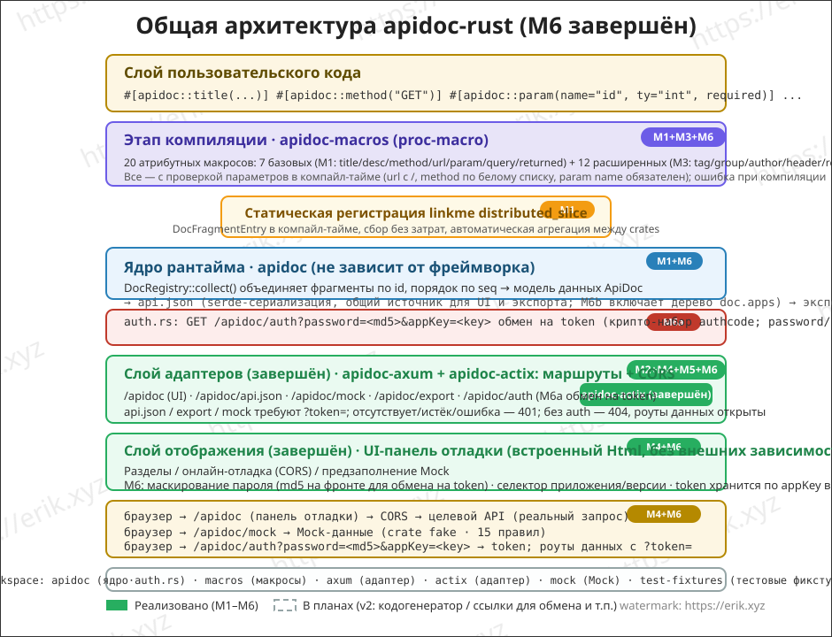
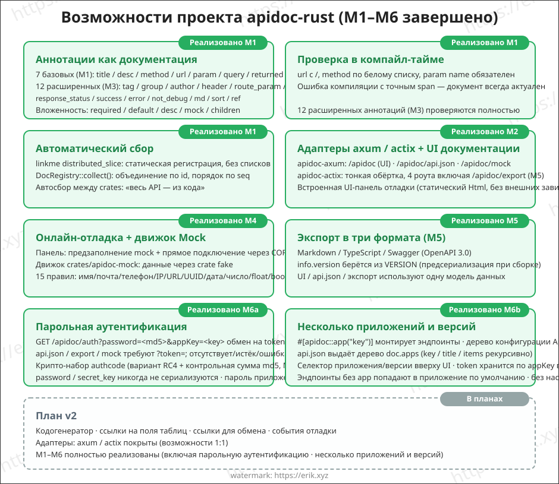
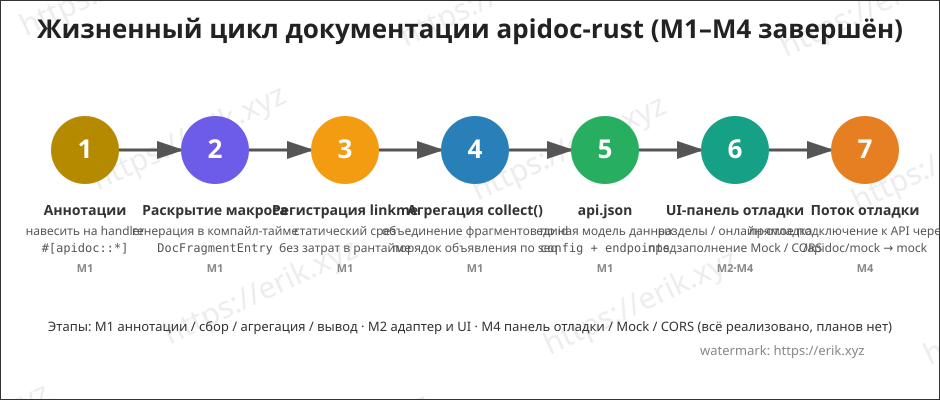

<h1 align="center">Apidoc (apidoc-rust)</h1>

<div align="center">
  Универсальная плагинная библиотека для генерации документации API на основе процедурных макросов Rust (proc-macro)
</div>

<div align="center">
<a href="https://github.com/erikwang2013/apidoc-rust"></a>
<a href="https://github.com/erikwang2013/apidoc-rust"></a>
</div>

<div align="center">
<a href="../../README.md">中文</a> ·
<a href="README-en.md">English</a> ·
<a href="README-ko.md">한국어</a> ·
<a href="README-ru.md"><strong>Русский</strong></a> ·
<a href="README-de.md">Deutsch</a> ·
<a href="README-fr.md">Français</a> ·
<a href="README-es.md">Español</a> ·
<a href="README-pt.md">Português</a> ·
<a href="README-hi.md">हिन्दी</a> ·
<a href="README-ar.md">العربية</a> ·
<a href="README-bn.md">বাংলা</a> ·
<a href="README-id.md">Bahasa Indonesia</a> ·
<a href="README-ja.md">日本語</a>
</div>

## О проекте

apidoc-rust — это **универсальный плагинный генератор документации API**, реализованный на Rust, по образцу [apidoc-php](https://github.com/erikwang2013/apidoc-php) (composer-расширение, генерирующее документацию API на основе PHP 8 attributes). Он воплощает принцип «аннотации как документация» нативным для Rust способом:

- **Генерация на этапе компиляции**: документация создаётся процедурными макросами во время компиляции — документация никогда не расходится с кодом;
- **Сбор с нулевой стоимостью**: статическая регистрация через linkme — один проход агрегации в рантайме даёт всю документацию API;
- **Универсальные плагины**: ядро не зависит от HTTP-фреймворка; любой фреймворк подключается через тонкие адаптеры (axum / actix-web).

## Возможности

### Реализовано (M1-M3)

- **Аннотации как документация**: семь атрибутных макросов `title` / `desc` / `method` / `url` / `param` / `query` / `returned`, по одной аннотации на элемент (аналог PHP attributes); параметры поддерживают вложенность `required` / `default` / `desc` / `mock` / `children`
- **Проверка на этапе компиляции**: url обязан начинаться с `/`, method — по белому списку, param name обязателен и т.д.; недопустимые аннотации вызывают ошибку компиляции (с точным span)
- **Автоматический сбор**: статическая регистрация linkme `distributed_slice` — ручной список интерфейсов не нужен; `DocRegistry::collect()` объединяет фрагменты по id и восстанавливает порядок объявления по seq, с автоматическим сбором между crates
- **Вывод api.json**: serde сериализует единую модель данных документации (config + endpoints), поля выровнены по семантике PHP
- **Адаптер axum + встроенный UI документации**: монтируете маршруты — получаете страницу документации с группировкой по разделам (M2)
- **Дополнение аннотаций**: 12 новых аннотаций `tag` / `group` / `author` / `header` / `route_param` / `response_status` / `success` / `error` / `not_debug` / `md` / `sort` / `ref` (M3)

### Реализовано (M4)

- **Онлайн-отладка**: на странице документации встроена панель «Онлайн-отладка» — Base URL предзаполняется из `location.origin` для кросс-доменного прямого подключения к целевому сервису, форма параметров предзаполняется по mock, подстановка плейсхолдеров `{name}` / `:name` в маршруте, параметры GET/HEAD уходят в query, остальные method собираются в JSON body, редактирование заголовков запроса + свои заголовки, показ ответа (статус / время / pretty JSON), жёлтая подсказка при сбое CORS
- **Движок Mock** (`crates/apidoc/src/mock.rs`, зависит от crate fake, 15 правил: name / company / email / phone / url / ip / city / country / text / number / int / float / bool / uuid / date). Приоритет правил: `mock="fake:xxx"` — через таблицу правил fake (неизвестные имена откатываются к значениям по умолчанию) → остальные непустые mock выводятся как есть (например, `mock="1"`, `mock="erik"`) → без mock автоматически по `ty` (int→`"1"`, float→`"0.5"`, bool→`"true"`, object→`"{}"`, string→`"string"`); children рекурсивно вкладываются, array всегда из 2 элементов
- **Mock-интерфейс**: в адаптере axum добавлен `GET /apidoc/mock?url=&method=` — точное совпадение url + method, иначе 404; панель отладки по умолчанию скрывает эндпоинты `not_debug`, они появляются после установки флажка «Показать интерфейсы not_debug»
- **Прямое подключение через CORS**: онлайн-отладка выполняется браузером напрямую к целевому API, `cors_layer` адаптера отвечает за разрешение (серверный обратный прокси — в v2)

### Реализовано (M5)

- **Экспорт в три формата** (`crates/apidoc/src/export/`): markdown / typescript / swagger (OpenAPI 3.0.0); в core crate есть `export::markdown::render` / `export::typescript::render` / `export::swagger::render`
- **Маршрут экспорта**: в адаптер добавлен `GET /apidoc/export?format=md|ts|swagger` — неизвестный format возвращает 400; Content-Type: `text/markdown` / `application/typescript` / `application/json` соответственно
- **markdown**: группировка по разделам + таблицы параметров + блоки ответов; **typescript**: типы `{Name}Params` / `{Name}Result` в пространстве имён по group, неструппированные интерфейсы попадают в `defaultGroup` (`default` — зарезервированное слово TS); **swagger**: `info.version` берётся из файла `VERSION` в корне
- **Адаптер actix-web** (`crates/apidoc/src/actix.rs`): функционально 1:1 с адаптером axum — `apidoc_routes(ApidocConfig) -> Scope` монтирует /apidoc, /apidoc/api.json, /apidoc/mock, /apidoc/export, `cors_layer(CorsConfig)` разрешает кросс-домен
- **Общий UI**: UI документации (`src/ui.html`) перенесён в core crate и экспортируется как `pub const UI_HTML`; оба адаптера ссылаются на одну копию (безопасно при публикации)

### Реализовано (M6)

- **Парольная аутентификация (M6a)**: при включённом `AuthConfig { enable, password, secret_key, expire }` клиент получает token через `GET /apidoc/auth?password=<md5(пароль)>&appKey=<key>`; маршруты данных `/apidoc/api.json`, `/apidoc/export`, `/apidoc/mock` требуют `?token=xxx` — отсутствие/просрочка/ошибка token возвращает 401, а UI документации показывает парольную маску; token подписывается набором шифрования authcode (построчный перенос Discuz authcode: вариант RC4 + контрольная сумма md5 + base64 без padding), полезная нагрузка `{key: md5(md5(исходный пароль)), expire: now+expire}`, сравнение MAC — за константное время
- **Красные линии безопасности**: `password` / `secret_key` никогда не сериализуются — вывод api.json побайтово совпадает с вариантом без аутентификации; при выключенном auth `/apidoc/auth` возвращает 404, а маршруты данных пропускают напрямую; при собственном password у приложения приоритет у пароля приложения, а не глобального; `secret_key` по умолчанию `"apidoc#hgcode"` (одно предупреждение в stderr при включении без настройки), `expire` по умолчанию 86400 секунд
- **Несколько приложений и версий (M6b)**: `ApidocConfig.apps: Vec<AppConfig>` (`key` / `title` / `items` с рекурсивными подверсиями / `password`) задаёт дерево приложений; `#[apidoc::app("key")]` привязывает интерфейс к key приложения; интерфейсы без key попадают в приложение по умолчанию; в вывод api.json добавлено дерево `doc.apps`, вверху UI появляется селектор приложения/версии, token хранится в localStorage раздельно по appKey (у разных приложений могут быть свои пароли)

### В планах (v2)

- v2: генератор кода, ссылки на поля таблиц БД, ссылки для совместного доступа, события отладки

## Архитектура



## Возможности



## Жизненный цикл



## Структура проекта

```
apidoc-rust/
├── Cargo.toml                 # конфигурация workspace (resolver 2)
├── VERSION                    # версия проекта (v1.3.0, отделена от версии фреймворка 0.1.0)
├── crates/
│   ├── apidoc/                # ядро рантайма (не зависит от фреймворка)
│   │   ├── src/lib.rs         # модель данных + агрегация DocRegistry + api.json + UI_HTML
│   │   ├── src/auth.rs        # M6a парольная аутентификация (выдача/проверка token authcode + защита маршрутов)
│   │   ├── src/export/        # экспорт M5: markdown / typescript / swagger
│   │   ├── src/ui.html        # общий UI документации (экспортируется core crate, оба адаптера ссылаются)
│   │   ├── tests/             # интеграционные тесты (раскрытие макросов/агрегация/сериализация/между crates)
│   │   └── examples/demo.rs   # пример: аннотации + вывод api.json
│   ├── apidoc-macros/         # proc-macro: 20 атрибутных макросов
│   │   └── src/lib.rs         # определения макросов + разбор параметров + проверка на этапе компиляции

│   ├── apidoc-test-fixtures/  # тестовые фикстуры для регистрации между crates


├── .github/
│   └── workflows/release.yml  # рабочий процесс релиза (читает VERSION, инкрементально создаёт tag+release)
└── docs/
    ├── images/                # схемы: архитектура/возможности/жизненный цикл (SVG)
    └── i18n/                  # многоязычная документация (12 языков)
```

## Использование

### 1. Добавление зависимостей

```toml
[dependencies]
apidoc-rust = "0.1"        # или path = "crates/apidoc"


serde_json = "1"      # для вывода api.json
```

> Адаптер выбирается по веб-фреймворку: для axum — `features = ["axum"]`, для actix-web — `features = ["actix"]` (оба функционально 1:1). `mock` (движок Mock) — внутренняя зависимость фреймворка, подключается адаптером автоматически; обычно потребителю не нужно использовать её напрямую.

### 2. Написание аннотаций

Аннотации навешиваются на функции-handler по одной — документация генерируется на этапе компиляции:

```rust
use apidoc::*;

#[apidoc::title("获取用户信息")]
#[apidoc::desc("根据用户 ID 查询用户详情")]
#[apidoc::url("/api/user/info")]
#[apidoc::method("GET")]
#[apidoc::param(name = "user_id", ty = "int", required, desc = "用户ID", mock = "1")]
#[apidoc::query(name = "lang", ty = "string", desc = "语言", default = "zh-CN")]
#[apidoc::returned(
    name = "data",
    ty = "object",
    desc = "用户数据",
    children = [
        { name = "id", ty = "int", required, desc = "用户ID" },
        { name = "name", ty = "string", required, desc = "用户名", mock = "erik" },
    ]
)]
fn get_user_info() -> String {
    unimplemented!()
}
```

### 3. Сбор и вывод

```rust
fn main() {
    let doc = DocRegistry::collect_doc(ApidocConfig {
        title: "我的 API".to_string(),
        description: None,
        auth: None,    // M6a парольная аутентификация, см. «8. Парольная аутентификация»
        apps: vec![],  // M6b несколько приложений и версий, см. «9. Несколько приложений и версий»
    });
    println!("{}", serde_json::to_string_pretty(&doc).unwrap());
}
```

### 4. Запуск примера

```bash
cargo run --example demo -p apidoc
```

Вывод (фрагмент):

```json
{
  "config": { "title": "demo api" },
  "endpoints": [
    {
      "title": "获取用户信息",
      "desc": "根据用户 ID 查询用户详情",
      "url": "/api/user/info",
      "method": "GET",
      "params": [
        { "name": "user_id", "type": "int", "required": true, "desc": "用户ID", "mock": "1" }
      ],
      "querys": [
        { "name": "lang", "type": "string", "required": false, "default": "zh-CN", "desc": "语言" }
      ],
      "returned": [
        {
          "name": "data",
          "type": "object",
          "required": false,
          "desc": "用户数据",
          "children": [
            { "name": "id", "type": "int", "required": true, "desc": "用户ID" },
            { "name": "name", "type": "string", "required": true, "desc": "用户名", "mock": "erik" }
          ]
        }
      ]
    }
  ]
}
```

### 5. Онлайн-отладка и Mock (M4)

Откройте страницу документации → выберите интерфейс → панель «Онлайн-отладка» справа предзаполнит параметры по правилам mock → укажите Base URL целевого сервиса (по умолчанию `location.origin`, прямое кросс-доменное подключение) → нажмите «Отправить» и получите реальный ответ (код статуса / время / pretty JSON). Панель отладки по умолчанию скрывает эндпоинты `not_debug` — они появляются только после установки флажка «Показать интерфейсы not_debug».

**Требование CORS**: онлайн-отладка выполняется браузером напрямую к целевому API, поэтому целевой сервис должен подключить `cors_layer` из адаптера, чтобы разрешить кросс-доменные запросы; при сбое CORS панель показывает жёлтую подсказку.

Синтаксис правил mock (три уровня приоритета):

```rust
#[apidoc::param(name = "email", ty = "string", desc = "邮箱", mock = "fake:email")]  // генерация по правилу fake
#[apidoc::param(name = "status", ty = "string", desc = "状态", mock = "1")]          // непустой mock выводится как есть
#[apidoc::param(name = "name", ty = "string", desc = "用户名")]                       // без mock: автогенерация по ty
#[apidoc::returned(
    name = "data",
    ty = "object",
    children = [
        { name = "id", ty = "int", required },       // без mock → "1"
        { name = "email", ty = "string", mock = "fake:email" },  // children рекурсивно вложены
    ]
)]
fn create_user() -> String {
    unimplemented!()
}
```

15 встроенных правил fake: `name` / `company` / `email` / `phone` / `url` / `ip` / `city` / `country` / `text` / `number` / `int` / `float` / `bool` / `uuid` / `date`; неизвестные имена правил откатываются к значениям по умолчанию. Автогенерация без mock: int→`"1"`, float→`"0.5"`, bool→`"true"`, object→`"{}"`, string→`"string"`; массив всегда из 2 элементов.

### 6. Онлайн-экспорт (M5)

В адаптер встроены три формата экспорта — после подключения работает сразу (неизвестный `format` возвращает 400):

```bash
GET /apidoc/export?format=md        # группировка по разделам + таблицы параметров + блоки ответов (text/markdown)
GET /apidoc/export?format=ts        # типы {Name}Params / {Name}Result в пространстве имён по group (application/typescript)
GET /apidoc/export?format=swagger   # файл описания OpenAPI 3.0.0 (application/json)
```

- **markdown**: удобно вставлять в Wiki проекта / заметки к релизу; по группам выводится оглавление, у каждого интерфейса таблица параметров и блок ответа;
- **typescript**: фронтенд может вставить это как определения типов; неструппированные интерфейсы попадают в пространство имён `defaultGroup` (`default` — зарезервированное слово TS, не может быть идентификатором);
- **swagger**: `info.version` берётся из файла `VERSION` в корне (сейчас 1.3.0), можно сразу импортировать в Swagger UI или генераторы кода.

### 7. Адаптер actix-web

При использовании actix-web подключайте `features = ["actix"]` (функционально 1:1 с адаптером axum):

```toml
[dependencies]
apidoc-rust = { version = "0.1", features = ["actix"] }
```

```rust
use actix_web::{App, HttpServer};
use apidoc::actix::{apidoc_routes, cors_layer, CorsConfig};
use apidoc::ApidocConfig;

#[actix_web::main]
async fn main() -> std::io::Result<()> {
    HttpServer::new(|| {
        App::new()
            .service(apidoc_routes(ApidocConfig {
                title: "我的 API".to_string(),
                description: None,
                auth: None,    // M6a парольная аутентификация, см. «8. Парольная аутентификация»
                apps: vec![],  // M6b несколько приложений и версий, см. «9. Несколько приложений и версий»
            }))
            .wrap(cors_layer(CorsConfig::default()))   // разрешение кросс-домена для онлайн-отладки (M4)
    })
    .bind("127.0.0.1:8080")?
    .run()
    .await
}
```

После подключения доступны `/apidoc` (UI документации), `/apidoc/api.json` (данные), `/apidoc/mock` (Mock), `/apidoc/export` (экспорт). Пустая конфигурация CORS пропускает литеральный `*` (без учётных данных); при настройке белого списка `allow_origins` Origin отражается с точным совпадением — в обоих режимах учётные данные не включаются.

### 8. Парольная аутентификация (M6a)

При включённом `auth` документация доступна только по паролю (выровнено по Auth.php из apidoc-php; token — построчный перенос набора шифрования Discuz authcode):

```rust
use apidoc::auth::AuthConfig;

let doc = DocRegistry::collect_doc(ApidocConfig {
    title: "我的 API".to_string(),
    description: None,
    auth: Some(AuthConfig {
        enable: true,
        password: "your-password".to_string(),
        secret_key: "your-secret-key".to_string(), // по умолчанию "apidoc#hgcode" (одно предупреждение в stderr при включении без настройки)
        expire: 86400,                             // секунды; по умолчанию 86400
    }),
    apps: vec![],
});
```

**Порядок действий**:

1. Клиент получает token через `GET /apidoc/auth?password=<md5(пароль)>&appKey=<key>` (при успехе возвращается `{"token":"..."}`, при неверном пароле — 401); при выключенном auth этот маршрут возвращает 404, а маршруты данных пропускают напрямую
2. Маршруты данных `GET /apidoc/api.json`, `/apidoc/export`, `/apidoc/mock` требуют `?token=xxx` (а при выборе конкретного приложения — ещё и `&appKey=`); отсутствие/просрочка/ошибка token возвращает 401, UI документации автоматически показывает парольную маску, после ввода пароля фронтенд вычисляет md5 и отправляет его для получения token
3. Полезная нагрузка token — `{key: md5(md5(исходный пароль)), expire: now+expire}`, шифруется `secret_key` через authcode (вариант RC4 + контрольная сумма md5 + base64 без padding; сравнение MAC за константное время против timing-атак)
4. `password` / `secret_key` никогда не сериализуются — вывод api.json побайтово совпадает с вариантом без аутентификации; при собственном `password` у приложения приоритет у пароля приложения, а не глобального

### 9. Несколько приложений и версий (M6b)

Один проект можно разбить на несколько приложений/версий, у каждого — свой показ и контроль доступа:

```rust
#[apidoc::title("获取用户信息")]
#[apidoc::app("demo")]   // привязка к приложению key="demo"; интерфейсы без app попадают в приложение по умолчанию
fn get_user_info() -> String {
    unimplemented!()
}
```

```rust
let doc = DocRegistry::collect_doc(ApidocConfig {
    title: "我的 API".to_string(),
    description: None,
    auth: None,
    apps: vec![
        AppConfig {
            key: "demo".to_string(),
            title: "演示应用".to_string(),
            items: vec![AppConfig {
                key: "v1".to_string(),
                title: "v1".to_string(),
                items: vec![],
                password: None,
            }],
            password: None, // свой пароль доступа приложения, приоритет над глобальным, никогда не сериализуется
        },
    ],
});
```

- `AppConfig { key, title, items, password }`: `key` — уникальный идентификатор, на который ссылается аннотация `#[apidoc::app("key")]`; `items` рекурсивно вкладывает подверсии/подприложения; `password` — свой пароль доступа приложения (при своём пароле проверяется только token приложения)
- В вывод api.json добавлено дерево `doc.apps` (key / title / items / endpoints); вверху UI появляется селектор приложения/версии — при переключении интерфейсы рендерятся по выбранному узлу и данные перезагружаются; token хранится в localStorage раздельно по appKey
- Если аннотация `app` ссылается на key, отсутствующий в `apps`, — предупреждение в stderr и попадание в приложение по умолчанию; без аннотации `app` или без настройки `apps` вывод побайтово совпадает с M5

## План разработки

| Этап | Содержание | Статус |
|------|------------|--------|
| M1 | Скелет workspace + модель данных + MVP макросов + регистрация linkme | ✅ Завершено |
| M2 | Адаптер axum + встроенный UI документации + группировка по разделам | ✅ Завершено |
| M3 | Дополнение аннотаций (tag/group/author/header/route_param/response_status/success/error/not_debug/md/sort/ref) | ✅ Завершено |
| M4 | Онлайн-отладка + движок Mock | ✅ Завершено |
| M5 | Экспорт в markdown / typescript / swagger.json (OpenAPI3) | ✅ Завершено |
| —  | Адаптер actix-web (функционально 1:1 с axum) | ✅ Завершено |
| M6a | Парольная аутентификация (token authcode + парольная маска, приоритет пароля приложения) | ✅ Завершено |
| M6b | Несколько приложений и версий (дерево настройки apps + аннотация app + селектор в UI) | ✅ Завершено |

## Многоязычная документация

- [English](README-en.md)
- [한국어](README-ko.md)
- [Русский](README-ru.md)
- [Deutsch](README-de.md)
- [Français](README-fr.md)
- [Español](README-es.md)
- [Português](README-pt.md)
- [हिन्दी](README-hi.md)
- [العربية](README-ar.md)
- [বাংলা](README-bn.md)
- [Bahasa Indonesia](README-id.md)
- [日本語](README-ja.md)

## Поддержка и пожертвования

Если этот проект оказался вам полезен, поставьте нам ⭐ Star — и вы также можете поддержать открытый исходный код пожертвованием!

### 微信 / 支付宝 (WeChat Pay / Alipay)

<table>
  <tr>
    <td align="center">
      <br/>
      <strong>微信支付</strong>
    </td>
    <td align="center">
      <br/>
      <strong>支付宝</strong>
    </td>
  </tr>
</table>

### Пожертвования международным переводом

**【Информация о получателе】**

- Имя получателя: WANG KEXUN
- Номер счёта получателя: 881015918251

**【Банк получателя】**

- ZA Bank SWIFT Code: AABLHKHHXXX
- Название банка: ZA Bank Limited
- Банковский код: 387
- Адрес банка: Core F, Cyberport 3, 100 Cyberport Road, Hong Kong

**【Банк-посредник для международных переводов (при необходимости)】**

> Обратите внимание: это информация о банке-посреднике (транзитном банке) для международных переводов, а не о банке получателя. Уточните в банке, из которого делаете перевод, требуется ли предоставлять данные банка-посредника.

- **Банк-посредник для переводов в гонконгских долларах, юанях и долларах США — Citibank:**
  - Название банка: Citibank N.A. Hong Kong
  - SWIFT Code: CITIHKHXXXX
  - Банковский код: 006
  - Отделение: Hong Kong Branch
  - Код отделения: 391
  - Адрес банка: Citibank Tower, Citibank Plaza, 3 Garden Road, Central, Hong Kong
- **Банк-посредник для переводов в других валютах — BNY Mellon:**
  - Название банка: THE BANK OF NEW YORK MELLON
  - SWIFT Code: IRVTUS3NXXX
  - Адрес банка: THE BANK OF NEW YORK MELLON, 240 GREENWICH STREET, NEW YORK, United States

## License

[MIT](../../LICENSE)
